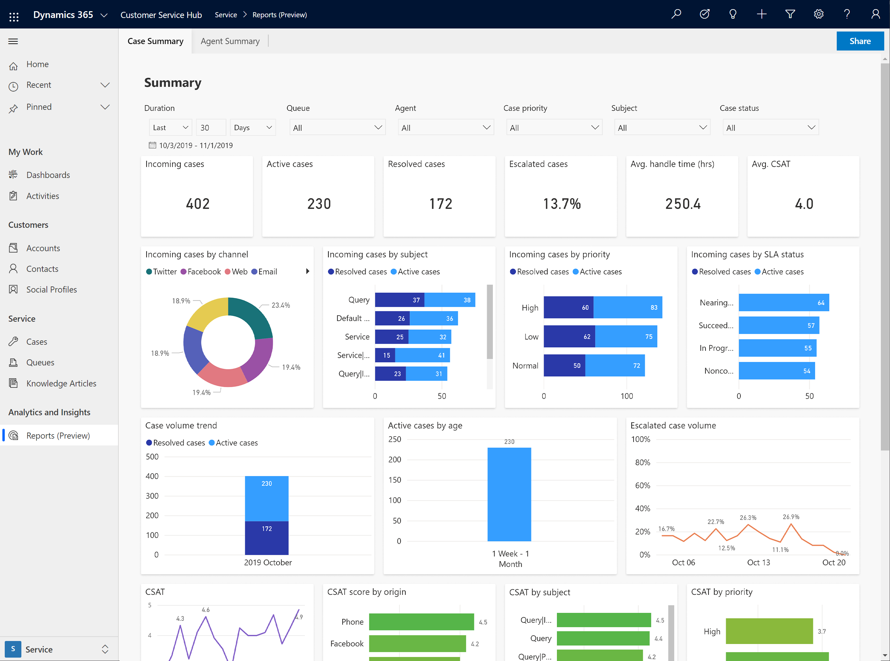
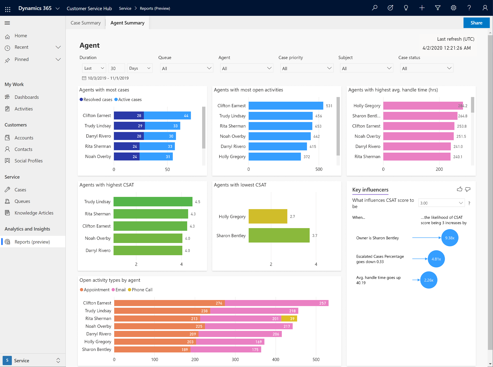

# Dashboard overview

The Insights dashboards for Customer Service contain a variety of charts and metrics to help you to understand the factors that have the greatest impact on your customer service. Key performance indicators and graphical breakdowns of your system's support cases are coupled with AI-generated Insights on cases and topics that contribute to overall trends.

Customer Service Management dashboards give you a performance summary in addition to detailed reports on agents and topics.  

Right-clicking on a chart entry and hovering over **Drill through**, selecting **Agent Details** or **Topic details** brings up a more detailed report that's specific to the selected agent or topic.

By navigating to the Knowledge Management tab, you can view the **Search Term Insights** dashboard to understand what search terms agents and smart agent assist are using to find knowledge articles related to cases. 

## Customer Service analytics reports

The following reports are available for Customer Service analytics:

- **Case Summary**

   > [!div class=mx-imgBorder]
   > 

- **Agent Summary**

   > [!div class=mx-imgBorder]
   > 

The following KPIs are available.

| KPI                       | Description         |
|---------------------------|-------------------------|
|Total cases                |The number of cases created to support customers.      |
|Active cases               |The number of cases that are currently open.          |
|Resolved cases             |The number of cases that have been closed by an agent.   |
|Escalated cases %          |The percentage of cases that have been escalated.    |
|Average handle time (hrs) |The average length of time taken by an agent to resolve the case. |
|Avg. CSAT                  | The average customer satisfaction score, based on the survey submitted by the customer. |
|Case age                    |The average time the case was in an open state.                 |
|Total activities            |The total number of activities that were created by agents.              |

You can use the following filters in the reports.

|Filters / Dimensions  |Description        |
|----------------------|-------------------|
|Duration              |Filters the reporting date range.|
|Queue                 |Lets you filter the queue you'd like to drill down to and see all metrics related to that queue. |
|Agent                 |Lets you filter the report to show all the agents who report to you, to understand how each is performing and help you develop coaching and training plans.  |
|Priority              |Filters the reporting to the selected priority of the case (high, normal, or low). |
|Subject               |Filters the reporting to the selected subject of the case.  |
|Channel               |Filters the reporting to the selected Omnichannel for Customer Service channels, such as chat, SMS, or Facebook.  |

When you select a filter condition, the data is automatically filtered and rendered in the report.

   > [!div class=mx-imgBorder]
   > 

> [!NOTE]
> For the **Date** filter, the **Next** option won't display results in the report.

For detailed information about the reports, see [Case Summary report](customer-service-analytics.md#1-summary) and [Agent Summary report](customer-service-analytics.md#2-agent-and-queue).

## Information you need to know about Customer Service analytics reports

### Reports refresh, data retention

The following information is applicable to reports refresh:

- **Data refresh:** Occurs every 24 hours. The reports are available during the refresh process. You might see a warning icon beside the **Last refresh (UTC)** label in the upper-right corner of each report when there's a delay or issue in the data refresh. When you hover over the icon, the tooltip message indicates whether the dataset is up to date.
  > [!div class=mx-imgBorder]
  > 

- **Custom refresh:** Isn't available.
- **Data refresh for inactive environments:** Data refresh is paused if the reports aren't used continuously for two weeks. When you access a report after a lengthy period of inactivity, the report will be refreshed in the subsequent refresh cycle.
- **Data retention:** Data is retained for a period of 24 months.

### Report customizations

Currently, report customizations aren't supported.

### Supported entities

The following entities are supported:

- ActivityPointer
- AppModule
- Incident
- IncidentResolution
- Organization
- Queue
- QueueItem
- Subject
- SystemUser

> [!NOTE]
> A report might be blank if you've customized any of the listed entities or didn't use out-of-the-box entities.

## Regions supported in Customer Service analytics reports

The Customer Service Analytics reports are supported in the following regions:

- North America
- South America
- Canada
- Europe, except France
- Asia Pacific
- Australia
- Japan
- India
- Great Britain

## Troubleshooting

To troubleshoot issues when you try to access or view the reports, do the following.

|   Error message    |            Action         |
|-------------------------|------------------------|
| Oops! No reports were found in CRM. You may not have access to these reports. Please contact your system administrator.       |   Contact your administrator to get access.     |  
| Oops! Internal service error, please contact your system administrator with Error Code: {numeric value}.   |   Contact Microsoft Support and create a support ticket.     | 
|   Oops! There was a problem rendering the report.   |   Refresh the report. If this doesn't work, contact Microsoft Support and create a support ticket.     |  
| Oops! There was a problem rendering the report, please try again.   |   Refresh the report. If this doesn't work, contact Microsoft Support and create a support ticket    |

### See also

[Introduction to Customer Service insights](introduction-customer-service-analytics.md)  
[Configure Customer Service insights in Customer Service Hub](configure-customer-service-analytics-insights-csh.md)  
[Configure Customer Service analytics in Power BI](configure-customer-service-analytics-dashboard.md)
