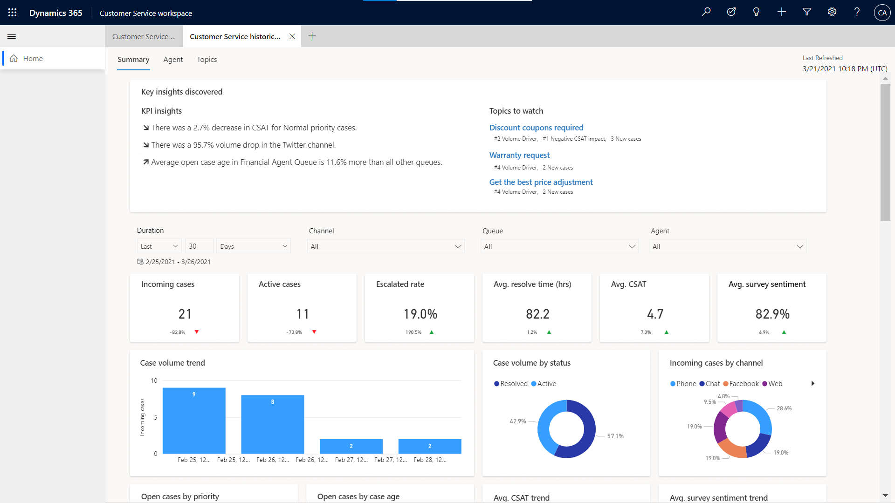
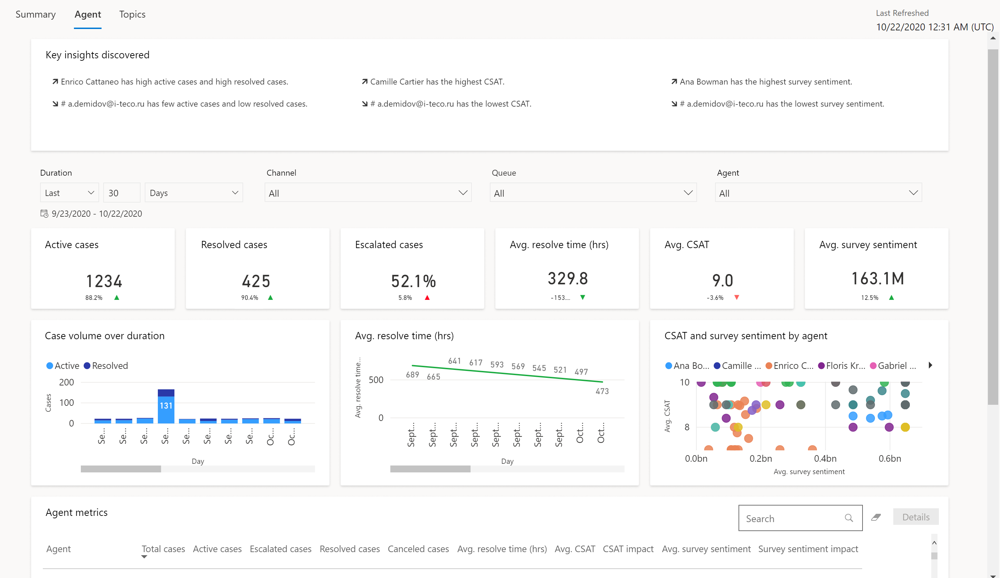
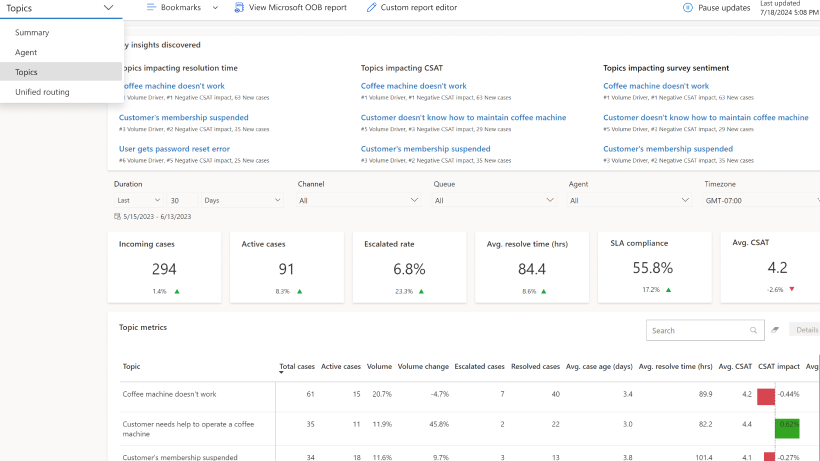
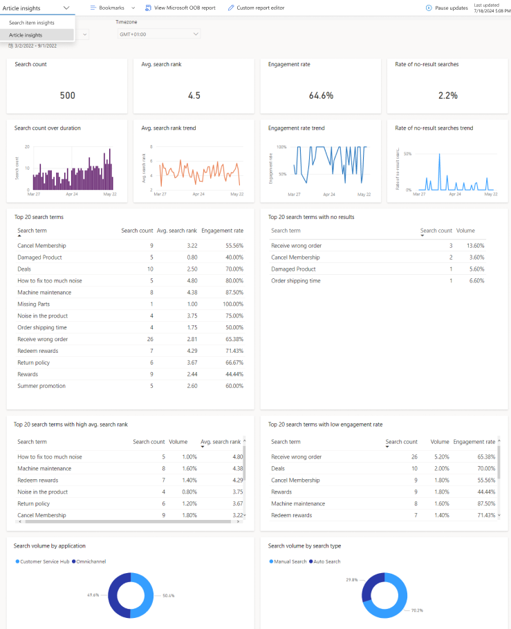
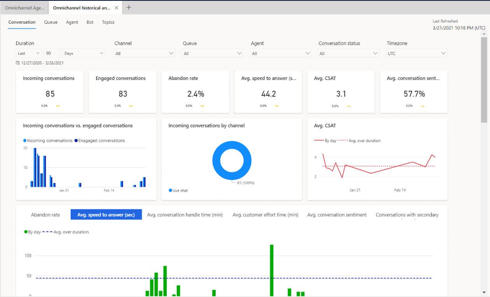
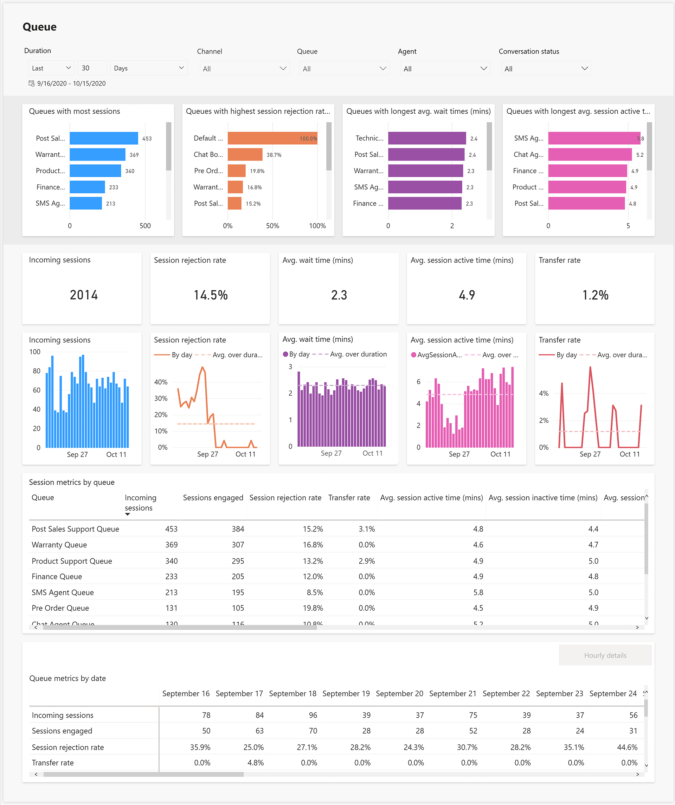
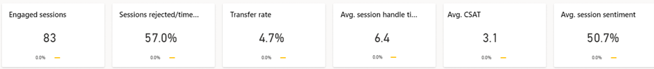
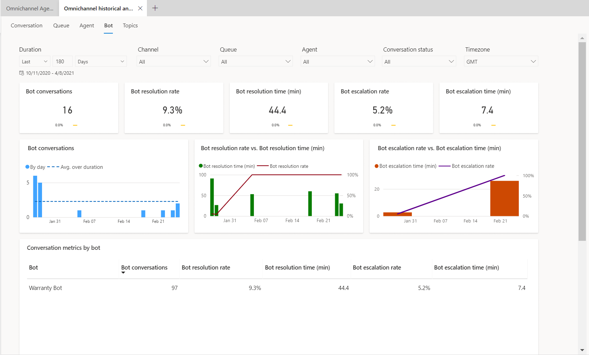
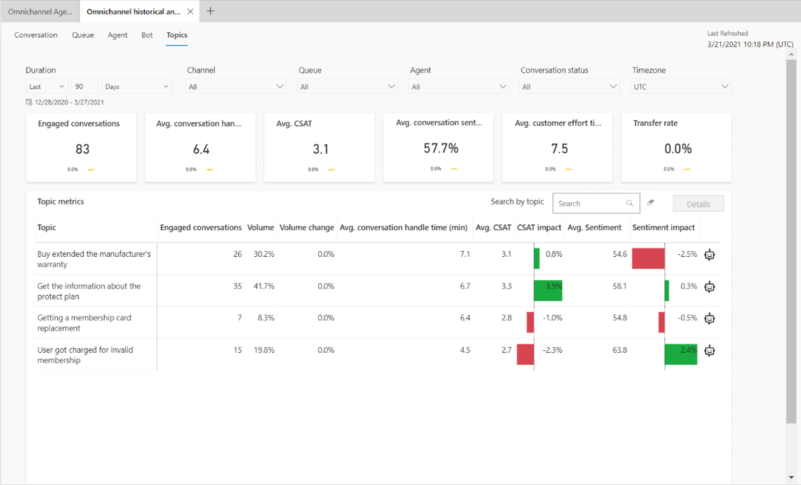
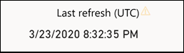

# Dashboard overview

The Insights dashboards for Customer Service and Omnichannel for Customer Service contain various charts and metrics to help you to understand the factors that can improve customer service for your organization.. Key performance indicators and visual breakdowns of your organization's support cases are coupled with AI-generated insights on cases, agents, and topics that contribute to overall trends.

Insights dashboards cover Customer Service, Omnichannel for Customer Service, and Knowledge Management. The Customer Service dashboards give you a performance summary in addition to detailed reports on agents and topics. Similarly, the Omnichannel for Customer Service dashboards provide a view into the support operation across channels. For Knowledge managers, Knowledge Search analytics provide insight into search terms being used by agents to uncover content needed to resolve customer issues.  

## Configure dashboards

To enable the dashboards, see the following topics:

- [Configure historical analytics reports](configure-cs-historical-analytics-csh.md)

- [Configure knowledge search insights](enable-knowledge-search-insights.md)

## Customer Service historical analytics reports

The following dashboard reports are available for Customer Service historical analytics:

### Summary

The Summary dashboard gives you a broad overview of the customer service experience in your organization. It uses artificial intelligence (AI) technology to show you topics that are generating the highest volume and emerging topics with the highest rate of change in volume.

   > [!div class=mx-imgBorder]
   > 
   
For more information about the Summary dashboard, see [Summary dashboard](summary-dashboard-cs.md)

### Agent

The Agent dashboard shows charts and KPIs for individual agents and overall agent performance.

   > [!div class=mx-imgBorder]
   > 
   
For more information about the Agent dashboard, see [Agent dashboard](agent-dashboard-cs.md)

### Case Topics

The Case Topics dashboard shows a detailed breakdown of cases and their assigned topics.

   > [!div class=mx-imgBorder]
   > 
   
For more information about the Case Topics dashboard, see [Topics dashboard](case-topics-dashboard-cs.md)

### Knowledge Search Analytics report

The knowledge search analytics dashboard is designed to provide your organization's customer service supervisors and knowledge workers with valuable insights into how your support agents are finding and using knowledge articles.

> [!div class="mx-imgBorder"]
> 

For more information about the Knowledge Search Analytics report, see [Knowledge Search Analytics Report](knowledge-search-analytics-cs.md)

## Omnichannel historical analytics reports

The following dashboard reports are available for Omnichannel historical analytics.

### Conversation

The Conversation dashboard gives you a broad overview of the assisted support customer service experience in your organization. 

> [!div class="mx-imgBorder"]
> 

For more details about the conversation report, see [Conversation dashboard](conversation-dashboard.md)

### Queue

The Queue dashboard gives you a broad overview of the customer service experience in your organization by providing insights into how specific queues are operating.

> [!div class="mx-imgBorder"]
> 

For more details about the queue report, see [Queue dashboard](oc-queue-dashboard.md)

### Agent

The Agent dashboard shows charts and KPIs that you can use to guide agents and understand overall agent performance.

> [!div class="mx-imgBorder"]
> .

For more details about the Agent report, see [Agent dashboard](agent-dashboard-cs.md)

### Bot

The Bot dashboard shows charts and KPIs that you can use to understand how bots are playing a role in a support organization. 

> [!div class="mx-imgBorder"]
> 

For more details about the bot report, see [Bot dashboard](oc-bot-dashboard.md)

### Conversation Topics

The Topics dashboard shows a detailed breakdown of conversations and their assigned topics. 

> [!div class="mx-imgBorder"]
> 

For more details about the Topics dashboard, see [Topics dasboard](oc-conversation-topics-dashboard.md)

## Information that you need to know about the analytics reports

### Reports refresh, data retention

The reports refresh shows the following information.

- **Data refresh:** Occurs every 24 hours. The reports are available during the refresh process. You might see a warning icon beside the **Last refresh (UTC)** label in the upper-right corner of each report when there's a delay or issue in the data refresh. When you hover over the icon, the tooltip message indicates whether the dataset is up to date.
  > [!div class=mx-imgBorder]
  > 

- **Custom refresh:** Isn't available.
- **Data refresh for inactive environments:** Data refresh is paused if the reports aren't used continuously for two weeks. When you access a report after a lengthy period of inactivity, the report will be refreshed in the next refresh cycle.
- **Data retention:** Data is stored for 24 months.

### Report customizations

Currently, report customizations aren't supported.

### Supported tables

The following tables are used for Customer Service historical analytics:

- incident
- incidentresolution
- appmodule
- organization
- msfp_surveyresponse
- msfp_question
- msfp_questionresponse
- msdyn_casetopic
- msdyn_casetopic_incident
- msdyn_casetopicsetting
- Queue
- QueueItem
- Subject
- SystemUser

> [!NOTE]
> A report might be blank if you've customized any of the listed entities or are using out-of-the-box entities.

## Troubleshooting

To troubleshoot issues when you try to access or view the reports, do the following.

|   Error message    |            Action         |
|-------------------------|------------------------|
| Oops! No reports were found in CRM. You may not have access to these reports. Contact your system administrator.       |   Contact your administrator to get access.     |  
| Oops! Internal service error, contact your system administrator with Error Code: {numeric value}.   |   Contact Microsoft Support and create a support ticket.     | 
|   Oops! There was a problem rendering the report.   |   Refresh the report. If this doesn't work, contact Microsoft Support and create a support ticket.     |  
| Oops! There was a problem rendering the report, try again.   |   Refresh the report. If this doesn't work, contact Microsoft Support and create a support ticket    |

### See also

[Introduction to Customer Service insights](introduction-customer-service-analytics.md)  
[Configure Customer Service insights for Customer Service Hub and Customer Service workspace](configure-customer-service-analytics-insights-csh.md)  
[Configure Customer Service analytics in Power BI](configure-customer-service-analytics-dashboard.md)

[!INCLUDE[footer-include](../includes/footer-banner.md)]