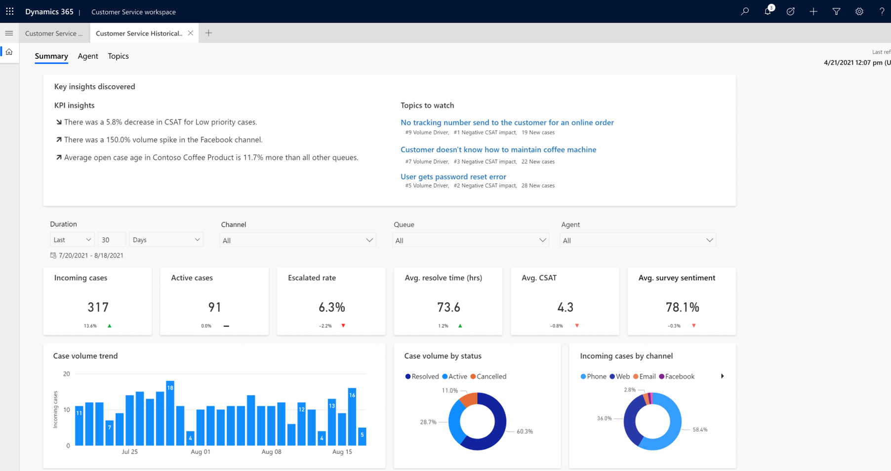
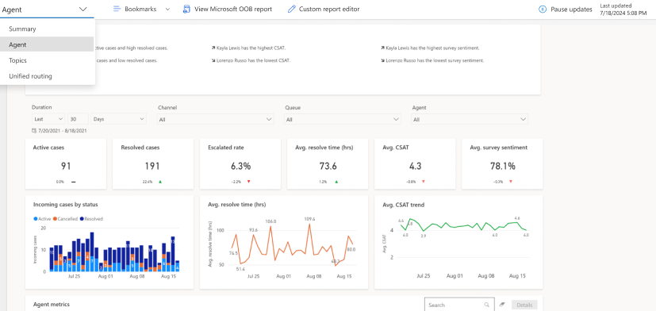
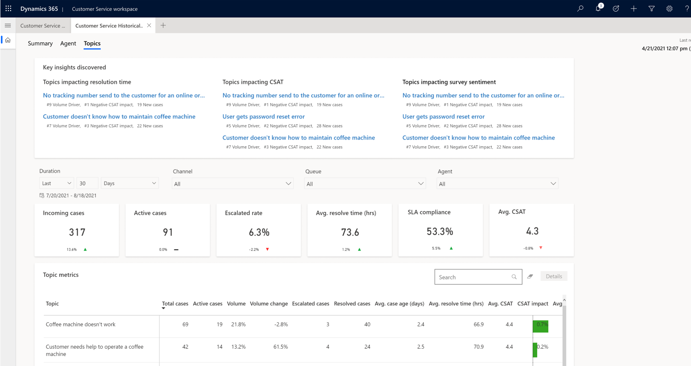

# Customer Service dashboards

The insights dashboards for Customer Service contain various charts and metrics to help you understand the factors that can improve customer service for your organization. Key performance indicators and visual breakdowns of your organization's support cases are coupled with AI-generated insights on cases and topics that contribute to overall trends.

The Customer Service dashboards give you a performance summary and detailed reports on cases, agents, and topics.

## Configure dashboards

To enable the dashboards, see the following topics:

- [Configure historical analytics reports](configure-cs-historical-analytics-csh.md)

## Customer Service historical analytics reports

The following dashboard reports are available for Customer Service historical analytics:

### Summary

The Summary dashboard gives you a broad overview of the customer service experience in your organization. It uses AI technology to show you topics that are generating the highest volume and emerging topics with the highest rate of change in volume.

   > [!div class=mx-imgBorder]
   > 

More information: [Summary dashboard](summary-dashboard-cs.md)

### Agent

The Agent dashboard shows charts and KPIs for individual agents and overall agent performance. 

   > [!div class=mx-imgBorder]
   >  

More information: [Agent dashboard](agent-dashboard-cs.md)

### Case Topics

The Case Topics dashboard shows a detailed breakdown of cases and their assigned topics.

   > [!div class=mx-imgBorder]
   > 

More information: [Topics dashboard](case-topics-dashboard-cs.md)

## Information that you need to know about the analytics reports

### About this report

About this report is a link that you can select to view the corresponding documentation.

### Reports refresh, data retention

The reports refresh shows the following information.

- **Data refresh:** Occurs every 24 hours. The reports are available during the refresh process. The **Last updated** timestamp in the report pages indicates when the latest data was included in the report, and the time reflects the time zone that's set in your user preferences. 
- **Custom refresh:** Isn't available.
- **Data refresh for inactive environments:** Data refresh is paused if the reports aren't used continuously for two weeks. When you access a report after a lengthy period of inactivity, the report will be refreshed in the next refresh cycle.
- **Data retention:** Data is stored for 24 months.

### Supported tables

The following tables are used for Customer Service historical analytics:

- incident
- incidentresolution
- appmodule
- organization
- msfp_surveyresponse
- msfp_question
- msfp_questionresponse
- msdyn_casetopic
- msdyn_casetopic_incident
- msdyn_casetopicsetting
- Queue
- QueueItem
- Subject
- SystemUser

> [!NOTE]
> A report might be blank if you've customized any of the listed entities or are using out-of-the-box entities.

## Troubleshoot issues when accessing reports

To troubleshoot issues when you try to access or view the reports, do the following.

|   Error message    |            Action         |
|-------------------------|------------------------|
| Oops! No reports were found in CRM. You may not have access to these reports. Contact your system administrator.       |   Contact your administrator to get access.     |  
| Oops! Internal service error, contact your system administrator with Error Code: {numeric value}.   |   Contact Microsoft Support and create a support ticket.     | 
|   Oops! There was a problem rendering the report.   |   Refresh the report. If this doesn't work, contact Microsoft Support and create a support ticket.     |  
| Oops! There was a problem rendering the report, try again.   |   Refresh the report. If this doesn't work, contact Microsoft Support and create a support ticket    |

### See also

[Introduction to Customer Service insights](introduction-customer-service-analytics.md)  
[Configure Customer Service insights for Customer Service Hub and Customer Service workspace](configure-customer-service-analytics-insights-csh.md)  
[Manage bookmarks](manage-bookmarks.md)  
[Customize data models of historical analytics reports in Customer Service](model-customize-reports.md)  
[Tracked keywords in Dynamics 365 Sales](../sales/dynamics365-sales-insights-app-home-page.md#tracked-keywords)  

[!INCLUDE[footer-include](../includes/footer-banner.md)]
