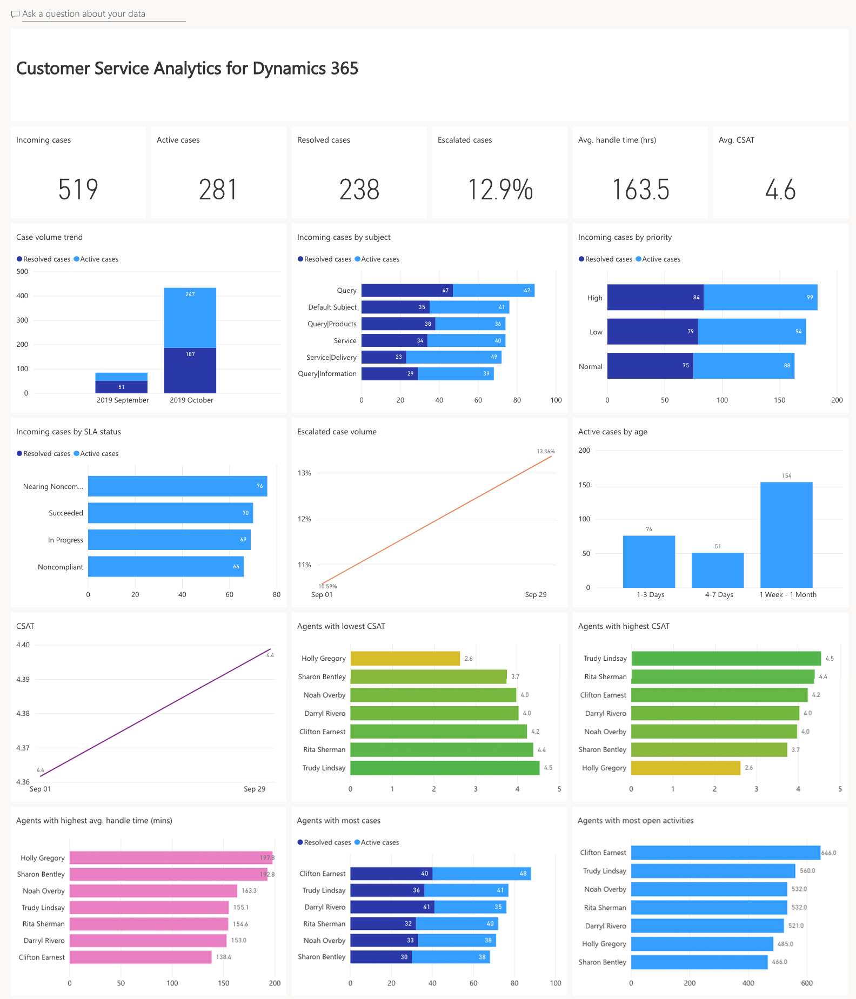
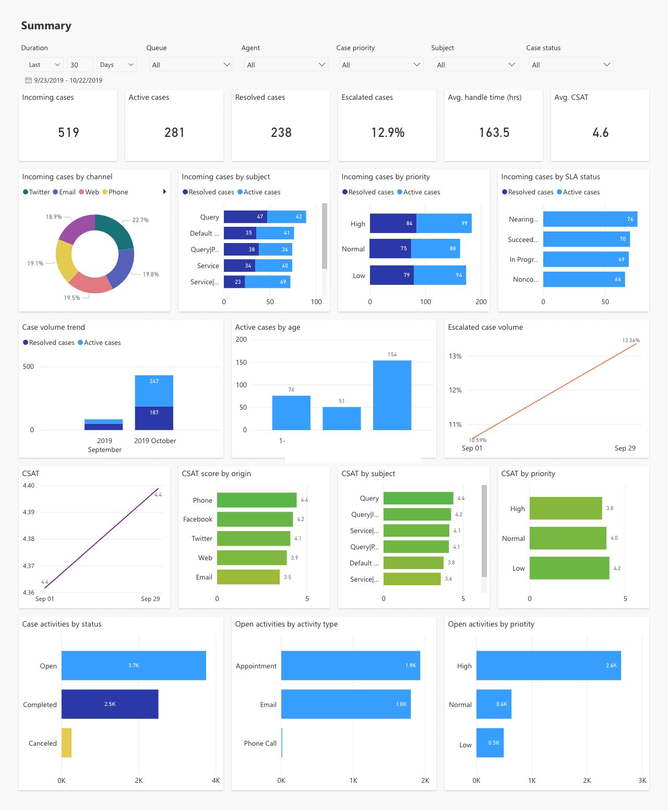
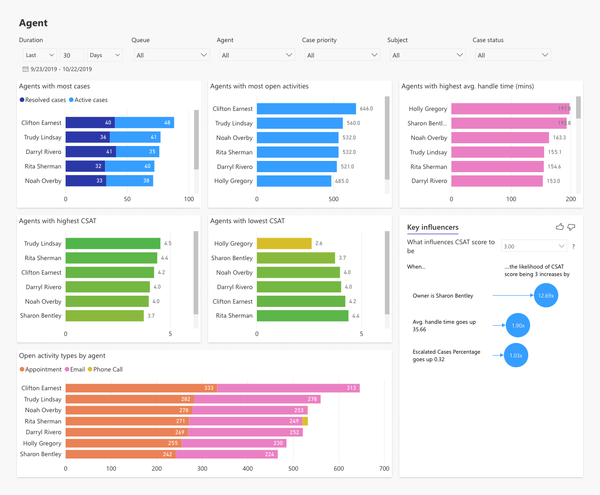
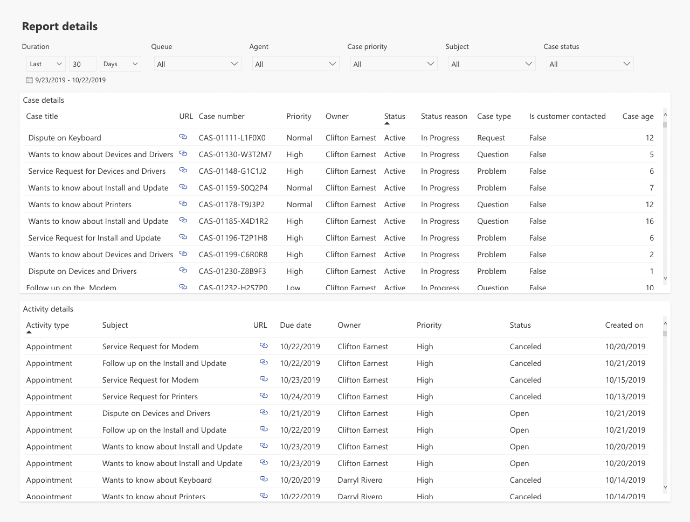
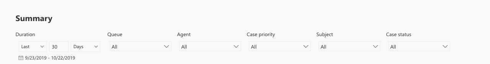

# View and understand Customer Service Analytics

## Customer Service Analytics dashboard

The Customer Service Analytics dashboard that's created in Power BI provides information about the historical operational metrics and key performance indicators (KPIs) to effectively manage contact centers.

The following is an example of the Customer Service Analytics overview dashboard:  

   > [!div class=mx-imgBorder]
   > 

This view includes the following KPIs:

| KPI                       | Description         |
|---------------------------|-------------------------|
|Total cases                |The number of cases created to support customers.      |
|Active cases               |The number of cases that are currently open.          |
|Resolved cases             |The number of cases that have been closed by an agent.   |
|Escalated cases %          |The percentage of cases that have been escalated.    |
|Average handle time (hrs) |The average length of time taken by an agent to resolve the case. |
|Avg. CSAT                  |The average customer satisfaction score, based on the survey submitted by the customer. |
|Case age                    |The average time the case was in an open state.                 |
|Total activities            |The total number of activities that were created by agents                |

This view also includes the following filters:

|Filters / Dimensions  |Description        |
|----------------------|-------------------|
|Duration              |Filters the reporting date range.|
|Queue                 |Lets you filter the queue you'd like to drill down to and see all metrics related to that queue. |
|Agent                 |Lets you filter the report to show all the agents who report to you, to understand how each is performing and help you develop coaching and training plans. |
|Priority              |Filters the reporting to the selected priority of the case (high, normal, or low). |
|Subject               |Filters the reporting to the selected subject of the case.  |
|Channel               |Filters the reporting to the selected Omnichannel for Customer Service channels, such as chat, SMS, or Facebook.  |

## Customer Service Analytics reports

The Customer Service Analytics report detail view has three views:

- [Summary](#1-summary)

- [Agent/queue](#2-agent-and-queue)

- [Case/activity list](#3-case-and-activity-list)

### 1. Summary

  This view provides KPIs and metrics across Customer Service and gives supervisors the ability to filter the view.

   > [!div class=mx-imgBorder]
   > 

   This view contains the following visuals or KPIs:

   |Visual / KPI              |Description                   |
   |---------------------------|------------------------------|
   |Incoming cases by channel  |The volume of cases created in each of the support channels. |
   |Incoming cases by priority |The volume of active and resolved cases, by priority.        |
   |Incoming cases by subject  |The active and resolved cases, by subject. This considers the last node in the subject hierarchy. |
   |Incoming cases by SLA status |The volume of active and resolved cases, by SLA status.      |
   |Case volume trend           |The trend of active and resolved cases, based on the time the case was created. |
   |Case by age                 |The cases that are currently open, grouped by the number of days, weeks, and months they've been open. |
   |Escalated case trend        |The trend of cases escalated over the period selected. |
   |CSAT trend                  |The CSAT trend over the period selected.  |

### 2. Agent and queue

   This view provides KPIs and metrics across Customer Service and gives supervisors the ability to filter the view.

   > [!div class=mx-imgBorder]
   > 

   This view contains the following visuals or KPIs:

   |Visual / KPI              |Description                            |
   |---------------------------|---------------------------------------|
   |Agents with most cases     |Shows the top agents who have handled the most cases, along with the state of those cases.|
   |Agents with most open activities          |Shows the agents with the most open activities. This helps you enable agents to clear the backlog.|
   |Agents with highest avg. handle time      |Shows the agents with the highest average handle time.|
   |Agents with highest CSAT                  |Shows the agents with the highest CSAT. |
   |Agents with lowest CSAT                   |Shows the agents with the lowest CSAT. You can use this information to train agents and improve overall customer satisfaction.|
   |Key influencers for CSAT                   |Shows the factors that drive the CSAT metric. It analyzes data, ranks the factors that matter, and displays them as key influencers. |
   |Open activities by agent                  |Shows the number of open activities by agent and type of activity.|

### 3. Case and activity list

   This section provides a detailed view of cases and activities that you can use to drill down to each case or activity to help resolve customer issues. The link in this report directs you to the Customer Service Hub app or Customer Service app.

   > [!NOTE]
   > Prerequisite for the link to work: you must have either a Customer Service Hub app or Customer Service app installed from AppSource.

   > [!div class=mx-imgBorder]
   > 

## View and filter report  

Filter information by viewing the reports and selecting from Duration, Queue, Agent, Case priority, Subject, and Case status.

   > [!div class=mx-imgBorder]
   > 

Select the subject you're interested in, and information is filtered according to your selection. This helps to quickly analyze KPIs and take necessary steps to improve outcomes.

### See also

[Introduction to Customer Service analytics and insights](introduction-customer-service-analytics.md)  
[Configure Customer Service analytics and insights in Customer Service Hub](configure-customer-service-analytics-insights-csh.md)  
[View and understand Customer Service analytics and insights in Customer Service Hub](customer-service-analytics-insights-csh.md)  
[Configure Customer Service Analytics in Power BI](configure-customer-service-analytics-dashboard.md)

[!INCLUDE[footer-include](../includes/footer-banner.md)]