<!-- The editors are checking terms like "model-driven apps" to make sure they are correct according to the latest guidance. The term is used here in line 213. It's hard to tell if it's correct. Can you check the style guidance (https://styleguides.azurewebsites.net/Styleguide/Read?id=2696&topicid=45145) and update if needed? -->

# Learn the basics of the Customer Service Hub

[!INCLUDE[cc-data-platform-banner](../includes/cc-data-platform-banner.md)]

## Open the Customer Service Hub

The Customer Service Hub app is available to use on a desktop browser and on a mobile device for managing knowledge articles and case management. You can open the Customer Service Hub in one the following ways:  

> [!NOTE]
> These options are available only to users with the Customer Service app access role, System Administrator role, or System Customizer role.

**Desktop browser**
  
- On the Dynamics 365 page, in the **Published Apps** area, select **Customer Service Hub**.

   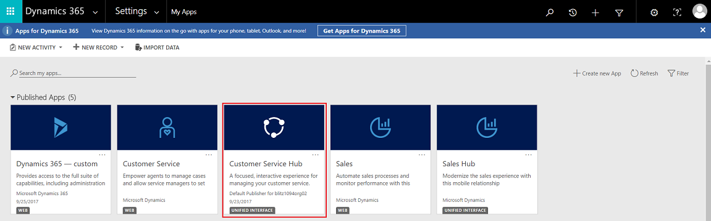
 
  
- If you are on the Settings page, then in the Dynamics 365 Customer Service site map, navigate to the app switcher, and then select **Customer Service Hub**.

  
  
**Mobile device**

To access the Customer Service Hub app on a mobile device:

1. Install the Dynamics 365 Customer Service mobile app.
  
  To install the Dynamics 365 Customer Service mobile app, see [Install Dynamics 365 for phones and tablets](../mobile-app/install-dynamics-365-for-phones-and-tablets.md)

2. From the My Apps page, select **Customer Service Hub**.

   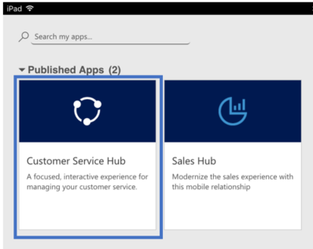

## Work with case management record types, dashboards, and tools

 In the Customer Service Hub, you will find everything you need to easily manage customer service at your organization:  
  
- Dashboards  
- Activities: Email, Task, Appointment, Phone Call, Social Activity  
- Accounts  
- Contacts
- Social Profiles
- Cases
- Queues  
- Knowledge Articles

The Customer Service Hub comes with an enhanced site map to enable easy navigation of the interface. To learn more, see [Understand the site map navigation](#understand-the-site-map-navigation).
  
## Understand the site map navigation

1. Select the site map icon . Select Service, and then select an entity record type.

  > 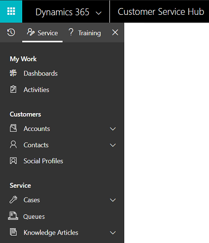

When you select a record type from the menu, such as Accounts, Contacts, or Cases, you'll see a list of corresponding customer records (also known as Entity grid).

To view recently opened records, select the down-arrow next to the record type in the site map.

Here is what each entity record type is used for:

  - **Dashboards** collect all your most important data in one place. You can select from multiple dashboards as per your role.
  - **Activities** help you keep track of tasks, email messages, appointments, phone calls and much more.
  - **Accounts** are the companies you do business with.
  - **Contacts** help you manage and store information about the customers you work with.
  - **Social Profiles** let you track a contact's presence in social media.
  - **Cases** help you create and track your customer requests and issues.
  - **Queues** keep a track of cases waiting for you to work on.
  - **Knowledge Articles** capture your customer's questions, issues, feedback, and resolutions, so that other service reps can benefit from them.

2. Select **...** to go to **Training**, and access the documentation site to view the **Help Center**. 

3. You can also access **Service Management** from the site map. Service Management lets you define all the customer service admin settings from the Customer Service Hub site map.  Select **...** to go to **Service Management**.

   [!INCLUDE[proc_more_information](../includes/proc-more-information.md)] [Configure Customer Service](configure-cs.md).
4. Select **Favorites and Recent** button   to see recently viewed records, or to see views that have been pinned as favorites.

   For a mobile device, the site map is displayed as illustrated in the following image:

   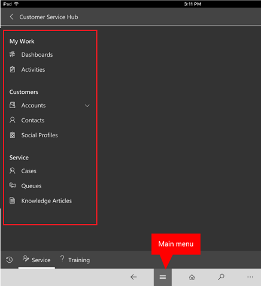

## Open the default dashboard for a record type

When you're viewing the list of records for a specific record type, select **Open Dashboards** in the command bar to switch to the default dashboard for that record type.

To return to the list of records, select **Open Views** in the command bar.
  
 [!INCLUDE[proc_more_information](../includes/proc-more-information.md)] [Use interactive dashboards to effectively manage service cases](customer-service-hub-user-guide-dashboard.md)
  
## Navigate through records and pages  

When you're viewing a record:

1. Select and expand **Open Record Set** to navigate to other records.

     

2. A side panel opens where you can view other records. You can directly select the records from the panel and view the details of the  record.

    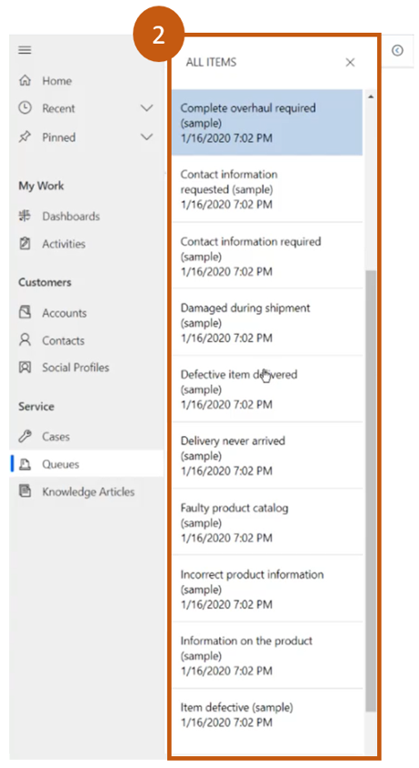 
 
> [!NOTE]
> The option Open Record Set will not be available on devices with comparatively smaller screen sizes.

More information: [Create and manage queues](https://docs.microsoft.com/dynamics365/customer-service/set-up-queues-manage-activities-cases) and [Create and manage a case](https://docs.microsoft.com/dynamics365/customer-service/user-guide-customer-service#create-and-manage-a-case).

## Quickly create new records
  
- To create records quickly by filling in only the most basic information, select the **New** button  given on the nav bar.

  > [!TIP]
  > On a mobile device, from the nav bar, tap  and then tap **Quick Create Menu**.

## Email a link

You can email links to records so your colleagues can quickly find these records by selecting the links. To email links to records, select one or more records in the list, and then on the command bar, select **Email a link**. The default email client opens with the links to these records. The recipients will see all content in the records for which they have permission.  

## Know your forms

Forms are designed to help you quickly handle important customer service tasks and complete actions from a single place.

The different components of a form are explained in the following sections.
  
### Business processes

In the Customer Service Hub, forms for cases and knowledge articles include a process bar (also called a business process flow), which appears when you save the record for the first time.

When you select a process stage on the process bar, you'll see the steps to take to complete that stage. A flag on a stage indicates the stage you're currently on. When you select an active stage, you can see the **Next Stage** button move to the next stage in the process.  

The stages in the business process flow are displayed in floating mode, or docked mode. Stages can  be aligned in a vertical layout, instead of horizontal, which makes it easier to see what steps are required to move forward. You can also choose to include an optional step in the business process flow and define criteria to trigger it.

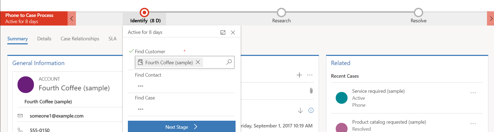
  
If there is more than one process to follow, you can switch between them by selecting **Process** > **Switch Process** on the command bar, and then selecting the process you want to use.  Or you can choose to abandon the process if it no longer applies.
  
 When a business process flow based on multiple entities is applied to a case or a knowledge article, the following limitations apply:  
  
- The business process flow based on multiple entities isn't displayed on the form.  
  
- The **Switch Process** option only shows business process flows that are based on a single entity.  
  
- If there are only multi-entity business process flows for an entity, the **Switch Process** option isn't available.  

### Tabs on the form

Each case form is composed of one or more tabs. By default, the **Summary** tab shows information about the customer, interactions with the customer, and other related records. You can select different tabs to enter or see other miscellaneous details of a record.  
  
For example, here's a view of how the tabs appear on the case form:
  

  
 This table lists the default tabs for each record type and the information that they show for a particular record.  
  
|Record type|Default tabs|  
|-----------------|------------------|  
|Case|**Summary**. Includes the customer card, Timeline, and the Related section.    **Details**. Tracks Case details, additional details, and social response details of the case.  **Case Relationships**. Shows merged cases, child cases, and associated knowledge articles. You can add a child case to the current case from the Child Cases list. It also shows a list of knowledge articles associated with the case. **SLA**. Shows the related SLA KPI Instance records that are created for each SLA KPI that is tracked for the case.  **Related**. Shows related entities, such as activities and connections.|
|Account|**Summary**. Includes the customer card, Timeline, and the Related section. **Details**. Tracks additional details like company profile, marketing details, contact preferences, and billing and shipping. **Related**. Shows related common entities.| 
|Contact|**Summary**. Includes the customer card, Timeline, and the Related section. **Details**. Tracks additional details like personal information, marketing details, contact preferences, and billing and shipping.  **Related**. Shows related common entities.| 
|Activities|Activity forms shows a tab called Task for the respective activity and a Related tab for common entities. |  
|Knowledge Articles|**Content**. Lets you write and edit the content for the article. **Summary**. Tracks basic settings, Timeline, publishing settings, and related information. **Analytics**. Shows the number of views, feedback, and a list of cases using the article. **Related**. Shows related common entities.|  
|Social Profiles|**Social Profile**. Captures general information, and social profile details along with related social profiles. **Related**. Shows related common entities.|  

### Contact card

See a complete view of your customer's touch points in the Contact card. This card is available in the **General Information** section of the **Summary** tab.  
  
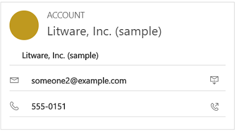

You can add a picture to the account or contact record in Dataverse, and it will appear on this card. You can make calls to customers from the Contact card using Skype for Business – IP telephony.
  
For account records, the card shows contact details for the primary contact associated with the account. For contact records, the card appears if the contact is the customer value on the case form.  

## Work with Queues

Use queues to organize, prioritize, and monitor the progress of your work. In Dynamics 365 Customer Service, queues are containers used to store anything that needs to be completed or requires an action, for example completing a task or closing a case. To know more about creating and managing queues, see [Create and manage queues](set-up-queues-manage-activities-cases.md).

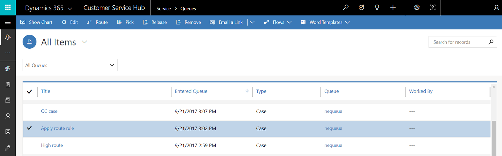

To know how to add a case to a queue, see [Add a case to a queue](customer-service-hub-user-guide-case-queues-and-routing.md).

## Understand Site

To create a new site, you need to go to **Advanced find** .  Then you can customize other entity forms (e.g. Account) by adding this site field.

  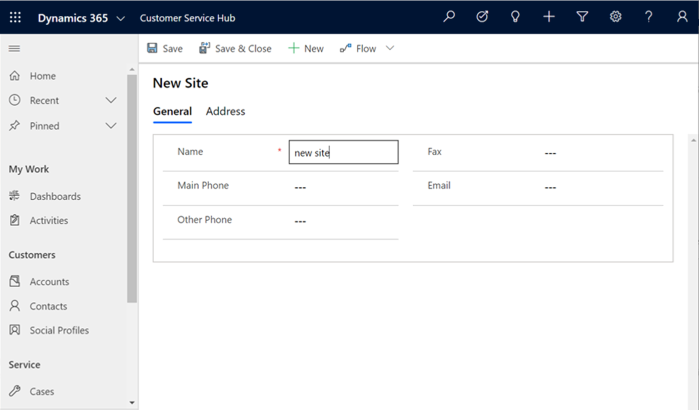
 
## Understand Facility/Equipment

 To create a new Facility/Equipment item, you need to go to **Advanced find** , where you can create Facility/Equipment.

  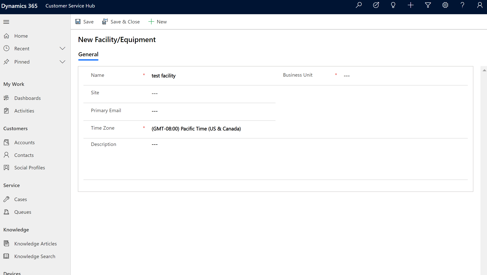

### Related section

In the **Related** section (also known as Reference panel), use the tabs to see related records for the current record. This section is enabled by default for account, contact, case, and knowledge article records. Your customizer can add this section for all entities (including custom entities) that are enabled for interactive experience. The reference panel is also available in model-driven apps. For information, see [Reference Panel in model-driven apps ](https://docs.microsoft.com/powerapps/user/navigation#reference-panel).

By default, the first tab in the Related section of a case record shows the **Recent Cases and Entitlements** for the current case record you're working on. 
  
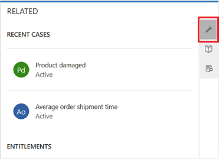

The second tab in the Related section of a case record is the **Knowledge Base search**. Knowledge Base search lets you search for the knowledge articles related to a specific record. It also lets you view automatic suggestions. You can filter the search results to display articles that are Published, Draft, or Approved. For more information, see [Search for Knowledge articles](search-knowledge-articles-csh.md). 
  

The third tab in the Related section of a case record displays **Similar Cases**. Select **...** on a record to follow or unfollow the case, and explore other options. 

Watch this video to learn more about the Reference Panel in the Customer Service Hub:

<iframe src="https://www.microsoft.com/videoplayer/embed/d8224c3f-6e20-4b8e-9d0d-b0f5602c7708" frameborder="0" allowfullscreen=""></iframe>

> [!NOTE]
> You can configure rules that help you view similar cases based on automatic suggestions. For more information, see [Use advanced similarity rules to view similar case suggestions](suggest-similar-cases-for-a-case.md).

Similarly,

- For **Accounts** records, you can view **Contacts**, **Recent Opportunities**, **Recent Cases**, and **Entitlements** in the Related section.
- For **Contacts** records, the Related section displays **Recent Opportunities**, **Recent Cases**, and **Entitlements**. 
- For **Knowledge articles** records, select an article and go to the **Summary** tab to view the **Related Information** panel. Here you can view **Related versions**, **Related translations**, **Related categories**, **Related articles**, and **Related products** for an article.

> [!NOTE]
> Your system administrator or customizer can choose if Related section should be included in a form. They can also decide on what related data should be displayed in the section for each form.

#### Reference Panel reflow

The Customer Service Hub is available to use on a desktop browser, and on a mobile device. Depending on the zoom level and the resolution of the system on which you are accessing the hub interface, the Reference panel adjusts the tabs and records for an optimum experience.

For example, on a browser, if you zoom in to about 100% or more, the tabs get docked on the top of the panel.

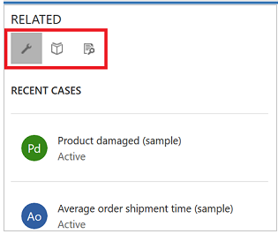

Similarly, if you zoom out to about 60-70%, the records appear in grid form.

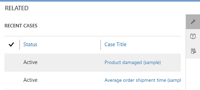

## Understand Activities

Activities are the tasks that you or your team perform while interacting with customers. An activity is any action which can be entered on a calendar and has time dimensions (start time, stop time, due date, and duration) that help determine when the action occurred or is planned to occur.

For example, you can make a record to track a phone call with a customer, or list an appointment scheduled with a customer to discuss a certain issue. You can create activities for yourself, or assign them to other service reps.

In Dynamics 365 Customer Service, the following activities are supported:
- Email
- Task
- Appointment
- Phone Call
- Social Activity

> [!NOTE]
> You can create and edit emails in the Customer Service Hub app on a desktop browser. However, on a mobile device email is read-only in the Hub app.

#### Open Activities view

In the Customer Service Hub site map, select **Service** > **Activities**. The **My Activities** view is displayed. 

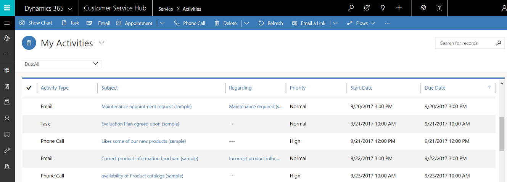

- Select  in the nav bar to go to **Activities** to quickly add a new activity.

- Select the **My Activities** drop-down to switch between activity views.

- Select the  **Due** drop-down to see the list of activities that are due in coming time or are already overdue.

- Explore the command bar options to create a new activity like new **Task**, **Email**, **Appointment**, or **Phone call**.
  
  For example: To create a new email, select **Email** from the command bar.  The New Email activity form is displayed.
  
- Select **...** in the command bar and go to **Open Dashboards** to directly open activity dashboard.

- To view the status of an activity, click the activity record and see bottom-left in the activity form. 

### Insert a knowledge article into an email

While working on an email, you can quickly help customers by searching and selecting a relevant knowledge article to include in your email. You can insert the article and/or share a link to it in the body of your message.

1. From an email form where you are drafting, place your cursor where you want to place the knowledge article or its link, and then select **Insert Knowledge Article**.

   The **Select knowledge article to insert** screen is displayed. 
   
  > [!div class="mx-imgBorder"]
  >  

2. Search for the article you want to include. For more information about searching for knowledge articles, see [Search for knowledge articles in the Customer Service Hub](search-knowledge-articles-csh.md).

   A list of available articles will be displayed. You can select an article in the search results to view it in the preview pane.
  
3. When you have found the article you want to include, do one of the following : 

   - To insert an article into the email, select the **Insert content** icon for the article in the search results or in the article preview pane, select **Insert article content** at the top of the pane. This will insert the content into the body of your email and close the **Select knowledge article to insert** page.
   
   > [!div class="mx-imgBorder"]
  >  
   
   -OR-

  - If your administrator has set up an external portal that supports a URL format, you can include a link. For more information, see [Set up knowledge management (Customer Service Hub)](set-up-knowledge-management-embedded-knowledge-search.md). To insert an article as a link in the email, select the **URL** icon for the article in the search results or in the article preview pane, select **Insert URL** at the top of the pane. This will insert a link to the article into the body of your email and close the **Select knowledge article to insert** page. 
   
  > [!div class="mx-imgBorder"]
  >  

## Create and Manage Queues

Use queues to organize, prioritize, and monitor the progress of your work. In Dynamics 365 Customer Service, queues are containers used to store anything that needs to be completed or requires an action, for example completing a task or closing a case. To know more about creating and managing queues, see [Create and manage queues](set-up-queues-manage-activities-cases.md).

**Open Queues view**

In the Customer Service Hub site map, select **Service** > **Queues**. The queues view is displayed.

- Use the drop-down lists to switch between the views and the various queues.
- Select a record in the queues view to:
    - **Edit** the record
    - **Route** the record
    - **Pick** the record. It will be assigned to you and will be moved to your queue.
    - **Release** the record. It will be assigned back to the queue owner for other's to pick up.

To know how to add a case to a queues, see [Add a case to a queue](customer-service-hub-user-guide-case-queues-and-routing.md).

## Create a new site

To create a new site, go to **Advanced find** . Then you can customize other entity forms (for example, Account) by adding this site field.

  
 
## Create a facility/equipment item

To create a new Facility/Equipment item, go to **Advanced find** , where you can create Facility/Equipment.

  

### See also

[Create and design forms for Customer Service Hub](create-design-forms-customer-service-hub.md)  
[Track your cases efficiently and act on them quickly](customer-service-hub-user-guide-case-sla.md)  

[!INCLUDE[footer-include](../includes/footer-banner.md)]
