# Learn the basics of the Customer Service Hub
  
The Customer Service Hub's intuitive interface brings together vital information in one place, so you can focus on the things that matter.  

## Customer Service Hub application requirements  
 Here's a list of browsers and mobile versions that are supported by the Customer Service Hub:  
  
- **Browsers** 
    - Google Chrome
    - Microsoft Edge (supported on Windows 10)
    - Apple Safari 11
    - Internet Explorer 11

- **Mobile**
    - iOS 10 - Tablet & Phone
    - Android - Tablet + Phone (Android 6 and 7)
    - Windows 10 

## Open the Customer Service Hub
The Customer Service Hub app is available to use on a desktop browser and on a mobile device for managing knowledge articles and case management. You can open the Customer Service Hub in the following ways:  

> [!NOTE]
>  These options are available only to users with the Customer Service app access role , System Administrator role, or System Customizer role. 

**Desktop browser**
  
- In the Common Data Service platform, go to **Settings** > **Application** > **My Apps** >  **Customer Service Hub**.   

   
 
  
- In the Dynamics 365 Customer Service sitemap, navigate to the app switcher and then select **Customer Service Hub**.

  
  
**Mobile device**

To access the Customer Service Hub app on a mobile device:

- Install the Dynamics 365 Customer Service mobile app. 
  
  To install the Dynamics 365 Customer Service mobile app, see [Install Dynamics 365 for phones and tablets](../mobile-app/install-dynamics-365-for-phones-and-tablets.md)
- From the MyApps page, select **Customer Service Hub**.

   

## Work with case management record types, dashboards, and tools  
 In the Customer Service Hub, you will find everything you need to easily manage customer service at your organization:  
  
-  Dashboards  
-  Activities: Email, Task, Appointment, Phone Call, Social Activity  
-  Accounts  
-  Contacts 
-  Social Profiles 
-  Cases 
-  Queues  
-  Knowledge Articles

The Customer Service Hub comes with an enhanced sitemap to enable easy navigation of the interface. To learn more, see [Understand the sitemap navigation](#understand-the-sitemap-navigation).
  
> [!NOTE]
> The navigation bar for the Customer Service Hub is different from the navigation bar in the Common Data Service platform.   Any record types that are enabled for mobile are also available for use in the Customer Service Hub. However, these records are read-only.  

## Understand the sitemap navigation

1. Select the sitemap icon . Select Service, and then select an entity record type.

  

When you select a record type from the menu, such as Accounts, Contacts, or Cases, you'll see a list of corresponding customer records (also known as Entity grid).

To view recently opened records, select the down-arrow next to the record type in the sitemap.

  Here is what each entity record type is used for:

  - **Dashboards** collect all your most important data in one place. You can select from multiple dashboards as per your role.
  - **Activities** help you keep track of tasks, email messages, appointments, phone calls and much more.
  - **Accounts** are the companies you do business with.
  - **Contacts** help you manage and store information about the customers you work with.
  - **Social Profiles** let you track a contact's presence in social media.
  - **Cases** help you create and track your customer requests and issues.
  - **Queues** keep a track of cases waiting for you to work on.
  - **Knowledge Articles** capture your customer's questions, issues, feedback, and resolutions, so that other service reps can benefit from them.

2. Select **...** to go to **Training** and access the documentation site to view the **Help Center**. 
3. You can also access **Service Management** from the sitemap. Service Management lets you define all the customer service admin settings from the Customer Service Hub sitemap.  Select **...** to go to **Service Management**. 

   [!INCLUDE[proc_more_information](../includes/proc-more-information.md)] [Service Manager Guide (Customer Service Hub and Customer Service app)](service-manager-guide.md).
4. Select **Favorites and Recent** button   to see recently viewed records, or to see views that have been pinned as favorites.

   For a mobile device, the sitemap is displayed as illustrated in the following image:

   

## Open the default dashboard for a record type
When you're viewing the list of records for a specific record type, select **Open Dashboards** in the command bar to switch to the default dashboard for that record type. 

To return to the list of records, select **Open Views** in the command bar.
  
 [!INCLUDE[proc_more_information](../includes/proc-more-information.md)] [Use interactive dashboards to effectively manage service cases](customer-service-hub-user-guide-dashboard.md)
  
 
## Navigate through records and pages  

When you're viewing a record:

1. Select and expand **Open Record Set** to navigate to other records. 

     

2. A side panel opens where you can view other records. You can directly select the records from the panel and view the details of the  record.

     
 
> [!NOTE]
> The option Open Record Set will not be available on devices with comparatively smaller screen sizes.

More information: [Create and manage queues](https://docs.microsoft.com/dynamics365/customer-service/set-up-queues-manage-activities-cases) and [Create and manage a case](https://docs.microsoft.com/dynamics365/customer-service/user-guide-customer-service#create-and-manage-a-case).
   
## Quickly create new records
  
- To create records quickly by filling in only the most basic information, select the **New** button  given on the nav bar.

  > [!TIP]
  > On a mobile device, from the nav bar, tap  and then tap **Quick Create Menu**.

## Email a link  
You can email links to records so your colleagues can quickly find these records by selecting the links. To email links to records, select one or more records in the list, and then on the command bar, select **Email a link**. The default email client opens with the links to these records. The recipients will see all content in the records for which they have permission.  

## Know your forms
Forms are designed to help you quickly handle important customer service tasks and complete actions from a single place.

Understand the different components of a form below:
  
### Business processes
 In the Customer Service Hub, forms for cases and knowledge articles include a process bar (also called a business process flow), which appears when you save the record for the first time. 
 
When you select a process stage on the process bar, you'll see the steps to take to complete that stage. A flag on a stage indicates the stage you're currently on. When you select an active stage, you can see the **Next Stage** button move to the next stage in the process.  

The stages in the business process flow are displayed in floating mode, or docked mode. Stages can  be aligned in a vertical layout, instead of horizontal, which makes it easier to see what steps are required to move forward. You can also choose to include an optional step in the business process flow and define criteria to trigger it.

  
If there is more than one process to follow, you can switch between them by selecting **Process** > **Switch Process** on the command bar, and then selecting the process you want to use.  Or you can choose to abandon the process if it no longer applies.
  
 When a business process flow based on multiple entities is applied to a case or a knowledge article, the following limitations apply:  
  
-   The business process flow based on multiple entities isn't displayed on the form.  
  
-   The **Switch Process** option only shows business process flows that are based on a single entity.  
  
-   If there are only multi-entity business process flows for an entity, the **Switch Process** option isn't available.  

### Tabs  
 A tab is a group of sections on a page. Each case form is composed of one or more tabs. By default, the **Summary** tab shows information about the customer, interactions with the customer, and other related records. You can select different tabs to enter or see other miscellaneous details of a record.  
  
For example, here's a view of how the tabs appear on the case form:
  

  
 This table lists the default tabs for each record type and the information that they show for a particular record.  
  
|Record type|Default tabs|  
|-----------------|------------------|  
|Case|**Summary**. Includes the customer card, Timeline, and the Related section.    **Details**. Tracks Case details, additional details, and social response details of the case.  **Case Relationships**. Shows a Merged Cases and Child Cases list. You can add a new child case to the current case from the Child Cases list. It also shows a list of knowledge articles associated with the case. **SLA**. Shows the related SLA KPI Instance records that are created for each SLA KPI that is tracked for the case.  **Related**. Shows related entities like Knowledge Base records and Connections.|
|Account|**Summary**. Includes the customer card, Timeline, and the Related section. **Details**. Tracks additional details like company profile, marketing details, contact preferences, and billing and shipping. **Related**. Shows related common entities.| 
|Contact|**Summary**. Includes the customer card, Timeline, and the Related section. **Details**. Tracks additional details like personal information, marketing details, contact preferences, and billing and shipping.  **Related**. Shows related common entities.| 
|Activities|Activity forms shows a tab called Task for the respective activity and a Related tab for common entities. |  
|Knowledge Articles|**Content**. Lets you write and edit the content for the article. **Summary**. Tracks basic settings, Timeline, publishing settings, and related information. **Analytics**. Shows the number of views, feedback, and a list of cases using the article. **Related**. Shows related common entities.|  
|Social Profiles|**Social Profile**. Captures general information, and social profile details along with related social profiles. **Related**. Shows related common entities.|  

### Contact card  
 See a complete view of your customer's touch points in the Contact card. This card is available in the **General Information** section of the **Summary** tab.  
  

 You can add a picture to the account or contact record in the Common Data Service platform, and it will appear on this card. You can make calls to customers from the Contact card using Skype for Business – IP telephony.
  
 For account records, the card shows contact details for the primary contact associated with the account. For contact records, the card appears if the contact is the customer value on the case form.  

### Timeline

[!INCLUDE[cc-early-access-2020w1](../includes/cc-early-access-2020w1.md)]

 See a combined view of your customer's interactions across various channels, such as phone, email, or even social activities in the Timeline. The Timeline enables you to create notes and posts, and also, to view any related notes or system posts.  The Timeline control makes collaboration with other users easy and efficient.

 You can do the following:

- Identify the key activities with simple icons.
- Quick access to the command bar to perform common actions on an activity with ease.
- Filter activities on the timeline with multiple filter options.
- View and manage email conversation threads on the timeline with ease.
- Expand and collapse activities in the timeline with ease.

The Customer Service Hub comes with an enhanced timeline that shows you all customer interactions arranged in a single stream. 
Managing activities in the timeline wall will be faster and more responsive with improvements to data viewability and usability.

  

  1. Search Records
  2. Take notes
  3. Add info and activities
  4. Filter
  5. More commands
  6. Activity status
  7. Activity icons
  8. Date and time

The timeline section is available on the **Summary** tab for account, contact, case records, and for knowledge articles, and it shows the following:
- Activity
  - Appointment
  - Email
  - Phone Call
  - Task
- Note
- Post

> [!Note]
> The activities, note, and post are standard entities. If your administrator or system customizer has configured other entities, then those will appear. 

You can create, edit, and delete an activity, note, post, and other interactions from the timeline itself. Additionally, you can filter and sort the interactions. In the timeline area, you can see three actions: **Add info and activities**, **Open filter pane**, and **More commands**. Use these options to add, filter, and sort the interactions on the timeline.

- **Add activities, posts, and notes:** Select the **+** icon in the timeline area to quickly open an form or quick create form to create and save. The item you created appears in the timeline. The standard activities that you can currently create with **+** button in the timeline are as follows:

    - Appointment
    - Task
    - Phone Call
    - Email

    If your administrator has the enabled enhanced email experience, then you can compose the email in the enhanced email pop-up window. To learn more, see [Create and send email using the enhanced email experience](#create-and-send-email-using-the-enhanced-email-experience).

  Based on your administrator configuration, other entities may appear.

- **Filter the activities, post, and note:** With the help of text and visual filters, you can filter by activities, notes, posts, and other custom entities in the timeline. You can also view the items from the previous day or week, and you can filter the interactions using the filter icon in the timeline area. To learn more, see [Filter activities, posts, and notes on the timeline](#filter-activities-posts-and-notes-on-the-timeline).

- **More commands:** The timeline provides the options to refresh so you see the updated list of activities, notes, and posts and sort the timeline interactions. Select the ellipsis (**...**) in the timeline to refresh and sort the timeline by choosing one of the two: **Sort newer to older** and **Sort older to newer**.

  

#### **Take a note**

You can select the **Enter a note** box in the timeline and specify a title and message. The message box has a rich text editor that enables you to create rich and well-formatted content for the notes with emphasis.  

  
  
  The editor offers the following functionality:
  
  |Icon | Name | Shortcut key | Description |
|----------------------|-------------------------|-----------------------------|-----------------------------|
|| Format Painter | Ctrl+Shift+C, Ctrl+Shift+V | Apply the look of a particular section to another section. |
| | Font | Ctrl+Shift+F | Select your desired font. The default font is Segoe UI. |
| | Font size | Ctrl+Shift+P | Change the size of your text. The default size is 12.|
|| Bold | Ctrl+B | Make your text bold. |
|| Italic | Ctrl+I | Italicize your text. |
|| Underline | Ctrl+U | Underline your text. |
|| Text Highlight Color |  | Make your text stand out by highlighting it in a bright color. |
|| Font Color |  | Change the color of your text. |
|| Bullets |  | Create a bulleted list. |
|| Numbering |  | Create a numbered list. |
|| Decrease Indent |  | Move your paragraph closer to the margin. |
|| Increase Indent |  | Move your paragraph farther away from the margin. |
|| Block Quote |  | Apply a block-level quotation format in your content. |
|| Align Left | Ctrl+L | Align your content with the left margin. (Commonly used for body text to make it easier to read.) |
|| Align Center | Ctrl+E | Center your content on the page. (Commonly used for a formal appearance.) |
|| Align Right | Ctrl+R | Center your content on the page. (Commonly used for a formal appearance.) |
|| Link |  | Create a link in your document for quick access to web pages and files.  Pasted or typed URL text is converted into a link. For example, "http://myexample.com" will become "<a href="http://myexample.com">http://myexample.com</a>".   In the **Link** dialog box, choose the type of link you'd like to insert.  The **Link Info** tab allows you to choose the link type as well as set the link protocol and URL.  The **Target** tab is only available for the URL link type. It specifies the location where the link will open after you select it. |
|| Unlink |  | Delete a link in your email or document.  When you place the cursor on a link, the **Unlink** button on the toolbar becomes active. Select the button to remove the link and make it plain text. |
|| Superscript |  | Type very small letters just above the line of text. |
|| Subscript |  | Type very smaill letters just below the line of text. |
|| Strikethrough |  | Cross out text by drawing a line through it. |
|| Left to Right |  | Change the text to left-to-right for content such as an paragraph, header, table, or list. Commonly used for bi-directional language content. |
|| Right to Left |  | Change the text to right-to-left for content such as a paragraph, header, table, or list. Commonly used for bi-directional language content. |
|| Undo Typing |  | Undo changes you made to the content. |
|| Redo Typing |  | Redo changes you made to the content. |
|| Clear All Formatting |  | Remove all formating from a selection of text, leaving only the normal, unformatted text. |
|| Add a Table |  | Add a table to your content.   After adding a table, you can do any of the following:  <ul><li>Resize table columns by clicking and dragging your mouse to resize to the columns to the desired width.</li><li>Select one or several cells within a table and apply specific formatting, add links to the selection, or cut, copy, or paste entire rows or columns.</li><li>Right-click to uaccess the properties. This supports features such as cell type, width and height, word wrapping, alignment, merging and splitting cells horizontally and vertically, inserting or deleting rows and columns, row and column span, and cell and border color.</li></ul>|
|| Expand Toolbar |  | Displays when the toolbar is collapsed and not all options appear. Click to expand the toolbar and make all options visible. |

  The feature is enabled by default, your administrator can enable or disable rich-text editor for you. To learn more, see [Enable rich-text editor for notes in timeline](https://review.docs.microsoft.com/powerapps/maker/model-driven-apps/set-up-timeline-control#enable-or-disable-rich-text-editor-for-notes-in-timeline).

  > [!Note]
  > You can format only the message (body), and not the title.

  You can also add an attachment to your notes, and the attachment is displayed below the note. At anytime, you can attach one file. Before adding the note, if you want upload another file than the one you've selected, you can again browse and choose another file. This will replace the already selected file.

  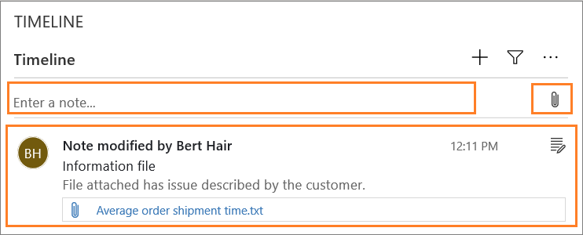

  > [!Note]
  > - The notes rich-text editor is available only for Unified Interface and not for web client.
  > - If you create a note with the rich-text editor formatting in Unified Interface, and when you see the note in Web Client, the note is displayed to you with HTML syntax.

#### **Identify the activities, notes, and posts with icons along with time stamp**
The timeline shows a simple icon before the activity, post, note, and custom entity making it easy for you to identify the type.

Also, you can view the timestamp at all times. Activities, posts, and notes that were created or updated today will reflect only the time and created or updated on other days will reflect the date and time.

  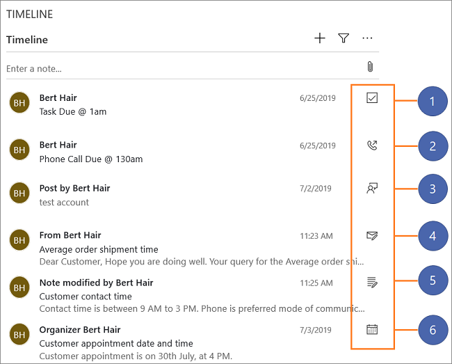

#### **Access command bar to perform actions**
When you hover the cursor on or expand an activity, post, and note, the command bar appears with the options specific to the activity, such as marking an activity complete, assigning it to others, adding it to a queue, converting it to a case, liking a post, replying to a post, editing a note, or deleting the activity.

  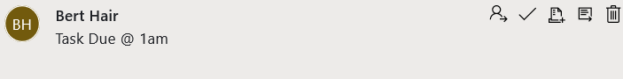
  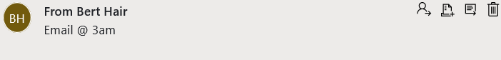
  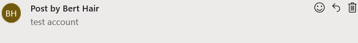
  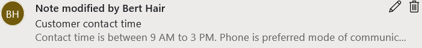

#### **Filter activities, posts, and notes on the timeline**
Quickly filter the activities, posts, and notes with multiple filter options to see what matters to you. The filter is available for the activities, posts, notes, and custom entities that are present in timeline. The timeline filters and displays the records and the count of those records that are present in the timeline. 

When you select the filter icon, you can see the **Filter by** menu where you can filter the items based on the following categories.

  | Category | Sub-category |
  |-----------------------|-----------------------|
  | Record type | <ul> <li> Notes </li> <li> Posts </li> <li> Activities </li> </ul> |
  | Activity type | <ul> <li> Appointment </li> <li> Email </li> <li> Phone Call </li> <li> Task</li> <li>Custom activities (as configured by your administrator) </li> </ul> |
  | Activity status | <ul> <li> Active </li> <li> Overdue </li> <li> Closed </li> </ul> |
  | Activity due date (active) | <ul> <li> Next 30 days </li> <li> Next 7 days </li> <li> Next 24 hours </li> <li> Last 24 hours </li> <li> Last 7 days </li> <li> Last 30 days </li> </ul> |
  | Posts by | <ul> <li> Auto post </li> <li> Users </li> </ul> |
  | Modified date | <ul> <li> Last 24 hours </li> <li> Last 7 days </li> <li> Last 30 days </li> </ul> |

  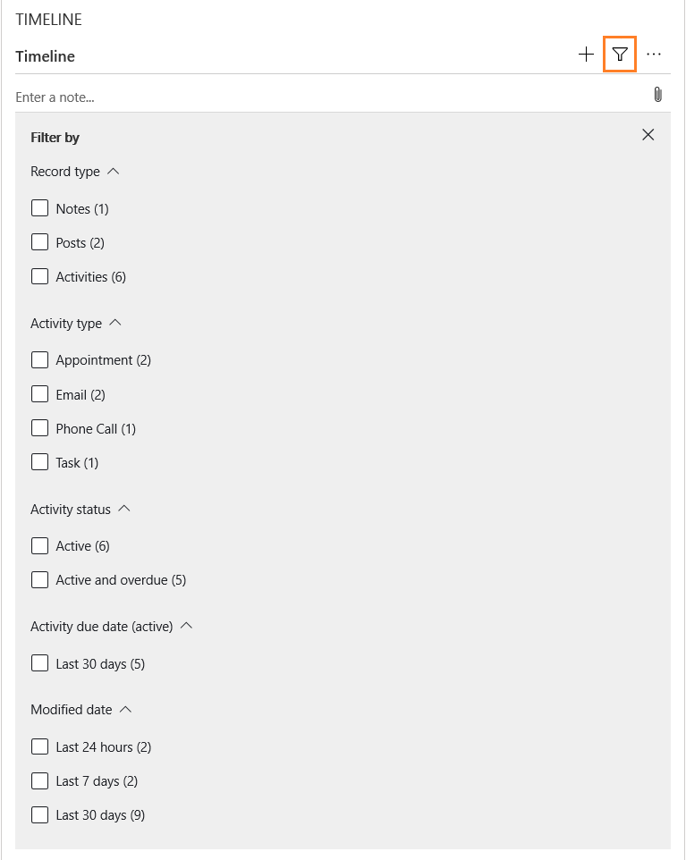 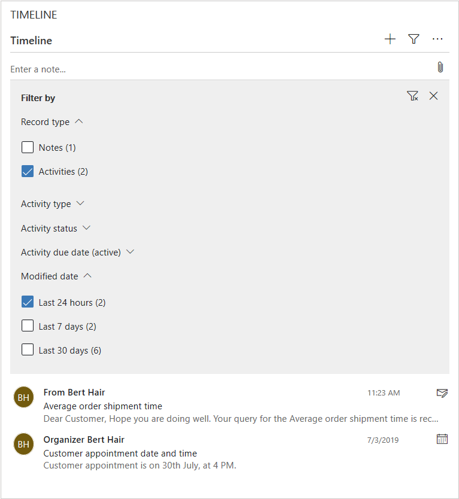

  When you filter based on the activity status, then those activities, notes, and posts in a particular status are displayed to you.

  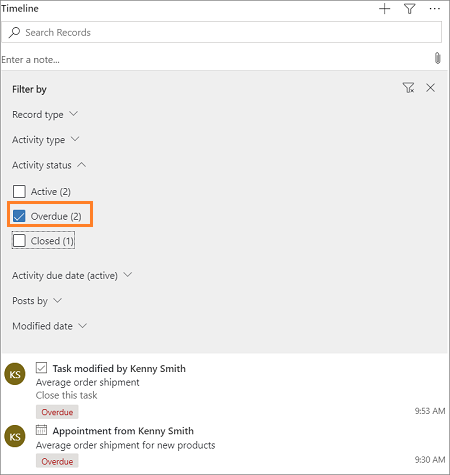

#### **Search for records**

You can easily search for records in the timeline. When you search for a phrase, the timeline searches the title or subject and description or body of the content, and then displays the record to you.

  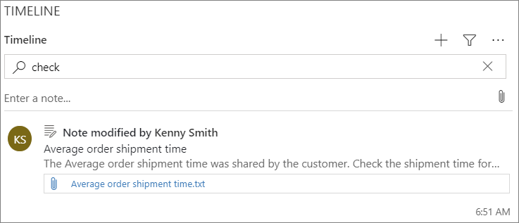

#### **View and manage email conversations**
You can easily set email messages to show as conversation threads on the timeline, significantly reducing usability (scroll and clicks) when managing email activities.

#### **Expand and collapse timeline activities**
Select an activity from the timeline to expand and view.

  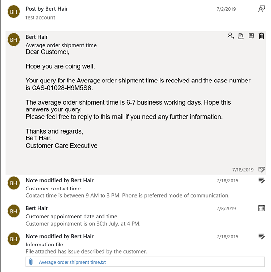

#### Configure Timeline section for your users

 To learn more about configuration, see [Set up timeline section (control)](https://docs.microsoft.com/powerapps/maker/model-driven-apps/set-up-timeline-control) and [FAQs for timeline control](https://docs.microsoft.com/powerapps/maker/model-driven-apps/faqs-timeline-control) in the Microsoft Power Apps documentation.

### Related section  
In the **Related** section (also known as Reference panel), use the tabs to see related records for the current record. This section is enabled by default for account, contact, case, and knowledge article records. Your customizer can add this section for all entities (including custom entities) that are enabled for interactive experience. The reference panel is also available in model-driven apps, for information, see  [Reference Panel in model-driven apps ](https://docs.microsoft.com/powerapps/user/navigation#reference-panel).

By default, the first tab in the Related section of a case record shows the **Recent Cases and Entitlements** for the current case record you're working on. 
  

The second tab in the Related section of a case record is the **Knowledge Base search**. Knowledge Base search lets you search for the knowledge articles related to a specific record. It also lets you view automatic suggestions. You can filter the search results to display articles that are Published, Draft, or Approved. For more information, see [Search for Knowledge articles](search-knowledge-articles-csh.md). 
  

The third tab in the Related section of a case record displays **Similar Cases**. Select **...** on a record to follow or unfollow the case, and explore other options. 

 Watch this video to learn more about the Reference Panel in the Customer Service Hub:

<iframe src="https://www.microsoft.com/videoplayer/embed/d8224c3f-6e20-4b8e-9d0d-b0f5602c7708" frameborder="0" allowfullscreen=""></iframe>

> [!NOTE]
> You can configure rules that help you view similar cases based on automatic suggestions. For more information, see [Use advanced similarity rules to view similar case suggestions](suggest-similar-cases-for-a-case.md).

Similarly,

- For **Accounts** records, you can view **Contacts**, **Recent Opportunities**, **Recent Cases**, and **Entitlements** in the Related section.
- For **Contacts** records, the Related section displays **Recent Opportunities**, **Recent Cases**, and **Entitlements**. 
- For **Knowledge articles** records, select an article and go to the **Summary** tab to view the **Related Information** panel. Here you can view **Related versions**, **Related translations**, **Related categories**, **Related articles**, and **Related products** for an article.

> [!NOTE]
> Your system administrator or customizer can choose if Related section should be included in a form. They can also decide on what related data should be displayed in the section for each form.

#### Reference Panel reflow
The Customer Service Hub is available to use on a desktop browser, and on a mobile device. Depending on the zoom level and the resolution of the system on which you are accessing the hub interface, the Reference panel adjusts the tabs and records for an optimum experience.

For example, on a browser, if you zoom in to about 100% or more, the tabs get docked on the top of the panel.

Similarly, if you zoom out to about 60-70%, the records appear in grid form.

## Understand Activities

Activities are the tasks that you or your team perform while interacting with customers. An activity is any action which can be entered on a calendar and has time dimensions (start time, stop time, due date, and duration) that help determine when the action occurred or is planned to occur.

For example, you can make a record to track a phone call with a customer, or list an appointment scheduled with a customer to discuss a certain issue. You can create activities for yourself, or assign them to other service reps.

In Dynamics 365 Customer Service, the following activities are supported:
- Email
- Task
- Appointment
- Phone Call
- Social Activity

> [!NOTE]
> You can create and edit emails in the Customer Service Hub app on a desktop browser. However, on a mobile device email is read-only in the Hub app.

#### Open Activities view
In the Customer Service Hub sitemap, select **Service** > **Activities**. The **My Activities** view is displayed. 

- Select  in the nav bar to go to **Activities** to quickly add a new activity.

- Select the **My Activities** drop-down to switch between activity views.

- Select the  **Due** drop-down to see the list of activities that are due in coming time or are already overdue.

- Explore the command bar options to create a new activity like new **Task**, **Email**, **Appointment**, or **Phone call**.
  
  For example: To create a new email, select **Email** from the command bar.  The New Email activity form is displayed.
  
- Select **...** in the command bar and go to **Open Dashboards** to directly open activity dashboard.

- To view the status of an activity, click the activity record and see bottom-left in the activity form. 

## View and create email

Dynamics 365 Customer Service lets agents interact with customers through email. Email functionality allows agents to:

- View and respond to emails. 

- Utilize common email toolbar functionality and rich text editor controls. 

- View and insert images inline using drag-and-drop or copy-and-paste functionality. 

- Create email in a pop-up window.  

- Preview templates before applying them. 

### View your email

To view your email:

1. In the Customer Service Hub sitemap, go to **Service** > **Activities**. 

2. Select the **All Activities** drop-down, and then select **My Received Emails**.

   > [!div class=mx-imgBorder]
   > 

3. Select the email you want to view to open it. The email will open, where you can then reply to the sender and recipients or forward it.

### Create email

The following steps detail how to create an email.

1. In the Customer Service Hub sitemap, go to **Service** > **Activities**.

2. On the command bar, select **Email**. A new email window opens.

   > [!div class=mx-imgBorder]
   > 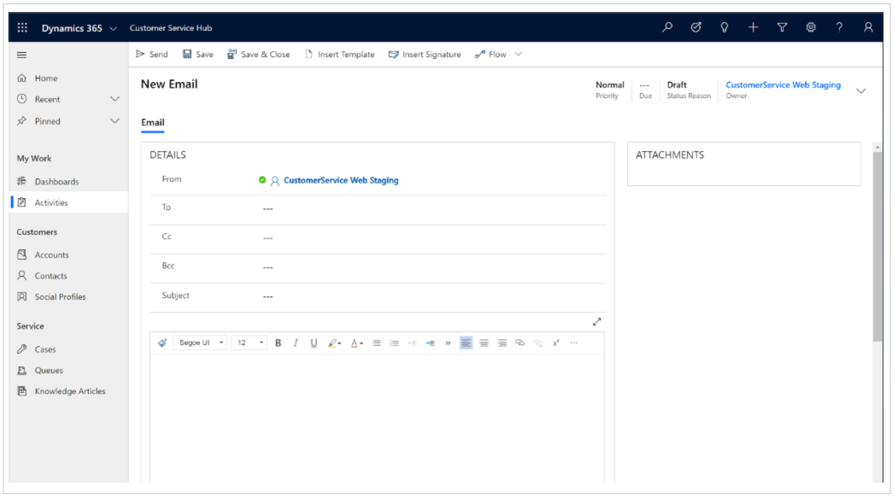

The **From** field is automatically populated based on the currently logged-in user.

3. Write your email directly in the composer or select **Insert Template** to search for and apply a template.

4. To compose your email in a full-screen window, select the expand icon.

   > [!div class=mx-imgBorder]
   > 

The message box has a rich text editor that enables you to create rich and well-formatted content for the emails with emphasis. By default, the editor displays as a single line which you can expand to see all of the functionality. For details about the features in the editor, see [Editor functionality and accessibility shortcuts](#editor-functionality-and-accessibility-shortcuts).

  > [!div class=mx-imgBorder]
  > 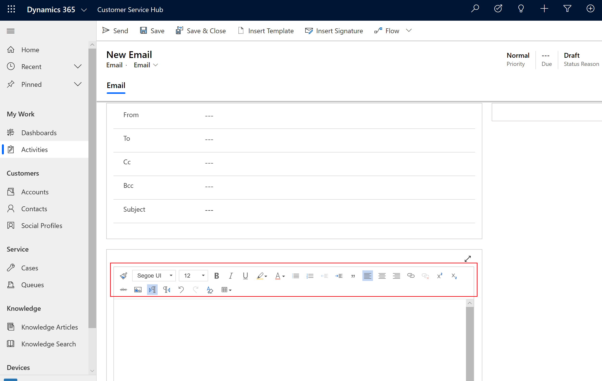

5. When you're done, select **Send**.

### Create and send email using the enhanced email experience

An alternate way of creating email is to use the enhanced email experience, which allows you to compose email without leaving the record you are working on. With the enhanced email experience, you can:

- Navigate to different pages without losing the email content.
- Minimize the email window to get back to the records you were working on.
- Expand the email editor pop-up window to see more email options.
- Simultaneously open three compose email pop-up windows.
- Search for and apply a predefined template to an email you're composing.
- Insert attachments to email.

> [!IMPORTANT]
> - Your system administrator must enable the enhanced email experience before you can use it. Follow the steps in [Enable the enhanced email experience](#enable-the-enhanced-email-experience).
> - The enhanced email experience is available only for email activities created from the **Timeline** section of any model-driven app. 

#### Enable the enhanced email experience

1. Sign in to your [https://<YourOrgURL>.dynamics.com/apps](https://<YourOrgURL>.dynamics.com/apps) environment.

2. Open a model-driven app, and then on the command bar, select **Settings**.

3. Under **System Settings**, select **Email Configuration**.

    > [!div class="mx-imgBorder"]  
    > 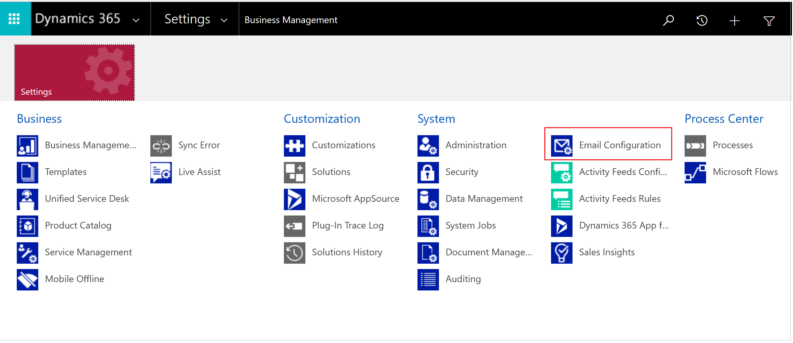

    The **Email Configuration** page opens.

4. Select **Email Configuration Settings**.

    > [!div class="mx-imgBorder"]  
    > 

5. On the **Email** tab of **System Settings** dialog box, scroll down to find **Enhanced email for Timeline**, and then select the **Multitask, compose, and save drafts, using email pop-up windows, when creating email from timeline** check box to enable it.

    > [!div class="mx-imgBorder"]  
    > 

6. Select **OK**.

#### Compose an email using the enhanced experience:

> [!Note]
> - This section assumes the administrator has already enabled this feature. For steps on how to enable it, see [Enable the enhanced email experience](#enable-the-enhanced-email-experience).

1. In the **Timeline** section of records such as account or contact, select **+** and then under **Activities**, select **Email**.

   A new email pop-up window opens. 

> [!IMPORTANT]
> The enhanced email pop-up window opens only when the height and width of your screen size is at least 400 x 650 pixels or greater. If lower, you will be taken to the standard form instead of the enhanced email experience. 

   > [!div class="mx-imgBorder"]
   > 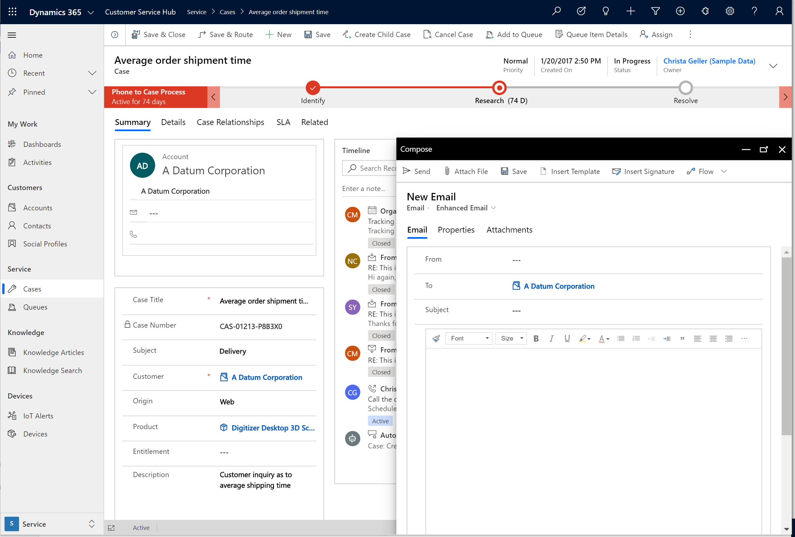

   The **From** and **To** fields are automatically populated based on the user and the account and contact of the original record.

2. Write your email from scratch or select **Insert Template** to search for and apply a template. For more information on inserting an email template, see [Insert an email template](#insert-an-email-template).

3. Select **Attach file** if you want to add attachments.

4. Select **Insert signature** to search for and add your signature.

5. When you're done, select **Send**. 

### Insert an email template
You can use an email template—a preformatted email message—to quickly create and send email messages. You can insert the template while composing an email by selecting **Insert Template** on the command bar. The list of available templates is displayed in the **Email templates** window. In the **Recently used** section, the four most recently used templates by you are displayed. The **All templates** section displays a list of all out-of-the-box email templates (global and entity specific), in alphabetical order. Global templates are shown as the type User. If you've created a custom email template, it will also be available here. For information about creating a custom email template, see [Create templates for email](https://docs.microsoft.com/power-platform/admin/create-templates-email).

You can see templates of a particular language by selecting a language from the **Language** list. You can either search for a template or browse through the list and select it. When you select an email template, a preview is displayed on the right side of the window. The preview shows you the content so you can pick the template that best meets your needs. After inserting an email template, you can modify the content as needed, and then send the email.

> [!NOTE]
> The search does not support regular expressions and it works on the template name only.

**To insert an email template**

1. In the email editor, select **Insert Template** on the command bar.

     > [!div class="mx-imgBorder"]
     >  

    The **Email templates** window opens.

2. To see templates of a different locale, select a language from the **Language** list. The templates are loaded as per the selected language.    

3. Browse for the template you want. Select the template, and preview the content of the template.

4. Optionally, you can select the down arrow on the name of the template to see a description of its content.

5. Select **Apply template** to insert the content in the email.

     > [!div class="mx-imgBorder"]
     > 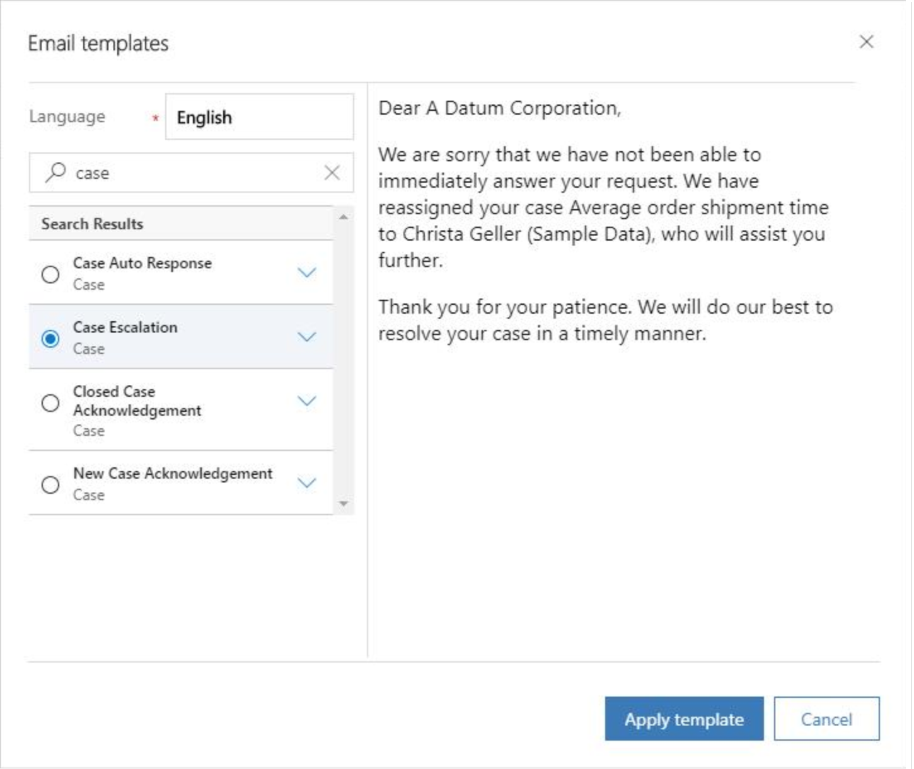

If you try to insert an email template on a device with smaller screen size, you'll only see an option to search and select a template.

> [!div class="mx-imgBorder"]
>  

### Editor functionality and accessibility shortcuts

The following table outlines the different formatting options of the rich text editor.

> [!Note]
> - You can access your browser's context menu by pressing **Ctrl** + right-click. This is useful if you need to use your browser's built-in spell checker. Otherwise, you can use the right-click to provide contextual formatting for any element you might be using.

|Icon | Name | Shortcut key | Description |
|----------------------|-------------------------|-----------------------------|-----------------------------|
|| Format Painter | Ctrl+Shift+C, Ctrl+Shift+V | Apply the look of a particular section to another section. |
| | Font | Ctrl+Shift+F | Select your desired font. The default font is Segoe UI. |
| | Font size | Ctrl+Shift+P | Change the size of your text. The default size is 12.|
|| Bold | Ctrl+B | Make your text bold. |
|| Italic | Ctrl+I | Italicize your text. |
|| Underline | Ctrl+U | Underline your text. |
|| Text Highlight Color |  | Make your text stand out by highlighting it in a bright color. |
|| Font Color |  | Change the color of your text. |
|| Bullets |  | Create a bulleted list. |
|| Numbering |  | Create a numbered list. |
|| Decrease Indent |  | Move your paragraph closer to the margin. |
|| Increase Indent |  | Move your paragraph farther away from the margin. |
|| Block Quote |  | Apply a block-level quotation format in your content. |
|| Align Left | Ctrl+L | Align your content with the left margin. (Commonly used for body text to make it easier to read.) |
|| Align Center | Ctrl+E | Center your content on the page. (Commonly used for a formal appearance.) |
|| Align Right | Ctrl+R | Center your content on the page. (Commonly used for a formal appearance.) |
|| Link |  | Create a link in your document for quick access to web pages and files.  Pasted or typed URL text is converted into a link. For example, "http://myexample.com" will become "<a href="http://myexample.com">http://myexample.com</a>".   In the **Link** dialog box, choose the type of link you'd like to insert.  The **Link Info** tab allows you to choose the link type as well as set the link protocol and URL.  The **Target** tab is only available for the URL link type. It specifies the location where the link will open after you select it. |
|| Unlink |  | Delete a link in your email or document.  When you place the cursor on a link, the **Unlink** button on the toolbar becomes active. Select the button to remove the link and make it plain text. |
|| Superscript |  | Type very small letters just above the line of text. |
|| Subscript |  | Type very smaill letters just below the line of text. |
|| Strikethrough |  | Cross out text by drawing a line through it. |
| | Image | | Insert an image.   You can insert an image by directly copying and pasting it inline in the editor, dragging and dropping it from your desktop or local folder directly into the editor, or by typing a URL. The following formats are supported: .PNG, .JPG., or .GIF.  To insert an image inline in your article:<ol><li>Drag and drop the image or or copy and paste it directly into the article.</li><li>Drag any corner of the image to resize it.</li></ol>  To insert an image using a URL or navigating to the local image:<ol><li>Choose Insert Image.</li><li>In the **Image** property dialog, choose from the following options:</li></ol><ul><li>Specify the web address of the image, and also specify properties to define how the image will appear in the email or article. **Note:**      If the image is located on the external server, use the full absolute path. If the image is located on a local server, you can use a relative path. If you want the image to be a selectable link, add a URL for the image. You can also specify if you want the targeted page to open in a new window, topmost window, same window, or parent window.</li><li>Select **Browse** to navigate to the image on your computer.</li></ul>|
|| Left to Right |  | Change the text to left-to-right for content such as an paragraph, header, table, or list. Commonly used for bi-directional language content. |
|| Right to Left |  | Change the text to right-to-left for content such as a paragraph, header, table, or list. Commonly used for bi-directional language content. |
|| Undo Typing |  | Undo changes you made to the content. |
|| Redo Typing |  | Redo changes you made to the content. |
|| Clear All Formatting |  | Remove all formating from a selection of text, leaving only the normal, unformatted text. |
|| Add a Table |  | Add a table to your content.   After adding a table, you can do any of the following:  <ul><li>Resize table columns by clicking and dragging your mouse to resize to the columns to the desired width.</li><li>Select one or several cells within a table and apply specific formatting, add links to the selection, or cut, copy, or paste entire rows or columns.</li><li>Right-click to uaccess the properties. This supports features such as cell type, width and height, word wrapping, alignment, merging and splitting cells horizontally and vertically, inserting or deleting rows and columns, row and column span, and cell and border color.</li></ul>|
|| Expand Toolbar |  | Displays when the toolbar is collapsed and not all options appear. Click to expand the toolbar and make all options visible. |

The following table outlines a list of accessibility shortcuts available when using email. You can access this list while composing email by pressing **Alt+0**.

|Type | Shortcut key | Description |
|----------------------|-------------------------|-----------------------------|
| General | Alt+F11 | Toggle full-screen view. |
| Tab navigation | Alt+Ctrl+0 | Go to menu bar. |
| Tab navigation | Alt+1 | Go to the rich-text editor. |
| Tab navigation | Alt+2 | Go to the HTML editor. |
| Tab navigation | Alt+3 | Go to the preview view. |
| General editor commands | Alt+F10 | Navigate to the editor toolbar. Move to the next and previous toolbar group with Tab and Shift+Tab. Move to the next and previous toolbar button with Right Arrow or Left Arrow. Press Space or Enter to activate the toolbar button. |
| General editor commands |  | Editor dialog: Inside a dialog, press Tab to navigate to the next dialog element, press Shift+Tab to move to the previous dialog element, press Enter to submit the dialog, press ESC to cancel the dialog. When a dialog has multiple tabs, the tab list can be reached either with Alt+F10 or with Tab, following the dialog tabbing order. With a tab list focused, move to the next and previous tab with Right and Left Arrow, respectively.. |
| General editor commands |  | Editor list box: Inside a list box, move to next list item with Tab or Down Arrow. Move to previous list item with Shift+Tab or Up Arrow. Press Space or Enter to select the list option. Press ESC to close the list box. |
| Base commands | Ctrl+Z | Undo command. |
| Base commands | Shift+Ctrl+Z | Redo command. |
| Base commands | Ctrl+B | Bold command. |
| Base commands | Ctrl+I | Italic command. |
| Base commands | Ctrl+U | Underline command. |
| Base commands | Alt+0 | Accessibility help. |
| Base commands | Esc | Cancel operation. |

## Work with Queues

Use queues to organize, prioritize, and monitor the progress of your work. In Dynamics 365 Customer Service, queues are containers used to store anything that needs to be completed or requires an action, for example completing a task or closing a case. To know more about creating and managing queues, see [Create and manage queues](set-up-queues-manage-activities-cases.md).

**Open Queues view**

In the Customer Service Hub sitemap, select **Service** > **Queues**. The queues view is displayed.

- Use the drop-down lists to switch between the views and the various queues.
- Select a record in the queues view to:
    - **Edit** the record
    - **Route** the record
    - **Pick** the record. It will be assigned to you and will be moved to your queue.
    - **Release** the record. It will be assigned back to the queue owner for other's to pick up.

To know how to add a case to a queues, see [Add a case to a queue](customer-service-hub-user-guide-case-queues-and-routing.md).

## Understand Site

To create a new site, you need to go to **Advanced find** .  Then you can customize other entity forms (e.g. Account) by adding this site field.

  
 
 ## Understand Facility/Equipment

 To create a new Facility/Equipment item, you need to go to **Advanced find** , where you can create Facility/Equipment.

  

### See also

[Create and design forms for Customer Service Hub](create-design-forms-customer-service-hub.md)

[Track your cases efficiently and act on them quickly](customer-service-hub-user-guide-case-sla.md)
