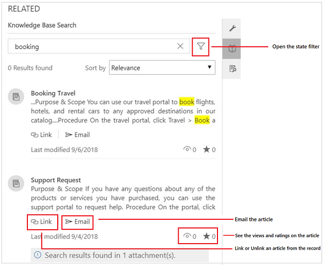

# Learn the basics of the Customer Service Hub

[!INCLUDE[cc-applies-to-update-9-0-0](../includes/cc_applies_to_update_9_0_0.md)]
  
The Customer Service Hub’s intuitive interface brings together vital information in one place, so you can focus on the things that matter.  

## Customer Service Hub application requirements  
 Here’s a list of operating systems and browsers that are supported by the Customer Service Hub:  
  
- **Desktop operating system**  
    - Windows 10 (for Knowledge management on Unified Interface)
  
- **Browsers** 
    - Google Chrome
    - Microsoft Edge (supported on Windows 10)
    - Apple Safari 11

- **Mobile**
    - iOS 10 - Tablet & Phone
    - Android - Tablet + Phone (Android 6 and 7)
    - Windows 10 

## Open the Customer Service Hub
The Customer Service Hub app is available to use on a desktop browser and on a mobile device for managing knowledge articles and case management. You can open the Customer Service Hub in the following ways:  

> [!NOTE]
>  These options are available only to users with the Customer Service app access role , System Administrator role, or System Customizer role. 

**Desktop browser**
  
-   In the [!INCLUDE[pn_microsoftcrm](../includes/pn-microsoftcrm.md)] web application, go to **Settings** > **Application** > **My Apps** >  **Customer Service Hub**.   

     
 
  
-    In the Dynamics 365 sitemap, navigate to the app switcher and then select **Customer Service Hub**.

     
  
**Mobile device**

To access the Customer Service Hub app on a mobile device:

- Install the Dynamics 365 mobile app. 
  
  To install the Dynamics 365 mobile app, see [Install Dynamics 365 for phones and tablets](../mobile-app/install-dynamics-365-for-phones-and-tablets.md)
- From the MyApps page, select **Customer Service Hub**.

   

## Work with case management record types, dashboards, and tools  
 In the Customer Service Hub, you will find everything you need to easily manage customer service at your organization:  
  
-  Dashboards  
-  Activities: Email, Task, Appointment, Phone Call, Social Activity  
-  Accounts  
-  Contacts 
-  Social Profiles 
-  Cases 
-  Queues  
-  Knowledge Articles

The Customer Service Hub comes with an enhanced sitemap to enable easy navigation of the interface. To learn more, see [Understand the sitemap navigation](#understand-the-sitemap-navigation).
  
Any record types that are enabled for mobile are also available for use in the Customer Service Hub. However, these records are read-only.  
  
> [!NOTE]
> The navigation bar for the Customer Service Hub is different from the navigation bar in the [!INCLUDE[pn_crm_shortest](../includes/pn-crm-shortest.md)] web application.   

## Understand the sitemap navigation
  
1.  On the sitemap, select **Service**, and then select an entity record type.  
  
    
  
    When you select a record type from the menu, such as Accounts, Contacts, or Cases, you’ll see a list of corresponding customer records (also known as Entity grid). 

 	To view recently opened records, select the down-arrow next to the record type.

    Here is what each entity record type is used for:

    - **Dashboards** collect all your most important data in one place. You can select from multiple dashboards as per your role.
    - **Activities** help you keep track of tasks, email messages, appointments, phone calls and much more.
    - **Accounts** are the companies you do business with.
    - **Contacts** help you manage and store information about the customers you work with.
    - **Social Profiles** let you track a contact's presence in social media.
    - **Cases** help you create and track your customer requests and issues.
    - **Queues** keep a track of cases waiting for you to work on.
    - **Knowledge Articles** capture your customer’s questions, issues, feedback, and resolutions, so that other service reps can benefit from them.

2. Select **Training** to go to the documentation site, known as **Help Center**. 
3. Select **Favorites and Recent** button   to see recently viewed records, or to see views that have been pinned as favorites.

For a mobile device, the sitemap is displayed as illustrated in the following image:

## Open the default dashboard for a record type
When you’re viewing the list of records for a specific record type, select **Open Dashboards** in the command bar to switch to the default dashboard for that record type. 

To return to the list of records, select **Open Views** in the command bar.
  
 [!INCLUDE[proc_more_information](../includes/proc-more-information.md)] [Use interactive dashboards to effectively manage service cases](customer-service-hub-user-guide-dashboard.md)
  
 
## Navigate through records and pages  
  
-   When you're viewing a record, select and expand **Open Record Set** to navigate to other records. A side panel opens where you can view other records. You can directly select the records from the panel and view the details of the  record.
 
      

> [!NOTE]
> The option Open Record Set will not be available on devices with comparatively smaller screen sizes.
  
-   To go the previous page in the Customer Service Hub, click the browser’s **Back** button. 
   
   
## Quickly create new records
  
- To create records quickly by filling in only the most basic information, select the **New** button  given on the nav bar.

  > [!TIP]
  > On a mobile device, from the nav bar, tap  and then tap **Quick Create Menu**.

## Email a link  
You can email links to records so your colleagues can quickly find these records by selecting the links. To email links to records, select one or more records in the list, and then on the command bar, select **Email a link**. The default email client opens with the links to these records. The recipients will see all content in the records for which they have permission.  

## Know your forms
Forms are designed to help you quickly handle important customer service tasks and complete actions from a single place.

Understand the different components of a form below:
  
### **Business processes**  
 In the Customer Service Hub, forms for cases and knowledge articles include a process bar (also called a business process flow), which appears when you save the record for the first time. 
 
When you select a process stage on the process bar, you'll see the steps to take to complete that stage. A flag on a stage indicates the stage you’re currently on. When you select an active stage, you can see the **Next Stage** button move to the next stage in the process.  

The stages in the business process flow are displayed in floating mode, or docked mode. Stages can  be aligned in a vertical layout, instead of horizontal, which makes it easier to see what steps are required to move forward. You can also choose to include an optional step in the business process flow and define criteria to trigger it.

  
If there is more than one process to follow, you can switch between them by selecting **Process** > **Switch Process** on the command bar, and then selecting the process you want to use.  Or you can choose to abandon the process if it no longer applies.
  
 When a business process flow based on multiple entities is applied to a case or a knowledge article, the following limitations apply:  
  
-   The business process flow based on multiple entities isn't displayed on the form.  
  
-   The **Switch Process** option only shows business process flows that are based on a single entity.  
  
-   If there are only multi-entity business process flows for an entity, the **Switch Process** option isn't available.  

### **Tabs**  
 A tab is a group of sections on a page. Each case form is composed of one or more tabs. By default, the **Summary** tab shows information about the customer, interactions with the customer, and other related records. You can select different tabs to enter or see other miscellaneous details of a record.  
  
For example, here’s a view of how the tabs appear on the case form:
  

  
 This table lists the default tabs for each record type and the information that they show for a particular record.  
  
|Record type|Default tabs|  
|-----------------|------------------|  
|Case|**Summary**. Includes the customer card, Timeline, and the Related section.    **Details**. Tracks Case details, additional details, and social response details of the case.  **Case Relationships**. Shows a Merged Cases and Child Cases list. You can add a new child case to the current case from the Child Cases list. It also shows a list of knowledge articles associated with the case. **SLA**. Shows the related SLA KPI Instance records that are created for each SLA KPI that is tracked for the case.  **Related**. Shows related entities like Knowledge Base records and Connections.|
|Account|**Summary**. Includes the customer card, Timeline, and the Related section. **Details**. Tracks additional details like company profile, marketing details, contact preferences, and billing and shipping. **Related**. Shows related common entities.| 
|Contact|**Summary**. Includes the customer card, Timeline, and the Related section. **Details**. Tracks additional details like personal information, marketing details, contact preferences, and billing and shipping.  **Related**. Shows related common entities.| 
|Activities|Activity forms shows a tab called Task for the respective activity and a Related tab for common entities. |  
|Knowledge Articles|**Content**. Lets you write and edit the content for the article. **Summary**. Tracks basic settings, Timeline, publishing settings, and related information. **Analytics**. Shows the number of views, feedback, and a list of cases using the article. **Related**. Shows related common entities.|  
|Social Profiles|**Social Profile**. Captures general information, and social profile details along with related social profiles. **Related**. Shows related common entities.|  

### **Contact card**  
 See a complete view of your customer’s touch points in the Contact card. This card is available in the **General Information** section of the **Summary** tab.  
  

 You can add a picture to the account or contact record in the [!INCLUDE[pn_crm_shortest](../includes/pn-crm-shortest.md)] web application, and it will appear on this card. You can make calls to customers from the Contact card using Skype for Business – IP telephony.
  
 For account records, the card shows contact details for the primary contact associated with the account. For contact records, the card appears if the contact is the customer value on the case form.  

### **Timeline**  
 See a combined view of your customer’s interactions across various channels, such as phone, email, or even social activities in the Timeline. The Timeline also shows any related notes or system posts.  The Timeline makes collaboration with other users easy and efficient.

The Customer Service Hub comes with an enhanced Timeline that lets you view all interactions, arranged in a single stream. You can create, update, and manage notes, posts and other interactions from the Timeline itself. 

With the help of text and visual filters, you can filter by activity types in the Timeline. You can also check what you have missed from the previous day or week, using the **What’s new** section. This section gives you a view of new notes, unread emails, and new activities created while you have been away. 
  
The Timeline is available on the **Summary** tab for account, contact, case records, and for knowledge articles.
  
   
  
 Here are a few things you can do in the Timeline: 
 
  
-   Enter a note by selecting the **Enter a note** box. You can also add attachments to your notes.
- Quickly create a new interaction with a customer by selecting **+** in the Timeline. 
- Filter the timeline for a specific activity type or by date. 
  
     You can filter by Activity status or record type. Select the ellipsis and then select  **Open filter pane** to explore the filters

     
  
-   Refresh the timeline so you see the updated list of activities.  
  
-   Select the title of an activity to open the activity record.  
  
-   Take quick actions on an activity from the timeline, such as marking an activity complete, assigning it to others, adding it to a queue, converting it to a case, or deleting it.   
-   Sort the entries by latest or oldest entry.

### **Related section**  
In the **Related** section (also known as Reference panel), use the tabs to see related records for the current record. This section is enabled by default for account, contact, case, and knowledge article records. Your customizer can add this section for all entities (including custom entities) that are enabled for interactive experience.

For example:

By default, the first tab in the Related section of a case record shows the **Recent Cases and Entitlements** for the current case record you’re working on. 
  

The second tab in the Related section of a case record is the **Knowledge Base search**. Knowledge Base search lets you search for the knowledge articles related to a specific record. It also lets you view automatic suggestions. You can filter the search results to display articles that are Published, Draft, or Approved. For more information, see [Search for Knowledge articles](customer-service-hub-user-guide-case-sla.md#search-for-knowledge-articles). 
  

The third tab in the Related section of a case record displays **Similar Cases**. Select **...** on a record to follow or unfollow the case, and explore other options. 

 Watch this video to learn more about the Reference Panel in the Customer Service Hub:

<iframe src="https://www.microsoft.com/en-us/videoplayer/embed/d8224c3f-6e20-4b8e-9d0d-b0f5602c7708" frameborder="0" allowfullscreen=""></iframe>

> [!NOTE]
> You can configure rules that help you view similar cases based on automatic suggestions. These rules can be created using either the Cognitive Services Text Analytics or a built-in similarities matching engine in Dynamics 365. For more information, see [Create similar record suggestion rules](../admin/public-preview-microsoft-cognitive-services-integration.md#create-similar-record-suggestion-rules).

Similarly,

- For **Accounts** records, you can view Contacts, Recent Opportunities, Recent Cases, and Entitlements in the Related section.
- For **Contacts** records, the Related section displays Recent Opportunities, Recent Cases, and Entitlements. 
- For **Knowledge articles** records, select an article and go to the **Summary** tab to view the **Related Information** panel. Here you can view Related versions, Related translations, Related categories, Related articles, and Related products for an article.

> [!NOTE]
> Your system administrator or customizer can choose if Related section should be included in a form. They can also decide on what related data should be displayed in the section for each form.

#### Reference Panel reflow
The Customer Service Hub is available to use on a desktop browser, and on a mobile device. Depending on the zoom level and the resolution of the system on which you are accessing the hub interface, the Reference panel adjusts the tabs and records for an optimum experience.

For example, on a browser, if you zoom in to about 100% or more, the tabs get docked on the top of the panel.

Similarly, if you zoom out to about 60-70%, the records appear in grid form.

## Understand Activities

Activities are the tasks that you or your team perform while interacting with customers. An activity is any action which can be entered on a calendar and has time dimensions (start time, stop time, due date, and duration) that help determine when the action occurred or is planned to occur.

For example, you can make a record to track a phone call with a customer, or list an appointment scheduled with a customer to discuss a certain issue. You can create activities for yourself, or assign them to other service reps.

In Dynamics 365, the following activities are supported:
- Email
- Task
- Appointment
- Phone Call
- Social Activity

> [!NOTE]
> You can create and edit emails in the Customer Service Hub app on a desktop browser. However, on a mobile device email is read-only in the Hub app.

#### Open Activities view
In the Customer Service Hub sitemap, select **Service** > **Activities**. The **My Activities** view is displayed. 

- Select  in the nav bar to go to **Activities** to quickly add a new activity.

- Select the **My Activities** drop-down to switch between activity views.

- Select the  **Due** drop-down to see the list of activities that are due in coming time or are already overdue.

- Explore the command bar options to create a new activity like new **Task**, **Email**, **Appointment**, or **Phone call**.
  
  For example: To create a new email, select **Email** from the command bar.  The New Email activity form is displayed.
  
- Select **...** in the command bar and go to **Open Dashboards** to directly open activity dashboard.

- To view the status of an activity, click the activity record and see bottom-left in the activity form. 

## Manage Queues

Use queues to organize, prioritize, and monitor the progress of your work. In Dynamics 365 for Customer Service, queues are containers used to store anything that needs to be completed or requires an action, for example completing a task or closing a case.

**Open Queues view**

In the Customer Service Hub sitemap, select **Service** > **Queues**. The queues view is displayed.

- Use the drop-down lists to switch between the views and the various queues.
- Select a record in the queues view to:
    - **Edit** the record
    - **Route** the record
    - **Pick** the record. It will be assigned to you and will be moved to your queue.
    - **Release** the record. It will be assigned back to the queue owner for other's to pick up.

To know how to add a case to a queues, see [Add a case to a queue](customer-service-hub-user-guide-case-sla.md#add-a-case-to-a-queue).

### See also

[Track your cases efficiently and act on them quickly](customer-service-hub-user-guide-case-sla.md)
