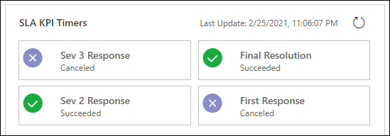

# Case SLAs

The Customer Service Hub provides the ability to track and manage case SLAs.

## Track SLA details with Timer Control

You or the agent working on the case can see the SLA details on the case form.

### Timer control for SLA-enabled entities

If your administrator has configured to display the statuses of the configured SLA KPIs by using the SLA Timer control subgrid, the  following details are available:

- The different stages that the KPIs go through are displayed.
- When a KPI nears compliance or noncompliance, the time ticker changes to show the time in hours, minutes, and seconds, as applicable.
- The icons are updated for the different stages that the KPIs go through.
- The KPIs are refreshed at the interval that you specify at the time of configuration.

A sample runtime view of the SLA Timer is as follows.

### Case form with SLA applied  

Only the failure time is tracked and saved on the case record. You can ask your system administrator or customizer to add a timer to the case form. The timer shows the time remaining to meet the SLA or the time elapsed since the SLA failed and takes into consideration the business hours. For example, if failure time is set to 5 days and business hours are 9:00 a.m. to 5:00 p.m., then you will see 5 days on the timer. If failure time is set to 10 hours, then you will see 1 day and 2 hours on the timer.

> [!NOTE]
> It is recommended to use only Enhanced SLA because Standard SLA is deprecated. For more information, see [Important changes coming in Dynamics 365 Customer Service](https://docs.microsoft.com/dynamics365/get-started/whats-new/customer-engagement/important-changes-coming).

### Case form with Enhanced SLA applied

When an enhanced SLA is applied to a case, a related **SLA KPI Instance** record is created for each SLA KPI that is tracked for that case. On the **Summary** tab of the case record, you’ll see a timer that shows the time remaining to meet each SLA KPI. When a service rep puts a case on hold, the status of the SLA KPI Instance is set to **Paused**. You can see the time for which a case was on hold and the last time the case was put on hold. These details are not available on the case form by default, but your system customizer can add these fields on the case form for you. 

The on-hold time is the time for which the case was set to a status that you defined as an **On-Hold** status in the **System settings** dialog box. [!INCLUDE[proc_more_information](../includes/proc-more-information.md)] [System Settings dialog box - Service tab.](../admin/system-settings-dialog-box-service-tab.md)

When the service rep resumes a case, the status of the SLA KPI Instance record is updated. The following details are updated in the record if the SLA isn’t violated:

- Failure time
- Warning time
- Total time the case is on hold

If the service rep puts the case on hold after the warning time, then the warning time isn’t updated when the case is resumed.

Similarly, the status of the SLA KPI instance is updated when the first response time on a case is:

- Nearing expiry
- Has expired
- Has succeeded

> [!NOTE]
>
> - The SLA timer continues to run after it is triggered or resumed. It includes the holiday hours, non-business hours, and pause time (only business hours) while projecting the SLA warning or failure time.  
> - The timer control auto-refreshes for **Pause** and **Resume** states to show the updated SLA. For all other states, you must refresh the page to view the refreshed SLA. Select **...** and select **Refresh** on the command bar to refresh the SLA timer control.

You can now also apply SLAs on demand. [!INCLUDE[proc_more_information](../includes/proc-more-information.md)] [Apply SLA on demand](define-service-level-agreements.md#apply-sla-on-demand)

To learn more about adding a timer control to a case form, see [Add a timer control for SLA-enabled entities](add-timer-control-case-form-track-time-against-sla.md).

## Apply a routing rule set

An active routing rule set is automatically applied to all automatically created cases. Perform the following steps to manually apply a routing rule to the existing or manually created cases:

1.	In Customer Service Hub, select Cases. The **My Active Cases** page appears.
2.	Select the cases for which you want to apply the routing rule, and on the command bar, select **Apply Routing Rule**. The routing rule will be applied for the selected cases.

  > [!NOTE]
  > If you’re importing bulk records, and don’t want the routing rules to be applied to the cases that you’re importing, add a column **Route Case** to your spreadsheet, and add the value **No** for all the cases that you don’t want to route.

## Use SLA on the Customer Service Hub records

Your system administrator can enable entities other than case for SLA. For the Customer Service Hub, the following other entities can be enabled for SLA:  

- Account  

- Contact  

- All activity entities: Email, Task, Appointment, Phone Call, Social Activity  

- All custom entities and activities  

  With this enhancement, you can define metrics or key performance indicators (KPIs) to meet the service level for these entity records.  

> [!NOTE]
>  SLAs can only be created in the Dynamics 365 Customer Service. However, you can ask your system administrator or customizer to add a timer to your interactive experience forms to track the SLA KPI details in the Customer Service Hub.  

To know more about how to create SLAs, see [Define Service Level Agreements (SLAs)](define-service-level-agreements.md).

### See also

[Learn the basics of the Customer Service Hub](customer-service-hub-user-guide-basics.md)  
[Use the Main form and its components](../customerengagement/on-premises/customize/use-main-form-and-components.md)  

[!INCLUDE[footer-include](../includes/footer-banner.md)]