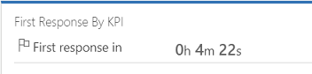
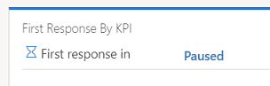
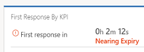
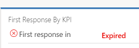
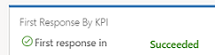

# Work with cases and manage SLAs

Track your cases efficiently and act on them quickly in the Customer Service Hub application.

Creating and managing a case can’t be any simpler. With the intuitive case form in the Customer Service Hub, you can do all your important tasks and actions without navigating to different parts of the application.  

You can capture important information about customers, interactions you’ve had with them, and all related records of the current case in once single place.  

Watch this video to learn more about case management in the Customer Service Hub:

<iframe src="https://www.microsoft.com/videoplayer/embed/cde80c83-f592-4b15-b1a1-4fae13be93f9" frameborder="0" allowfullscreen=""></iframe>

## Create a case
1. Make sure that you have the Customer Service Manager or Customer Service Representative role, or equivalent permissions. 
2. In the Customer Service Hub sitemap, go to <strong>Service</strong> &gt; <strong>Cases</strong>.

   - The **My Active Cases** view is displayed. You can switch between case views using the drop-down.
   - Select **Show Chart** on the command bar to see the chart view.
   - Select **Open Dashboards** on the command bar to directly open the entity dashboard. To switch back to views, select **Open Views**.

   If you select a case record from the case view, you see these additional options on the command bar:

   - Select **Apply Routing Rule** to apply a routing rule on a selected case.
   - Select **Assign** to assign a case to another owner.
   - Select **Add to Queue** to add a case to a queue.  

   

3. On the command bar, select **New Case**.  Alternatively, you can quickly create a new case by selecting  in the nav bar and selecting **Case**. This opens a vertical flyout towards the right side of the screen.

   View and update the **Priority**, **Status**, and **Owner** of the case. The **Created On** date is picked up as soon as you save the case. 

4. Go to **Summary** and in the **Case Title** field, type a descriptive title to identify the case.  

5. In the **Subject** field, select a subject. Associating cases with subjects helps you search for cases with similar issues and find related articles. If you don't see the subject you want in the list, ask your system administrator to add it.

6. Find the customer:  

   1.  Select the **Customer** lookup button. By default, this field shows all customer records, accounts, and contact records. Or, type a few letters and select **Enter** to search for records that contain the letters. After you select an existing customer, the **General Information** section  will show the contact card for the customer, along with recent cases in the Related section.  

   2.  If a customer record doesn’t exist, you can a add new customer record using the entity tab.

7. In the **Origin** field, select the channel through which this case was initiated.  

8. In the **Product** field, select the product this case is for. You can’t select a product family, a draft product, or a draft product bundle.  
9. To see what kind of support you should provide the customer, select the **Entitlements** lookup button and select an active entitlement. The **Entitlements** section in the case record lists all the active entitlements for the customer.

    > [!IMPORTANT]
    > If an SLA is associated with an entitlement and the same entitlement is applied to a case, then the associated SLA becomes applicable for the case. 

   > [!NOTE]
   > - When a case is created and an entitlement is applied to it (or when the case gets resolved), the entitlement terms from the associated entitlement are decremented. However, if you don’t want the entitlement terms to be decremented for a case, on the command bar select **Do not decrement entitlement terms**.  
   > - When you update the **Customer** field, the value of the **Entitlements** field will be cleared.

10. Select in the **Description** field to enter to add a detailed description about the case.

11. Navigate to other tabs to provide or view more information about the case. 

    -   The **Details** tab tracks **Case Details**, **Additional Details**, **Social Details**, **Description**, and **Applicable SLA** of the case.  

    -   The **Case Relationships**  tab shows a **Merged Cases** and **Child Cases** list. You can add an existing child case to the current case from the **Child Cases** list. If you want to create a new child case for the current case, select **Create Child Case** on the command bar.  

        The **Case Relationships** tab also shows a list of knowledge articles associated with the case, in the Associated Knowledge Records sub-grid.  

    -   The **SLA** tab shows the related SLA KPI instance records for each SLA KPI that’s tracked for the case.  

        > [!NOTE]
        >  By default, a timer for enhanced SLA is already added to your case form. If an enhanced SLA applies to the case you're working on, you will see a timer that shows the countdown to meet the SLA KPIs.    

    - The **Related** tab shows the common associated entities like **Knowledge Base Records**, **Activities**, **Connections**, and **Work Orders**. 

      Select on any one of the common associated entities and they open in a new tab, aligned horizontally.   

12. When you’re done, select **Save**.
    - After you save the case, the Timeline section appears and displays the post about case creation.
    - The Business Process flow bar appears and displays the process stages to guide your case towards completion. For more information, see [**Business processes**](customer-service-hub-user-guide-basics.md#business-processes).
    - On the command bar: 
       - Select **Save and Route** to  route the case by applying routing rules
       - Select **Create Child Case** to create a child case
       - Select **...** on the command bar to explore more options for the case.

    

> [!NOTE]
> If you have previously installed any portal solution, to create a case in the Customer Service Hub or to use the Merge cases command, you must turn off the **Read-only in mobile** option for the Case entity. More information: [Turn off Read-only in mobile option](../customerengagement/on-premises/customize/edit-entities.md#enable-or-disable-entity-options).

## Track SLA details with Timer Control  
You or the CSR working on the case can see the SLA details right on the case form. See the below section to know what happens when an  SLA is applied to a case form. 

### Case form with Applicable SLA applied  

Only the failure time is tracked and saved on the case record. You can ask your system administrator or customizer to add a timer to the case form. The timer shows the time remaining to meet the SLA or the time elapsed since the SLA failed. 

> [!NOTE]
> It is recommended to use only Enhanced SLA as Standard SLA is deprecated. For more information, see [Important changes coming in Dynamics 365 Customer Service](https://docs.microsoft.com/dynamics365/get-started/whats-new/customer-engagement/important-changes-coming).

### Case form with Enhanced SLA applied 
When an enhanced SLA is applied to a case, a related **SLA KPI Instance** record is created for each SLA KPI that is tracked for that case. On the **Summary** tab of the case record, you’ll see a timer that shows the time remaining to meet each SLA KPI.     When a service rep puts a case on hold, the status of the SLA KPI Instance is set to **Paused**. You can see the time for which a case was on hold and the last time the case was put on hold. These details are not available on the case form by default, but your system customizer can add these fields on the case form for you. 

The on-hold time is the time for which the case was set to a status that you defined as an **On-Hold** status in the **System settings** dialog box. [!INCLUDE[proc_more_information](../includes/proc-more-information.md)] [System Settings dialog box - Service tab.](../admin/system-settings-dialog-box-service-tab.md)  When the service rep resumes a case, the status of the SLA KPI Instance record is updated. The following details are updated in the record if the SLA isn’t violated:   -   Failure time -   Warning time -   Total time the case is on hold   If the service rep puts the case on hold after the warning time, then the warning time isn’t updated when the case is resumed.

Similarly, the status of the SLA KPI instance is updated when the first response time on a case is:

- Nearing expiry 

  

- Has expired

  

- Has succeeded

  
 

> [!NOTE]
> - The SLA timer continues to run once it is triggered or un-paused. It includes the holiday hours, non-business hours, and pause time (only business hours) while projecting the SLA warning or failure time.  
> - The timer control auto-refreshes for **Pause** and **Resume** states to show the updated SLA. For all other states, you must refresh the page to view the refreshed SLA. Select **...** and select **Refresh** on the command bar to refresh the SLA timer control.

You can now also apply SLAs on demand. [!INCLUDE[proc_more_information](../includes/proc-more-information.md)] [Apply SLA on demand](define-service-level-agreements.md#apply-sla-on-demand)

To know more about adding a timer control to a case form, see [Add a timer control to the Case form to track time against an SLA](add-timer-control-case-form-track-time-against-sla.md). 

## Manage activities from the Timeline  
 Capture all interactions and communications you’ve had with your customer by adding them as activities in the Timeline section. The Timeline section gives you a unified view of everything that's happening on a case, like email received, a follow-up task that you created, system posts that are automatically generated when the cases is created, or any notes you take while talking to the customer.  

 When you update an activity, it moves up in the Timeline. You can sort the Timeline in both ascending or descending order of time, as per your wish.

||||  
|-|-|-|  
|**To**|**Do this**|| 
|Enter a note |  Enter a note by selecting the **Enter a note** box. You can also add attachments to your notes.|
|View what you have missed | See any interaction missed from the previous day or week at the top of the Timeline |
|Create a new interaction|In the **Timeline** section, select **+**, and then select an interaction type: Activity, Appointment, Email, Phone call, Task, Note or a Post.   To draft an email in the email activity, you can use the rich text editor, which has several formatting options. More information: [Use the rich text editor to create knowledge articles and emails](customer-service-hub-user-guide-knowledge-article.md#use-the-rich-text-editor-to-create-knowledge-articles-and-emails). |
|Filter activities|1.  In the **Timeline** section, select  **(...)**  and select **Open Filter Pane**. 2. Filter the timeline for a specific activity type or by date. You can filter on the basis of Activity status or record type. |  
|Take actions on an activity|For an activity, select the **Quick Actions** button   and select the action you want to take. For example, for a Phone Call activity, you will see actions like Close Activity, Add to Queue, and Open Entity Record. |  

## See and manage related records in the Related section  
 The **Related** section (also known as Reference panel) in a case record provides you with quick access to important information related to the selected case that would help you resolve the case. For more information, see [Related section](customer-service-hub-user-guide-basics.md#related-section).

### See recent cases and entitlements  
See **Recent Cases and Entitlements** to view:  

-   A list of recent cases for the customer associated with the current case.  

-   A list of entitlements for the customer associated with the current case.  

### Search knowledge articles in the Knowledge Base Search control

Search for relevant knowledge articles to quickly resolve a case. For more information, see [Search for knowledge articles in the Customer Service Hub](search-knowledge-articles-csh.md).

## Convert a case to a Knowledge article  
 There are times when existing knowledge articles do not contain relevant information for resolving a case. You, as a CSR, can now contribute to the knowledge base by turning all information that has been researched for a case into a knowledge article. You can convert one case into multiple knowledge articles.  

1. Make sure you have Create permissions on the Knowledge Article entity.  

2. In the list of active cases, open the one that has the information that you want to convert to a knowledge article.  

3. On the command bar, select the ellipsis **(...)** and go to **Convert To** > **To Knowledge Article**.  

    The **Convert to Knowledge Article** dialog box opens. The title, owner, and subject of the article are populated based on the title, owner, and subject of the case. The content of the article is automatically populated with the description of the case. If the case is resolved, the content field shows the case description, case resolution, and case resolution description.  

4. If you want to open the newly-created article, select the **Open the new knowledge article** field to set it to **Yes**, and then select **Convert**. Otherwise, set it to **No**.  

5. If you set **Open the new knowledge article** to **Yes**, a knowledge article form opens. Fill in the necessary information for the knowledge article, and then select the **Save** button.  

   [!INCLUDE[proc_more_information](../includes/proc-more-information.md)] [Create a knowledge article](customer-service-hub-user-guide-knowledge-article.md#create-a-knowledge-article)  

The knowledge article is created regardless of whether you set **Open the new knowledge article** to **Yes** or **No**.  

## Merge cases  
 When a customer opens multiple cases about the same issue (through different support channels), or when multiple customers from the same account call in about the same issue, you can merge those cases into one case to eliminate redundancy.  

 When a case is merged, the state of the case is changed to canceled, and the status is changed to merged. This is because it is merged into another case and all of the open case activities, emails, and attachments are now associated with the case it was merged into. By default you can merge up to 10 cases at a time.  

 A few things to remember when you merge cases with parent and child relationships:  

- When you merge a case that has child cases, those child cases become child cases of the parent case they were merged into.  

- You can only merge a child case into another child case if both of the child cases have the same parent case.  

  In the Customer Service Hub, you can merge cases from the dashboard streams or from the list of case records.  

#### Merge cases from dashboard streams  

1.  On the sitemap, select **Service** > **Dashboards**.  

2.  Open the dashboard you want to look at.  

3.  Select at least two active case records that you want to merge using the **Bulk select** button .
4.  Select the **More Actions** button , and then select **Merge Cases**.  

     You can select and merge up to 10 cases at a time.  

4.  In the **Merge Cases** dialog box, from the list of cases, select the case the other cases will be merged into, and then select **Merge**.  

5.  To see the merged case, open the case it was merged into. You'll find the merged case listed in the **Merged Cases** section on the **Case Relationships** tab.  

#### Merge cases from a list of case records  

1.  On the sitemap, select **Service** > **Cases**.  

2.  Select  at least two active case records that you want to merge, and then on the command bar, select **Merge Cases**.  

     You can select and merge up to 10 cases at a time.  

3.  In the **Merge Cases** dialog box, from the list of cases, select the case the other cases will be merged into, and then select **Merge**.  

4.  To see the merged case, open the case it was merged into. You'll find the merged case listed in the **Merged Cases** section on the **Case Relationships** tab.  

## Create and manage parent and child cases  
 You can manage multiple cases more efficiently if you use parent and child cases in the Customer Service Hub. When you want to track a case where work needs to be done by other departments, or when you need to track the same issue for multiple customers,  open a primary, or "parent" case, and then create secondary, "child" cases.  For example, if you get a service request to install new electrical and gas connections, this requires work to be done separately by the gas and electric departments. In this situation, you can open two child cases, one for the gas department and the other for the electric department. The original case is marked as the parent case. Once the child cases are resolved, you can then close the parent case.  

### Create a new child case  
 When you need to create a child case for the case you’re working on, you can quickly do this from the case form.  

> [!IMPORTANT]
>  For more information about defining settings for parent child cases, see [Define settings for parent and child cases](define-settings-parent-child-cases.md).    

1. [!INCLUDE[proc_service_cases](../includes/proc-service-cases.md)]  

2. When the case form is open, do one of the following:
   - On the command bar at the top, select **Create Child Case**.
   - Go to the **Case Relationships** tab, and in the **Child Case** section, select **Add New Case**.

   > [!NOTE]
   > If you wish to add an existing case as a child case, go to the **Case Relationships** tab, in the **Child Case** section, select **(...)** and select **Add Existing Case**. A flyout appears on the right side of the screen. Use Lookup Records to look for a case that you want to add as child case.

3. Next, fill in the necessary case information for the child case, and then select **Save**.  

### Associate cases as parent and child
You can set a parent child relationship between cases where you can set one case as parent and set other cases as its child cases. 

> [!NOTE]
>  A child case can’t have a child case.  

1. [!INCLUDE[proc_service_cases](../includes/proc-service-cases.md)]  

2. Then, do one of the following:  

   From your active list of cases, do this:  

   1.  Select the cases that you want to associate as parent and child case(s). You must select at least two cases.  

   2.  On the command bar, select **Associate Child Cases**.  

   3.  In the **Set Parent Child Relationship** pane, from the list of cases, select the case that you want to make the parent case, and then select **Set**.  

   From an open case, do this:  

   1.  Select the **Case Relationships** tab, and in the **Child Case** section, select **Add New Case**. The open case automatically becomes the parent case.

       > [!NOTE]
       > If you wish to add an existing case as a child case, go to the **Case Relationships** tab, in the **Child Case** section, select **(...)** and select **Add Existing Case**. A flyout appears on the right side of the screen. Use Lookup Records to look for a case that you want to add as child case.

### Resolve a case with a parent and child relationship  

> [!IMPORTANT]
>  Sometimes, resolving a case action might be blocked based on your current case status. This is because your admin may have set things up so that you only see a limited set of statuses to choose from based on the current status of a case. For more information about the available list of case statuses, contact your administrator.  

 Depending on your settings, a case with a parent and child relationship can be closed in one of the following ways:  

-   When all the child cases are resolved, you can then close the parent case.  

-   When you resolve the parent case, it will then resolve all the active associated child cases.  

-   A parent and child case can be closed independently of each other. This is the default setting.  

> [!IMPORTANT]
>  Before you resolve a parent case with active child cases, make sure that all the case activities are closed. Otherwise, you’ll get a warning stating that you need to manually close the open activities or the system will automatically cancel the open activities when the case is resolved. Also, performance may be slow when you close a parent case with lots of active child case associated with it.  

## Resolve a case  

1.  In the list of active cases, open the one you want to resolve.  

2.  On the command bar, select **Resolve case**.  

     Make sure you close all the case activities. If there are open activities associated with the case, you’ll see a message saying that the open activities will be canceled if you resolve this case. To continue, select **Confirm**.  

3.  In the **Resolve Case** dialog box, in the **Resolution Type** list, select how the case was resolved.  

4.  In the **Resolution** box, type a short explanation of the resolution.  

     The total time spent on all activities for this case, as recorded in the **Duration** box in each activity, is filled out automatically in the **Total Time** box.  

5.  In the **Billable Time** list, enter the amount of time spent on the case to be billed to the customer.  

     If this case is linked to an entitlement, the billable time will be subtracted from the allotted minutes for that entitlement.  
  
6.  Select **Resolve**.

> [!NOTE]
> You cannot edit or update any attribute of the case once it is resolved.
  
 
## Cancel a case  
 All case activities must be closed before you can cancel a case.  

1.  In the list of active cases, open the case you want to cancel, and then on the command bar, select **Cancel Case**.  

2.  In the **Confirm Cancellation** dialog box, select the case status:  

    - **Canceled**: This means the case is canceled and it will no longer be assigned to you.  

    - **Merged**: This means the case is merged with another case. When the case is merged, the case activities will be moved to the case it was merged with.  

3.  Select **Confirm**.  

> [!NOTE]
> If you are using a custom code or custom workflow to mark a case resolved or canceled, ensure that you set up appropriate validation to check if the case is already resolved or canceled. If a custom workflow tries to resolve or cancel a case that is already resolved or canceled, you will see errors while executing the custom workflow.

## Reassign a case  
 If you don’t have enough information to resolve a case, or if you think another member in your team has expertise on the subject, you can assign the case to another user or team.  

1.  In the list of cases, select the case that you want to reassign, and on the command bar, select **Assign**.  

2.  In the **Assign to Team or User** dialog box, in the **Assign To** field, select **User or Team**, and then in the **User or team** field, select who you want to assign the case to.  

3.  Select **Assign**.  

## Add a case to a queue  
 If you think another group in your team has expertise on the subject, you can move the case to a queue so that someone else can pick it up.  

1. [!INCLUDE[proc_service_cases](../includes/proc-service-cases.md)]  

2. In the list of cases, select the case that you want to add to a queue.  

3. On the command bar, select **Add to Queue**.  

4. In the **Queue** field, select the queue that you want to add the case to, and then select **Add**.  

To know more about Queues, see [Work with Queues](customer-service-hub-user-guide-basics.md#work-with-queues).

## Save and route a case  
 To save a case record and route it to a queue in a single select, use the **Save & Route** button.  

1.  From the list of cases, open a case record.  

2.  Make the changes as required, and on the command bar, select **Save & Route**.  

3.  In the **Route Case** dialog box, select **Route**.  

     The case will be routed based on the active routing rule set.  

    > [!IMPORTANT]
    >  The **Save & Route** button is available only on active cases.  

## Use SLA on the Customer Service Hub records 

Your system administrator can enable entities other than case for SLA. For the Customer Service Hub, the following other entities can be enabled for SLA:  

- Account  

- Contact  

- All activity entities: Email, Task, Appointment, Phone Call, Social Activity  

- All custom entities and activities  

  With this enhancement, you can define metrics or key performance indicators (KPIs) to meet the service level for these entity records.  

> [!NOTE]
>  SLAs can only be created in the Dynamics 365 Customer Service. However, you can ask your system administrator or customizer to add a timer to your interactive experience forms to track the SLA KPI details in the Customer Service Hub.  

To know more about how to create SLAs, see [Define Service Level Agreements (SLAs)](define-service-level-agreements.md).

### See also

[Learn the basics of the Customer Service Hub ](customer-service-hub-user-guide-basics.md)

[Use the Main form and its components](../customerengagement/on-premises/customize/use-main-form-and-components.md)
