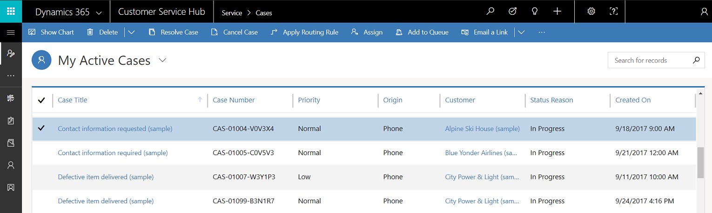
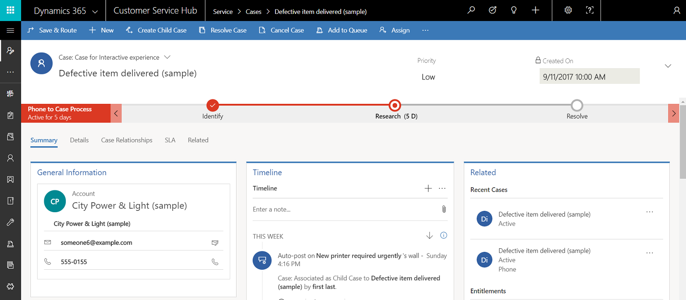

# Work with cases

Track your cases efficiently and act on them quickly in the Customer Service Hub application.

Creating and managing a case can’t be any simpler. With the intuitive case form in the Customer Service Hub, you can do all your important tasks and actions without navigating to different parts of the application.  

You can capture important information about customers, interactions you’ve had with them, and all related records of the current case in once single place.  

Watch this video to learn more about case management in the Customer Service Hub:

<iframe src="https://www.microsoft.com/videoplayer/embed/cde80c83-f592-4b15-b1a1-4fae13be93f9" frameborder="0" allowfullscreen=""></iframe>

## Create a case
1. Make sure that you have the Customer Service Manager or Customer Service Representative role, or equivalent permissions. 
2. In the Customer Service Hub sitemap, go to <strong>Service</strong> &gt; <strong>Cases</strong>.

   - The **My Active Cases** view is displayed. You can switch between case views using the drop-down.
   - Select **Show Chart** on the command bar to see the chart view.
   - Select **Open Dashboards** on the command bar to directly open the entity dashboard. To switch back to views, select **Open Views**.

   If you select a case record from the case view, you see these additional options on the command bar:

   - Select **Apply Routing Rule** to apply a routing rule on a selected case.
   - Select **Assign** to assign a case to another owner.
   - Select **Add to Queue** to add a case to a queue.  

   

3. On the command bar, select **New Case**.  Alternatively, you can quickly create a new case by selecting  in the nav bar and selecting **Case**. This opens a vertical flyout towards the right side of the screen.

   View and update the **Priority**, **Status**, and **Owner** of the case. The **Created On** date is picked up as soon as you save the case. 

4. Go to **Summary** and in the **Case Title** field, type a descriptive title to identify the case.  

5. In the **Subject** field, select a subject. Associating cases with subjects helps you search for cases with similar issues and find related articles. If you don't see the subject you want in the list, ask your system administrator to add it.

6. Find the customer:  

   1.  Select the **Customer** lookup button. By default, this field shows all customer records, accounts, and contact records. Or, type a few letters and select **Enter** to search for records that contain the letters. After you select an existing customer, the **General Information** section  will show the contact card for the customer, along with recent cases in the Related section.  

   2.  If a customer record doesn’t exist, you can a add new customer record using the entity tab.

7. In the **Origin** field, select the channel through which this case was initiated.  

8. In the **Product** field, select the product this case is for. You can’t select a product family, a draft product, or a draft product bundle.  
9. To see what kind of support you should provide the customer, select the **Entitlements** lookup button and select an active entitlement. The **Entitlements** section in the case record lists all the active entitlements for the customer.

    > [!IMPORTANT]
    > If an SLA is associated with an entitlement and the same entitlement is applied to a case, then the associated SLA becomes applicable for the case. 

   > [!NOTE]
   > - When a case is created and an entitlement is applied to it (or when the case gets resolved), the entitlement terms from the associated entitlement are decremented. However, if you don’t want the entitlement terms to be decremented for a case, on the command bar select **Do not decrement entitlement terms**.  
   > - When you update the **Customer** field, the value of the **Entitlements** field will be cleared.

10. Select in the **Description** field to enter to add a detailed description about the case.

11. Navigate to other tabs to provide or view more information about the case. 

    -   The **Details** tab tracks **Case Details**, **Additional Details**, **Social Details**, **Description**, and **Applicable SLA** of the case.  

    -   The **Case Relationships**  tab shows a **Merged Cases** and **Child Cases** list. You can add an existing child case to the current case from the **Child Cases** list. If you want to create a new child case for the current case, select **Create Child Case** on the command bar.  

        The **Case Relationships** tab also shows a list of knowledge articles associated with the case, in the Associated Knowledge Records sub-grid.  

    -   The **SLA** tab shows the related SLA KPI instance records for each SLA KPI that’s tracked for the case.  

        > [!NOTE]
        >  By default, a timer for enhanced SLA is already added to your case form. If an enhanced SLA applies to the case you're working on, you will see a timer that shows the countdown to meet the SLA KPIs.    

    - The **Related** tab shows the common associated entities like **Knowledge Base Records**, **Activities**, **Connections**, and **Work Orders**. 

      Select on any one of the common associated entities and they open in a new tab, aligned horizontally.   

12. When you’re done, select **Save**.
    - After you save the case, the Timeline section appears and displays the post about case creation.
    - The Business Process flow bar appears and displays the process stages to guide your case towards completion. For more information, see [**Business processes**](customer-service-hub-user-guide-basics.md#business-processes).
    - On the command bar: 
       - Select **Save and Route** to  route the case by applying routing rules
       - Select **Create Child Case** to create a child case
       - Select **...** on the command bar to explore more options for the case.

    

> [!NOTE]
> If you have previously installed any portal solution, to create a case in the Customer Service Hub or to use the Merge cases command, you must turn off the **Read-only in mobile** option for the Case entity. More information: [Turn off Read-only in mobile option](../customerengagement/on-premises/customize/edit-entities.md#enable-or-disable-entity-options).

### See also

[Learn the basics of the Customer Service Hub ](customer-service-hub-user-guide-basics.md)

[Use the Main form and its components](../customerengagement/on-premises/customize/use-main-form-and-components.md)

[!INCLUDE[footer-include](../includes/footer-banner.md)]