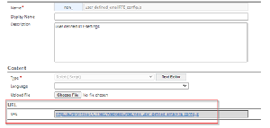
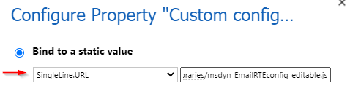

# Customize the email experience

The email configuration experience enables users to be more effective and efficient when using email to communicate with customers. This article discusses how to configure the email editor, email template builder, and email signature builder, which accepts the full configuration capability of the Rich Text Editor control.

> [!NOTE]
> If you're using the Activity Editor control, we recommend that you use the rich text editor control instead because the Activity Editor control has been deprecated. For details, see [Use the rich text editor control in Power Apps](/power-apps/maker/model-driven-apps/rich-text-editor-control#defaultsupportedprops). 

Each instance of the email editor or builder can be configured independently, enabling you to:

- Choose the fonts you want.
- Set a default font.
- Add your own font.
- Adjust the toolbar location and buttons.
- Automatically increase the editor height to fit the content.
- Access HTML.
- Configure [the rich text editor control](/power-apps/maker/model-driven-apps/rich-text-editor-control) in email experiences (including email editor, email template builder, and signature builder).

## Configure the email form by using a web resource file

You can configure email by using a web resource file that can be modified as needed and then linked to the email form.

Enabling the user configured settings to an email form consists of the following steps:
1.	[Configure the web resource file](#configure-the-web-resource-file)
1.	[Enable the RTE control in the email form](#enable-the-rte-control-in-the-email-form)

### Configure the web resource file

1. Access the web resource file by navigating to **Advanced settings** > **Customize the system** > **Web Resources**.

1. Use the filter to search for the web resource files, as shown below:

   

   There may be more than one file named msdyn_EmailRTEconfig_reference.js. One is the default, out-of-the-box configuration file that isn't modifiable. The other can be opened and used as a reference to create a new web resource file that will host your configuration changes. 

1. Select the editable file. A new window is displayed. 
   
1. In the **Content** section, select **Text Editor**.
   
   An **Edit Content** window is displayed.
   
1. Copy the text in the **Source** field, and then close the window.

    

1. Create a new web resource and paste the code you copied from the existing file into it.

1. Make any changes you want, and then select **Save and publish**.
   > [!NOTE]
   >  - A code editor such as Visual Studio Code can provide a better editing experience.
   >  - There are a variety of properties that can be modified and will apply to the email form when you configure it. For more information, see [Rich Text Editor Properties](/power-apps/maker/model-driven-apps/rich-text-editor-control#rich-text-editor-properties).
   >  - Ensure that the **disableDefaultImageProcessing** property is set to **True** for inline images added to the editor to load properly in the recipient's email.

3.  Save the URL to the new web resource because you'll need it to map the new web resource file to the **Enhanced Email** form.
   
     
5.  Navigate to **Customization** > **Customize the system** > **Entity** > **Email** > **Forms**.
6.  Open the **Enhanced Email** form, double-click **Description**, and then navigate to the **Control** tab.
7.  Add the RTE control, select **Custom Configuration URL**, and then in the URL field, enter the URL from the new web resource file you created.
8.  Select **Save** and then **Publish All Customizations**.

### Enable the RTE control in the email form

1. Navigate to the email form properties: Select **Advanced settings** > **Customize the system** > **Entities** > **Email** > **Forms**.

   In this example, we'll add the web resource file to the **Enhanced Email** form.
   
    
 
1. Select the form, and then double-click the **Description** field to enter the field properties.

1. If the RTE control isn't already added, select the **Controls** tab to add it.

1. Select the **Custom configuration control** and replace **singleLine.URL** with the web resource URL for the web resource file you created in the steps above.

   

1. Select **Save** > **Publish**.
   
   The settings will now apply to the form when you create an email.

>[!Note]
>If you're using a workflow to populate email content in RTE fields that aren't in Timeline and you experience issues with inline images not rendering properly, you must use the msdyn_EmailRTEconfig_reference.js plugin.

### Add the language filter in the email template selection view

Perform the following steps to enable the language filter for the [enhanced email template selection](/power-apps/user/insert-email-template#new-email-template-selection-window) window:

1. Navigate to **Settings** > **Advanced Settings**.
1. Select **Customizations** > **Customize the System**.
1. In **Solution: Default Solution**, expand **Entities**.
1. Expand **Email Template** and then select **Forms**.
1. On the **Active Forms**, select **Template gallery filter form**.
1. Drag and drop **Language**  from the available fields to the form. 
   > [!NOTE]
   >  **Language** is added to the form by default.
1. Select **Language** and then select **Change Properties**. 
1. In **Label**, select **Display label on the form**.
1. In **Visible**, select **Visible by default**. 
1. Save and publish the changes.

## Customize the enhanced email template selection view

The [enhanced email template selection](/power-apps/user/insert-email-template#new-email-template-selection-window) window displays the the **Select Record dialog** and allows agents to toggle between email template views. Perform the following steps to enable these features:

1. Navigate to **Advanced Settings** > **Email Configuration**.
1. Select **Email Configuration** > **Email Configuration Settings**.
1. In **Enhanced E-mail Template selection experience**, set **Enable Email Template views** and **Skip Select Record dialog** to **Yes**.

### Configure the default email template selection view

Perform the following steps to configure the default view for the [enhanced email template selection](/power-apps/user/insert-email-template#new-email-template-selection-window) window:

1. Navigate to **Settings** > **Advanced Settings**.
1. Select **Settings** > **Email Configuration** > **Email Configuration Settings**.
1. Set the **Default view** option for **Enhanced E-mail Template selection experience**.

### See also

[Configure email](/power-platform/admin/settings-email) 
[Create an email template](customer-service-hub-user-guide-email-create-template.md) 
[Insert an email template](customer-service-hub-user-guide-email-insert-template.md) 
[Convert an email to a template](customer-service-hub-user-guide-email-convert-template.md) 
[Use a signature in email](customer-service-hub-user-guide-email-create-signature.md) 
[Email FAQ](email-faqs.md)  

[!INCLUDE[footer-include](../includes/footer-banner.md)]
