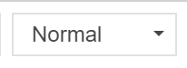
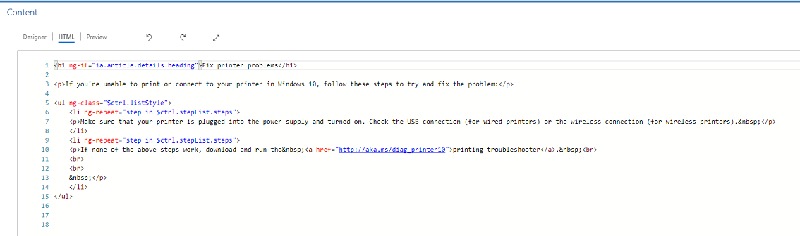
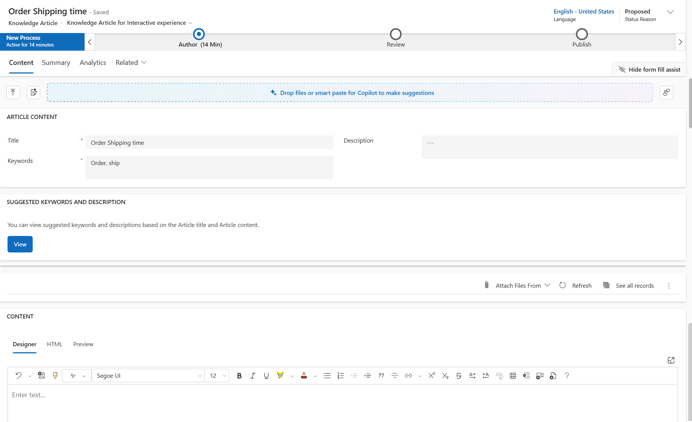

# Create and manage knowledge articles

[!INCLUDE[cc-trial-sign-up](../includes/cc-trial-sign-up.md)]

Turn your customer questions, issues, and feedback into knowledge articles, so that agents can benefit from them. Add images and videos to your articles to explain things better and make the articles engaging. You can author, edit, search, publish, and translate the knowledge articles in the Customer Service Hub.

Knowledge articles can address any number of issues your customers encounter while using your organization's product or services. Types of knowledge articles can include solutions to common issues, product or feature documentation, answers to frequently asked questions (FAQ), product briefs, and more.
  
> [!IMPORTANT]
> Knowledge management is available out of the box through the Customer Service Hub app module, and it works with other customer service apps as well. Articles that are created in the Customer Service Hub will be available in the Dynamics 365 Customer Service app as read-only records.  

> [!NOTE]
> The entities `KBArticle`, `KBArticleTemplate` and `KBArticleComment` are now deprecated. This means we don't expect you to use these entities anymore. You must use the newer `KnowledgeArticle` entity for knowledge management in Dynamics 365 Customer Service. More information: [Work with knowledge articles](work-knowledge-articles.md)

Ensure that you have Create and Read permissions on the Knowledge Article entity. By default, these permissions are added to the roles of knowledge manager, customer service manager, or customer service representative. Perform the following steps:
  
1. In the Customer Service Hub sitemap, go to **Service** > **Knowledge Articles**.  
  
2. On the command bar, select **New**.  
  
   You’ll be on the **Content** tab of the knowledge article.
  
3. In the **Article Content** section, fill in the following details:  
  
   - **Title**: Type a descriptive title that communicates the subject and purpose of the article in a concise manner.  
  
   - **Keywords**: Type or select keywords for the article. These keywords are used to search the knowledge base for articles. Separate keywords with commas. 

   - **Description**: Type or select a short description of the article. This appears in the search results and is used for search engine optimization.
   
       :::image type="content" source="media/v9-add-cont_article.png" alt-text="Add article content":::
 
4. In the **Content** section, add the content for your knowledge article.  
  
   > [!NOTE]
   > As soon as you select inside the editor space, the rich text editor command bar appears. Use the rich text editor command bar options to format and style your content. If you can't use the features, your editing space is too small. If this is the case, you'll need to resize to a larger space. [!INCLUDE[proc_more_information](../includes/proc-more-information.md)] [Use the rich text editor to create knowledge articles and emails](#use-the-rich-text-editor-to-create-knowledge-articles-and-emails)
  
5. Select **Save**.
   
   As the article is saved, the Business Process flow bar appears for the article. The stages are **New Process**, **Author**, **Review**, and **Publish**. The Business Process flow bar guides you to drive the article toward completeness. You can customize the stages in the Business Process flow to suit your  requirements.

6. On the Business Process flow bar, select **Author**.  

7. In the **Set Keywords** text box, add keywords for your article.
  
8. In the **Article Subject** dropdown list, choose the subject of the article to help with article searches.  
  
9. In the **Assign Primary Author** dropdown list, choose a person who is responsible for maintaining the article content. By default, the user who creates the article is the primary author.  

    Once a new article is created, the author value will be replicated to Primary author if it is a system user but not a team. The knowledge article author must be a single user (not a team) in order for it to be searchable and to load properly.
    
    You can mark the article complete by selecting the checkbox at this stage.

> [!TIP]
> Select the icon  to pin the stage flyout vertically.
  
Posts about knowledge article-related activities will begin appearing in the **Timeline** section.  

## Use AI-suggested article keywords and descriptions

If your administrator has enabled keywords and description suggestions, you can select and enter your preferred keywords and descriptions when authoring or updating knowledge articles. More information: [Configure AI suggestions for article keywords and description](configure-ai-suggested-article-keywords-description.md#configure-ai-suggestions-for-article-keywords-and-description)

However, either the **Title** or **Content** fields&mdash;or any other corresponding mapped fields set by the administrator&mdash;must contain some value for suggestions to be generated. If any of the fields that the model uses to generate suggestions are empty, you'll see messages such as "There was a problem finding suggested keywords" or "There was a problem finding a suggested description".

1. In the article **Content** section, add the content for your knowledge article and then select **Save**. The **View suggested keywords and description** link appears.

1. Select the **View suggested keywords and description** link.

      :::image type="content" source="media/v9-view-suggested-keywords.png" alt-text="View suggested keywords and description link":::

1. In the **Suggested keywords and description** dialog, do the following:

   - Select the keywords that you want to add to your keywords list or select the **Insert all keywords** link to insert all the suggested keywords to the Keywords field. You can enter a keyword in the Keywords field to add to existing list.
   - Select **Insert suggested description** to add the description to the **Description** field.

     :::image type="content" source="media/v9-suggested-keywords-description-dialog.png" alt-text="Screenshot showing a Keyword field containing keywords that were selected from the list of suggested keywords below it.":::

1. Select **Apply Changes**.

The selected keywords and description appear in the **Keywords** and **Description** fields of the knowledge article form.

## Create knowledge articles using templates

Authors can use the templates to create knowledge articles quickly because the fields for the knowledge article are prepopulated according to the selected template. To create knowledge articles using templates:
 
Ensure that you have Create and Read permissions on the Knowledge Article entity. By default, these permissions are added to the roles of knowledge manager, customer service manager, or customer service representative.
  
1. In the Customer Service Hub sitemap, go to **Service** > **Knowledge Articles**.  

    A list of available articles is displayed. 

2.	To create an article from a template, select **+ New From Template**.
  
3.	In the **Select Knowledge Article Template** dialog, select the template to use as a base on which you author the article and select **OK**. In this example, we are selecting the template as **Getting Started With Template**.

    > [!div class=mx-imgBorder]
    > 
  
    You observe that some fields are prepopulated as defined in the template.

4.	In the **New Knowledge Article** page, edit the fields as required. 

    > [!div class=mx-imgBorder]
    > 
  
5.	Select **Save**.

    The article is saved, and you can take it to the next stage to approve and publish the article to make it available for users.

> [!NOTE] 
> To learn how to create knowledge article templates, see [Create a knowledge article template](create-templates-knowledge-article.md).

## Use the rich text editor to create knowledge articles and emails

Create rich and well-formatted content for emails or knowledge articles using the new rich text editor in the Customer Service Hub. The editor brings common word processor features like advanced styling, linking, find and replace, and insert images and tables.  

The **Content** editor panel consists of three tabs:

- **Designer**: Author and edit the article here. Benefit from the enhanced and rich text editing capabilities.
- **HTML**: View the HTML preview of the content here. You can author or edit the article in the HTML tab also.
- **Preview**: See how your content would look on devices like desktop, tablet, or mobile.

Additionally, you can perform **Undo**, **Redo**, and **Full Screen** in the Content editor panel. 
  
### Designer

You can choose a specific format or style for the content you’re writing. The following table outlines the different formatting options of the rich text editor.

   > [!Note]
   > You can access your browser's context menu by pressing **Ctrl+right-click**. This is useful if you need to use your browser's built-in spell checker. Otherwise, you can use the right-click to provide contextual formatting for any element you might be using.

|Icon | Name | Shortcut key | Description |
|----------------------|-------------------------|-----------------------------|-----------------------------|
|| Format Painter | Ctrl+Shift+C, Ctrl+Shift+V | Apply the look of a particular section to another section.   **Note**: Copy formatting only works with inline styles, and won't copy or apply block-level styles. |
| | Formatting Styles | | Apply predefined sets of formatting features to make it easier to keep the presentation of the text consistent. To make the choice easier, the style names are displayed in a style that they represent, giving you a preview of what the text will look like.   **Note**: This option is available in the expanded mode only.
| | Paragraph Format | | Apply predefined block-level combinations of formatting options. A paragraph format can only be applied to a block-level element, like a `paragraph` or a `div` element.   **Note**: This option is available in the expanded mode only. |
| | Font | Ctrl+Shift+F | Select your desired font. The default font is Segoe UI.   **Note**: When you select any formatted content, the font name for that content displays. If your selection contains multiple fonts, the topmost font name of your selection is displayed. |
| | Font size | Ctrl+Shift+P | Change the size of your text. The default size is 12.   **Note**: When you select any formatted content, the font size for that content displays. If your selection contains multiple font sizes, the topmost font size of your selection is displayed.|
|| Bold | Ctrl+B | Make your text bold. |
|| Italic | Ctrl+I | Italicize your text. |
|| Underline | Ctrl+U | Underline your text. |
|| Text Highlight Color |  | Make your text stand out by highlighting it in a bright color. |
|| Font Color |  | Change the color of your text. |
|| Bullets |  | Create a bulleted list. |
|| Numbering |  | Create a numbered list. |
|| Decrease Indent |  | Move your paragraph closer to the margin. |
|| Increase Indent |  | Move your paragraph farther from the margin. |
|| Block Quote |  | Apply a block-level quotation format in your content. |
|| Align Left | Ctrl+L | Align your content with the left margin. (Commonly used for body text to make it easier to read.) |
|| Align Center | Ctrl+E | Center your content on the page. (Commonly used for a formal appearance.) |
|| Align Right | Ctrl+R | Center your content on the page. (Commonly used for a formal appearance.) |
|| Link |  | Create a link in your document for quick access to webpages and files.  URL text that you paste or enter is converted into a link. For example, **ht&#8203;tp://myexample.com** will become <a href="http://myexample.com">http://myexample.com</a>.   In the **Link** dialog, choose the type of link you'd like to insert.   Use the **Link Info** tab to choose the link type and set the link protocol and URL.   The type of links that you can add are defined by your administrator. If you add links whose origin link doesn't match any of the links specified in the origins list, an error will be displayed when users open an article. The error message "Update your origins allow list if any iframe in the article doesn't work or displays error" will appear. More information: [Configure origins allow list for knowledge articles](configure-knowledge-article-origin-allow-list.md)   The **Target** tab is only available for the URL link type. It specifies the location where the link will open after you select it. |
|| Unlink |  | Delete a link in your email or document.  When you place the cursor on a link, the **Unlink** button on the toolbar becomes active. Select the button to remove the link and make it plain text. |
|| Superscript |  | Type very small letters just above the line of text. |
|| Subscript |  | Type very small letters just below the line of text. |
|| Strikethrough |  | Cross out text by drawing a line through it. |
| | Image | | Insert an image.   You can insert an image by directly copying and pasting it inline in the editor, dragging and dropping it from your desktop or local folder directly into the editor, or by typing a URL. The following formats are supported: PNG, JPG, or GIF. For details on using inline images, see [Use inline images](#use-inline-images).|
|| Left to Right |  | Change the text to left-to-right for content such as a paragraph, header, table, or list. Commonly used for bi-directional language content. This is the default setting.|
|| Right to Left |  | Change the text to right-to-left for content such as a paragraph, header, table, or list. Commonly used for bi-directional language content. The default setting is left-to-right. |
|| Undo Typing |  | Undo changes you made to the content. |
|| Redo Typing |  | Redo changes you made to the content. |
|| Clear All Formatting |  | Remove all formatting from a selection of text, leaving only the normal, unformatted text. |
|| Add a Table |  | Add a table to your content.   After adding a table, you can do any of the following:  <ul><li>Resize table columns by clicking and dragging your mouse to resize the columns to the desired width.</li><li>Select one or several cells within a table and apply specific formatting, add links to the selection, or cut, copy, or paste entire rows or columns.</li><li>Right-click to access the properties. This supports features such as cell type, width and height, word wrapping, alignment, merging and splitting cells horizontally and vertically, inserting or deleting rows and columns, row and column span, and cell and border color.</li></ul>|
| | Create Collapsible Section | | Create a section that can be collapsed or expanded. This is useful in articles with a lot of information. Collapsed sections help agents find relative information more quickly by scanning the titles within an article. Collapsible sections include title and body fields to type text into, and you can nest collapsible sections to make it easier to scan longer articles to find the most relevant sections quickly. You can also select text you have already typed and then click the collapse icon to turn it into a collapsible section.     If you create a collapsible section and then later want to delete it, place your cursor within the section, and then click **Delete** on your keyboard, or right-click within the collapsible section and select **Cut**. |
|| Embed Media | | To embed videos into your content:   1.  Place the cursor where you want to insert the video, and then on the toolbar, select the **Embed Media** button. The **Embed Video** dialog opens.  2.  Enter the embed link of the video provided by the video hosting provider, and then select **OK**. |
| | Create Div Container | | Create a `div` container to apply formatting to a larger document fragment that extends beyond one block.   The **General** tab lets you manually add a stylesheet class that is applied to the div element.   The **Advanced** tab lets you configure additional div element options such as assigning it an ID, a language code, a text direction, an advisory title, or CSS style properties.  **Note**: This option is available in the expanded mode only. |
| | Create Anchor | | You can add anchors in document text and then link to them for easier navigation.  **Note**: The anchor feature only works when an article is open. It doesn't work if you are viewing an article from the **Preview** tab.   To add an anchor:   1.  Place the cursor where you want to insert an anchor, and then on the toolbar, select the **Anchor** button. The **Anchor Properties** dialog opens.  2.  Enter a name for the anchor, and then select **OK**.      The **Anchor** button  appears in the area where you created the anchor.   You can now use the **Link** button to link to your anchor. |   
  
> [!IMPORTANT]
>  You can’t use client-side code (script tags or [!INCLUDE[pn_JavaScript](../includes/pn-javascript.md)]) in articles or emails. If you want to associate CSS or [!INCLUDE[pn_JavaScript](../includes/pn-javascript.md)], use web resources. 
> 
> [!NOTE]
> In mobile devices, where you have comparatively smaller screen sizes, a limited set of formatting options will be displayed.

#### Use inline images

You can insert an image by directly copying and pasting it inline in the editor, dragging and dropping it from your desktop or local folder directly into the editor, or by typing a URL. 

Before using inline images, keep in mind the following: 

- These are the supported formats: PNG, JPG, or GIF
- These are the supported browsers: Microsoft Edge, Chrome, Firefox, Safari

**Drag and drop an image**

> [!Note]
> You can only drag and drop an image in an editable area of the editor.

1. Drag and drop the image either above the content or in the middle of the content in the editor.

2. Drag any corner of the image to resize it to your desired size in the editor.

**Copy and paste an image**

> [!Note]
> To copy and paste images, you must open the image file and then copy and paste it into the editor.  You can drag and drop or copy and paste an image from Microsoft Word into the editor. One or two images can be copied at a time, as long as the total size of the images together doesn't exceed 5 MB.

1. Open the image file that you want to copy to the editor.

2. Right-click the image, then select **Copy**.

3. Go to the desired location in the editor where you want to insert the image, and then either right-click and select **Paste**, or select **Ctrl+V**.

**Insert a URL for an image**

To insert an image by using a URL or navigating to the local image:

1. In the editor, choose **Insert Image**.
2. In the **Image** property dialog, choose from the following options:
   - Specify the web address of the image, and also specify properties to define how the image will appear in the email or article.
    
     **Note:** If the image is located on the external server, use the full absolute path. If the image is located on a local server, you can use a relative path. If you want the image to be a selectable link, add a URL for the image. You can also specify if you want the targeted page to open in a new window, top-most window, same window, or parent window.

   - Select **Browse** to navigate to the image on your computer.

### HTML

You can author and edit the article in the HTML tab of the Content editor panel, using HTML tags.

### Preview

You can preview the content to view its compatibility on multiple devices, like tablets or phones.

This is an indicative preview. Content rendered can be different in the actual device or screen.

> [!NOTE]
> If you add anchor links to a knowledge article in the **Content** field, you can’t test them because they don’t work in the **Designer** or **Preview** mode. The anchor links work only when you open the article in knowledge search and on portals.

## Add a file attachment to a knowledge article

When you're creating a knowledge article, you can attach one or more files to it to help provide comprehensive information for your customers. Keep in mind the following when attaching files:

- There is no limit to the number of articles that can be attached to a knowledge article, but the file size mustn't exceed 32 MB.
- Your administrator may limit the file size for knowledge articles.
- You must save your knowledge article before attaching files to it.

To attach a file to a knowledge article:

1. Open the knowledge article where you want to add a file attachment, and then on the **Content** tab, on the right side of the screen, select **Attach Files From**.
 
   

2. Choose from the following file locations:
    - **My Device** lets you browse and select files from your local device.
    - **Previous Uploads** opens a search pane where you can search and select from files that were previously uploaded to Customer Service Hub.

### Work with file attachments

The **Attached files** section displays all your knowledge article attachments in a tile view horizontally above your message. The default setting for the maximum number of files that can be displayed is five attachments before the page forward functionality is displayed.

For your attached files, use these commands to do the following:

- **Select**: Allows you to select one or more attachments by clicking the box that appears on the attachments, and then you can either **Remove** or **Download** the selected files.
- **Sort**: Allows you to sort records by a specific filter, such as file name or size.

> [!NOTE]
> Uploads and downloads of knowledge article attachments are supported for files up to 4MB only, for:
> - Dynamics 365 Customer Engagement (on-premise)
> - Customer Managed Key-enabled organizations

When you publish your knowledge article, if you've attached files to it, the attachments can be accessed by knowledge consumers through Knowledge Search.

#### User permissions to view and download file attachments

For users to be able to view and download file attachments, you'll need to grant the following permissions to the Knowledge Article table:

|Task|Access needed |  
|--------|-------------|  
| Download and search attachments | Read |
| Add attachments | Create, append, append-to |
| Remove and add existing attachments | Append or append-to |

#### Sync knowledge article attachments to the portal

To sync knowledge article attachments to the portal, your administrator must first enable the option. More information: [Update knowledge article attachments for portal](set-up-knowledge-management-embedded-knowledge-search.md#update-knowledge-article-attachments-for-portal)

On syncing knowledge article attachments to the portal:

- Dataverse search will be able to search through knowledge article attachments. More information: [Microsoft Dataverse search can search through file data type](/power-platform-release-plan/2021wave2/data-platform/dataverse-search-search-through-file-data-type) Additionally, you must configure the faceted search results web template from your portal to be able to search through knowledge article attachments. More information: [Configure faceted search results web template from your portal](configure-faceted-search-results.md) 
  
- There will be a one-time migration from the notes attachments that have the prefix of your original KnowledgeManagement/Notesfilter setting to new attachments in knowledge articles. Only the notes attachments used in the portal will be migrated to new attachments.

For more information, see [Display file attachments with knowledge articles](/powerapps/maker/portals/customer-engagement-apps/display-file-attachments-knowledge-article).

## Mark a knowledge article for review  

To ensure that the content you’ve created is accurate, have someone review it.  
  
You can mark an article for review or directly assign it to a specific person or queue. When you mark an article for review, it starts appearing in the knowledge manager’s dashboard. The knowledge manager can then assign the article to specific team members or a queue for review.  
  
1.  In the article you want to mark for review, in the **Status Reason** dropdown list, select **Needs Review**.  
  
2.  On the Business process flow, select **Author**.  
  
3.  In the **Mark for Review** field, select **Mark Complete**.  

    
  
4.  To assign the knowledge article to another reviewer or team, on the command bar, select **Assign** and select the user or a team.  
  
5.  To add the article to a queue so reviewers can pick it from there, on the command bar, select **Add to Queue**, and then select the queue.  
  
### See also

[Add the Knowledge Base Search control to forms](add-knowledge-base-search-control-forms.md)  
[Create knowledge article template](create-templates-knowledge-article.md)  
[Set up knowledge management using embedded knowledge search](set-up-knowledge-management-embedded-knowledge-search.md)  
[Use Workflow processes to automate processes that don't require user interaction](../customerengagement/on-premises/customize/workflow-processes.md)  

[!INCLUDE[footer-include](../includes/footer-banner.md)]
