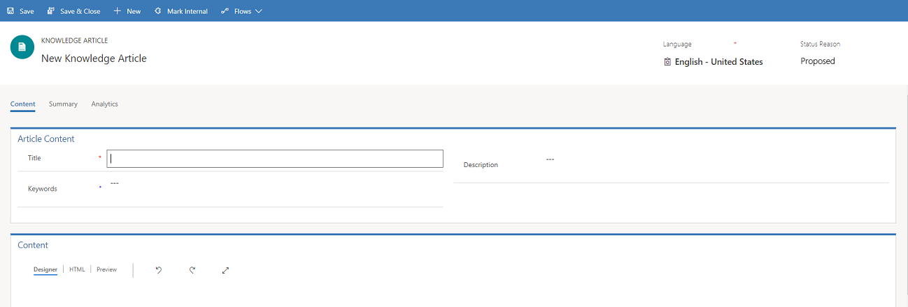

# Reduce call handling times with Knowledge articles in the Customer Service Hub

[!INCLUDE[cc-applies-to-update-9-0-0](../includes/cc_applies_to_update_9_0_0.md)]

 
  
 With the new [!INCLUDE[pn_crm_shortest](../includes/pn-crm-shortest.md)] knowledge management module, you can create and manage knowledge articles that your users may be looking for. 

 Knowledge articles can address any number of issues your customers encounter while using your organization's product or services. Types of Knowledge articles can include solutions to common issues, product or feature documentation, answers to frequently asked questions (FAQs), product briefs, and more. Use the rich text editor to create knowledge articles, format your content or embed videos and images.  
  
> [!IMPORTANT]
> Knowledge management is available out-of-the-box through the Customer Service Hub app module, and it can work with other customer apps as well. The articles that are created in the Customer Service Hub will be available in the [!INCLUDE[pn_crm_shortest](../includes/pn-crm-shortest.md)] web application as read-only records.  

  
   

## Knowledge management process  
 The following diagram describes the default process for creating and using knowledge articles in the Customer Service Hub.  
  
   
  
 
  
## Create a knowledge article  
Turn your customer questions, issues, and feedback into knowledge articles, so other service reps can benefit from them. Add images and videos to your articles to explain things better and make the articles engaging.  You can author, edit, search, publish, and translate the knowledge articles in the Customer Service Hub. 
  
1.  Make sure that you have Create and Read permissions on the Knowledge Article entity. By default, these permissions are added to the Knowledge Manager, Customer Service Manager, or Customer Service Representative role.  
  
2.  In the Customer Service Hub sitemap, go to **Service** > **Knowledge Articles**.  
  
3.  On the command bar, select **New**.  
  
     You’ll be on the **Content** tab of the knowledge article.  
  
       
  
4.  In the **Article Content** section, fill in the following details:  
  
    - **Title**. Type a descriptive title that communicates the subject and purpose of the article in a concise manner.  
  
    - **Keywords**. Type keywords for the article. These keywords are used for searching the knowledge base for articles. Separate keywords with commas.  
  
    - **Description**. Type a short overview of the article. This appears in the search results and is used for search engine optimization.  
  
        
  
5.  In the **Content** section, add the content for your knowledge article.  
  
    > [!NOTE]
    >  As soon as you select inside the editor space, the rich text editor command bar appears. Use the rich text editor command bar options to format and style your content. [!INCLUDE[proc_more_information](../includes/proc-more-information.md)] [Use the rich text editor to create knowledge articles and emails](#use-the-rich-text-editor-to-create-knowledge-articles-and-emails)
  
6. Select **Save**. 
   
   As the article is saved, the Business Process flow bar appears for the article. The stages are **New Process**, **Author**, **Review**, and **Publish**. The Business Process flow bar guides you to drive the article towards completeness. You can customize the stages in the Business Process flow to suit your  requirements.

7. On the Business process bar, select **Author**.  
8. In the **Set Keywords** text box, add keywords for your article.
  
8.  In the **Article Subject** drop-down list, choose the subject of the article to help with article searches.  
  
9.  In the **Assign Primary Author** drop-down list, choose a person who is responsible for maintaining the article content. By default, the user who creates the article is the primary author.  
 
    You can  mark the article complete by selecting the checkbox at this stage.

> [!TIP]
> Select the icon   to pin the stage flyout vertically.
  
Posts about knowledge article-related activities will begin appearing in the **Timeline** section.  
  
   

## Use the rich text editor to create knowledge articles and emails
 Create rich and well-formatted content for emails or knowledge articles using the new rich text editor in the Customer Service Hub. The editor brings common word processor features like advanced styling, linking, find and replace, and insert images and tables.  

The **Content** editor panel consists of three tabs:

- **Designer**. Author and edit the article here. Benefit from the enhanced and rich text editing capabilities.
- **HTML**. View the HTML preview of the content here. You can author or edit the article in the HTML tab also.
- **Preview**. See how your content would look like on devices like Desktop, Tablet, or Mobile.

Additionally, you can perform **Undo**, **Redo**, and **Full Screen** in the Content editor panel. 
  
**Designer**

You can choose a specific format or style for the content you’re writing.  
  
   
  
|Command|Use|  
|-------------|---------|  
|**1**. Formatting Styles|Apply predefined sets of formatting features to make it easier to keep the presentation of the text consistent. To make the choice easier, the style names are displayed in a style that they represent, giving you a preview of what the text will look like. **Note:**  This option is available in the expanded mode only.|  
|**2**. Paragraph Format|Apply predefined block-level combinations of formatting options. A paragraph format can only be applied to a block-level element, like a `paragraph` or a `div` element. **Note:**  This option is available in the expanded mode only.|  
|**3**. Font Name|Choose a font for the selected text.|  
|**4**. Font size|Choose a font size for the selected text.|  
|**5**. Bold|Apply bold formatting to the selected text.|  
|**6**. Italic|Apply italic formatting to the selected text.|  
|**7**. Underline|Underline the selected text.|  
|**8**. Strikethrough|Mark selected text for deletion.|  
|**9**. Text Color|Choose a text color for the selected text.|  
|**10**. Background Color|Choose a background color for the selected text.|  
|**11**. Align Left|Left align the text. When you align your text left, the paragraph is aligned with the left margin and the text is ragged on the right side. **Note:**  This option is available in the expanded mode only.|  
|**12**. Center|Center align the text. When you center align the text, the paragraph is aligned symmetrically along the vertical axis and the text is ragged on the both sides. **Note:**  This option is available in the expanded mode only.|  
|**13**. Align Right|Right align the text. When you align your text right, the paragraph is aligned with the right margin and the text is ragged on the left side. **Note:**  This option is available in the expanded mode only.|  
|**14**. Insert/Remove Numbered List|Create a numbered list.|  
|**15**. Insert/Remove Bulleted List|Create a bulleted list.|  
|**16**. Increase Indent|Increase the margin on the left side of text.|  
|**17**. Decrease Indent|Decrease the margin on the left side of the text.|  
|**18**. Paste as Plain Text|Paste the clipboard data as plain text, without the source formatting and styling.|  
|**19**. Paste From Word|Paste content from [!INCLUDE[pn_MS_Word_Full](../includes/pn-ms-word-full.md)] with the original content formatting.  This will retain:   -   Spacing and line breaks -   Ordered and unordered lists -   Tables -   Font styles and colors **Note:**  Images won’t be copied from [!INCLUDE[pn_ms_Word_short](../includes/pn-ms-word-short.md)] [!INCLUDE[pn_MS_Word_Full](../includes/pn-ms-word-full.md)].|  
|**20**. Insert Table|Insert a table, and specify the table properties.|  
|**21**. Image| Insert an image.   <ol><li>Choose Insert Image.</li><li>In the **Image Info** tab, specify the web address of the image, and also specify properties to define how the image will appear in the email or article. **Note:**      If the image is located on the external server, use the full absolute path. If the image is located on a local server, you can use a relative path.</li><li>If you want the image to be a selectable link, in the **Link** tab, add a URL for the image. You can also specify if you want the targeted page to open in a new window, topmost window, same window, or parent window.</li><li>To configure additional image options, use the **Advanced** tab. This is meant for advanced users with knowledge of HTML and CSS, and lets you change the presentation of the image.   <ul><li>**ID**. Type a unique identifier for an image element in the document (`id` attribute).</li><li>**Language Direction**. Choose the direction of the text.</li><li>**Language Code.** Type the language of the image element specified.</li><li>**Long Description URL**. Type the web address of an HTML page containing a longer description of the image.</li><li>**Stylesheet Classes**. Enter the class of the image element (class attribute). Note that an image element might be assigned more than one class. If this is the case, separate class names with spaces.</li><li>**Advisory Title**. Enter the text of the tooltip that is shown when the mouse cursor hovers over the image.</li><li>**Style**. Enter the CSS style definitions. Note that each value must end with a semicolon and individual properties should be separated with spaces.</li></ul></li></ol>|  
|**22**. Link|Add selectable hyperlinks or email addresses to your documents. In the **Link** dialog box choose the type of link you’d like to insert.   The **Link Info** tab allows you to choose the link type as well as set the link protocol and URL.   The **Target** tab is only available for the URL link type. It specifies the location where the link will open after you select it.|  
|**23**. Unlink|When you place the cursor on a link, the **Unlink** button on the toolbar becomes active. Select the button to remove the link and make it plain text.|  
|**24**. Anchor|You can add anchors in document text. After you add anchors, you can link to these anchors for easier navigation.   To add an anchor:   1.  Place the cursor where you want to insert an anchor, and then on the toolbar, select the **Anchor** button.      The **Anchor Properties** dialog box opens. 2.  Ente a name for the anchor, and then select **OK**.      The **Anchor** button  appears in the area where you created the anchor.   You can now use the **Link** button to link to your anchor.|  
|**25.** Embed Media|To embed videos into your content:   1.  Place the cursor where you want to insert the video, and then on the toolbar, select the **Embed Media** button.      The **Embed Video** dialog box opens. 2.  Enter the embed link of the video provided by the video hosting provider, and then select **OK**.|  
|**26**. Create Div Container|Create a `div` container to apply formatting to a larger document fragment that extends beyond one block.   The **General** tab lets you manually add a stylesheet class that is applied to the div element.   The **Advanced** tab lets you configure additional `div` element options such as assigning it an ID, a language code, a text direction, an advisory title, or CSS style properties. **Note:**  This option is available in the expanded mode only.| 
 
  
> [!IMPORTANT]
>  You can’t use client-side code (script tags or [!INCLUDE[pn_JavaScript](../includes/pn-javascript.md)]) in articles or emails. If you want to associate CSS or [!INCLUDE[pn_JavaScript](../includes/pn-javascript.md)], use web resources. 

> [!NOTE]
> In mobile devices, where you have comparatively smaller screen sizes, limited set of formatting options will be displayed.
  
**HTML**

You can author and edit the article in the HTML tab of the Content editor panel, using HTML tags.

 

**Preview**

You can preview the content to view its compatibility on multiple devices, like Tablets, or Phones.

> [!NOTE]
> This is an indicative preview. Content rendered can be different in the actual device or screen.
  
## Mark a knowledge article for review  
 To make sure the content you’ve created is accurate, have someone review it.  
  
 You can mark an article for review or directly assign it to a specific person or queue. When you mark an article for review, it starts appearing in the knowledge manager’s dashboard. The knowledge manager can then assign the article to specific team members or a queue for review.  
  
1.  In the article you want to mark for review, in the **Status Reason** drop-down list, select **Needs Review**.  
  
2.  On the Business process flow, select **Author**.  
  
3.  In the **Mark for Review** field, select **Mark Complete**.  
  
4.  To assign the knowledge article to another reviewer or team, on the command bar, select **Assign** and select the user or a team.  
  
5.  To add the article to a queue so reviewers can pick it from there, on the command bar, select **Add to Queue**, and then select the queue.  
  
  
 
## Review and reject or approve a knowledge article  
 It’s important to review articles for accuracy before they’re published or made available to others.  
  
> [!IMPORTANT]
>  To approve a knowledge article, you must have **Approve** permissions for the knowledge article record type. This permission is added by default to the Knowledge Manager, Customer Service Manager, Customer Service Representative, or System Administrator role or equivalent permissions.  
  
|To|Do this|  
|--------|-------------|  
|Pick an article assigned to you|Go to **Service** > **My Knowledge Dashboard**, and then see the **My Active Articles** stream.   **-OR-**   In the Customer Service Hub, go to **Service** > **Queue Items**, and then select the **Items available to work on** view.|  
|To suggest review feedback|1.  On the Business process bar, in the **Review** stage, in the **Review** field, select **Reject**. Give the reason for rejection in the **Reject Knowledge Article** flyout.  2.  To add details about the changes you want in the knowledge article, go to **Summary** tab and in the **Timeline** section, select **+** to add a note.   The rejected article is  assigned back to the primary author of the knowledge article.|  
|Approve the content of the article|When you approve the content of an article, it means that the content is ready to be consumed by other customer service reps, and also ready to be published.   On the Business process bar, in the **Review** stage, in the **Review** field, select **Approve**.   The article is now ready to be published.|  
  
  
 
## Update knowledge articles to capture feedback  
 Make sure that your articles are up to date and accurate at all times by updating them based on feedback you receive.  
  
1.  In the Customer Service Hub, go to **Service** > **Knowledge Articles**.  
  
2.  Select the article you want to edit.  
  
     If the reviewer has suggested any changes from their review, you can see them as notes in the **Timeline** section.  
  
3.  Update the article based on the feedback.  
  
4.  Select **Save**.  
  
5.  To assign the article back to the reviewer for approval or publishing, on the command bar, select **Assign**, and then select a user or a team  
  
## Update published knowledge articles  
 When a knowledge article is in the Published (or Scheduled) state, only the users who have the Publish privilege can update it.  
  
1.  In the Customer Service Hub, go to **Service** > **Knowledge Articles**.  
  
2.  Select the published article you want to edit.  
  
3.  On the command bar, select **Update**.  
  
4.  Update the article based on the feedback.  
  
  
 If the article has information that complements an existing knowledge article, associate the existing article with the current knowledge article.  
  
1.  In the knowledge article, on the command bar, select **More** > **Relate Article**.  
  
2.  In the **Select Article to Associate** field, select the **Lookup** button, select an existing article, and then, select **Associate**.  
  
     The associated article appears in the **Related Articles** list in the **Related Information** section of the **Summary** tab.  
  
  
 
## Create and manage article versions  
 Article versioning helps you manage updates to your knowledge articles without disrupting the live or published articles. By creating major and minor versions of a knowledge article, you can keep your articles up to date with the latest information while keeping track of changes throughout the lifecycle of your products and services.  
  
 This capability helps you to keep accurate records of the features your organization provides and go back to previous versions if you need to.  
  
1.  In the Customer Service Hub, select **Services** and choose **Knowledge Articles**.  
  
2.  Open the article you want to create a new version for.  
  
3.  In the knowledge article, select **Create Major Version** or **Create Minor Version**.  
  
     An example of a major version would be when your documentation changes to detail a new feature or functionality,  while a minor version might be a change to the user interface with no change to functionality.  
  
     The new version of your article will contain all of the same content, information, and permissions as the current version. The **Version Major** or **Version Minor** field will automatically update to reflect the new version number.  
  
    > [!NOTE]
    >  You won’t able to make any changes to the **Major Version Number**, **Minor Version Number**, **Language**, or **Article Public Number** fields when creating a new major or minor version of an article.  
  
4.  After you have reviewed the article, make any changes that you want to the new version. You can update the article title, content, keywords, and description to reflect any changes to your products, features, or services.  
  
### Review and publish your new version  
 When you are done making changes, you can push the new version of your article through your standard article workflow. When you are finished reviewing and are ready to publish, on the command bar, select **More** > **Publish**, and then choose how and when you want to publish your new version. You can publish your new version immediately, schedule it to publish at a future date, or leave it as a draft to manually publish later. [!INCLUDE[proc_more_information](../includes/proc-more-information.md)] [Schedule or publish an article](#schedule-or-publish-an-article) 
  
### Manage article versions  
 Managing your article versions means publishing and archiving different versions of each article to provide the most accurate information to your customers and internal employees. Keep in mind that only one version of an article can be published at a time; it’s important to keep track of the changes that are made to each version and publish them when it is appropriate.  
  
1.  In the knowledge article, select the **Summary** tab.  
  
2.  In the **Related Information** section, select the **Related Versions** button to display a list of all major and minor versions of the article.  
  
3.  In the **Related versions** list, open the version you want to delete.  
  
4.  Select the **More** button, and then select **Send to Trash**.  
  
5.  When prompted, select **OK**.  
  
     Deleting an article version is permanent and can’t be undone. You won’t be able to go back to that version of the article, so make sure that you don’t need any of the information. It’s a good idea to create a local backup of any versions you delete.  
  
 
  
## Translate a knowledge article in multiple languages  
 Your knowledge content needs to reach all of your customers, no matter what market or region they are from. The knowledge management capability in [!INCLUDE[pn_crm_shortest](../includes/pn-crm-shortest.md)] helps you translate your articles so that you can provide the same self-help content in multiple languages without having to manage multiple copies of the same article. By using the translation feature, you can quickly and efficiently provide 24-hour service to all of your customers.  
  
1.  Open the article you want to translate, and on the command bar, select **Translate**.  
  
2.  In the **Create new translation** dialog box, in the **Pick a language** drop-down list, choose the language you want.  
  
3.  In the **Create new version** field, choose whether to create a new major or minor version for your translation.  
  
     You can translate articles into any language that’s supported by the Customer Service Hub.  
  
4.  Select **Create**.  
  
5.  Enter your translated text in the appropriate fields. You can enter translated text for the following fields:  
  
    -   Title  
  
    -   Keywords  
  
    -   Article Description  
  
    -   Content  
  
6.  When you are finished reviewing and are ready to publish, select **More** > **Publish**. Choose how and when you want to publish your new version. You can publish your new version immediately, schedule it to publish at a future date, or leave it as a draft to manually publish later. [!INCLUDE[proc_more_information](../includes/proc-more-information.md)] [Schedule or publish an article](#schedule-or-publish-an-article)
  
### Manage article translations  
 After you have published a translation for an article, you can manage it and any other translations by selecting the **Summary** tab of the knowledge article.  
  
1.  In the **Related Information** section, select **Related Translations**.  
  
2.  Open the translation you want to view. Keep in mind that there may be multiple versions for each language. You can sort the translations by selecting the column headers of the **Related Translations** section.  
  
     From here, you can:  
  
    -   Edit or update a translation  
  
    -   Create a new major or minor version of a translation  
  
    -   Delete a translation or version of a translation  
  
   

## Schedule or publish an article  
 After the content in the article is complete and reviewed, you can publish the article to the portal to make it available to your customers. You can publish the article immediately or schedule it for a later time. 
  
> [!IMPORTANT]
>  If your organization is using a portal for publishing the knowledge articles, your customizer can write a plug-in that can pick the published articles and post on your portal, and also report the article views back.  
  
1.  Make sure that you have the Publish and Update permission on the Knowledge Article record type. These permissions are added by default to the Knowledge Manager, Customer Service Manager, Customer Service Representative, or System Administrator role.  
  
2.  In the Customer Service Hub, go to **Service** > **Knowledge Articles**.  
  
3.  Open a knowledge article that’s in the Approved state.  
  
4.  To make it easy to find knowledge articles related to specific products, associate the knowledge article with a product.  
  
    1.  On the command bar, select **More** > **Relate Product**.  
  
    2.  In the **Select Product to Associate with** field, select the **Lookup** button, elect a product this article is about, and then, select **Associate**.  
  
         The associated article appears in the **Related Products** list in the **Related Information** section of the **Summary** tab.  
  
5.  On the Business process bar, select the **Publish** stage.  
  
6.  In **the Set Product Associations** field, select **Mark as Complete**.  
  
7.  If you want to schedule the article to publish on a later date, on the **Summary** tab, in the **Publish On** field, select a date and time to publish the article.  
  
8.  On the command bar, select **More** > **Publish**.  
  
    -   In the **Publish** field, select whether you want to publish the knowledge article right away or in the future. To publish the article in the future, in the **Publishing Date Time** field, select a date and time.  
  
    -   In the **Published Status** field, select what status the article should be in after it is published. By default, **Published** is selected.  
  
    -   In the **Expiration Date** field, select a date and time when you want the published article to expire. Expired articles are no longer available in searches.  
  
    -   If you’ve set an expiration date, in the **Expiration Status** field, select the status the knowledge article should be set to after it expires.  
  
    -   To publish all approved related translated articles with the article, in the **Publish Approved related translations with Article**, select **Yes**.  
  
    -   Select **Publish**.  

## Track basic details of an article  

Use the **Summary** tab to track some basic details of the article. In the **Summary** tab, you can:

- View or edit **Basic settings** for the article. These include details like Language, Article Public Number, and many more.
- View or edit **Publish settings** for the article
- See the **Timeline**. Add notes, or view what you have missed.
- View related information about the article in the **Related Information** section. These include related versions, translations, categories, articles, and products

  
 
  
### Track knowledge article analytics  
 Tracking your content helps you and your authoring team assess its value to your organization and your customers. Knowing and understanding when, where, and how many times an article was viewed tells you how much your customers and team members rely on the information that it contains. This data is extremely useful when creating future content curation plans and can help you decide what content you will deliver in the future, as well as how you deliver it, where you deploy it, and what style or structure you use to write it.  
  
 To view an article’s view counts and other statistics, open the article you want to track, and then select the **Analytics** tab.  
  
- **Views**. Shows you the total number of times that this article has been viewed. This figure represents the total views of all versions and all translations of this article combined. It also shows individual article views on specific days. You can select the column headers to sort by chronological order or by the number of views. 

- **Feedback**. Captures all the feedback and ratings on the knowledge articles and update  the articles  accordingly. If your articles are published on a portal, customers and users can provide their feedback and also give ratings on an article.   The Feedback subgrid shows all feedback received for the current knowledge article.  

   The **Rating** field calculates the average rating of the article based on the amount of feedback and number of ratings received.  
   > [!NOTE]
   > Rating and Views are tracked using roll up, which gets updated based on a System job periodically. 

- **Cases**. Shows a list of the cases that have used this article. Double-click a case to view its details.  
  
     By reviewing cases that have used your articles, you can gain valuable insights into the questions that customers are asking, as well as what avenues they tried before asking for help. This data can help you expose your knowledge articles better and provide more useful information to your customers and team members.  
  
  
#### Add feedback to an article  
  
1.  In the **Feedback** subgrid, select **Create Feedback**. You can also select  in the nav bar and then go to **Feedback** to create a feedback.  
  
3.  In the **Create Feedback** flyout, fill in the information:  
  
    - **Title**. Type a descriptive  title for the feedback. For example, if the feedback is about customer satisfaction, type that.  
    - **Regarding**. Look for relevant records to associate the feedback.
  
    - **Source**. Select whether the feedback is internal or from a portal. If you received the feedback via a phone call, you can select **Internal**.  
  
    - **Comments**. Type any feedback comments that you want.  
  
    - **Rating**. Type a number to specify how useful the related record is. For example, if you are tracking the customer satisfaction for a case, and you want to rate it a 2 on a scale of 1 - 10, type 2.  
  
    - **Minimum Rating Value** and **Maximum Rating Value**. Specify a minimum and maximum rating to define a rating scale. For example, you want to give a rating of 2  on the scale of 1 - 10, type 1 as the minimum rating and 10 as the maximum rating.  
  
    - **Created by (Contact)**. If you're creating the feedback on behalf of a customer contact, select the contact here.  
  
         The **Created By** and **Closed By** fields are automatically populated with the user who creates or deactivates the feedback record.  
  
    - [!INCLUDE[pn_microsoftcrm](../includes/pn-microsoftcrm.md)] automatically calculates the normalized rating based on the following formula: (Rating - Minimum Rating)/ (Maximum Rating - Minimum Rating).  
  
4.  Select **Save**.

> [!NOTE]
> You can also update the owner of the feedback in the flyout.
  
  
 
## Monitor knowledge articles with dashboards  
 Knowledge managers and authors can now monitor the status of knowledge articles using the two  default dashboards available in the Customer Service Hub.  
  
> [!NOTE]
>  If these dashboards don’t offer what you need, you can create new interactive dashboards. [!INCLUDE[proc_more_information](../includes/proc-more-information.md)] [Configure interactive experience dashboards](https://technet.microsoft.com/library/d1446a95-14bf-4b15-a905-72fce07f4c76.aspx)  
  
### My knowledge Dashboard  
 This dashboard is designed for authors to give them a visual snapshot of the number and status of knowledge articles they’re working on. It helps them quickly know things like article expiring in the month and articles in review.  
  
   
  
-   **Streams** show data from views or queues. In the My Knowledge Dashboard, the stream shows the active articles assigned to the author.  
  
-   **Charts** provide a count of relevant records in the streams, such as articles by status, articles by owner, or articles by subject. They also act as visual filters. You can drill down in a chart to see data that interests you the most.  
  
-   **Tiles** give authors an aggregated view of data in the streams and help them monitor the volume of their knowledge articles.  
  
### Knowledge Manager  
 This dashboard is designed specifically for knowledge managers. As a knowledge manager, you can quickly know the most popular articles, articles that need review, highest-rated articles, or articles that are about to expire, and take necessary actions on the articles from here.  
  
   
  
 [!INCLUDE[proc_more_information](../includes/proc-more-information.md)] [Use interactive dashboards to effectively manage service cases](customer-service-hub-user-guide-dashboard.md)

### See also
[Learn the basics of the Customer Service Hub ](customer-service-hub-user-guide-basics.md)
