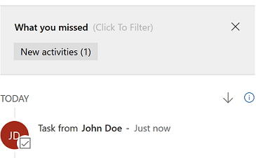

# Manage activities from the Timeline  
 Capture all interactions and communications you’ve had with your customer by adding them as activities in the Timeline section. The Timeline section gives you a unified view of everything that's happening on a case, like email received, a follow-up task that you created, system posts that are automatically generated when the cases is created, or any notes you take while talking to the customer.  

 When you update an activity, it moves up in the Timeline. You can sort the Timeline in both ascending or descending order of time, as per your wish.

||||  
|-|-|-|  
|**To**|**Do this**|| 
|Enter a note |  Enter a note by selecting the **Enter a note** box. You can also add attachments to your notes.|
|View what you have missed | See any interaction missed from the previous day or week at the top of the Timeline |
|Create a new interaction|In the **Timeline** section, select **+**, and then select an interaction type: Activity, Appointment, Email, Phone call, Task, Note or a Post.   To draft an email in the email activity, you can use the rich text editor, which has several formatting options. More information: [Use the rich text editor to create knowledge articles and emails](customer-service-hub-user-guide-knowledge-article.md#use-the-rich-text-editor-to-create-knowledge-articles-and-emails). |
|Filter activities|1.  In the **Timeline** section, select  **(...)**  and select **Open Filter Pane**. 2. Filter the timeline for a specific activity type or by date. You can filter on the basis of Activity status or record type. |  
|Take actions on an activity|For an activity, select the **Quick Actions** button   and select the action you want to take. For example, for a Phone Call activity, you will see actions like Close Activity, Add to Queue, and Open Entity Record. |  

## See and manage related records in the Related section  
 The **Related** section (also known as Reference panel) in a case record provides you with quick access to important information related to the selected case that would help you resolve the case. For more information, see [Related section](customer-service-hub-user-guide-basics.md#related-section).

### See recent cases and entitlements  
See **Recent Cases and Entitlements** to view:  

-   A list of recent cases for the customer associated with the current case.  

-   A list of entitlements for the customer associated with the current case.  

### Search knowledge articles in the Knowledge Base Search control

Search for relevant knowledge articles to quickly resolve a case. For more information, see [Search for knowledge articles in the Customer Service Hub](search-knowledge-articles-csh.md).

### See also

[Learn the basics of the Customer Service Hub ](customer-service-hub-user-guide-basics.md)

[Use the Main form and its components](../customerengagement/on-premises/customize/use-main-form-and-components.md)

[!INCLUDE[footer-include](../includes/footer-banner.md)]