# Modify case resolution dialog box

Updates to the case resolution main form dialog box provide customers with additional functionality to support case resolution entities and edit the dialog box. This functionality provides a powerful construct to expand the case resolution entity to support business needs that enable users to add and remove fields instantly without writing a single line of code.

Customers can go to the form designer and edit and modify fields according to their business needs.

The option to customize the case resolution dialog box is also available in Dynamics 365 Customer Engagement (on-premises) 9.1. More information: [New features in Dynamics 365 Customer Engagement (on-premises)](../customerengagement/on-premises/whats-new.md#configurable-case-resolution-page)

Use the following steps to get started:

- **Step 1:** Set permissions (required)
- **Step 2:** Enable customizable dialog (required)
- **Step 3:** Create status values
  - Case entity (status code)
  - Case Resolution entity (resolution type code)
- **Step 4:** Edit form

## Permissions

The first step is to set your security permission. This is a critical requirement, and must be done before you enable customizable dialog on a form.  

Permissions must be set per the following example. Otherwise, you will not see the modified Case Resolution dialog box, but the box case resolution instead.

> [!div class=mx-imgBorder]
> 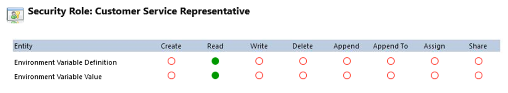

> [!div class=mx-imgBorder]
>  Manager")

> [!IMPORTANT] 
> If you've created your own security roles, you'll need to update your roles before you can use the modified Case Resolution dialog.

## Enable customizable dialog

Perform the following steps to enable customizable dialog:  

**Step 1:** In the site map, go to **Service Management**.

**Step 2:** Select **Service Configuration**. 

**Step 3:** In the **Resolve case dialog** drop-down list, select **Customizable dialog**.

**Step 4:** Select **Save**. 

  > [!div class=mx-imgBorder]
  > 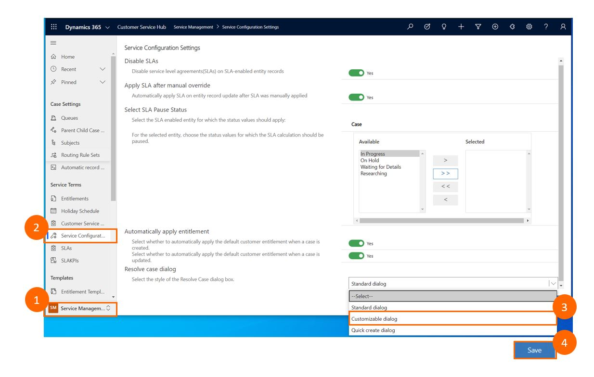

> [!NOTE]
> The default setting is **Standard dialog**. You must select the **Customizable dialog** option, otherwise changes made to the form will be saved, but will not be displayed at runtime. 

## Status values 

After you set your permissions and enable customizable dialog, you can create status values in your form. 

When adding custom status values, you must update them in the following two locations:

- **Case entity** (status code)
- **Case Resolution entity** (resolution status code)

> [!IMPORTANT] 
> - If you change the value in the **Case entity**, you must update the value in the **Case Resolution entity** to match.
> - If the values do not match, an error message will be displayed when you try to resolve the case.

You can customize the Case entity and Case Resolution entity through the **Customization** page.

To go to the **Customization** page:

**Step 1:** On the navigation bar, select the **Settings** icon.

   > [!div class=mx-imgBorder]
   > 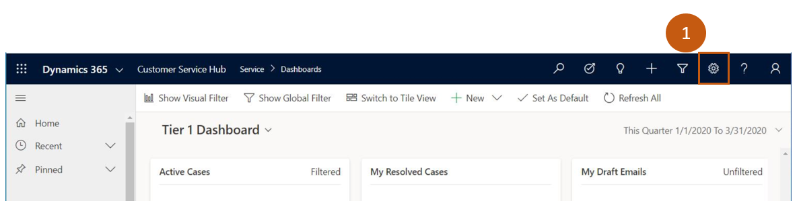

**Step 2:** In the Power Platform admin center **Settings** page, select **All legacy settings**.
    

   > [!div class=mx-imgBorder]
   > 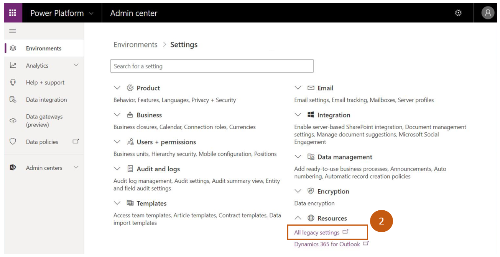

**Step 3:** Select **Customize the System**.
    
   > [!div class=mx-imgBorder]
   > 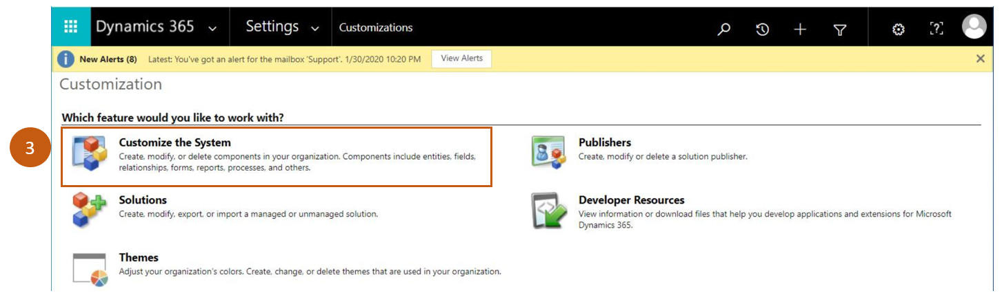

### Case entity

One example of how you can use case resolution is by resolving situations where you receive duplicate cases. In this example, we'll show you how to set the resolution type to display cases that have the duplicate status.  

From the **Customization** page, use the following steps to set the Case entity for duplicate cases:

**Step 1:** Select **Customize the System**.

**Step 2:** In the solution explorer, expand **Entities**, and then expand **Case**.

  > [!div class=mx-imgBorder]
  > 

**Step 3:** Select **Fields**.

  > [!div class=mx-imgBorder]
  > 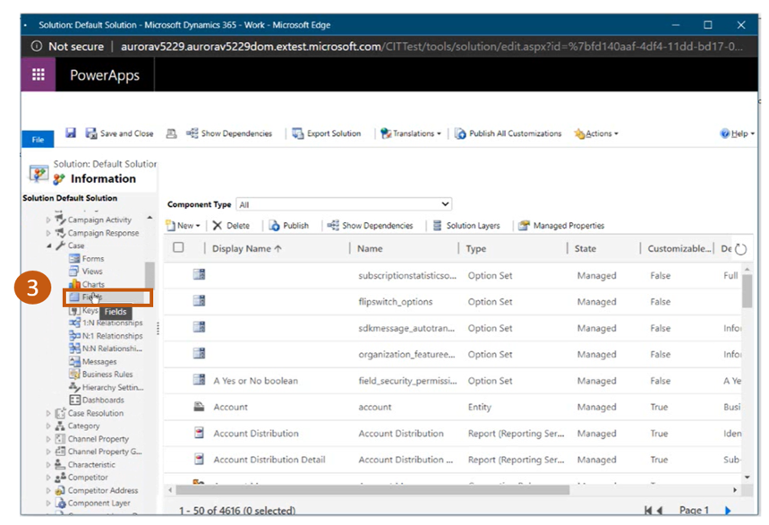

**Step 4:** Select the field you want to update. For this example, select **Status Reason**.

  > [!div class=mx-imgBorder]
  > 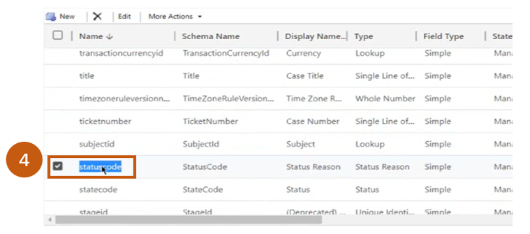

  After you open the field, the **Status Reason** in the case window will be displayed.

**Step 5:** In the **Status** drop-down list, select a status. For this example, select **Resolved**. 

  > [!div class=mx-imgBorder]
  > 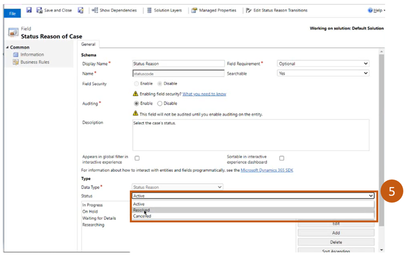

**Step 6:** Select **Add**.

  > [!div class=mx-imgBorder]
  > 

When you select **Add**, the **Add List Value** dialog box will appear. 

**Step 7:**  In the **Label** field, enter **Duplicate**. 

  > [!div class=mx-imgBorder]
  > 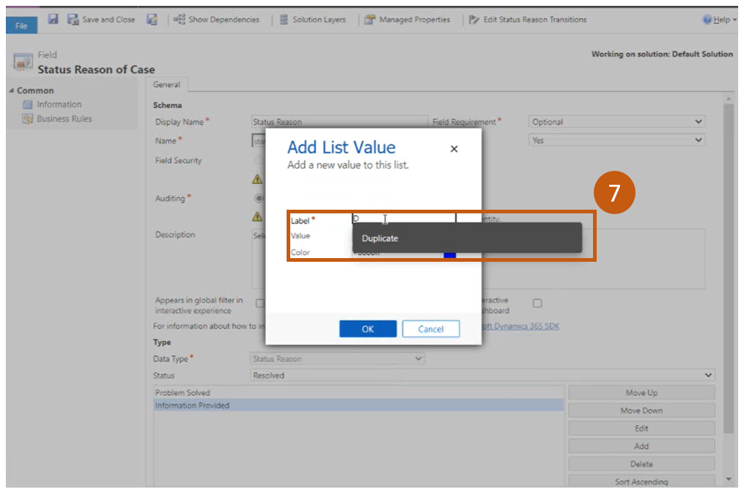

You've successfully added a duplicate status to the status code field.  

### Case Resolution entity

Now that you've added the duplicate status to the Case entity, you need to add it to the Case Resolution entity using the following steps:

**Step 1:** In the solution explorer, expand **Entities**, and then expand **Case Resolution**.

**Step 2:** Select **Fields**.

**Step 3:** Select **Resolution Type**.

  > [!div class=mx-imgBorder]
  > 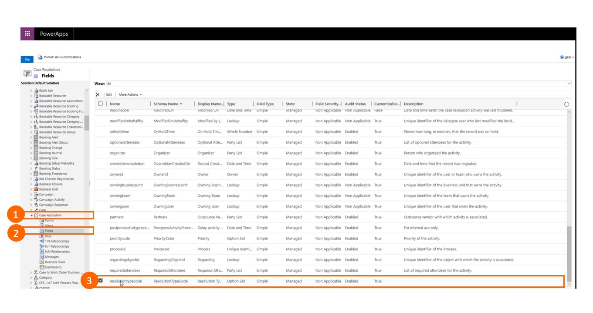
  
**Step 4:** Under the **Options** section, select the **Plus** icon. This will enable the **Label** and **Value** fields to be populated.

**Step 5:** In the **Label** field, enter a value name. For this example, type **Duplicate**.

**Step 6:** In the **Value** field, confirm that the variable listed matches the value in the Case entity.  

**Step 7:** Select **Save**.

  > [!div class=mx-imgBorder]
  > 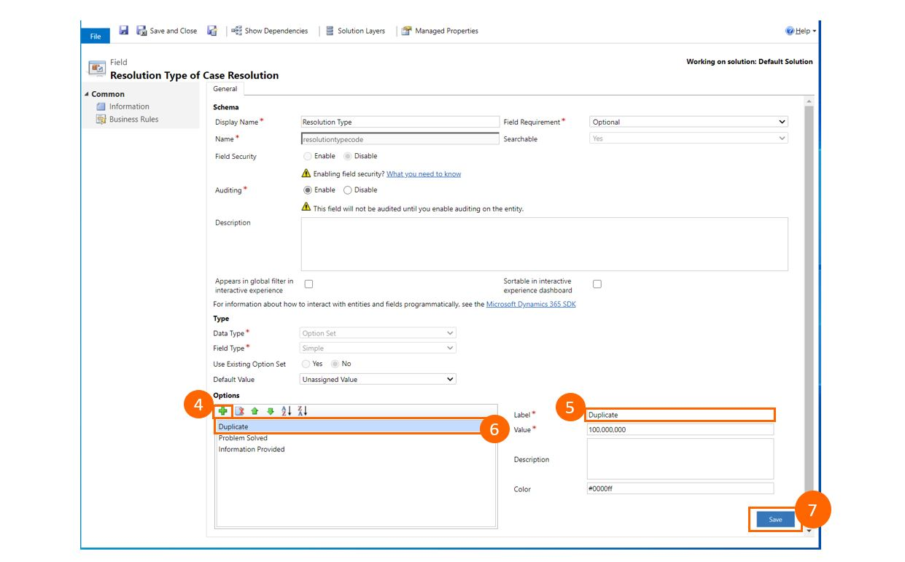

Now, the Case Resolution entity will appear in the dialog field as an option that you can select. 

## Edit form

The case resolution form allows you to add or remove fields according to the needs of your business model.  

For example, your business model might not require a **Billable Time** field because your case resolutions do not track billable hours, and therefore you would like to remove the corresponding field from the form.  

The following section describes how to remove the **Billable Time** field in the Form Editor.

**Step 1:** In the solution explorer, expand the **Case Resolution** entity, and then select **Forms**.  

  > [!div class=mx-imgBorder]
  > 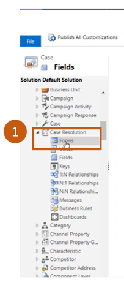

**Step 2:** Open the form you want to edit. In this example, select the **Information** form.

  > [!div class=mx-imgBorder]
  > 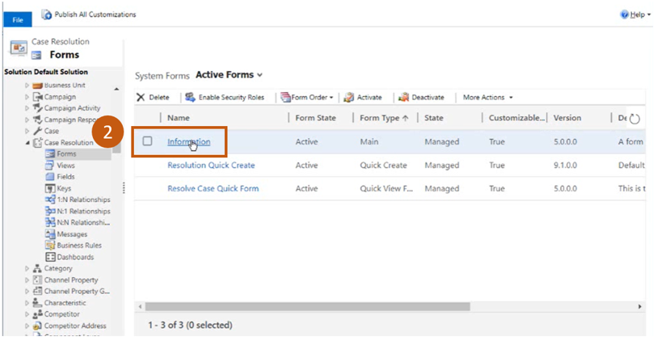

This will open the form in the form designer.

**Step 3a:** Select **Billable Time**.

**Step 3b:** On the command bar, select **Remove**. The **Billable Time** field is removed.

  > [!div class=mx-imgBorder]
  > 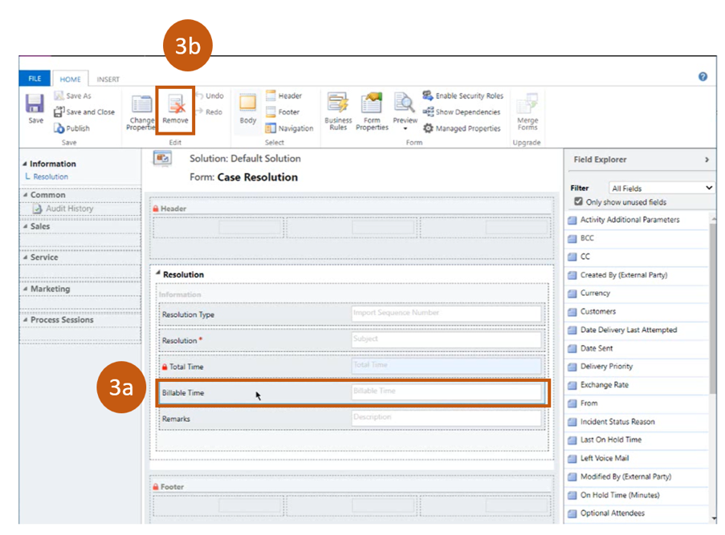

**Step 4a:** Select **Save**.

**Step 4b:** Select **Publish**.

  > [!div class=mx-imgBorder]
  > 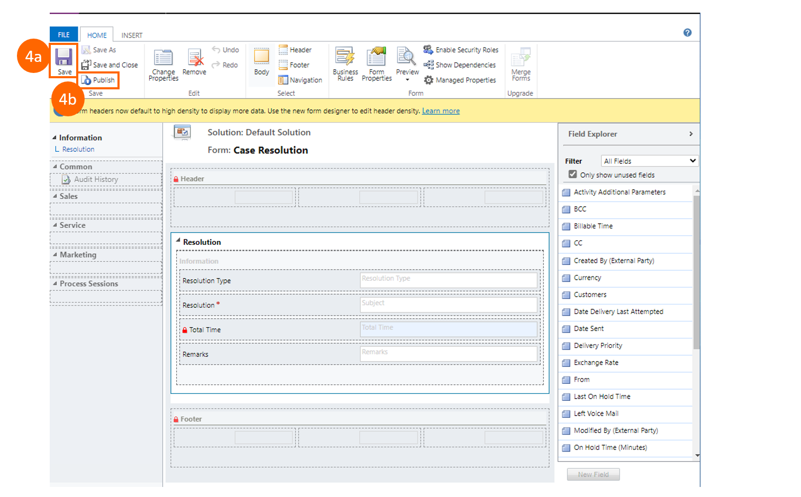

Now, when the customer service reps try to resolve a case, the case resolution dialog box will not display the field you've removed.

**Step 5:** In the **Resolution Type** drop-down list, select **Duplicate**.

  > [!div class=mx-imgBorder]
  > 

You will know if a case has been successfully resolved per the status bar at the top of the form.

  > [!div class=mx-imgBorder]
  > 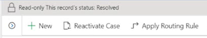

### See also

[Work with cases](customer-service-hub-user-guide-create-a-case.md) 

[Create a case](customer-service-hub-user-guide-create-a-case.md)

[Merge cases](customer-service-hub-user-guide-merge-cases.md)

[Resolve, cancel, and reassign cases](customer-service-hub-user-guide-resolve-cancel-reassign-a-case.md)

[Create and manage parent and child cases](customer-service-hub-user-guide-create-and-manage-parent-and-child-cases.md)

[Case queues and routing](customer-service-hub-user-guide-case-queues-and-routing.md)

[Convert case to knowledge article](customer-service-hub-user-guide-convert-case-to-knowledge-article.md)

[Case SLAs](customer-service-hub-user-guide-case-sla.md)

[Learn the basics of the Customer Service Hub](customer-service-hub-user-guide-basics.md)

[Use the main form and its components](../customerengagement/on-premises/customize/use-main-form-and-components.md)

[!INCLUDE[footer-include](../includes/footer-banner.md)]