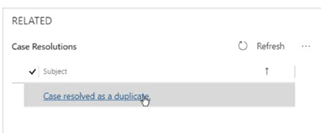

# Resolve, cancel, and reassign cases

The Customer Service Hub provides you with the ability to resolve, cancel, and reassign cases.

## Resolve a case  

1. In the list of active cases, open the one you want to resolve.  

2. On the command bar, select **Resolve case**.  

     Make sure you close all the case activities. If there are open activities associated with the case, you’ll see a message saying that the open activities will be canceled if you resolve this case. To continue, select **Confirm**.  

3. In the **Resolve Case** dialog box, in the **Resolution Type** list, select how the case was resolved.  

4. In the **Resolution** box, type a short explanation of the resolution.  

     The total time spent on all activities for this case, as recorded in the **Duration** box in each activity, is filled out automatically in the **Total Time** box.  

5. In the **Billable Time** list, enter the amount of time spent on the case to be billed to the customer.  

     If this case is linked to an entitlement, the billable time will be subtracted from the allotted minutes for that entitlement.  
  
6  Select **Resolve**.

> [!NOTE]
>
> - You cannot edit or update any attribute of the case once it is resolved.
> - The "resolve cases" action is not available in the business process flow in Customer Service Hub. As a workaround, you can customize the business process flow to add the action. For information about customizing the business process flow, see [Add an action to a business process flow](https://docs.microsoft.com/power-automate/create-business-process-flow#add-an-on-demand-action-to-a-business-process-flow).

## Resolve a case with a parent and child relationship  

> [!IMPORTANT]
>
> Sometimes, resolving a case action might be blocked based on your current case status. This is because your admin may have set things up so that you only see a limited set of statuses to choose from based on the current status of a case. For more information about the available list of case statuses, contact your administrator.  

 Depending on your settings, a case with a parent and child relationship can be closed in one of the following ways:  

- When all the child cases are resolved, you can then close the parent case.  

- When you resolve the parent case, it will then resolve all the active associated child cases.  

- A parent and child case can be closed independently of each other. This is the default setting.  

> [!IMPORTANT]
>
> Before you resolve a parent case with active child cases, make sure that all the case activities are closed. Otherwise, you’ll get a warning stating that you need to manually close the open activities or the system will automatically cancel the open activities when the case is resolved. Also, performance may be slow when you close a parent case with lots of active child case associated with it.  

## Cancel a case

 All case activities must be closed before you can cancel a case.  

1. In the list of active cases, open the case you want to cancel, and then on the command bar, select **Cancel Case**.  

2. In the **Confirm Cancellation** dialog box, select the case status:  

    - **Canceled**: This means the case is canceled and it will no longer be assigned to you.  

    - **Merged**: This means the case is merged with another case. When the case is merged, the case activities will be moved to the case it was merged with.  

3. Select **Confirm**.  

> [!NOTE]
> If you are using a custom code or custom workflow to mark a case resolved or canceled, ensure that you set up appropriate validation to check if the case is already resolved or canceled. If a custom workflow tries to resolve or cancel a case that is already resolved or canceled, you will see errors while executing the custom workflow.

## Reassign a case

 If you don’t have enough information to resolve a case, or if you think another member in your team has expertise on the subject, you can assign the case to another user or team.  

1. In the list of cases, select the case that you want to reassign, and on the command bar, select **Assign**.  

2. In the **Assign to Team or User** dialog box, in the **Assign To** field, select **User or Team**, and then in the **User or team** field, select who you want to assign the case to.  

3. Select **Assign**.  

## Case Resolution History

Located on the right side of the form, is the case resolution sub-grid. Here you will find the case resolution history.  Should a case need to be reopened, agents have the ability to view case history here.

  > [!div class=mx-imgBorder]
  > 

### See also

[Learn the basics of the Customer Service Hub](customer-service-hub-user-guide-basics.md)

[Use the Main form and its components](../customerengagement/on-premises/customize/use-main-form-and-components.md)
  

[!INCLUDE[footer-include](../includes/footer-banner.md)]