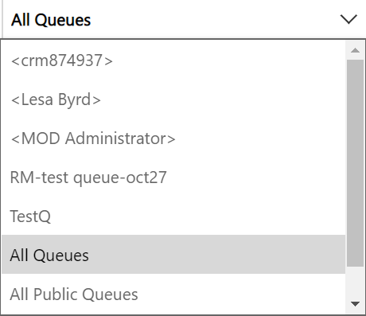

# Find the queue items
Use the view list and queue list to filter and find items in queues.

1. Go to Service > Queues.
2. Select a view and a filter to see the items you want.
   
   

# Find all items in queues

1. To see all cases from a selected queue, in the view list, select **All Items in Selected Queues**.

2. In the queue list, choose one of the following options to filter cases based on queues:
- <Individual queues>
- All Queues
- All Public Queues
- Queues I'm a member of

# Find cases that are available to work on

1. To see only the cases no one else is working on, in the view list, select **Cases Available to Work On**
2. In the queue list, choose one of the following options to filter cases based on queues:
- <Individual queues>
- All Queues
- All Public Queues
- Queues I'm a member of

# Find cases that you're working on

1. To see only the cases that you are currently working on, in the view list, select **Cases I'm Working On**.
2. In the queue list, choose one of the following options to filter cases based on queues:
- <Individual queues>
- All Queues
- All Public Queues
- Queues I'm a member of

# Find items available to work on

1. To see only items (activites and cases) that no one else is working on, in the view list, select **Items available to work on**.
2. In the queue list, choose one of the following options to filter cases based on queues:
- <Individual queues>
- All Queues
- All Public Queues
- Queues I'm a member of

# Find items that you are working on

1. To see only items that you're currently working on, in the view list, select **Items I am working on**.
2. In the queue list, choose one of the following options to filter cases based on queues:
- <Individual queues>
- All Queues
- All Public Queues
- Queues I'm a member of

# Pick an item to work on

1. Select Service.
2. Select Queues.
3. Select a view from the System Views menu.
4. Select the queues from the menu.
5. Select an item in the queue. Select the check box next to the item title.
6. Select Pick from the menu bar. A dialog box appears with an option to remove the
   item from the queue while you are working on it.
7. Select No and change it to Yes.
8. Select Pick.

