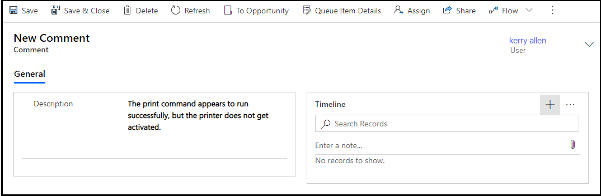

# Customer Service Team Member app

With the entry-level Team Member license, you can now address self-service support scenarios for your employees using the new Customer Service Team Member app module. Employees can create cases for their problems, such as laptop issues, HR queries, and administrative needs, and interact with agents through the commenting feature. They can also search the knowledge base for solutions pertaining to their problems. 

## Install Customer Service Team Member app

The Customer Service Team Member app must be manually installed in your instance and the **Customer Service Team Member** role assigned to the users before they can access it.

1. As an administrator, sign in to [Power Platform administration center](https://admin.powerplatform.microsoft.com/).
2. In the site map, expand **Resources**, and select Dynamics 365 apps.
3. On the apps list page, select the ellipses beside **Customer Service Team Member**, and select **Install**.
4. In the **Install Customer Service Team Member** panel, select an environment from the list.
5. Select the terms of service, and then select **Install**.
6. Grant the **Customer Service Team Member** role to the users who will access the app. To learn about granting the role, see [Assign a security role to a user](https://docs.microsoft.com/power-platform/admin/create-users-assign-online-security-roles#assign-a-security-role-to-a-user).

## Change the default account

You can update the default account that appears for employees when they are creating a case. Perform the steps outlined in this section to update the default account.

> [!IMPORTANT]
>
> Do not modify or update the default account that is available out of the box with the app; instead, deactivate the out-of-the-box account, and configure a new account and set it as the default.

1. In your instance, log on to Customer Service Hub as an administrator, and create an account.
2. Retrieve the account record ID from the URL where you created the account.
3. Go to https://make.powerapps.com, and select **Solutions**.
4. In the **Solutions** list, browse and select **Customer Service Team Member**.
5. On the **Solutions** > **Customer Service Team Member** page, select **Default customer account**. The **Edit Default customer account** dialog box appears.
6. Under **Current value**, select **New value**.
7. In the box that appears, paste the account ID that you had copied in step 2, and select **Save**. The account that you have chosen is set as the default account.

## Use the Customer Service Team Member app

In the Customer Service Team Member app, you can perform the following tasks:

- Create cases, read, and update the cases that you created.
- Use the comments feature for your cases to interact with agents.
- Search and view knowledge articles.

1. Sign in to Dynamics 365, and select **Customer Service Team Member**.
2. Select **Cases**. The **Active Cases created by me** page appears.
3. Select **New Case**. The **New Case** page appears.
4. Enter the following details on the **Summary** tab:

   - **Case Title:** Specify a title.
   - **Subject:** Specify the subject.
   - **Product:** Select the product category.
   - **Description:** Specify a description that summarizes the problem.

    > [!NOTE]
    > The **Customer** value is not available for editing; it is mapped to the "Default account" that is configured by your administrator.

5. Select **Save**. The **Comments** section appears on the page that can be used to provide additional information.
6. Select **New Comment**. The **New Comment** page appears.
7. In **General** > **Description**, enter additional information that would be useful in addressing the problem.
8. Select **Save**. The **Timeline section is enabled where you can add notes and upload files pertaining to the problem.**
  
    > [!div class="mx-imgBorder"]
    > 

9. (Optional.) Select **Enter a note** to add notes and attach files.
10. Select **Save & Close**. The **Active Cases created by me** page appears.
11. Select **Knowledge Search** to search for articles pertaining to your problem area that may help in addressing the issue. To learn more, see [Independent knowledge base search](search-knowledge-articles-csh.md#independent-knowledge-base-search).

    > [!NOTE]
    > "Send article URLs" is not supported in the Customer Service Team Member app.

12. If you want to close a case after it has been resolved, you can select the case on the **Active Cases created by me** page and click **Close Case**. Alternatively, you can close the case on the **My Case** page.

### See also

[Dynamics 365 Team Members license](https://docs.microsoft.com/dynamics365/get-started/team-members-license)

[!INCLUDE[footer-include](../includes/footer-banner.md)]