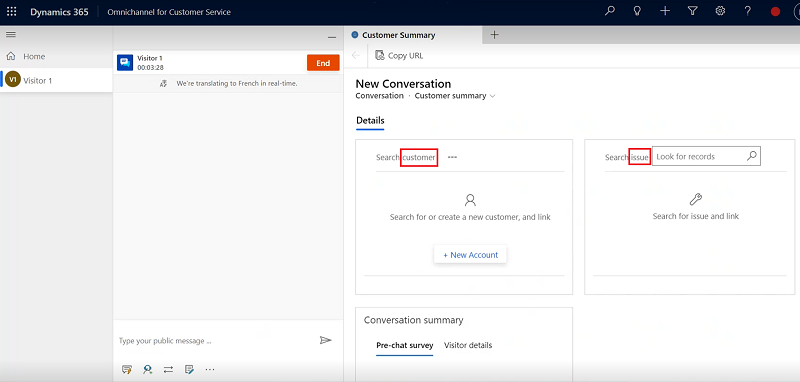

# Customize the Customer summary form

[!INCLUDE[cc-use-with-omnichannel](../includes/cc-use-with-omnichannel.md)]

## Introduction

You can customize the following for the **Customer summary** page:

- Add or remove custom controls
- Add a web resource or iFrame to the form
- Customize the layout
- Add custom fields
- Embed canvas apps

> [!NOTE]
> However, for a conversation entity, you can't add custom forms.

By default, the **Customer summary** page displays the sections that are listed in this article. For information on how to customize these sections, see [Customize quick view forms](customize-quick-view-form.md).

## Customer profile

The **Customer profile** section provides details about the customer or account. These details include the name of the customer or account, category or job, title, relationship type, city, and the preferred channel of engagement. You can modify the quick view forms in this section by navigating to the respective entity forms. 

## Conversation summary

The **Conversation summary** section fetches details based on the context of the incoming conversation request.

This section includes **Pre-chat survey** and **Visitor details**. The details on these tabs help you to understand contextual channel-specific information about the conversation with the customer. The **Pre-chat survey** tab shows responses from the customer on the pre-chat questions.

The **Visitor details** tab provides some information such as the customer is authenticated or not, browser used by the customer for contacting support, an operating system used by the customer, location of the customer, interacting language of the customer, and so on. In addition, conversation and transfer details.

If the customer signs in to the portal to initiate a chat with the support, then as an agent, you can see the **Authenticated** field value as **Yes** in the **Visitor details** tab of the **Conversation summary** section. Otherwise, the **Authenticated** field value is shown as **No**.

## Issue snapshot

For an incoming conversation request, the system links an existing case to the conversation and shows it on the **Issue Snapshot** section. This section shows information such as the title of the case, the priority, the status of the case, the product, and the owner. You can modify the quick view forms in this section by navigating to the respective entity forms.

## Recent cases

This form section displays the recent cases that relate to the customer. You can modify the quick view forms in this section by navigating to the respective entity forms.

## Customize the labels for customer, account, and case on the conversation form

You can customize the labels for customer, account, and case that appear on the conversation form so that they are relevant to your business needs. These customizations are applicable to labels such as **Search customer**, **New customer**, **Search issue**, and **New case**. When you update a label, the updated name that you choose will reflect in all occurrences where that name exists.

   > [!div class="mx-imgBorder"]
   > 

For example, you could change **Search customer** to **Search client** or **Search issue** to **Search ticket** using the following procedure.

To customize labels on the conversation form:

1. In your Dynamics 365 instance, go to **Customize the System** in **Advanced Settings**, and then select **Web Resources**.

1. Select the filters icon, select the dropdown menu next to the **Type** column, and then select the checkbox for **String (RESX)**.

1. In the **Name** column filter, select **Custom Filter**, and in the dialog that is displayed, set **Select Operator** to **Contains**, and then type **CustomerSummary** for the value. All the CustomerSummary labels for all the languages are displayed.

1. Optionally, use the language filter to narrow the results to show the results for the required language.

1. In the **Name** column, select the **CustomerSummary** label. A dialog opens with the URL link to the content of the CustomerSummaryLabels.resx file.

1. Select the link in the URL field. A dialog opens and displays the contents of the resource file.

   1. Copy and paste the contents into a text editor, and then update the text for the value tag of the labels you want to change with a label of your choice . For example, for **Customer**, update the text in value with "Client". This will replace the "Customer" label with "Client" on the Customer summary form.
   
   1. Similarly, for the **Issue** tag, update the text in value* with "Ticket". This will replace the "Issue" label with "Ticket" on the Customer summary form.

    The sample tags with the new values are as follows.

      ```</resheader>
      <data name="Customer" xml:space="preserve">
        <value>Client</value>
        <comment>Client Label</comment>
      </data>
      <data name="Issue" xml:space="preserve">
        <value>Ticket</value>
        <comment>Issue Label</comment>
      </data>
      ```

1. Save the file locally, and then return to the **CustomerSummaryLabels Web resource** dialog, select **Choose File**, and upload the edited file.

1. Select the recently saved file, select **Save**, and then publish the changes.

1. To view the published changes, in the Customer Service workspace or Omnichannel for Customer Service app, manually refresh the page containing the conversation summary form.

## Timeline

This section displays case-related and customer-related activities in the form of a timeline. You can create quick notes based on the discussion with the customer. Use the **Linked records** field to switch the timeline based on the Case, Contact, or Account record linked to the conversation.

You can customize the timeline dropdown labels for case, account, and contact by editing the display name for the corresponding entity and publishing your changes.

> [!div class="nextstepaction"]
> [Next topic: Customize quick view forms](customize-quick-view-form.md)

### See also

[Omnichannel system customizers](omnichannel-customizer.md)  
[Customize the conversation form](customize-session-form.md)  
[Configure agent and supervisor configurations in Unified Service Desk](../unified-service-desk/oc-customizer/create-agent-supervisor-configurations-unified-service-desk.md)  
[Configure notification for agents](../unified-service-desk/oc-customizer/configure-notification-screen-pop-agents.md)  


[!INCLUDE[footer-include](../includes/footer-banner.md)]
