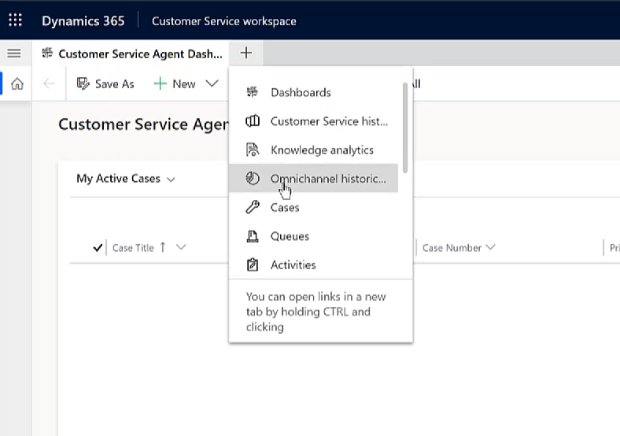
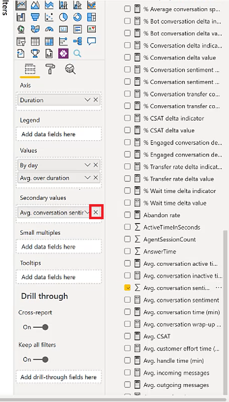

# Customize analytics reports in Customer Service (preview)

> [!IMPORTANT]
> [!INCLUDE[cc-preview-feature](../includes/cc-preview-feature.md)]
>
> [!INCLUDE[cc-preview-features-definition](../includes/cc-preview-features-definition.md)]
>
> [!INCLUDE[cc-preview-features-expect-changes](../includes/cc-preview-features-expect-changes.md)]
>
> [!INCLUDE[cc-preview-features-no-ms-support](../includes/cc-preview-features-no-ms-support.md)]

Dynamics 365 Customer Service provides out-of-box reporting capabilities, including industry-standard metrics that are critical for every support organization. These reports are designed to help supervisors in your organization to better understand and manage agent performance.

The nature of your business may require that you customize these standard reports based on your organization's needs. You can edit out-of-box reports in the following ways:

- Rearrange out-of-box report layouts and change themes
- Modify the visual look of the data, such as to display a metric trend over time versus a tabular view
- Create visuals using metrics in the data model that aren't directly exposed in the out-of-box reports.

## Grant user privileges to edit analytics reports

1. Go to **Settings** > **Advanced settings** > **Security**.

1. Select **Users** > **Enabled users**.

1. Search for and select the user you want to grant access to, and then on the command bar, select **Manage Roles**.
 
1. Select **Analytics Report Author**.

1. Select **OK**.

1. To see the edit report option on the reports, close and reopen your browser window.

## Customize the visual display of your analytics reports

1. Open the **Omnichannel historical analytics** dashboard in Customer Service workspace.

   > [!div class="mx-imgBorder"] 
   > 

1. Select **Edit** to open the report authoring experience. The **Visualizations** and **Fields** panes open on the right-hand side of the page.

1. Select any of the visualizations you desire. For example, if you want to change the background color of your reports, select **Page background**, and then select the color you want from the **Themes color** palette.

   > [!div class="mx-imgBorder"] 
   > 

1. You can customize the key performance indicators (KPIs) you want represented on the report. For example, if you want to track average handle time more closely, you can select **Avg handle time** from the list in the **Fields** pane, and then drag and drop it in the **Fields** section of the **Visualizations** pane.

   > [!div class="mx-imgBorder"] 
   > 
 
1. To track a secondary value, you can drag and drop the desired KPI from the **Fields** pane to the **Secondary value** of the **Visualizations** pane. In our example, we've customized the report to track average conversation sentiment as part of the **Avg CSAT** KPI.

   > [!div class="mx-imgBorder"] 
   > 

1. If you want to remove a metric from the report, you can select the "x" at the top of the metric to delete it.

   > [!div class="mx-imgBorder"] 
   > 

 
1. When you're done selecting the visual customizations you want for your report, select **Publish** > **Continue**. Changes are immediately reflected in your report.
