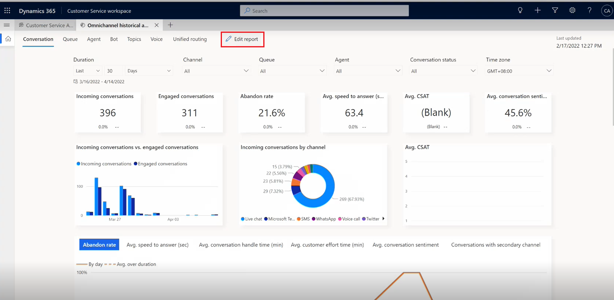
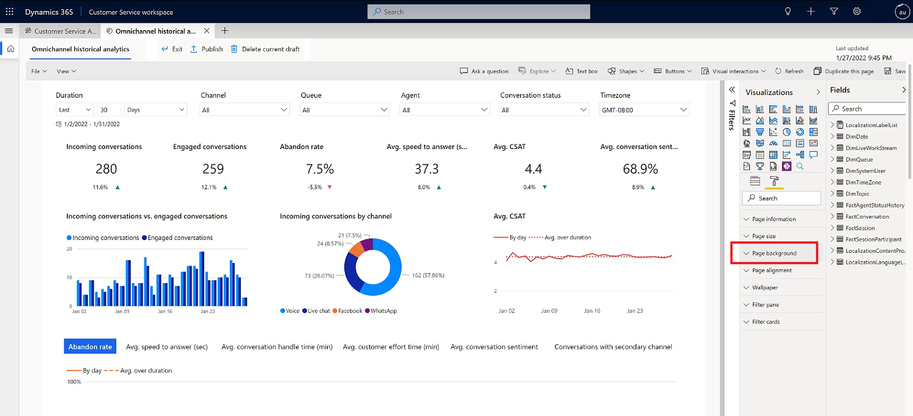
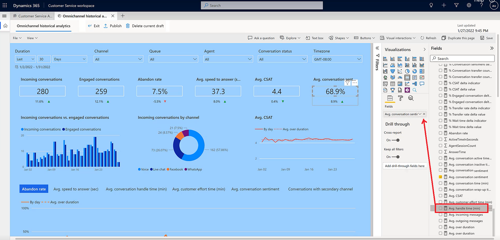
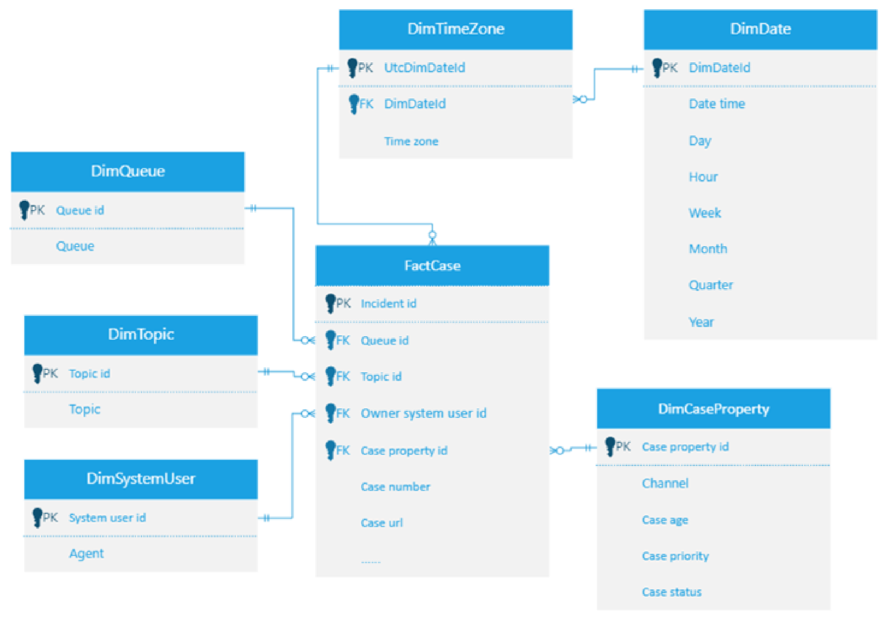
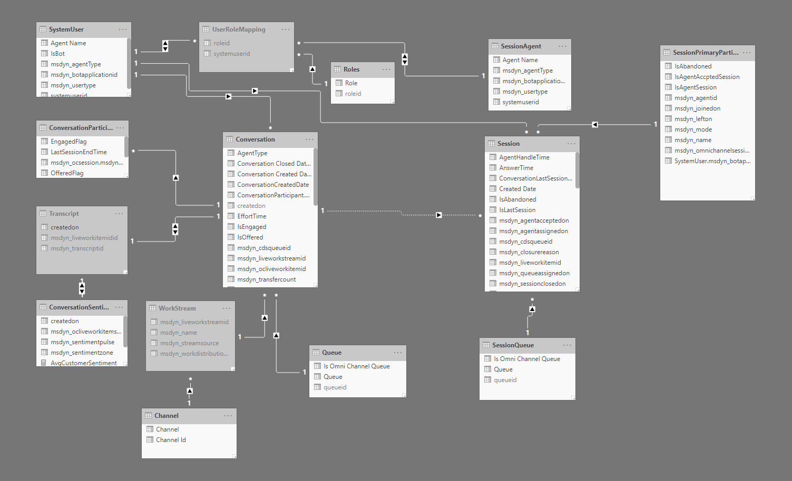
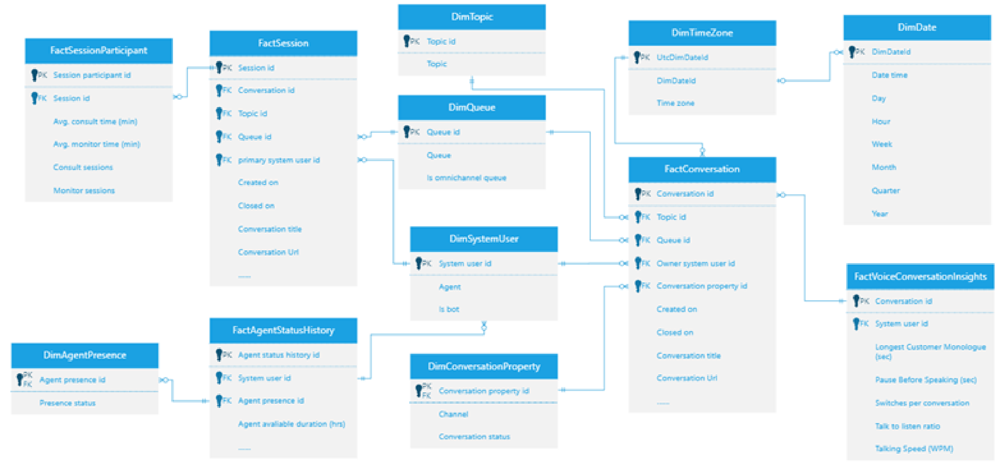

# Visual customization of historical analytics reports in Customer Service

Dynamics 365 Customer Service provides out-of-box reporting capabilities, including industry-standard metrics that are critical for every support organization. These reports are designed to help supervisors in your organization to better understand and manage agent performance.

The nature of your business may require that you customize these standard reports based on your organization's needs. You can edit out-of-box reports in the following ways:

- Rearrange out-of-box report layouts and change themes.
- Modify the visual look of the data, such as to display a metric trend over time versus a tabular view.
- Create visuals using metrics in the data model that aren't directly exposed in the out-of-box reports.

> [!Note]
> Visual customization of historical analytics reports is currently available for Customer Service Workspace, Customer Service Hub, and Omnichannel for Customer Service. It is not available for unified routing or knowledge management analytical reports.

## Grant user privileges to edit analytics reports

To be able to edit analytics reports, users must have the **Analytics Report Author** role. For information about assigning user roles, go to [Assign roles to users](add-users-assign-roles.md#assign-roles-to-users).

## Customize the visual display of your analytics reports

1. Open the **Omnichannel historical analytics** or **Customer Service historical analytics** report in Customer Service workspace.
   
1. Select **Edit report**. The Power BI embedded editing experience is displayed.

   > [!div class="mx-imgBorder"] 
   > 

   The following panes open on the right-hand side of the page:

   - **Visualizations**: Displays a list of options you can use to create different visual views in your report. Choose which visuals you want in your report by deleting a currently displayed visual and then adding the visual you prefer by dragging and dropping it from **Visualizations** list to the area where you want it to display in your report. For example, if you wanted to change the background color of your reports, you would select **Page background**, and then select the color you want from the **Themes color** palette.

     > [!div class="mx-imgBorder"] 
     > 

   - **Fields**: Displays a list of KPIs, measures, dimensions, and attributes you can represent in your report. For example, if you wanted to track average handle time more closely, you could select **Avg handle time** from the list in the **Fields** pane, and then drag and drop it in the **Fields** section of the **Visualizations** pane.

     > [!div class="mx-imgBorder"] 
     > 
 
 
1. When you're done selecting the customizations you want for your report, select **Save** and then **Publish**. Once you publish the report, all customizations become visible to all users in your organization. 

1. (Optional) To continue editing the report after you've published it, select **Resume editing**. The **Visualizations** and **Fields** panes are reopened. You can further customize your report, and then save and publish it again.

1. If at some point you want to revert all of your changes to the original report settings, you can do so by selecting **Edit report** > **Checkout default report** > **Reset**. 
   > [!IMPORTANT]
   > Selecting **Reset** will permanently remove any customizations you've made.

### Future data model updates

In a scenario in which you've customized your reports and then Microsoft makes updates to the default data model for a report, the customizations you've made for your reports won't be overwritten by the updates to the data model. However, if there's a change to the naming conventions in the Power BI embedded editing experience, those changes will be reflected in the respective list and may require that you reselect the metric with the new name.

## Customer service manager analytics

### Data model
 
   > [!div class="mx-imgBorder"] 
   > 
 

### Data dictionary 

|Entities |Attributes |	Description |
|----------|------------------|---------------|
|DimDate	|Date time	|Date time. The type is Date/Time. |
|DimDate	|Day | Day name. Example: "Fri". |
|DimDate	|Year	| Year number. Example: "2021". |
|DimDate	|Week	| Week number. Example: "1". |
|DimDate	|Month	| Month name. Example: "Apr 2021"|
|DimDate	|Quarter	| Quarter name. Example: "Q1". |
|DimDate	|Hour	| Hour. Example: "01:00", "01:30" |
|FactCase	|Incident id	|Incident id, Primary key. Type: Guid.|
|FactCase	|Case number	|Case number value. |
|FactCase	|Queue id	|Queue id. Foreign key to DimQueue. |
|FactCase	|Owner system user id	|Owner system user id. Foreign key to DimSystemUser. |
|FactCase	|Case url	|URL for case. |
|FactCase	|Case property id |	Foreign key to DimCaseProperty. |
|FactCase	|Topic id	|Topic id. Foreign key to DimTopic. |
|FactCase	|Case title	|Case title. |
|FactCase	|Created on	|Date created on. |
|FactCase	|Incoming cases	|Incoming cases count.|
|FactCase	|Total cases	|Total case count. |
|FactCase	|Resolved cases	|Case count when case status is resolved. |
|FactCase	|Active cases	|Case count when case status is active. |
|FactCase	|Canceled cases	|Case count when case status is canceled. |
|FactCase	|Escalated cases	|Case count when case is escalated. |
|FactCase	|Escalated rate	|Rate that escalated cases divided by total cases. |
|FactCase	|Case volume	|Total case count per topic divided by total cases. |
|FactCase	|Case volume change	|Total case count link relative ratio for the same date range filter.|
|FactCase	|Avg. resolve time (hrs|	Average time for case handle time. |
|FactCase |	Avg. case age (days)	|Average case age |
|FactCase	|First response - SLA %	|Total cases when first response sent is false divided by total cases. |
|FactCase	|Avg. CSAT |	Average CSAT score. |
|FactCase	|CSAT impact	| Change ratio for the CSAT.|
|FactCase	| Avg. survey sentiment	|Average survey sentiment. |
|FactCase |	Survey sentiment impact |	Change ratio for the sentiment. |
|DimQueue |	Queue	|Queue name.|
|DimQueue	|Queue id	|Queue ID. Primary key. Type: Guid. |
|DimSystemUser	|Agent	|Name of the agent. |
|DimSystemUser	|System user id |System user ID. | 
|DimCaseProperty	|Case status	|Case status value, Example: Active, Canceled, Resolved. |
|DimCaseProperty	|Case priority	|Case priority value, Example: Low, High, Normal. |
|DimCaseProperty	|Channel	|Case channel.|
|DimCaseProperty	|Case age	| Description for case age, Example: 4-7 Days, <1 Day, 1-3 Days|
|DimCaseProperty	|Case property id	|Case property ID. Primary key. |
|DimTopic	|Topic	|Topic name. |
|DimTopic	|Topic id	|Topic ID. Primary key. Type: Guid. |
|DimTimeZone	|Time zone	|Time zone code. Example: GMT +01:00 |

## Omnichannel analytics

### Data model

   > [!div class="mx-imgBorder"] 
   > 

### Data dictionary

|Entities |Attributes|	Description |
|----------|----------|----------| 
|DimAgentPresence	|Agent presence id |Primary key. |
|DimAgentPresence	|Presence status	| Agent presence status. That is, Available, Busy, Busy-DND, Away, or Offline. |
|DimConversationProperty |Conversation property id |Primary key. |
|DimConversationProperty	|Channel |	Channel name. The name of the channel that the conversation came through. |
|DimConversationProperty|Conversation status |The status of the conversation. That is, open, active, waiting, wrap up, and closed. |
|DimDate |	Date time	|Date time. The type is Date/Time. |
|DimDate |	Day	|Day name. Example: "Fri".|
|DimDate |	Hour	|Hour. Example: "01:00", "01:30"|
|DimDate	|Month	|Month name. Example: "Apr 2021".|
|DimDate	|Quarter	|Quarter name. Example: "Q1". |
|DimDate |Week	|Week number. Example: "1". |
|DimDate	|Year	|Year number. Example: "2021". |
|DimQueue	|Queue id	|Queue ID. Primary key. Type: Guid. |
|DimQueue	|Is omnichannel queue |Is omnichannel queue. Currently, it's always true. |
|DimQueue	|Queue	|Queue name.|
|DimSystemUser	|System user id|	System user ID. |
|DimSystemUser	|Agent	|Name of the agent. |
|DimSystemUser	|Is bot	|Is bot. True or false. |
|DimTimeZone	|Time zone	|Time zone code. Example: GMT +01:00. |
|DimTopic	|Topic id	|Topic ID. Primary key. Type: Guid. |
|DimTopic	|Topic	|Topic name.|
|FactAgentStatusHistory |Agent status history id	|Original identifier of the agent status history record from msdyn_agentstatushistory entity. Type: Guid.|
|FactAgentStatusHistory	|System user id	|Agent ID. Foreign key to DimSystemUser. |
|FactAgentStatusHistory	|Agent logged in time	|The time an agent logged in the Omnichannel application per presence status. |
|FactAgentStatusHistory	|Agent presence id	|Foreign key to DimAgentPresence.|
|FactAgentStatusHistory	|Agent available duration (hrs)|	The time an agent is in the Available state in the Omnichannel application.|
|FactAgentStatusHistory	|Agent away duration (hrs)|	The time an agent is in the away state in the Omnichannel application.|
|FactAgentStatusHistory	|Agent busy (DND) duration (hrs)|	The time an agent is in the Busy DND state in the Omnichannel application.|
|FactAgentStatusHistory	|Agent busy duration (hrs) |Time an agent in the busy state in Omnichannel application.|
|FactAgentStatusHistory	|Agent offline duration (hrs)|	The time an agent signed out of the Omnichannel application.|
|FactAgentStatusHistory	|Agent total sign-in time (hrs)	|The time an agent is in each status. The column is used to calculate other measures like "Agent available duration (hrs)", "Agent away duration (hrs)".|
|FactConversation	Conversation id	|Identifier of the conversation record. | Primary key. Type: Guid.|
|FactConversation|	Conversation title	|Conversation title.|
|FactConversation|	Conversation Url	|Conversation URL.|
|FactConversation	|Conversation property id|	Foreign key to DimConversationProperty. |
|FactConversation	|Owner system user id|	Owner system user ID. Foreign key to DimSystemUser.|
|FactConversation	|Queue id	|Queue ID. Foreign key to DimQueue.|
|FactConversation	|Topic id	|Topic ID. Foreign key to DimTopic. |
|FactConversation	|Is offered	|Whether the conversation is initiated by the customer. Bot escalates to an agent or an agent handling customer call directly. |
|FactConversation	|Is conversation date in past	|Is conversation data in past. |
|FactConversation|	Is outbound	|Is outbound conversation. |
|FactConversation	|Abandon rate	|Abandon rate.|
|FactConversation	|Avg. conversation hold time (min)|	The total time an agent has put a customer on hold.|
|FactConversation	|Avg. conversation sentiment|	Average conversation sentiment. |
|FactConversation	|Avg. conversation talk time (min)	|The total time spent by the customer and agent talking on the voice call. It’s the difference between the handle time and cumulative time in hold and after call work time.|
|FactConversation	|Avg. conversation time (min)|	Average conversation time (min).|
|FactConversation	|Avg. conversation wrap-up time (min)	|Average conversation wrap-up time (min).|
|FactConversation	|Avg. CSAT	|Avg. CSAT.|
|FactConversation	|Avg. speed to answer (sec)|The time it took for a customer call to be answered.|
|FactConversation	|Conversation volume|	Conversation volume that is assigned to a topic.|
|FactConversation	|Conversation volume change|	Conversation volume change.|
|FactConversation	|Created on	|Date created on. |
|FactConversation	|Closed on	|Date closed on.|
|FactConversation	|Engaged conversations	|Offered conversations that are engaged by an agent. Customer-to-agent communication can begin at this point.|
|FactConversation	|Incoming conversations	|The number of incoming conversations.|
|FactConversation	|Outgoing conversations	|The number of outgoing conversations.}
|FactConversation	|Total conversations |The number of total conversations. |
|FactConversation	|Transfer rate	|The percentage of conversations that are transferred to another agent/queue. |
|FactConversation	|Sentiment zone	|Sentiment zone for the conversation. |
|FactConversation	|Avg. conversation active time (min)|	Average time when conversation is active.|
|FactConversation	|Avg. conversation inactive time (min)	|Average time when conversation is inactive. |
|FactConversation	|Avg. customer effort time (min)	|Average time for customer effort. |
|FactConversation	|Avg. handle time (min)	|Average active time for the closed conversation. |
|FactConversation |Avg. incoming messages	| Average incoming messages.|
|FactConversation	|Avg. outgoing messages	|Average outgoing messages. |
|FactConversation	|Conversation count	|Conversation count. |
|FactConversation	|Avg. response time (min)|	Average response time up on response time of each session. |
|FactConversation	|Avg. session per conversation|	Average session count per conversation. |
|FactConversation	|Avg. survey sentiment	|Average sentiment score. |
|FactConversation	|Avg. time for first response (min)	|Average response time for first response time. |
|FactConversation	|Avg. wait time (sec)|	Average wait time. |
|FactConversation	|Outgoing messages	|Outgoing messages count. |
|FactConversation	|Incoming messages |Incoming messages count. |
|FactSession	|Session id	|Identifier of the session record.|
|FactSession	|Conversation id	|Foreign key to FactConversation.|
|FactSession	|Conversation title	|Conversation title.|
|FactSession	|Conversation Url	|Conversation URL. |
|FactSession	|Created on	|Date created on. |
|FactSession	|Closed on	|Date closed on.|
|FactSession	|Queue id	|Queue ID. Foreign key to DimQueue.|
|FactSession	|Topic id	|Topic ID. Foreign key to DimTopic. |
|FactSession	|Primary system user id	|Primary system user ID. Foreign key to DimSystemUser.|
|FactSession	|Is agent accepted session	|Is agent accepted the session or not. |
|FactSession	|Is agent session	|Is agent session or not.|
|FactSession	|Avg. conversation handle time (min)	|Average conversation handle time (min).|
|FactSession	|Avg. conversation hold time (min)|	Average conversation hold time (min).|
|FactSession	|Avg. conversation sentiment	|Average sentiment score based on the verbatim provided in customer voice survey.|
|FactSession	|Avg. conversation talk time (min)	|Average conversation talk time (min).|
|FactSession	|Avg. CSAT|	Average CSAT.|
|FactSession	|Avg. incoming messages	|Average incoming messages. |
|FactSession	|Avg. outgoing messages	|Average outgoing messages. |
|FactSession	|Avg. session active time (min)|	Average session active time (min). |
|FactSession	|Avg. session handle time (min)	|Average session handle time (min).|
|FactSession	|Avg. session hold time (min)	|Average session hold time (min). |
|FactSession	|Avg. session inactive time (min) |Average session inactive time (min). |
|FactSession	|Avg. session sentiment	|Average session sentiment. |
|FactSession	|Avg. session talk time (min) |Average session talk time (min). |
|FactSession	|Avg. session time (min)	|Average session time (min).|
|FactSession	|Avg. Speed to answer (sec) |	Average speed to answer (sec). |
|FactSession	|Avg. wait time (min) |	The average time in minutes customers waited before connecting to agents. Similar to "speed to answer", but includes time waited on each session within a conversation.|
|FactSession	|Avg. wait time (sec)	|The average time in seconds customers waited before connecting to agents. Similar to "speed to answer", but includes time waited on each session within a conversation.|
|FactSession	|Engaged conversations	|The conversations that the agent was engaged in. Customer-to-agent communication can begin at this point. |
|FactSession	|Engaged sessions	| Number of sessions presented to an agent and accepted by an agent. |
|FactSession	|Incoming conversations	|Incoming conversations. |
|FactSession	|Incoming messages	|Incoming messages. |
|FactSession	|Incoming sessions	|Incoming sessions. |
|FactSession	|Outgoing conversations |	Outgoing conversations. |
|FactSession	|Outgoing messages	|Outgoing messages. |
|FactSession	|Sentiment zone	|Sentiment zone. |
|FactSession	|Session rejected/timed out rate|	Session rejected/timed out rate. |
|FactSession	|Sessions rejected	|Sessions rejected. |
|FactSession	|Transfer rate	|The number of sessions transferred by an agent. |
|FactSession	|Bot conversations	|The number of conversations handled by bot. |
|FactSession	|Bot escalation rate	|The percentage of bot conversations that have been escalated.|
|FactSession	|Bot resolution rate	|The percentage of bot conversations that have been resolved. |  
|FactSession	|Bot escalation time (min)	|The average session time of the escalated bot sessions. |
|FactSession	|Bot resolution time (min)	|The average session time of the resolved bot sessions. |
|FactSession	|Bot abandoned rate	|The percentage of bot conversations that have been abandoned.|
|FactSession	|Sessions rejected rate	|The percentage of sessions that have been rejected. |
|FactSession	|Sessions timeout rate	|The percentage of sessions that timed out. |
|FactSession	|Sessions timed out count	|Session count when agent is timeout. |
|FactSession	|Bot escalated	| Number of bot conversations that have been escalated. |
|FactSession	|Bot resolved	| Number of bot conversations that have been resolved. |
|FactSession	|Transfer count |Number of sessions that have been transferred (closure reason in 192350006 or 192350010).
|FactSessionParticipant	|Session participant id	|Identifier of the session participant record.|
|FactSessionParticipant	|Session id	|Session ID. Foreign key to FactSession.|
|FactSessionParticipant	|Avg. consult time (min)	|The time spent on the consult from when the agent joined to when they left in session participant. |
|FactSessionParticipant	|Avg. monitor time (min)	|The time spent on the monitor from when the agent joined to when they left in session participant. |
|FactSessionParticipant	|Consult sessions	|The number of sessions accepted by a user in mode = consult.|
|FactSessionParticipant	|Monitor sessions	|The number of sessions accepted by a user in mode = monitor.|

## Omnichannel voice analytics

### Data model

   > [!div class="mx-imgBorder"] 
   > 

### Data dictionary

| Entities | Attributes | Description |
|----------|----------|----------|
|DimAgentPresence	|Agent presence id	|Primary key. |
|DimAgentPresence	|Presence status	|agent presence status that could be "Available", "Busy", "Busy - DND", "Away", or "Offline"|
|DimConversationProperty	|Conversation property id	|Primary key|
|DimConversationProperty	|Channel name. |The name of the channel that the conversation came through.|
|DimConversationProperty	|Conversation status	|The status of the conversation, that is, open, active, waiting, wrap up, and closed.|
|DimDate	|Date time	|Date time. The type is Date/Time. |
|DimDate	|Day	|Day name. Example: "Fri".|
|DimDate	|Hour	|Hour. Example: "01:00", "01:30"|
|DimDate	|Month	|Month name. Example: "Apr 2021".|
|DimDate	|Quarter	|Quarter name. Example: "Q1".|
|DimDate	|Week	|Week number. Example: "1".|
|DimDate	|Year	|Year number. Example: "2021".|
|DimQueue	|Queue id	|Queue id. Primary key. Type: Guid. |
|DimQueue|	Is omnichannel queue| Currently, it's always true.|
|DimQueue	|Queue	|Queue name.|
|DimSystemUser	|System user id	|System user ID.| 
|DimSystemUser	|Agent	|Name of the agent.|
|DimSystemUser	|Is bot	|Is bot. True or false.|
|DimTimeZone	|Time zone	|Time zone code. Example: GMT +01:00.|
|DimTopic	|Topic id	|Topic ID. Primary key. Type: Guid.|
|DimTopic	|Topic	|Topic name.|
|FactAgentStatusHistory	|Agent status history id|	Identifier of the agent status history record. Primary key. Type: Guid.|
|FactAgentStatusHistory|	System user id	|Agent ID. Foreign key to DimSystemUser.|
|FactAgentStatusHistory	|Agent presence id	|Foreign key to DimAgentPresence.|
|FactAgentStatusHistory	|Agent available duration (hrs)	|The time an agent is in the Available state in the Omnichannel application.|
|FactAgentStatusHistory	|Agent away duration (hrs)|	The time an agent is in the Away state in the Omnichannel application.|
|FactAgentStatusHistory	|Agent busy (DND) duration (hrs)	|The time an agent is in the Busy DND state in the Omnichannel application.|
|FactAgentStatusHistory	|Agent busy duration (hrs)	|Time an agent in the busy state in Omnichannel application.|
|FactAgentStatusHistory	|Agent offline duration (hrs)	|The time an agent signed out of the Omnichannel application.|
|FactAgentStatusHistory|	Agent total sign-in time (hrs)	|The time an agent in each status. The column is used to calculate other measure.|
|FactConversation|	Conversation id	|Identifier of the conversation record. Primary key. Type: Guid.|
|FactConversation|	Conversation title	|Conversation title.|
|FactConversation	|Conversation Url	|Conversation URL.|
|FactConversation	|Conversation property id	|Foreign key to DimConversationProperty. |
|FactConversation|	Owner system user id	|Owner system user ID. Foreign key to DimSystemUser.|
|FactConversation	|Queue id	|Queue ID. Foreign key to DimQueue.|
|FactConversation	|Topic id	|Topic ID. Foreign key to DimTopic.|
|FactConversation	|Is offered	|It means whether the conversation is initiated by the customer. Bot escalates to an agent or an agent handling customer call directly|
|FactConversation	|Is conversation date in past	|Is conversation date in past. |
|FactConversation	|Is outbound	|Is outbound conversation. |
|FactConversation|	Abandon rate	|Abandon rate.|
|FactConversation	|Avg. conversation hold time (min)	|The total time an agent has put a customer on hold.|
|FactConversation	|Avg. conversation sentiment|	Avg. conversation sentiment.|
|FactConversation	|Avg. conversation talk time (min)	|The total time spent by the customer and agent talking on the voice call. It’s the difference between the handle time and cumulative time in hold and after call work time.|
|FactConversation	|Avg. conversation time (min)	|Avg. conversation time (min).|
|FactConversation	|Avg. conversation wrap-up time (min)	|Avg. conversation wrap-up time (min).|
|FactConversation	|Avg. CSAT	|Avg. CSAT.|
|FactConversation	|Avg. speed to answer (sec)	|The time it took for a customer call to be answered.|
|FactConversation	|Conversation volume	|Conversation volume that's assigned to a topic.|
|FactConversation	|Conversation volume change	|Conversation volume change.|
|FactConversation	|Created on|	Date created on. |
|FactConversation|	Closed on|	Date closed on.|
|FactConversation	|Engaged conversations	|Offered conversations that are engaged by an agent. Customer-to-agent communication can begin at this point.|
|FactConversation	|Incoming conversations|	The number of incoming conversations.|
|FactConversation|	Outgoing conversations|	The number of outgoing conversations.|
|FactConversation|	Total conversations	|The number of total conversations.|
|FactConversation	|Transfer rate	|The percentage of conversations that are transferred to another agent/queue.|
|FactVoiceConversationInsights	|Conversation id	|Conversation ID. Foreign key to FactConversation.|
|FactVoiceConversationInsights	|System user id	|System user ID. Foreign key to DimSystemUser.|
|FactVoiceConversationInsights	|Longest Customer Monologue (sec)	|The longest monologue by the customer with an agent; indicates that the agent is asking good questions and understanding customer needs.|
|FactVoiceConversationInsights	|Pause Before Speaking (sec)	|The milliseconds the agent paused before responding to customer queries; indicates agent's patience.|
|FactVoiceConversationInsights	|Switches per conversation	|The average exchanges between an agent and a customer in a conversation; the number of times the conversation switched from one person to another. It's a sign of engagement during conversations.|
|FactVoiceConversationInsights	|Talk to listen ratio	|The average listen and talk ratio of agent in conversations with customers.|
|FactVoiceConversationInsights	|Talking Speed (WPM)	|The average number of words used per minute by agent.|
|FactSession	|Session id	|Identifier of the session record.|
|FactSession	|Conversation id	|Identifier of the conversation record.| 
|FactSession	|Conversation title	|Conversation title.|
|FactSession	|Conversation Url	|Conversation URL.|
|FactSession	|Created on	|Date created on. |
|FactSession	|Closed on |	Date closed on.|
|FactSession	|Queue id	|Queue ID. Foreign key to DimQueue.|
|FactSession	|Topic id	|Topic ID. Foreign key to DimTopic. |
|FactSession	|primary system user id	|Primary system user ID. Foreign key to DimSystemUser.|
|FactSession	|Is agent accepted session|	Has agent accepted the session or not? |
|FactSession	|Is agent session	|Is agent session or not.|
|FactSession	|Avg. conversation handle time (min)	|Avg. conversation handle time (min)|
|FactSession	|Avg. conversation hold time (min)	|Avg. conversation hold time (min)|
|FactSession	|Avg. conversation sentiment	|The average sentiment score based on the verbatim provided in customer voice survey.|
|FactSession	|Avg. conversation talk time (min)	|Avg. conversation talk time (min)|
|FactSession	|Avg. CSAT	|Avg. CSAT|
|FactSession	|Avg. incoming messages	|Average incoming messages|
|FactSession	|Avg. outgoing messages	|Average outgoing messages|
|FactSession	|Avg. session active time (min)	|Average session active time (min)|
|FactSession	|Avg. session handle time (min)	|Average session handle time (min)|
|FactSession	|Avg. session hold time (min)	|Average session hold time (min)|
|FactSession|	Avg. session inactive time (min)	|Average session inactive time (min)|
|FactSession	|Avg. session sentiment	|Average session sentiment|
|FactSession	|Avg. session talk time (min)	|Average session talk time (min)|
|FactSession	|Avg. session time (min)	|Average session time (min)|
FactSession	|Avg. Speed to answer (sec)	|Average Speed to answer (sec)|
|FactSession	|Avg. wait time (min)	|The average time in minutes customers waited before connecting to agents. Similar to "speed to answer", but includes time waited on each session within a conversation.|
|FactSession	|Avg. wait time (sec)	|The average time in seconds customers waited before connecting to agents. Similar to "speed to answer", but includes time waited on each session within a conversation.|
|FactSession	|Engaged conversations	|The conversations that the agent was engaged in. Customer-to-agent communication can begin at this point.|
|FactSession	|Engaged sessions	|Sessions presented to an agent and accepted by an agent|
|FactSession	|Incoming conversations	|Incoming conversations|
|FactSession	|Incoming messages	|Incoming messages|
|FactSession	|Incoming sessions	|Incoming sessions|
|FactSession	|Outgoing conversations	|Outgoing conversations|
|FactSession	|Outgoing messages	|Outgoing messages|
|FactSession	|Sentiment zone	|SentimentZone|
|FactSession	|Session rejected/timed out rate	|Session rejected/timed out rate|
|FactSession	|Sessions rejected	|Sessions rejected|
|FactSession	|Transfer rate	|The number of sessions transferred by an agent|
|FactSessionParticipant	|Session participant id	|Identifier of the session participant record|
|FactSessionParticipant	|Session id	|Session ID. Foreign key to FactSession.|
|FactSessionParticipant	|Avg. consult time (min)	|The time spent on the consult from when the agent joined to when they left in session participant.|
|FactSessionParticipant	|Avg. monitor time (min)	|The time spent on the monitor from when the agent joined to when they left in session participant.|
|FactSessionParticipant	|Consult sessions	|The number of sessions accepted by a user in mode = consult.|
|FactSessionParticipant	|Monitor sessions	|The number of sessions accepted by a user in mode = monitor.|

### See also

[Introduction to Customer Service Insights](introduction-customer-service-analytics.md)  
[Configure Customer Service analytics and insights](configure-customer-service-analytics-insights-csh.md)  
[Configure Customer Service Analytics dashboards in Power BI](configure-customer-service-analytics-dashboard.md)  
[Configure Omnichannel historical analytics](oc-historical-analytics-reports.md)
