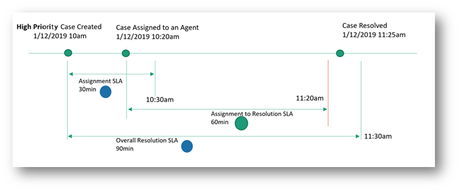
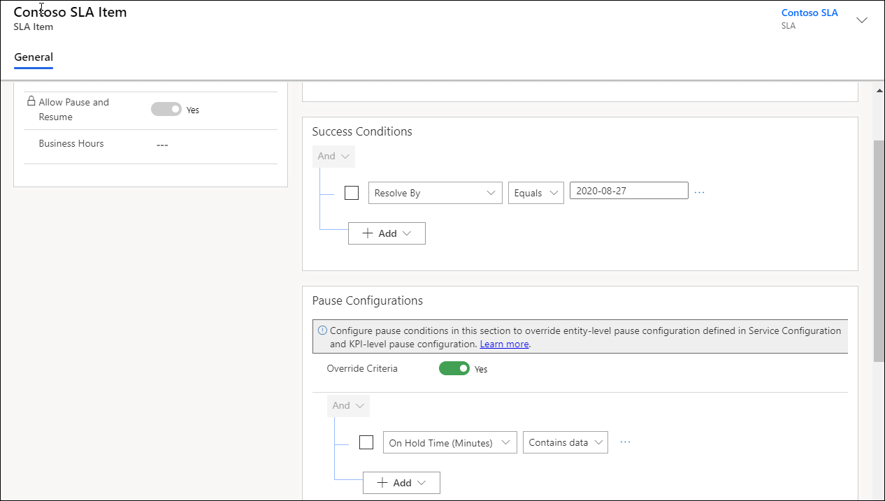
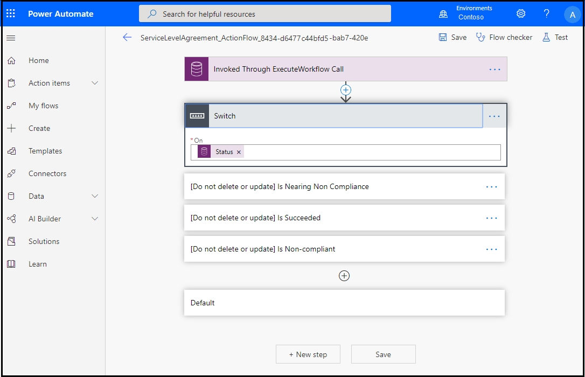
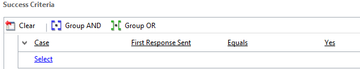

# Define service-level agreements

Define the level of service or support that your organization agrees to offer to a customer by using service-level agreements (SLAs) in Dynamics 365 Customer Service. You can include detailed items to define metrics or key performance indicators (KPIs) to attain that service level. KPIs help you get timely warnings about any issues your customer support team might be having.

You can associate an SLA with an entitlement so that when an entitlement is added to a case, the associated SLA is also applied. You can only associate SLAs that are created for the Case entity with entitlements. [!INCLUDE[proc_more_information](../includes/proc-more-information.md)] [Create an entitlement to define the support terms for a customer](create-entitlement-define-support-terms-customer.md)

Alternatively, you can set up a default SLA for the organization.  

> [!NOTE]
> With the latest release of Customer Service, you can access and manage all service management tasks from the Customer Service Hub site map except **Routing Rule Sets**, **Automatic Record Creation**, and **Service Level Agreements**. To access and manage these three settings, use **Service Management** under **Settings** in the Customer Service app.

## Configure SLAs in Customer Service Hub

With the SLA feature in Customer Service Hub, you can:

- Use out-of-the-box actions in Microsoft Power Automate.
- Define work hours, and pause and resume SLAs at the SLA KPI level and SLA item level, which helps track SLA items for different work hours based on priority and criteria. The pause settings at SLA KPI level or SLA item level gives you added flexibility to define pause conditions at a more granular level.
- In a case lifecycle, multiple SLA KPIs can be triggered at different start points. The following illustration depicts how you can define an overall resolution time, and also specify SLA KPIs at different start points.

Perform the following steps to configure SLAs in Customer Service Hub:

1. [Review prerequisites](#prerequisites).
2. [Create SLA KPIs](#create-sla-kpis).
3. [Create SLAs](#create-slas).
4. Learn [how the SLA is applied](#how-is-the-sla-applied).

## Prerequisites

Review the following requirements before configuring SLAs for your organization:

- The System Administrator, System Customizer, or Customer Service Manager role is assigned to you. Additionally, make sure that the following permissions have been granted in **Security** > **Security Roles** > **Custom Entities**:
  - **CSR Manager:**
    - **Connector:** All permissions at the business unit level.
    - **SLAKPI:** Create permission at the business unit level, delete permission at the parent-child level, and other permissions at the organization level.
    - **ProcessStageParameter:** All permissions at the business unit level.
  - **Customer Service Representative:** Read permission at the organization level for the SLAKPI entity.
- Identify target entities and add customizations. To add customizations in target entities to track SLAs, follow these steps:

   1. Create a lookup field on the entity for which an SLA has to be configured, and relate it to an SLA KPI instance. Lookup fields are created so that you can view the SLA in the timer on the entity form and track your SLAs. To learn more, see [Create and edit fields](../customerengagement/on-premises/customize/create-edit-fields.md#create-and-edit-fields).
   For example, to track an SLA on a case for "escalated by KPI", you need to create a field as **EscalatedByKPI** on the Case entity, and provide the **Data Type** as **Lookup** and **Target Record Type** as **SLA KPI Instance**.

   2. Use the lookup field to configure a timer to help users estimate the amount of time they have to complete a task—typically as specified in an SLA. 
   To configure a timer, add the timer control to an entity form. The timer control initially displays a countdown timer to show the time remaining to complete the task. To learn more, see [Add a timer control to the Case form to track time against an SLA](add-timer-control-case-form-track-time-against-sla.md).

> [!NOTE]
> In Unified Interface, the Elapsed Time and Paused On attributes of an SLA KPI Instance contain the values that are equivalent to the values in the Last Onhold Time and Onhold Time attributes of the target record, such as the case and account, in the web client.

## Create SLA KPIs in Customer Service Hub

SLA KPIs are performance indicators, such as First Response or Resolve by, that you'd like to track.

1. Sign in to Customer Service, and open the **Customer Service Hub** app.

2. Select **Change area** > **Service Management** > **SLA KPIs**.

3. Select **New**. The **New SLA KPI** page appears.

4. Enter the following details on the **General** tab:

   - **Name:** The name of the SLA KPI.

   - **Owner:** The user creating the SLA is populated by default. You can specify a different owner.

   - **Entity Name:** Select the entity for which the KPI must be measured.

   - **KPI Field:** Select the respective KPI field. For example, if you're creating an SLA KPI to define the time within which a first response should be sent to the customer, select **FirstResponseByKPI** in the list.

   - **Applicable From:** Select a value based on which the warning and failure time will be measured. For example, if you select **Created On**, the warning and failure start time for an SLA will be calculated from the date and time when the entity was created.

5. Select **Save**.

6. To define the pause criteria at the KPI level, in the **Pause Conditions** section that appears, do the following:
   1. Set the toggle to **Yes** for **Override Criteria**. If any pause settings are applied at the entity level for your org, they will be overridden by the criteria define at the KPI level. For the other KPIs, the entity level pause settings will continue to function if no pause criteria is defined at the KPI level.
   2. Select **Add** to define the conditions in which the SLA KPI can be paused.

    > [!NOTE]
    > At runtime, when you pause an SLA KPI instance and resume it, the SLA KPI instance is canceled and a new SLA KPI instance is created.

7. Select **Activate**. The SLA KPI is saved and activated.

## Create an SLA in Customer Service Hub

Create SLAs to define conditions and actions that are applicable when an SLA is applied to an entity. The following steps are involved in creating the SLA:

1. Create an SLA.
2. Create an SLA item.
3. Configure actions for the SLA item.
4. Activate the SLA.

### Create an SLA

1. In **Customer Service Hub** > **Service Management**, select **SLAs**.

2. Select **New**. The **New SLA** page appears.

3. On the **General** tab, do the following:

   - **Name:** Enter a name for the SLA.
   - **Primary Entity:** Select a value in the box.
   - **Description:** Enter a description for the SLA.

4. Select **Save**. The **SLA Items** section appears on the page, and the SLA is saved. You can perform the steps to create SLA items as described in the following section.

### Create an SLA item

1. In **Customer Service Hub** > **Service Management**, select the SLA for which you want to add an SLA item.
 
2. On the page that appears, select **New SLA Item**. The **New SLA Item** dialog box appears.

3. On the **General** tab, enter the following details.

   - **Name:** Enter a name.
   - **KPI:** Select an SLA KPI.
   - **Allow Pause and Resume:** (Optional.) Enable this option if you want the SLA to be paused during the time the record is on hold. For each entity that's enabled for the SLA, you can set each status that will be considered "on hold" in the **Service Management** > **Service Configuration Settings** page.
   - **Business Hours:** (Optional.) Select a value to assign business hours. The SLA is calculated based on the business hours and business closure that you define. More information: [Create customer service schedule and define the work hours](create-customer-service-schedule-define-work-hours.md).
  
4. In the **Applicable When** section, define the conditions for the entity when the SLA can be applied. We recommend that you don't use case fields that are updated too frequently, because any change to the field value might lead to the SLA item being canceled.

6. In the **Success Conditions** section, define the conditions that specify the success criteria of the SLA.

7. In the **Pause Configurations** section that appears only when **Allow Pause and Resume** is enabled, do the following:
   1. Set the toggle to **Yes** for **Override Criteria** to pause the SLA item. This setting overrides the pause settings defined at the entity level, if any, in Service Configuration or at the SLA KPI level.
   2. Select **Add** to define the conditions for pausing the SLA item.
    > 

8. In the **Warn and Fail Duration** section, specify the values to trigger notifications when an SLA is missed.
  > [!NOTE]
  >  The time for failure and warning is calculated after considering the business hours selected in the SLA record. If you don't set the business hours record (customer service schedule), the work hours are considered to be all day, every day.

8. Select **Save**.

### Configure actions for the SLA item

1. On the SLA page, select the SLA item, and then select **Edit SLA Item**. The SLA item page appears.

2. In the **Actions** area, select **Configure Actions**. The Power Automate application opens on a new tab where you can configure the actions and reminders for agents to keep track of their SLAs.

3. Perform the following steps in Power Automate:

   a. Accept the default settings or select the ellipsis to configure a connection.

   b. Select **Continue**. The predefined flow that's specific to the SLA appears.

     > [!NOTE]
     > We recommend that you don't edit the predefined flow, which can cause breaks in the flow, and the SLA might not work as defined.

   c. Select **Switch**. The following condition steps are displayed:

     - **Is Nearing Non-Compliance**: Will run when the warning time is reached for the SLA.
     - **Is Succeeded**: Will run when the SLA succeeds.
     - **Is Non-compliant**: Will run when the SLA fails.
      

    d. Select **[Do not delete or update] Is Nearing Non-Compliance** > **Add an action**. The **Choose an action** area appears, in which you can configure the action that must be performed when the warning time has been reached for the SLA.

      i. Search for an action to add or go to the existing entities, such as **Mail**.

      ii. Select **Send an email notification**. Update the options to define the information in the mail.

    e. Configure the actions for **Is Succeeded** and **Is Non-compliant**, as required.

    f. Save and exit Power Automate.

4. Select **Save & Close** on the SLA item dialog box.

5. Define as many SLA items as you need.

6. Select **Activate**. The SLA is activated.

## Create a standard SLA (Customer Service app)

> [!NOTE]
>
> Standard SLAs have been deprecated and replaced with enhanced SLAs.   More information: [Standard SLAs in Dynamics 365 Customer Service are deprecated](https://docs.microsoft.com/power-platform/important-changes-coming#standard-slas-in-dynamics-365-customer-service-are-deprecated)

1. [!INCLUDE[proc_permissions_custsvcmgr_sysadmin_and_customizer](../includes/proc-permissions-custsvcmgr-sysadmin-and-customizer.md)]  

     When you activate an SLA, a corresponding workflow is also created. For every action you perform on the SLA, you must have permissions to perform the same action on workflows. The SLA is applied in the context of the permissions that the owner of the SLA has.  

    **Check your security role**  

   - [!INCLUDE[proc_follow_steps_in_link](../includes/proc-follow-steps-in-link.md)]  

   - [!INCLUDE[proc_dont_have_correct_permissions](../includes/proc-dont-have-correct-permissions.md)]  

2. Go to **Settings** > **Service Management**. 

3. Go to **Service Level Agreements**.  

4. To create a new SLA, select **New** on the command bar.  

    -Or-  

    To edit an SLA, select the SLA in the list of records, and then select **Edit** on the command bar.  

5. If you're creating a new SLA, you'll see the **Create SLA** dialog box. Type a name for the SLA, and then in the **Entity** drop-down list, select **Case**.  

    You do this because you can create a standard SLA only for the Case entity.  

6. Enter your information as follows:

   - **Applicable From**. Select the case field that specifies the date and time from which the SLA items will be calculated. For example, if you select the **Created On** field, calculations will start from the time the case was created.  

       > [!NOTE]
       >  You can have multiple SLA KPIs within one SLA. The start time for different SLA KPIs within an SLA is set at the SLA level and can't be different across SLA KPIs. The start time is determined by the **Applicable From** field value.  

   - **Business Hours**. Select a customer service schedule record that defines your support organization's business hours. This is useful in the SLA time-tracking calculations. If a business hours record (customer service schedule) isn't selected, work hours are considered to be all day, every day.  

   - **SLA Type**. Select **Standard**.  

        You can select **Standard** only when the **Entity** field is set to **Case**.  

   - **Allow Pause and Resume**. Select **Do Not Allow**. Because standard SLAs don't support pausing and resuming of SLAs, you can set this field to **Allow** only when you're creating an enhanced SLA.  

7. [!INCLUDE[proc_click_or_tap_save](../includes/proc-click-or-tap-save.md)]  

8. To add SLA details, in the **SLA Details** section, select the **Add** button .  

    You add SLA details to define the KPIs or metrics for the SLA. You can define any KPI your organization needs. For example, a KPI might be that all cases for standard customers must be resolved within five days from when the case was created.  

    Define success criteria and the failure and warning actions that need to be taken when an SLA metric isn't met for a customer case.  

    SLA KPIs are performance indicators that you'd like to track, for example First Response or Resolve By. SLA items refer to SLA KPIs based on specific conditions. You can add multiple SLA items and arrange them in the order that works for you. For any given KPI, only the first SLA item that matches the conditions in the **Applicable When** section is applied.  

   > [!NOTE]
   >  In Customer Service, SLA and SLA KPIs (SLA details) use the process (workflow) functionality. Although SLA KPIs use workflows, not all of the actions available in workflows are available for defining failure and warning actions. The available actions are currently limited to **Send Email**, **Create Record**, **Update Record**, **Assign Record**, and **Change Status**. [!INCLUDE[proc_more_information](../includes/proc-more-information.md)] [Create and edit workflow processes](../customerengagement/on-premises/customize/workflow-processes.md)  

9. Enter the following information in the **New SLA Item** form:  

   - **Name**. Type a meaningful name.  

   - **Related Case Field**. Select a field of DateTime type of the case record that this SLA item refers to. For example, if you're creating a KPI for sending the first response within a specified time, select the **First Response By** option from the drop-down list. If necessary, ask your system customizer to create new fields of type DateTime.  

        When a case record is created or updated, this field is set to the date and time when the failure time will be reached for the respective SLA item. For example, select **First Response By** in **Related Case Field**, and set **Failure After** to two hours from the time the case was created. If the case was created at 09:00, the **First Response By** field in the case record will be set to 11:00, assuming the business hours are all day, every day.  

       > [!TIP]
       >  By default, there are four options available in the drop-down list. If you want to track other KPIs, ask your system customizer to create case fields of type DateTime.  

   - In the **Applicable When** section, define the conditions under which the KPI will be applied. The condition can be based on case or related entity fields.  

      For example, the conditions might be as shown in the following image.

       category equals Corporate; Case priority equals High")

     > [!NOTE]
     >  If there are multiple clauses, and you don't use AND or OR grouping, by default the clauses will use the AND grouping.  

   - In the **Success Criteria** section, specify the conditions to define when the KPI will be considered as met. For example, the condition might be as shown in the following image.

         
  

     > [!NOTE]
     >  Before you specify the failure and warning actions for the SLA, save the SLA item record.      If the conditions configured in the SLA fields conflict with each other, the SLA is canceled before it meets the success or failure criteria. For example, if the **Case Status** field is set as **Active** in the **Applicable When** section and is set as **not equal to Active** in the **Success Criteria** section, the SLA will be canceled when implemented.

   - Under **SLA Item Failure**, in the **Failure After** drop-down list, select when the SLA items will be considered as failed. For example, if you select **1 hour**, the KPI will be considered as failed if the first response isn't completed within one hour of the time the case was created. One hour is calculated based on the value in the date-time field that you select in the **Applicable From** field of the SLA record.  

   - In the **Failure Actions** section, select **Add Step**, and then specify the actions to be taken if the success criteria aren't met and the case exceeds the specified failure time. For example, to mark a case for escalation when the KPI has failed, select **Add Step** > **Update Record** > **Case** > **Set Properties**. In the case record, change the value of the **Is Escalated** field, and then close the case form.  

   - Under **SLA Item Warning**, in the **Warn After** drop-down list, select the time when a warning is to be raised that the KPI is nearing violation.  

   - In the **Warning Actions** section, select **Add Step**, and then specify the actions to be taken when the KPI reaches the time when a warning is to be raised. For example, to warn the case owner that the KPI is nearing violation, select **Add Step** > **Send Email** > **Create New Message** > **Set Properties**. In the email record, type the email details, and then close the email form.  

     > [!NOTE]
     >  The time for failure and warning is calculated after considering the business hours selected in the SLA record. If a business hours record (customer service schedule) isn't selected, the work hours are considered to be all day, every day.

     > [!IMPORTANT]
     >  Make sure that you don't have too many SLA items in an SLA, because that might negatively affect the create and update operations on the record on which the SLA is applied or reevaluated. We recommend that you have no more than 15 SLA items in an SLA record, for performance reasons.  

10. [!INCLUDE[proc_click_or_tap_save_and_close](../includes/proc-click-or-tap-save-and-close.md)]  

    > [!IMPORTANT]
    > - Failure and warning actions run asynchronously, and might not be triggered exactly at the failure or warning time.
    > - If failure or warning times are set to less than one hour, processing of the failure or warning actions might be delayed.
    > - Make sure you author SLAs in a way that best suits your company's needs. For example, in the SLA **Applicable When** conditions, we recommend that you don't use case fields that are updated too frequently, because any change to the field value might lead to the SLA item being canceled.

## Create an enhanced SLA (Customer Service app) 

1. [!INCLUDE[proc_permissions_custsvcmgr_sysadmin_and_customizer](../includes/proc-permissions-custsvcmgr-sysadmin-and-customizer.md)]  

     When you activate an SLA, a corresponding workflow is also created. For every action you perform on the SLA, you must have permissions to perform the same action on workflows. The SLA is applied in the context of the permissions that the owner of the SLA has.  

    **Check your security role**  

   - [!INCLUDE[proc_follow_steps_in_link](../includes/proc-follow-steps-in-link.md)]  

   - [!INCLUDE[proc_dont_have_correct_permissions](../includes/proc-dont-have-correct-permissions.md)]  

2. Go to **Settings** > **Service Management**.

3. Go to **Service Level Agreements**.

4. To create a new SLA, select **New**.  

    -Or-  

    To edit an SLA, select the SLA from the list of records, and then select **Edit** on the command bar.  

5. If you're creating an SLA, you'll see the **Create SLA** dialog box. Type a name for the SLA, and then select the entity for which you want to create the SLA.  

6. Enter your information as follows:

   - **Applicable From**. Select the field that specifies the date and time from which the SLA items will be calculated. For example, if you select the **Created On** field, calculations will start from the time the record was created.  

       > [!NOTE]
       >  You can have multiple SLA KPIs within one SLA. The start time for different SLA KPIs within an SLA is set at the SLA level and can't be different across SLA KPIs. The start time is determined by the **Applicable From** field value.  

   - **Business Hours**. Select a customer service schedule record that defines your support organization's business hours. This is useful for SLA time-tracking calculations. If a business hours record (customer service schedule) isn't selected, work hours are considered to be all day, every day. 

   - **SLA Type**. Select **Enhanced**.  

        If you're creating an SLA for an entity other than the Case entity, this field is automatically set to **Enhanced** and can't be changed.  

   - **Allow Pause and Resume**. Select **Allow** if you want the SLA to pause during the time the record is on hold. For each entity that's enabled for SLA, you can select each status that will be considered "on hold" by using the **Service** tab of the **System Settings** dialog box. [!INCLUDE[proc_more_information](../includes/proc-more-information.md)] [System Settings dialog box - Service tab](../admin/system-settings-dialog-box-service-tab.md)

7. [!INCLUDE[proc_click_or_tap_save](../includes/proc-click-or-tap-save.md)]  

8. In the **SLA Details** section, select **Add** .

9. Enter the following information in the SLA Item form:  

   - **Name**. Type a meaningful name.  

   - **SLA KPI**. Select the KPI the SLA item is about. For example, if you're creating a KPI for sending the first response within a specified time, select the **First Response By KPI** option from the drop-down list.  

        For example, select **First Response By KPI** in the **SLA KPI** field, and set **Failure After** to two hours from the time the record was created. If the record was created at 09:00, the **Failure Time** field of the SLA KPI Instance record is set to 11:00, assuming business hours are all day, every day.  

       > [!TIP]
       >  If you're creating an SLA for a Case entity, by default you have two options to choose from in the drop-down list. If you want to track other KPIs for a case or if you're creating the SLA for entities other than the Case entity, ask your system customizer to create new fields (of type Lookup) that refer to the SLA KPI Instance entity.  

   - In the **Applicable When** section, define the conditions under which the KPI will be applied. The condition can be based on primary entity or related entity fields.  

      For example, the conditions might be as shown in the following image.

      category equals Corporate; Case priority equals High")  

   - In the **Success Criteria** section, specify the conditions to define when the KPI will be considered as met. For example, the condition might be as shown in the following image.  

       

     > [!NOTE]
     > - Before you specify the failure and warning actions for an SLA, save the SLA item record.
     > - If the conditions configured in the SLA fields conflict with each other, the SLA is canceled before it meets the success or failure criteria. For example, if the **Case Status** field is set as **Active** in the **Applicable When** section and is set as not equal to **Active** in the **Success Criteria** section, the SLA will be canceled when implemented. 

   - In the **Success Action** section, select **Add Step**, and then specify the actions that you want the application to take when the success criteria is met before the violation time. For example, select **Add Step** > **Change Status**, and then in the first drop-down list, select **Case**, and in the next drop-down list, select **Information Provided**.

   - Under **SLA Item Failure**, in the **Failure After** drop-down list, select when the SLA items will be considered as failed. For example, if you select **1 hour**, the KPI will be considered as failed if the first response isn't completed within one hour of the time the case was created. One hour is calculated based on the value in the DateTime field that you select in the **Applicable From** field of the SLA record.  

   - In the **Failure Actions** section, select **Add Step**, and then specify the actions to be taken if the success criteria aren't met and the record exceeds the specified failure time. For example, to mark a case for escalation when the KPI has failed, select **Add Step** > **Update Record** > **Case** > **Set Properties**. Now in the case record, change the value of the **Is Escalated** field, and then close the case form.  

   - Under **SLA Item Warning**, in the **Warn After** drop-down list, select the time when a warning is to be raised that the KPI is nearing violation.  

   - In the **Warning Actions** section, select **Add Step**, and then specify the actions to be taken when the KPI reaches the warning time. For example, to warn the case owner that the KPI is nearing violation, select **Add Step** > **Send Email** > **Create New Message** > **Set Properties**. In the email record, specify the email details, and then close the email form.  

     > [!NOTE]
     >  The time for failure and warning is calculated after considering the business hours selected in the SLA record. If a business hours record (customer service schedule) isn't selected, work hours are considered to be all day, every day.  

### Samples for creating enhanced SLA KPIs

The following sample SLA KPIs for the Lead entity can help you get familiar with creating SLAs for other entities.

#### Sample 1: Contact the customer

This sample SLA KPI tracks whether the salesperson has contacted the customer within a specific timeline.  

|Applicable when|Success condition|Failure time|Failure action|Warning time|Warning action|  
|---------------------|-----------------------|------------------|--------------------|------------------|--------------------|  
|Rating = Hot|Status = Contacted|1 day|Send an escalation email to the sales manager|16 hours|Send a warning email to the salesperson|  
|Rating = Warm|Status = Contacted|2 days|Send an escalation email to the sales manager|1.5 days|Send a warning email to the salesperson|  
|Default|Status = Contacted|7 days|Send an escalation email to the sales manager|5 days|Send a warning email to the salesperson|  

#### Sample 2: Take action on a lead

This sample SLA KPI tracks whether the salesperson has taken necessary action on the lead within a specific timeline.  

|Applicable when|Success condition|Failure time|Failure action|Warning time|Warning action|  
|---------------------|-----------------------|------------------|--------------------|------------------|--------------------|  
|Rating = Hot|Status = Qualified or Disqualified|2 days|Send an escalation email to the sales manager|1.5 hours|Send a warning email to the salesperson|  
|Rating = Warm|Status = Qualified or Disqualified|5 days|Send an escalation email to the sales manager|4 days|Send a warning email to the salesperson|  
|Default|Status = Qualified or Disqualified|15 days|Send an escalation email to the sales manager|12 days|Send a warning email to the salesperson|  

> [!IMPORTANT]
> - We recommend that you not create or update SLAs by using [!INCLUDE[pn_crm_for_outlook_short](../includes/pn-crm-for-outlook-short.md)]. Use the Customer Service app for this purpose.  
> - Make sure you don't have too many SLA items in an SLA, because that might negatively affect the create and update operations on the record on which the SLA is applied or reevaluated. We recommend that you have no more than 15 SLA items in an SLA, for performance reasons. 
> - The SLA business logic relies on **SLA KPI Instance** record values, so to avoid any conflict we recommend that you not create plug-ins or processes to directly update the **SLA KPI Instance** record values.

## Set an SLA as the default

For a Case entity, set an SLA as the default if you want it to apply to all cases that don't have an SLA applied through an entitlement. This is useful when a customer wants an SLA but doesn't have an entitlement. For all other entities that are enabled for SLA, you can set one default SLA.

To set an SLA as the default, select an active SLA from the list, and then select **Set as Default** on the command bar.  

> [!NOTE]
>  If you deactivate a default SLA, you must activate it again before resetting it as the default.  

## Disable an SLA in Customer Service app

During maintenance activities or when you're importing records and you don't want the SLAs to be applied, you can disable SLAs for your organization. A system administrator can disable SLAs from the **System Settings** dialog box. [!INCLUDE[proc_more_information](../includes/proc-more-information.md)] [System Settings dialog box - Service tab](../admin/system-settings-dialog-box-service-tab.md)  

## How is an SLA applied?

When a record is created, the SLA is applied (either by default or through entitlement for the Case entity) and the related record field values are updated. When the record is modified and any of the record field values change&mdash;that is, when the fields that are added in the **Applicable When** conditions of the SLA change&mdash;the SLA is applied again. For example, if the priority of the case changes from Normal to High, and according to the SLA the first response should happen soon, the SLA is reapplied to make sure the KPIs are tracked based on the updated values.  

When the SLA is applied again, all the SLA items are evaluated based on the updated record fields, and failure or warning actions are initiated if the time has been exceeded. This happens even if the failure or warning actions were already initiated before the record was updated.  

> [!NOTE]
>  You can only have one SLA running on one record. When an entity record is updated by using a different SLA, the previously applied SLA is canceled.  

## Apply SLAs on demand

With the enhancements made to SLAs, you can now apply SLAs to records manually. You can also automatically apply SLAs to records based on your business logic by using workflows or custom plug-ins.  

For example, if your customers are spread across different countries or regions, you can have multiple SLAs with different business hours and holiday schedules. You can set up business logic to apply SLAs on case records based on the customer's country or region, to make sure that the SLA time calculation is done correctly.  

To create workflows so that SLAs will be automatically applied, talk to your customer service managers, administrator, or customizer. [!INCLUDE[proc_more_information](../includes/proc-more-information.md)] [Create and edit workflow processes](../customerengagement/on-premises/customize/workflow-processes.md)

To manually apply SLAs on demand, choose the SLA in the SLA field. This field isn't available by default on entity forms; you need to ask your system administrator to add it.  

## Track SLA status and details on the case record

The service rep who is working on a case can see the SLA details right on the case form. The following table explains what happens when a standard or enhanced SLA is applied to a case form.

| Case form with a standard SLA applied |  Case form with an enhanced SLA applied |
|-------------------------------------|--------------------------------------|
| Only the failure time is tracked and saved on the case record.   You can ask your system administrator or customizer to add a timer to the case form. The timer shows the time remaining to meet the SLA or the time elapsed since the SLA failed. [!INCLUDE[proc_more_information](../includes/proc-more-information.md)] [Add a timer control to the case form to track time against an SLA](add-timer-control-case-form-track-time-against-sla.md) | When an enhanced SLA is applied to a case, a related SLA KPI Instance record is created for each SLA KPI that is tracked for that case. In the **Enhanced SLA Details** section of the case record, you'll see a timer and the SLA KPI Instances for the case with their status, failure times, and warning times.   When a service rep puts a case on hold, the status of the SLA KPI Instance is set to Paused. You can see the time during which a case was on hold and the last time the case was put on hold. These details aren't available on the case form by default, but your system customizer can add these fields for you. The on-hold time is the time during which the case was set to a status that you defined as an On-Hold status in the **System Settings** dialog box. [!INCLUDE[proc_more_information](../includes/proc-more-information.md)] [System Settings dialog box - Service tab](../admin/system-settings-dialog-box-service-tab.md)   When the service rep resumes a case, the status of the SLA KPI Instance record is updated. The following details are updated in the record if the SLA isn't violated:   -   Failure time -   Warning time -   Total time the case has been on hold   If the service rep puts the case on hold after the warning time, the warning time isn't updated when the case is resumed. |

> [!IMPORTANT]
>  To track SLAs for entities other than the Case entity, ask your system administrator or customizer to add an enhanced SLA timer on the entity forms. [!INCLUDE[proc_more_information](../includes/proc-more-information.md)] [Add a timer to forms to track time against enhanced SLAs](add-timer-forms-track-time-against-enhanced-sla.md)  

## Export and import a solution with SLAs

You can replicate the SLA settings in another environment by exporting the solution containing the SLAs. During the export, all the related components and their dependencies will also be exported.

<!--During the export of the solution with SLAs, all the related dependencies for the SLAs are listed on the UI and selected by default. While you can explicitly choose the dependencies, we recommend that you select all the related dependencies for the SLAs to function correctly. -->

## Recommended procedure for upgrading a solution

We recommend that you perform the following steps to upgrade a solution:

1. Deactivate the SLAs that have been brought through the previous version of the solution. The status of these SLAs will change to Draft.
2. Upgrade your solution.
3. After the solution has been successfully upgraded, activate the SLAs as required.

### See also  

[Enable entities for service-level agreements](enable-entities-service-level-agreements.md)  
