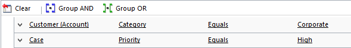

# Define Service Level Agreements (SLAs)

Define the level of service or support that your organization agrees to offer to a customer by using service level agreements (SLAs) in Dynamics 365 Customer Service. Include detailed items to define metrics or key performance indicators (KPIs) to attain the service level. KPIs help you get timely warnings on your team’s issues while providing support.  

 You can associate an SLA with an entitlement so that when an entitlement is added to a case, the associated SLA is also applied. You can associate only SLAs that are created for the Case entity with entitlements. [!INCLUDE[proc_more_information](../includes/proc-more-information.md)] [Create an entitlement to define the support terms for a customer](../customer-service/create-entitlement-define-support-terms-customer.md)  

 Alternatively, you can set up a default SLA for the organization.  

> [!NOTE]
> With the latest release of Dynamics 365 Customer Service app, you can access and manage all service management tasks from the Customer Service Hub sitemap except **Routing Rule Sets**, **Automatic Record Creation**, and **Service Level Agreements**. To access and manage these three admin settings, use **Service Management** under **Settings** in the web application.  

## Standard vs. Enhanced SLAs: What’s the difference?  
 Dynamics 365 Customer Service lets you create two types of SLAs: Standard and Enhanced.         Standard SLAs can only be created for the Case entity.         We recommend that you use enhanced SLAs, which have some additional capabilities that standard SLAs don’t have. With an enhanced SLA, you can:  

-   Create SLAs for entities other than Case.  

-   Pause an SLA when the case is on hold, so that the time the case is on hold isn’t considered in SLA calculations.  

-   Add success actions to an SLA. For example, you may want to send communications internally or outside your organization when the SLA has succeeded. Success actions are initiated only when the success condition is met on time, not when it is breached.  

-   Track SLA statuses and times on the case form by default. These details are tracked through the SLA KPI Instance record type.  

> [!NOTE]
  >  The standard SLAs have been deprecated and replaced with enhanced SLAs.
   
  More information: [Standard SLAs in Dynamics 365 Customer Service are deprecated](https://docs.microsoft.com/power-platform/important-changes-coming#standard-slas-in-dynamics-365-customer-service-are-deprecated).

## Entities (record types) that support SLA  
 In previous releases, you could create SLAs only for case records. With Dynamics 365 Customer Service, you can now create enhanced SLAs for entities that are enabled for SLA. A system administrator or customizer can enable SLAs for the following entities:  

- Account  

- Contact  

- Order  

- Invoice  

- Quote  

- Opportunity  

- Lead  

- All activity entities like email, phone, and appointment except recurring appointment and its instances  

  > [!NOTE]
  >  SLA can also be enabled for custom entities and custom activities.  

  For more information, see [Enable entities for service level agreements](../customer-service/enable-entities-service-level-agreements.md).  

## Configure SLAs in Customer Service Hub

[!INCLUDE[cc-early-access-2020w1](../includes/cc-early-access-2020w1.md)]

The SLA feature in Customer Service Hub supports the following salient features:

- Option to use the out-of-the-box actions in Microsoft Power Automate.
- Option to define work hours, pause, and resume SLAs at SLA item level that helps track SLA items for different work hours based on priority and criteria.
  
The following illustration depicts how you can define an overall resolution time, and also specify nested SLA items of shorter duration.

Perform the following steps to configure SLAs in Customer Service Hub:
-	Review prerequisites. To learn more, see Prerequisites.
-	Create SLA KPIs. To learn more, see Create SLA KPIs.
-	Create SLAs. To learn more, see Create SLAs.
-	Learn how the created SLA is applied to entity records. To learn more, see [How is the SLA is applied](define-service-level-agreements.md#how-is-the-sla-applied)

## Prerequisites

[!include[cc-beta-prerelease-disclaimer](../includes/cc-beta-prerelease-disclaimer.md)]

Review the following requirements before configuring SLAs for your organization:

- System Administrator, System Customizer, or Customer Service Manager role is assigned to you.

- Identify target entities and add customizations. To add customizations in target entities to track SLAs, follow these steps:

  a. Create a lookup field on the entity for which an SLA has to be configured, and relate it to an SLA KPI instance.
  
    Lookup fields are created so that you can view the service level agreement in the timer on the entity form and track your SLAs. To learn more, see [Create and edit fields](/on-premises/customize/create-edit-fields#create-and-edit-fields).
  
    For example, to track an SLA on case for escalated by KPI, you need to create a field as *EscalatedByByKPI* on the Case entity and provide the respective Target Record Type as Service Level Agreement Instances and Data Type as *Lookup*.

  b. Use the lookup field to configure a timer to help users estimate the amount of time they have to complete a task—typically as specified in a service level agreement.
  
    To configure a timer, add the timer control to an entity form. The timer control initially displays a countdown timer to show the time remaining to complete the task. To learn more, see [Add a timer control to the Case form to track time against an SLA](add-timer-control-case-form-track-time-against-sla.md).

## Create SLA KPIs in Customer Service Hub

[!include[cc-beta-prerelease-disclaimer](../includes/cc-beta-prerelease-disclaimer.md)]

SLA KPIs are performance indicators, such as First Response or Resolve by, that you’d like to track. 

1. Sign in to Dynamics 365 for Customer Service, and open the **Customer Service Hub** app.
2. Select **Change area** > **Service Management** > **SLA KPIs**. A list of active SLA KPIs is displayed.
3. Select New. The **New SLA KPI** page appears.
4. Enter the following details on the **General** tab:
  - **Name:** Name of the SLA KPI.
  - **Owner:** 
  - **Entity Name:** Select the entity for which the KPI must be measured.
  - **KPI Field:** Select the respective KPI field. For example, if you are creating an SLA KPI to define the time within which a first response should be sent to the customer, then select **FirstResponseByKPI** in the list.    
   - **Applicable From:** Select a value based on which the warning and failure time will be measured. For example, if you select Created On, the warning and failure start time for an SLA is calculated from the date and time when the entity was created.

5. Select **Save**, and then select **Activate**. The SLA KPI is saved and activated.

## Create an SLA in Customer Service Hub

[!include[cc-beta-prerelease-disclaimer](../includes/cc-beta-prerelease-disclaimer.md)]

Create SLAs to define conditions and actions that are applicable when an SLA is applied to an entity. The following steps are involved in creating the SLA:

1. Create an SLA
2. Create an SLA item
3. Configure actions for the SLA item
4. Activate the SLA

### Create an SLA

1. In **Customer Service Hub** > **Service Management**, select **SLAs**.
2. Select **New**. The **New SLA** page appears.
3. On the **General** tab, do the following:
   -  **Name:** Enter a name for the SLA.
   -  **Primary Entity:** Select a value in the box.
   -  **Description:** Enter a description for the SLA.
4. Select **Save**. The **SLA Items** section appears on the page, and the SLA is saved. You can perform the steps to create SLA items as mentioned in the subsequent section.

### Create an SLA item

1. In **Customer Service Hub** > **Service Management**, select the SLA for which you want to add an SLA item.
 
2. On the page that appears, select **New SLA Item**. The **New SLA Item** dialog box appears.

3. On the **General** tab, enter the following details.
   -  **Name:** Enter a name.
   -  **KPI:** Select an SLA KPI.
   -  **Allow Pause and Resume:** (Optional.) Enable this option if you want the SLA to pause during the time the record is on hold. For each entity that's enabled for the SLA, you can set the statuses that will be considered “on hold” in the **Service Management** > **Service Configuration Settings** page.
   -  **Business Hours:** (Optional.) Select a value to assign business hours. The SLA is calculated based on the business hours and business closure that you define. To learn more, see [Create customer service schedule and define the work hours](create-customer-service-schedule-define-work-hours.md).
  
4. In the **Applicable When** section, define the conditions for the entity when the SLA can be applied:
   - In the **Success Conditions** section, define the conditions that specify the success criteria of the SLA.
   - In the **Warn and Fail Duration** section, specify the values to trigger notifications when an SLA is missed.
   
5. Select **Save**. A message appears on the top stating that warning and failure actions are not set.

### Configure actions for the SLA item

1. On the SLA page, select the SLA item, and then select **Edit SLA Item**. The SLA item page appears.
2. In the **Actions** area, select **Configure Actions**. The Power Automate application opens on a new tab where you can configure the actions and reminders for agents to keep track of their SLAs.
   
3. Perform the following steps in Power Automate:
    
    a. Accept the default settings or select the ellipses to configure a connection.

    b. Select **Continue**. The predefined flow that is specific to the SLA appears.
       
      > [!NOTE] 
      > We recommend that you do not edit the predefined flow that may cause breaks in the flow and the SLA may not work as defined.
    
    c. Select **Switch**. The following condition steps are displayed:

      - **Is Nearing Non-Compliance:** Will run when the warning time is reached for the SLA.
      - **Is Succeeded:** Will run when SLA succeeds.
      - **Is Non-Compliant:** Will run when SLA fails.
      
    
    d. Select **[Do not delete or update] Is Nearing Non-Compliance** > **Add an action**. The **Choose an action** area appears in which you can configure the action that must be performed when the warning time has been reached for the SLA.

      i. Search for an action to add or go to the existing entities, such as **Mail**.
    
      ii.Select **Send an email notification**. Update the options to define the information in the mail.

    e. Configure the actions for "Is Succeeded" and "Is Non-compliant" as required.

    f. Save and exit Power Automate.

4. Select **Save & Close** on the SLA item dialog box.
5. Define as many SLA items as required.
6. Select **Activate**. The SLA is activated.

## Create a standard SLA (Customer Service app)

1. [!INCLUDE[proc_permissions_custsvcmgr_sysadmin_and_customizer](../includes/proc-permissions-custsvcmgr-sysadmin-and-customizer.md)]  

     When you activate an SLA, a corresponding workflow is also created. For every action you perform on the SLA, you must have permissions to perform the same action on workflows. The SLA is applied in context to the permissions that the owner of the SLA has.  

    #### Check your security role  

   - [!INCLUDE[proc_follow_steps_in_link](../includes/proc-follow-steps-in-link.md)]  

   - [!INCLUDE[proc_dont_have_correct_permissions](../includes/proc-dont-have-correct-permissions.md)]  

2. [!INCLUDE[proc_settings_service_management](../includes/proc-settings-service-management.md)]  

3. Go to **Service Level Agreements**.  

4. To create a new SLA, on the command bar, select the **New** button.  

    -OR-  

    To edit an SLA, in the list of records, select the SLA, and then on the command bar, select **Edit**.  

5. If you're creating a new SLA, you'll see the **Create SLA** dialog box. Type a name for the SLA, and then in the **Entity** drop-down list, select **Case**.  

    You do this because you can create a standard SLA only for the Case entity.  

6. Fill in your information:  

   - **Applicable From**. Select the case field that specifies the date and time from which the SLA items will be calculated. For example, if you select the **Created On** field, the calculations for service level agreements will start from the time the case is created.  

       > [!NOTE]
       >  You can have multiple SLA KPIs within one SLA. The start time for different SLA KPIs within an SLA is set at the SLA level and can't be different across SLA KPIs. The start time is determined by the Applicable From field value.  

   - **Business Hours**. Select a customer service schedule record that defines your support organization’s business hours. This is useful in the SLA time-tracking calculations. If a business hours record (customer service schedule) isn’t selected, the work hours are considered to be 24 x 7.  

   - **SLA Type**. Select **Standard**.  

        You can select **Standard** only when the **Entity** field is set to **Case**.  

   - **Allow Pause and Resume**. Select **Do Not Allow**. Because standard SLAs do not support pausing and resuming of SLAs, you can set this field to **Allow** only when you’re creating an enhanced SLA.  

7. [!INCLUDE[proc_click_or_tap_save](../includes/proc-click-or-tap-save.md)]  

8. To add SLA details, in the **SLA Details** section, select the **Add** button .  

    You add SLA details to define the key performance indicators (KPIs) or metrics for the service level agreement. You can define any KPI your organization needs. For example, a KPI could be that all cases for standard customers must be resolved within five days of case creation.  

    Define success criteria and the failure and warning actions that need to be taken when a service level metric isn’t met for a customer case.  

    SLA KPIs are performance indicators that you’d like to track, for example First Response or Resolve By. SLA items refer to SLA KPIs based on specific conditions. You can add multiple SLA items and arrange them in the order that works for you. For any given KPI, only the first SLA item that matches the conditions in the **Applicable When** section is applied.  

   > [!NOTE]
   >  In Dynamics 365 Customer Service, SLA and SLA KPIs (SLA details) use the process (workflow) functionality. Although SLA KPIs use workflows, not all of the actions available in workflows are available for defining the failure and warning actions. The available actions are currently limited to **Send Email**, **Create Record**, **Update Record**, **Assign Record**, and **Change Status**. [!INCLUDE[proc_more_information](../includes/proc-more-information.md)] [Create and edit workflow processes](../customerengagement/on-premises/customize/workflow-processes.md)  

9. Fill in the information in the New SLA Item form:  

   - **Name**. Type a meaningful name.  

   - **Related Case Field**. Select a field of DateTime type of the case record that this SLA item refers to. For example, if you are creating a KPI for sending the first response within a specified time, select the **First Response By** option from the drop-down list. If necessary, ask your system customizer to create new fields of type DateTime.  

        When a case record is created or updated, in the case record this field is set to the date and time when the failure time will be reached for the respective SLA item. For example, select **First Response By** in **Related Case Field**, and set **Failure After** to 2 hours from case creation. If the case is created at 09:00, the **First Response By** field in the case record will be set to 11:00, assuming the business hours are 24 x 7.  

       > [!TIP]
       >  By default, there are four options available in the drop-down list. If you want to track other KPIs, ask your system customizer to create case fields of type date-time.  

   - In the **Applicable When** section, define the conditions under which the KPI will be applicable. The condition can be based on case or related entity fields.  

      For example, the conditions could be as shown here.  

        

     > [!NOTE]
     >  If there are multiple clauses, and you don’t use AND or OR grouping, by default the clauses will use the AND grouping.  

   - In the **Success Criteria** section, specify the conditions to define when the KPI will be considered as met. For example, the conditions could be as shown here.  

       

     > [!NOTE]
     >  Before you specify the SLA failure and warning actions, save the SLA item record.      If the conditions configured in the SLA fields are conflicting, then the SLA is canceled before meeting the success or failure criteria. For example, if the **Case Status** field is set as **Active** in the **Applicable When** section and is set as **not equal to Active** in the **Success Criteria** section, then the SLA will be canceled when implemented.

   - Under **SLA Item Failure**, in the **Failure After** drop-down list, select when the SLA items will be considered as failed. For example, if you select **1 hour**, the KPI will be considered as failed if the first response is not done within 1 hour of case creation. 1 hour is calculated based on the value in date/time field that you select in the **Applicable From** field of the SLA record.  

   - In the **Failure Actions** section, select **Add Step**, and then specify the actions that will be taken when the success criteria isn’t met and the case has exceeded the specified failure time. For example, to mark the case for escalation when the KPI has failed, select **Add Step** > **Update Record**. Then select **Case** and select **Set Properties**. Now in the case record, change the value of the **Is Escalated** field, and then close the case form.  

   - Under **SLA Item Warning**, in the **Warn After** drop-down list, select when a warning is to be raised for the KPI nearing violation.  

   - In the **Warning Actions** section, select **Add Step**, and then specify the actions to be taken when the KPI reaches the warning time. For example, to warn the case owner about the KPI nearing violation, select **Add Step** > **Send Email**. Then select **Create New Message** and select **Set Properties**. Now in the email record, type the email details, and then close the email form.  

     > [!NOTE]
     >  The time for failure and warning is calculated after considering the business hours selected in the SLA record. If a business hours record (customer service schedule) isn’t selected, the work hours are considered to be 24 x 7.  

     > [!IMPORTANT]
     >  Make sure that you don't have too many SLA Items in an SLA, because that can directly impact the create and update operations on the record on which the SLA is applied or re-evaluated. We recommend  you not have more than 15 SLA items in an SLA record for performance reasons.  

10. [!INCLUDE[proc_click_or_tap_save_and_close](../includes/proc-click-or-tap-save-and-close.md)]  

    > [!IMPORTANT]
    > - The failure and warning actions run asynchronously and may not get triggered exactly at the failure or warning time.  
    > - If the failure or warning times are set to less than 1 hour, processing of failure or warning actions may be delayed.  
    > - Make sure you author the SLAs in a best way suited to your company’s needs. For example, in the SLA **Applicable When** conditions, avoid using case fields that are updated too frequently, because that may lead to frequent SLA computation and impact performance.  

## Create an enhanced SLA  

1. [!INCLUDE[proc_permissions_custsvcmgr_sysadmin_and_customizer](../includes/proc-permissions-custsvcmgr-sysadmin-and-customizer.md)]  

     When you activate an SLA, a corresponding workflow is also created. For every action you perform on the SLA, you must have permissions to perform the same action on workflows. The SLA is applied in context to the permissions that the owner of the SLA has.  

    #### Check your security role  

   - [!INCLUDE[proc_follow_steps_in_link](../includes/proc-follow-steps-in-link.md)]  

   - [!INCLUDE[proc_dont_have_correct_permissions](../includes/proc-dont-have-correct-permissions.md)]  

2. [!INCLUDE[proc_settings_service_management](../includes/proc-settings-service-management.md)]  

3. Go to **Service Level Agreements**.  

4. To create a new SLA, select the **New** button.  

    -OR-  

    To edit an SLA, in the list of records, select the SLA, and then on the command bar, select **Edit**.  

5. If you're creating a new SLA, you'll see the **Create SLA** dialog box. Type a name for the SLA, and then select the entity for which you want to create the SLA.  

6. Fill in your information  

   - **Applicable From**. Select the field that specifies the date and time from which the SLA items will be calculated. For example, if you select the **Created On** field, the calculations for service level agreements will start from the time the record is created.  

       > [!NOTE]
       >  You can have multiple SLA KPIs within one SLA. The start time for different SLA KPIs within an SLA is set at the SLA level and can't be different across SLA KPIs. The start time is determined by the Applicable From field value.  

   - **Business Hours**. Select a customer service schedule record that defines your support organization’s business hours. This is useful in the SLA time-tracking calculations. If a business hours record (customer service schedule) isn’t selected, the work hours are considered to be 24 x 7.  

   - **SLA Type**. Select **Enhanced**.  

        If you're creating an SLA for an entity other than Case,, this field is automatically set to **Enhanced**, and can't be changed.  

   - **Allow Pause and Resume**. Select **Allow** if you want the SLA to pause during the time the record is on hold. For each entity that's enabled for SLA, you can set the statuses that will be considered “on hold” in the **Service** tab of System Settings dialog box. [!INCLUDE[proc_more_information](../includes/proc-more-information.md)] [System Settings dialog box - Service tab](../admin/system-settings-dialog-box-service-tab.md). You can set this field to **Allow** only when you’re creating an enhanced SLA.  

7. [!INCLUDE[proc_click_or_tap_save](../includes/proc-click-or-tap-save.md)]  

8. To add SLA details, in the **SLA Details** section, select the **Add** button .  

9. Fill in your information in the SLA Item form:  

   - **Name**. Type a meaningful name.  

   - **SLA KPI**. Select the key performance indicator the SLA item is about. For example, if you are creating a KPI for sending the first response within a specified time, select the **First Response By KPI** option from the drop-down list.  

        For example, select **First Response By KPI** in the **SLA KPI** field, and set **Failure After** to 2 hours from record creation. If the record is created at 09:00, the **Failure Time** field of the SLA KPI Instance record is set to 11:00 assuming the business hours are 24 x 7.  

       > [!TIP]
       >  If you're creating an SLA for a Case entity, by default, there are two options available in the drop-down list. If you want to track other KPIs      for Case or if you're creating the SLA for entities other than Case, ask your system customizer to create new fields (of type lookup) that refer to the SLA KPI Instance entity.  

   - In the **Applicable When** section, define the conditions under which the KPI will be applicable. The condition can be based on primary entity or related entity fields.  

      For example, the conditions could be as follows.  

       

   - In the **Success Criteria** section, specify the conditions to define when the KPI will be considered as met. For example, the conditions could be as follows.  

       

     > [!NOTE]
     >  Before you specify the SLA failure and warning details, save the SLA item record.
      
      
     >  If the conditions configured in the SLA fields are conflicting, then the SLA is canceled before meeting the success or failure criteria. For example, if the **Case Status** field is set as **Active** in the **Applicable When** section and is set as not equal to **Active** in the **Success Criteria** section, then the SLA will be canceled when implemented. 

   - In the **Success Action** section, select **Add Step**, and then specify the actions that you want the application to take when the success criteria is met before the violation time. For example, select **Add Step** > **Change Status**. Then, in the first drop-down list, select **Case**, and in the next drop-down list, select **Information Provided**. This option is available only if you’re creating enhanced SLAs.  

   - Under **SLA Item Failure**, in the **Failure After** drop-down list, select when the SLA items will be considered as failed. For example, if you select **1 hour**, the KPI will be considered as failed if the first response is not done within 1 hour of case creation. 1 hour is calculated based on the value in date/time field that you select in the **Applicable From** field of the SLA record.  

   - In the **Failure Actions** section, select **Add Step**, and then specify the actions that will be taken when the success criteria are not met and the                      record                     has exceeded the specified failure time. For example, to mark                      a                     case for escalation when the KPI has failed, select **Add Step** > **Update Record**. Then select **Case** and select **Set Properties**. Now in the case record, change the value of the **Is Escalated** field, and then close the case form.  

   - Under **SLA Item Warning**, in the **Warn After** drop-down list, select when a warning is to be raised for the KPI nearing violation.  

   - In the **Warning Actions** section, select **Add Step**, and then specify the actions to be taken when the KPI reaches the warning time. For example, to warn the case owner about the KPI nearing violation, select **Add Step** > **Send Email**. Then select **Create New Message** and select **Set Properties**. In the email record, specify the email details, and then close the email form.  

     > [!NOTE]
     >  The time for failure and warning is calculated after considering the business hours selected in the SLA record. If a business hours record (customer service schedule) isn’t selected, the work hours are considered to be 24 x 7.  

   To help you get started with creating SLAs for other entities, here are a couple of sample SLA KPIs for the lead entity.  

   SLA KPI 1: Contact the customer (tracks if the salesperson has contacted the customer within the specific timeline)  

|Applicable when|Success condition|Failure time|Failure action|Warning time|Warning action|  
|---------------------|-----------------------|------------------|--------------------|------------------|--------------------|  
|Rating = Hot|Status = Contacted|1 day|Send an escalation email to the sales manager|16 hours|Send a warning email to the salesperson|  
|Rating = Warm|Status = Contacted|2 days|Send an escalation email to the sales manager|1.5 days|Send a warning email to the salesperson|  
|Default|Status = Contacted|7 days|Send an escalation email to the sales manager|5 days|Send a warning email to the salesperson|  

 SLA KPI 2: Action on lead (tracks if the salesperson has taken necessary action on the lead within specific timeline)  

|Applicable when|Success condition|Failure time|Failure action|Warning time|Warning action|  
|---------------------|-----------------------|------------------|--------------------|------------------|--------------------|  
|Rating = Hot|Status = Qualified or Disqualified|2 days|Send an escalation email to the sales manager|1.5 hours|Send a warning email to the salesperson|  
|Rating = Warm|Status = Qualified or Disqualified|5 days|Send an escalation email to the sales manager|4 days|Send a warning email to the salesperson|  
|Default|Status = Qualified or Disqualified|15 days|Send an escalation email to the sales manager|12 days|Send a warning email to the salesperson|  

> [!IMPORTANT]
> - We do not recommend creating or updating SLAs by using [!INCLUDE[pn_crm_for_outlook_short](../includes/pn-crm-for-outlook-short.md)]. Use the Dynamics 365 Customer Service app for this purpose.  
> - Make sure that you don't have too many SLA Items in an SLA, because that can directly impact the create and update operations on the record on which the SLA is applied or re-evaluated. We recommend  you not have more than 15 SLA items in an SLA record for performance reasons. 
> - The SLA business logic relies on SLA KPI Instance record values, so it is not recommended to create plugins or processes to directly update the SLA KPI Instance record values to avoid any conflict. 

## Set the SLA as default  
 For case entity, make an SLA a default one if you want it to apply to all the cases that don’t have an SLA applied through an entitlement. This is useful when a customer wants a service level agreement without an entitlement.  

 For all other entities, select a default SLA. You can have one default SLA for each entity that is enabled for SLA.  

 To set an SLA as the default, select an active SLA from the list, and then select **Set as Default** on the command bar.  

> [!NOTE]
>  If you deactivate a default SLA, you must activate it again before resetting it as the default.  

## Disable the SLA  
 During maintenance activities or when you’re importing records and you don’t want the SLAs to apply, you can disable SLAs for the organization. A system administrator can disable SLAs from the System Settings. [!INCLUDE[proc_more_information](../includes/proc-more-information.md)] [System Settings dialog box - Service tab](../admin/system-settings-dialog-box-service-tab.md)  

## How is the SLA applied?  
 When a record is created, the SLA is applied (default or through entitlement for the Case entity) and the related record field values are updated. When the record is modified and any of the record field values change, that is, when the fields that are added in the **Applicable When** conditions of the SLA change, the SLA is applied again. For example, if the priority of the case changes from Normal to High, and according to the SLA the first response should happen soon, the SLA is reapplied to make sure the KPIs are tracked based on the updated values.  

 When the SLA is applied again, all the SLA items are evaluated based on the updated record fields and the failure or warning actions are initiated if the time has been exceeded. This happens even if the failure or warning actions were already initiated before the record was updated.  

> [!NOTE]
>  You can only have one SLA running on one record. When an entity record is updated with a different SLA, the previously applied SLA is canceled.  

## Apply SLA on demand  
 With the enhancements made to SLAs, you can now apply SLAs to records manually. You can also automatically apply SLAs to records based on your business logic (using workflows or custom plug-ins).  

 For example, if your customers are spread across geographies, you can have multiple SLAs with different business hours and holiday schedules for different geographies. You can set up business logic to apply SLAs on case records based on the customer's region to make sure that the SLA time calculation happens based on the correct geography.  

 To create workflows so SLAs are automatically applied, talk to your customer service managers, administrator, or customizer. [!INCLUDE[proc_more_information](../includes/proc-more-information.md)] [Create and edit workflow processes](../customerengagement/on-premises/customize/workflow-processes.md)

 To apply SLAs on-demand manually, choose the SLA in the SLA field. This field is not available by default on entity forms. Ask your system administrator to add the field on the entity form.  

## Track SLA status and details on the case record  
 The CSR working on a case can see the SLA details right on the case form.  

 The following table explains what happens when a standard or enhanced SLA applies to a case form.  

|                                                                                                                                                                                                                         Case form with standard SLA applied                                                                                                                                                                                                                         |                                                                                                                                                                                                                                                                                                                                                                                                                                                                                                                                                                                                                                                                                       Case form with enhanced SLA applied                                                                                                                                                                                                                                                                                                                                                                                                                                                                                                                                                                                                                                                                                       |
|-------------------------------------------------------------------------------------------------------------------------------------------------------------------------------------------------------------------------------------------------------------------------------------------------------------------------------------------------------------------------------------------------------------------------------------------------------------------------------------|-----------------------------------------------------------------------------------------------------------------------------------------------------------------------------------------------------------------------------------------------------------------------------------------------------------------------------------------------------------------------------------------------------------------------------------------------------------------------------------------------------------------------------------------------------------------------------------------------------------------------------------------------------------------------------------------------------------------------------------------------------------------------------------------------------------------------------------------------------------------------------------------------------------------------------------------------------------------------------------------------------------------------------------------------------------------------------------------------------------------------------------------------------------------------------------------------------------------------------------------------------------------------------------------------------------------------------------------------------------------------------------------------------------------|
| Only the failure time is tracked and saved on the case record.   You can ask your system administrator or customizer to add a timer to the case form. The timer shows the time remaining to meet the SLA or the time elapsed since the SLA failed. [!INCLUDE[proc_more_information](../includes/proc-more-information.md)] [Add a timer control to the Case form to track time against an SLA](../customer-service/add-timer-control-case-form-track-time-against-sla.md) | When an enhanced SLA is applied to a case, a related SLA KPI Instance record is created for each SLA KPI that is tracked for that case. In the **Enhanced SLA Details** section of the case record, you’ll see a timer and also the SLA KPI instances for the case with their statuses and failure and warning times.   When a service rep puts a case on hold, the status of the SLA KPI Instance is set to Paused. You can see the time for which a case was on hold and the last time the case was put on hold. These details are not available on the case form by default, but your system customizer can add these fields on the case form for you. The on hold time is the time for which the case was set to a status that you defined as an On-Hold status in the System settings dialog box. [!INCLUDE[proc_more_information](../includes/proc-more-information.md)] [System Settings dialog box - Service tab](../admin/system-settings-dialog-box-service-tab.md)   When the service rep resumes a case, the status of the SLA KPI Instance record is updated. The following details are updated in the record if the SLA isn’t violated:   -   Failure time -   Warning time -   Total time the case is on hold   If the service rep puts the case on hold after the warning time, then the warning time isn’t updated when the case is resumed. |

> [!IMPORTANT]
>  To track SLAs for entities other than case, ask your system administrator or customizer to add an enhanced SLA timer on the entity forms. [!INCLUDE[proc_more_information](../includes/proc-more-information.md)] [Add a timer to forms to track time against enhanced SLAs](../customer-service/add-timer-forms-track-time-against-enhanced-sla.md)  

## Recommendation to upgrade solution

Perform the following steps before you upgrade a solution:

1.	Deactivate the SLAs which are brought through the previous version of the solution. The state of SLAs changes to draft.

2.	Upgrade your solution as required. 

3.	After the successful upgrade of the solution, activate the SLAs as required.

### See also  

[Enable entities for service level agreements](enable-entities-service-level-agreements.md)
