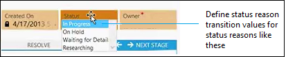
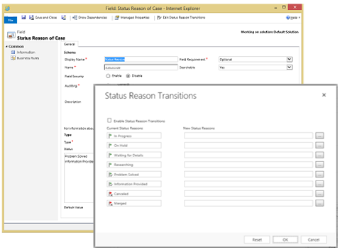

# Define status reason transitions for case management

If you’re in charge of incident management for an organization, it’s important to provide a simple model for customer service representatives responsible for entering and updating case status. In Dynamics 365 Customer Service, there are two fields in the Case entity (record type) that work together to provide information about case status: the **Status** field and the **Status Reason** field. The **Status** field for the **Case** entity has three possible values: **Active**, **Resolved**, or **Canceled**. The **Status Reason** field stores a reason for a specific status value. For example, for a case with an **Active** status, a status reason could be **In Progress**, **On Hold**, **Waiting for Details**, or **Researching**.  

 Big organizations often have a large number of combinations for the **Status** and **Status Reason** fields. This can make it difficult for customer service reps to choose the correct next status reason. You can define status reason transitions to add another level of filtering for what the status reason value can be changed to for each status reason. Limiting these values to just allowed status reasons can help customer service representatives make the right choices.  
  
   
  
1. [!INCLUDE[proc_permissions_system_admin_and_customizer](../includes/proc-permissions-system-admin-and-customizer.md)]  
  
2. [!INCLUDE[proc_settings_customization](../includes/proc-settings-customization.md)]  
  
3. Click **Customize the System**.  
  
4. In the solution explorer, in the left navigation pane, expand **Entities**, expand the **Case** entity, and then double-click **Fields**.  
  
5. Go to the second page of fields, and then open the **statuscode** (Status Reason of Case) field.  
  
6. In the **Field: Status Reason** dialog box, click **Edit Status Reason Transitions** at the top of the dialog box.  
  
     
  
7. In the **Status Reason Transitions** dialog box, under **New Status Reasons**, click one of the **Enter Value** buttons  corresponding with one of the existing status reasons.  
  
8. In the **Select Status Reason** dialog box, in the **Available Values** list, select the values you want to add, and then click the chevron button  to add to the **Selected Values** list. Click **OK** when you’re done with that status reason.  
  
9. Click another **Enter Value** button  to modify other status reasons. When you’re done, click **OK**.  
  
    > [!NOTE]
    >  Each status reason option for an active status must allow at least one path to an inactive status. Otherwise, you could create a condition where it would not be possible to resolve or cancel a case.  
  
10. In the **Status Reason Transitions** dialog box, select the **Enable Status Reason Transitions** check box to apply the defined status reason transitions to case records. The list of available status reasons will be filtered for each case record based on the defined transitions.  
  
### See also  
 [Define status reason transitions](../customerengagement/on-premises/customize/define-status-reason-transitions.md)   
 [Create or edit entity fields](../customerengagement/on-premises/customize/create-edit-fields.md)

[!INCLUDE[footer-include](../includes/footer-banner.md)]