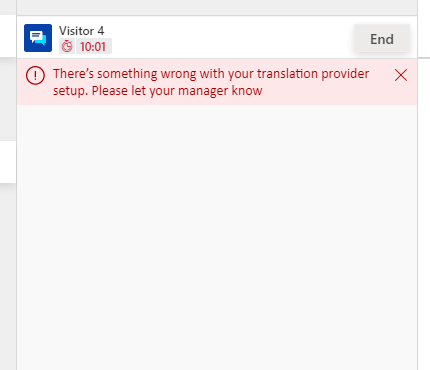

# initializeNewConversation

[!INCLUDE[cc-use-with-omnichannel](../../../../includes/cc-use-with-omnichannel.md)]

This method is required to be implemented in web resource. It is called once, as soon as a new conversation invitation is accepted or an existing conversation is opened from Agent Dashboard. 

1. You can choose to turn off or turn on the translation for a particular conversation using certain conditions; for example, you would like to turn the translation on if the agent and customer languages are different. 
2. You can also override the agent's language to be used in translation for the conversation. 
3. It provides you information about the conversation to take certain decisions, for example, the translation API engine that should be used for a conversation. 

> [!IMPORTANT]
> See this [sample web resource](https://github.com/microsoft/Dynamics365-Apps-Samples/blob/06e9c84263bac81e7411f95365c5e792aca15122/customer-service/omnichannel/real-time-translation/webResourceV2.js#L212) for more information on how to implement the `initializeNewConversation` API.

## Syntax

`function (conversationConfig): Object`

## Parameters

|Name|Required|Type|Description|
|----|----|----|----|
|`conversationConfig`|Yes| Javascript object| Provides details about conversation. Such as conversation id, default agent input language (From Real-time translation administrator configuration) etc. <br /> More details are available in the following paragraphs.|

Here is the structure of `conversationConfig` parameter.

```json
interface InviteParams {// Parameters received on a conversation invite 
        inviteLocale: string;  //Language locale of the channel from where conversation is received. This contains locale ID, example- "1033" for english.
        channelType: string;   //The type of the channel, example- "lcw" for chat widget, "facebook" for facebook.
} 


interface conversationConfig { 
        conversationId: string,  // Unique Id for conversation in Omnichannel for Customer Service
        c1Language: string;      // Default agent input language (From Real time translation administrator configuration)
        inviteParams: InviteParams;  // Implements InviteParams interface, Represents the parameters received on a conversation invite  
}
```
The `inviteLocale` parameter in `InviteParams` interface represents a Locale ID. More information: [Locale ID](https://docs.microsoft.com/openspecs/office_standards/ms-oe376/6c085406-a698-4e12-9d4d-c3b0ee3dbc4a).

The `channelType` parameter in `InviteParams` interface represents a supported channel in Omnichannel for Customer Service. The channels are listed as follows.

|Name|Description|
|----|----|
|`"lcw"`|For Live Chat Widget channel| 
|`"sms"`|For SMS channel| 
|`"facebook"`|For Facebook channel| 
|`"twitter"`|For Twitter channel| 
|`"custom"`|For custom made channel| 
|`"wechat"`|For WeChat channel| 
|`"whatsapp"`|For WhatsApp channel| 
|`"msteams"`|For Microsoft Teams channel| 
|`"line"`|For Line channel| 
|`"phonecall"`|For phone call channel| 


A sample of the `conversationConfig` parameter is as follows.

```json
conversationConfig = {
  "conversationId": "2f67af9e-c05a-4784-aaea-916d6938fcea",
  "c1Language": "1033",
  "inviteParams": {
    "inviteLocale": "3082",
    "channelType": "lcw"
  }
}
```

## Return Value

Returns a promise that resolves to the following Javascript object.

```
{
        keepTranslationOn: boolean;// mandatory field, if true the translation would be turned on for the conversation and vice-versa
        c1Language?: string;// optional field, return the agent's language if input param conversationConfig.c1Language needs to be overriden for the conversation
}
```
The `c1Language` parameter in resolved Javascript object represents a Locale ID only from the following list.

|Locale ID|Language|
|----|----|
|`"1033"`|English|
|`"1025"`|Arabic|
|`"1069"`|Basque|
|`"1027"`|Catalan|
|`"1026"`|Bulgarian|
|`"1050"`|Croatian|
|`"1029"`|Czech|
|`"1030"`|Danish|
|`"1043"`|Dutch|
|`"1061"`|Estonian|
|`"1035"`|Finnish|
|`"1036"`|French|
|`"1110"`|Galician|
|`"1031"`|German|
|`"1032"`|Greek|
|`"1037"`|Hebrew|
|`"1081"`|Hindi|
|`"1038"`|Hungarian|
|`"1040"`|Italian|
|`"1057"`|Indonesian|
|`"1041"`|Japanese|
|`"1087"`|Kazakh|
|`"1042"`|Korean|
|`"1062"`|Latvian|
|`"1063"`|Lithuanian|
|`"1086"`|Malay|
|`"1044"`|Norwegian Bokmal|
|`"1045"`|Polish|
|`"1046"`|Portuguese - Brazil|
|`"2070"`|Portuguese - Portugal|
|`"1048"`|Romanian|
|`"1049"`|Russian|
|`"3098"`|Serbian (Cyrillic)|
|`"2074"`|Serbian (Latin)|
|`"1051"`|Slovak|
|`"1060"`|Slovenian|
|`"3082"`|Spanish|
|`"1053"`|Swedish|
|`"1054"`|Thai|
|`"1055"`|Turkish|
|`"1058"`|Ukrainian|
|`"1066"`|Vietnamese|
|`"2052"`|Chinese - China|  
|`"3076"`|Chinese - Hong Kong|
||

**Sample expected response**

```json
{

  "keepTranslationOn": true,
  "c1Language": "1033"

}
```

## Additional Information

- On exception in this method or invalid return values, Omnichannel for Customer Service will keep translation off for the conversation. For example: if resolved Javascript object from the returned promise does not contains `keepTranslationOn` field or `c1Language` field contains a value that is not from list of Locale IDs, the conversation will start with translation turned off.

- Consider including minimal processing in this function because it makes the UI wait before rendering. If the run time of this function exceeds 30 seconds, the conversation will start with translation turned off, irrespective of the values of the returned promise.

- If this method is not implemented, the following error will be displayed to the agent.



### See also

[Add a web resource for real-time translation](../../../add-web-resource-real-time-translation.md)  
