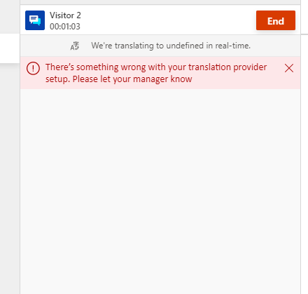

# translateMessage

[!INCLUDE[cc-use-with-omnichannel](../../../../includes/cc-use-with-omnichannel.md)]

This method is required to be implemented in web resource. This method is called for every conversation message exchanged between the customer and the agent, if translation is on and if the message has not been translated earlier in the conversation for the destination language.

> [!IMPORTANT]
> See this [sample web resource](https://github.com/microsoft/Dynamics365-Apps-Samples/blob/06e9c84263bac81e7411f95365c5e792aca15122/customer-service/omnichannel/real-time-translation/webResourceV2.js#L279) for more information on how to implement the `translateMessage` API.

## Syntax

`function (conversationId, translationConfig): Object`

## Parameters

|Name|Type|Description|
|----|----|----|
|`translationConfig`|Javascript object| Consists of `conversationId`, `messagePayload` and `translateToC1orC2` key-value pairs.|

Here is the structure of `translationConfig` parameter.

```json

export class UserType { 
        public static readonly C1 = "Agent"; //Used if the sender of the message is agent
        public static readonly C2 = "Customer"; //Used if the sender of the message is customer
        public static readonly CONSULT = "Consult Agent"; //Used if the sender of the message is other than agent or customer
} 
 
export class TranslateTo { 
        public static readonly C1 = "Agent"; //Used if message is translated for agent
        public static readonly C2 = "Customer"; //Used if message is translated for customer
} 
 
export class MessageContentType { 
        public static readonly Text = "Text"; //Used if the content type is text
} 
     
interface Sender { 
        userType: UserType;  //Points to any static field in UserType type,Represents the type of the user who is sending this message
} 

interface MessagePayload { 
        content: string;                 //Contains the content to be translated
        contentType: MessageContentType;  //Points to any static field in MessageContentType type,Represents the type of message content. For example: "Text" etc.
        sender: Sender; //Implements Sender interface, Represents the sender of the message
} 

interface translationConfig { 
        conversationId: string;   //Unique Id for conversation in Omnichannel for Customer Service
        messagePayload: MessagePayload;  //Implements MessagePayload interface, Represents the payload for the message to be translated
        translateToC1orC2: TranslateTo;   //Points to any static field in TranslateTo type,Represents for whom the message has to be translated 
 } 
```

Given below is a sample of the `conversationConfig` parameter.

```json
translationConfig = {
  "conversationId": "2b330c52-6844-4d36-8e05-03c78c9681dc",
  "messagePayload": {
    "content": "Hello",
    "contentType": "Text",
    "sender": {
      "userType": "Agent"
    }
  },
  "translateToC1orC2": "Customer"
}
```

## Return Value

Returns a promise that resolves to a Javascript object implementing `TranslatedMessageResponse` interface.

**Interface object**

```
export interface ErrorObject{ 
        isError: boolean; //mandatory field, represents true for error while executing this function else no
        errorCode: ErrorCodes; //mandatory field, represents the type of error based on errorCode
} 

export interface TranslatedMessageResponse { 
        translatedMessage: string;  //mandatory field, Contains the translated message
        sourceLanguage: string;       //mandatory field, represents the language locale of the original content 
        destinationLanguage: string;  //mandatory field, represents the language locale of the translated content
        errorObject?: ErrorObject;  //optional field, represents the error object for any error scenarios
}
```

The `errorCode` parameter in `ErrorObject` represents the errors only from the following list.

|Error message|Error code|Description|
|-----|-----|-----|
|MESSAGE_TOO_LONG|100|Error code for very long message which the translation service cannot translate|
|LANGUAGE_NOT_SUPPORTED|101|Error Code for language not supported by the translation service|
|MESSAGE_NOT_TRANSLATED|102|Error Code for message not translated by the translation service|
|TRANSLATION_SERVICE_LIMIT_EXCEEDED|103|Error code if the quota limit exceeded for the translation service|
|TRANSLATION_FAILED|104|Error Code if the translation service failed to translate a message|
|UNRECOGNIZED_TEXT|105|Error Code if the text is not recognized by the translation service|
|UNRECOGNIZED_ERROR|200|Error Code if there is any error other than the listed one.|
||||

The `sourceLanguage` and `destinationLanguage` parameter in `TranslatedMessageResponse` interface represents a Locale ID. More information: [Locale ID](https://docs.microsoft.com/openspecs/office_standards/ms-oe376/6c085406-a698-4e12-9d4d-c3b0ee3dbc4a).

**Sample response**

```json
{
  "translatedMessage": "Hola",
  "destinationLanguage": "3082",
  "errorObject": {
    "isError": false,                             
    "errorCode": null
  },
  "sourceLanguage": "3082"
}
```

## Additional Information

1. In case of an exception during execution of this method, Omnichannel for Customer Service will not retry and instead will display a translation failed error message.
2. Error while executing this method can be notified via `errorObject`. In case of an error, Omnichannel for Customer Service will not retry and instead will display the error message based on the provided error codes.
3. In case the returned response is invalid or incomplete, an error message on the translation banner will appear in the conversation control.
4. If this method is not implemented, then the message will not be translated and the following error message will be displayed to the agent.



### See also

[Add a web resource for real-time translation](../../../add-web-resource-real-time-translation.md)
