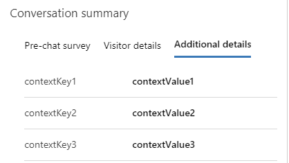

# Display custom context

[!INCLUDE[cc-use-with-omnichannel](../includes/cc-use-with-omnichannel.md)]

To display the context variables in the Conversation Summary Control for a conversation on the UI, make sure that you include `isDisplayable` attribute in the body of [setContextProvider](developer/reference/methods/setContextProvider.md) method and set its value to `true`. If the value of `isDisplayable` attribute is set to `true`, the context variables will appear as shown below.

For more information, see [setContextProvider method](developer/reference/methods/setContextProvider.md) and [Conversation summary](oc-customer-summary.md#conversation-summary).

### See also

[Manage custom context](send-context-starting-chat.md) 
[setContextProvider](developer/reference/methods/setContextProvider.md)

[!INCLUDE[footer-include](../includes/footer-banner.md)]