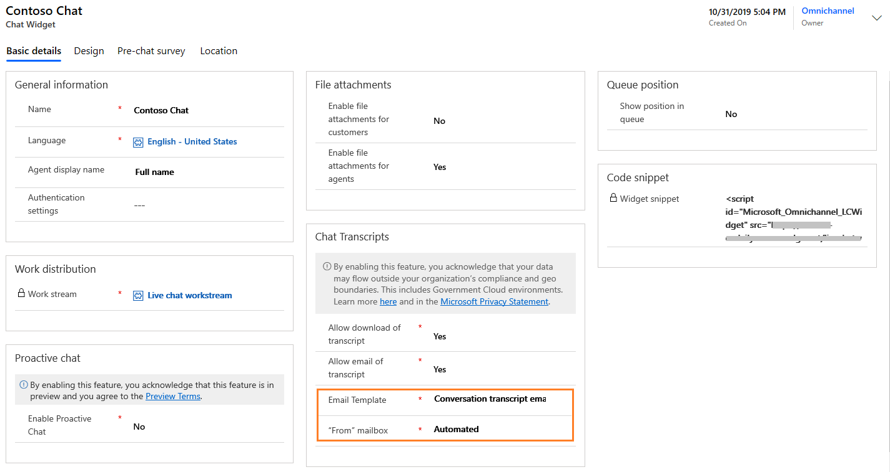
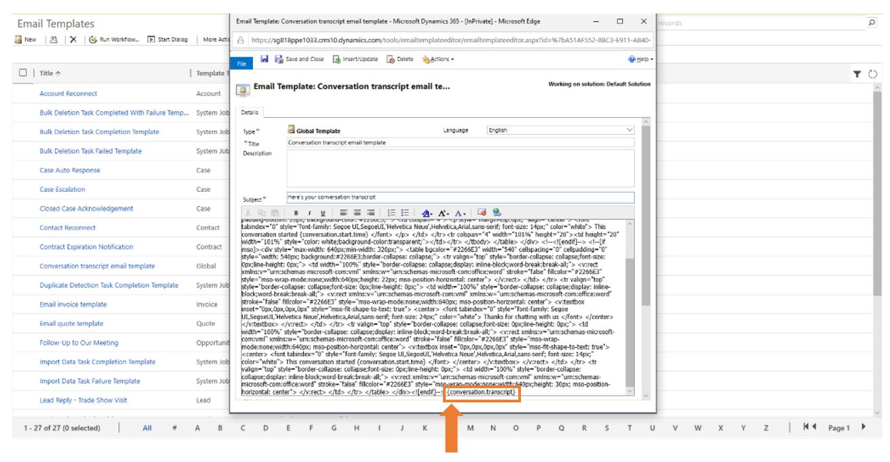
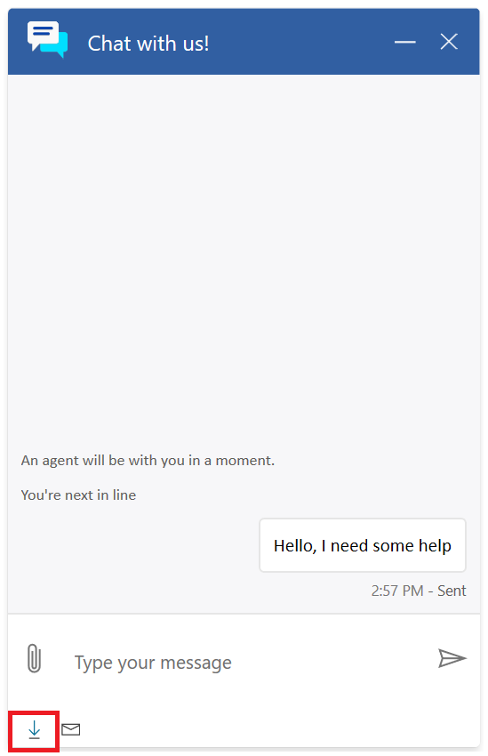
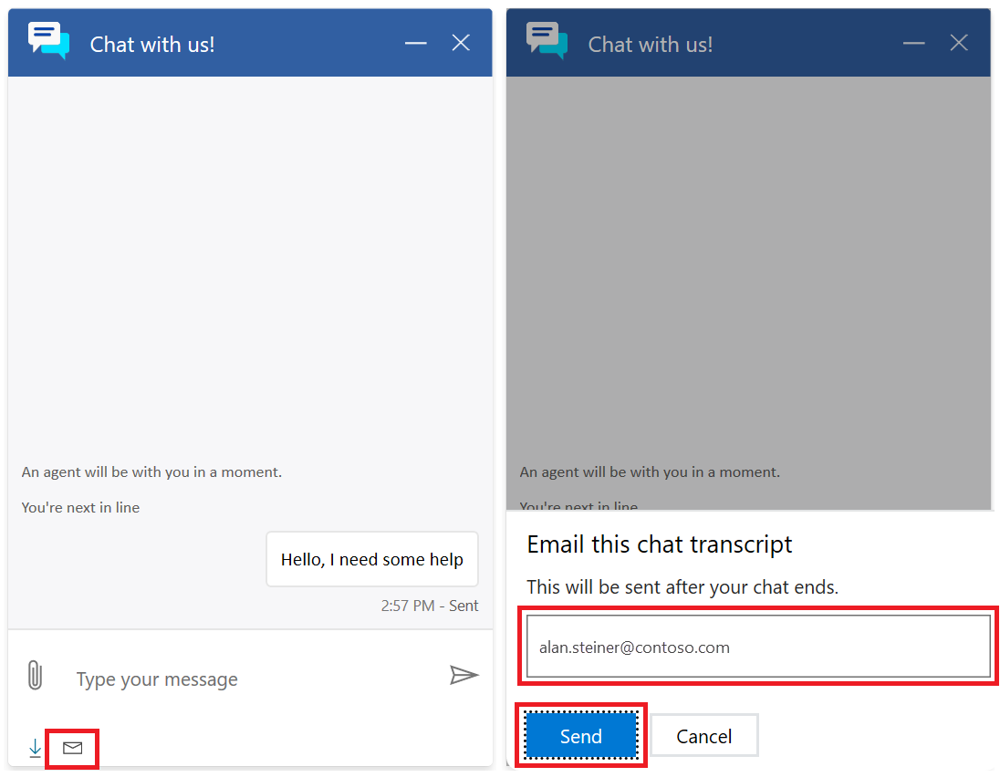
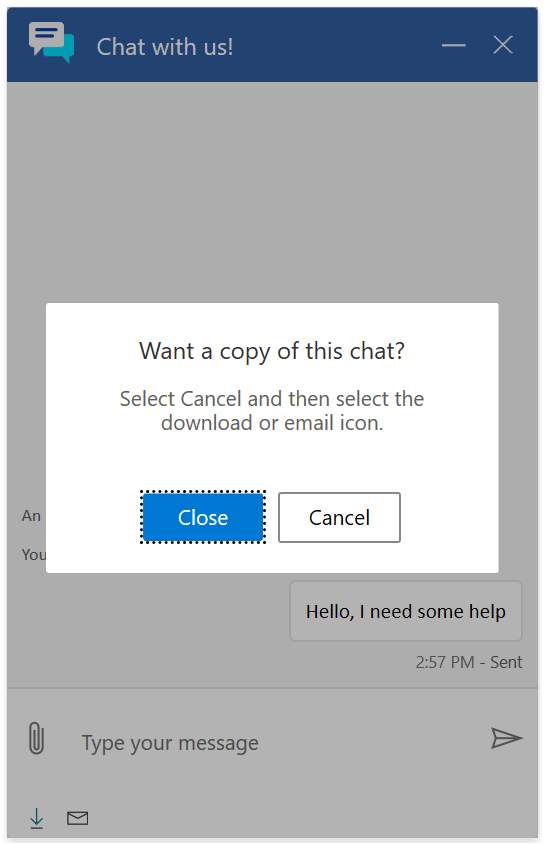

# Configure download and email of chat transcripts

[!INCLUDE[cc-use-with-omnichannel](../includes/cc-use-with-omnichannel.md)]

Chat for Dynamics 365 Customer Service allows customers to download and email a copy of their chat transcripts. When download and email options are enabled by an administrator, customers can request a copy of their chat transcript at any time during a chat session and are reminded at the end of the conversation to request a transcript. Icons at the bottom of the chat widget allow the customer to initiate an email or download a copy of their chat transcript, which is sent once the chat ends.

**Prerequisite**: Administrators should set up mailboxes before enabling, and must select the **Allow other Dynamics 365 users to send email on your behalf** checkbox for this feature to work. For more information, see [Dynamics 365 Email Setup](https://support.microsoft.com/help/4020807/dynamics-365-e-mail-setup-configuration-and-dynamics-365-for-mobile-ho) and [Dynamics 365 Email tab options](https://docs.microsoft.com/dynamics365/customerengagement/on-premises/basics/set-personal-options#email-tab-options).

1. Sign in to Omnichannel Administration.

2. Go to **Channels** > **Chat**.

3. Open the chat widget in which you need to configure download and email of chat transcripts.

4. Go to the **Basic details** tab.

5. Under **Chat Transcripts**, select **Yes** or **No** for the following:

   - **Allow download of transcript**: Allows your customers to download the chat transcript.

   - **Allow email of transcript**: Allows your customers to send the chat transcript as an email.

   By default, both the options are set to **No**.

   > [!div class=mx-imgBorder]
   > 

6. If you select **Yes** for **Allow email of transcript**, you must select an email template and a mailbox from which the email will be sent. Administrators have a choice to either:

    - Use an email template provided by Chat for Dynamics 365 Customer Service by selecting an option from the **"From" mailbox** drop-down list.

    - Modify the email template provided by Chat for Dynamics 365 Customer Service.
    
    - Create their own email template.

    > [!div class=mx-imgBorder]
    > 

    > [!NOTE] 
    > Whether an administrator chooses to use the email template provided or create their own, the "{conversation.transcript}" text determines where the transcript is injected into email.

    > [!div class=mx-imgBorder]
    > 

## Customer experience

Customers can choose to download and email a copy of their chat transcript conversation from the chat window: 

- **Download the chat transcript**: Select the download icon at the bottom of the chat screen. 

    > [!div class=mx-imgBorder]
    > 

- **Email the chat transcript**: Select the email icon at the bottom of the chat screen.

    1. Enter email address in pop-up window.
        
    2. Select **Send** to receive a copy of the chat transcript once the conversation ends.
    
    
       

     > [!div class=mx-imgBorder]
     > 

    At the end of the chat conversation, the following window appears reminding the customer they can either download or email a copy of their chat transcript to themselves.

    > [!div class=mx-imgBorder]
    > 

### See also

[Add a chat widget](add-chat-widget.md) 
[Configure a pre-chat survey](configure-pre-chat-survey.md)  
[Configure agent display name](agent-display-name.md) 
[Configure file attachment capability](configure-file-attachment.md) 
[Create quick replies](create-quick-replies.md)  
[Create and manage operating hours](create-operating-hours.md)  
[Create chat authentication settings](create-chat-auth-settings.md)   
[Embed chat widget in Power Apps portals](embed-chat-widget-portal.md)

[!INCLUDE[footer-include](../includes/footer-banner.md)]
