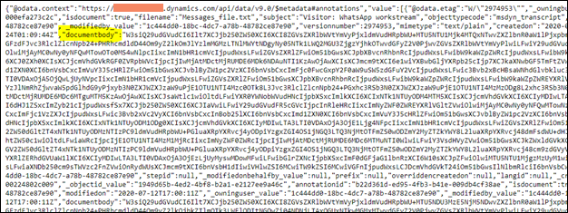

# Download Omnichannel for Customer Service transcripts in bulk

[!INCLUDE[cc-data-platform-banner](../includes/cc-data-platform-banner.md)]

[!INCLUDE[cc-use-with-omnichannel](../includes/cc-use-with-omnichannel.md)]

Omnichannel for Customer Service transcripts are stored in base64 encoded format in the annotations table in Microsoft Dataverse. Attachments are stored as separate records in the annotations table. If a conversation has two files exchanged between the agent and the customer, a total of three records are created pertaining to this conversation. Any conversation always has n+1 records stored for it in the annotations table, where n is the number of attachments the conversation has. Attachments are also base64 encoded before being saved.

The option to download transcripts in bulk is not available out of the box. You can use the following Web API requests to retrieve all the transcripts and attachments exchanged in the past one month.

The following Web API request will retrieve all the textual transcripts.

```http
GET [Organization URI]/api/data/v9.1/annotations?$filter=objecttypecode eq 'msdyn_transcript'
Accept: application/json  
OData-MaxVersion: 4.0  
OData-Version: 4.0  
```
The following Web API request will retrieve all the file attachment annotations.

```http
GET [Organization URI]/api/data/v9.1/annotations?$filter=objecttypecode eq 'msdyn_ocliveworkitem'
Accept: application/json  
OData-MaxVersion: 4.0  
OData-Version: 4.0  
```
The `documentBody` attribute in the response obtained from each of the web API requests contains the base64 encoded transcript or attachment.

> 

You can call the APIs using C# code and then iterate over each of the returned records, access the `documentBody` attribute, and process it to get the whole transcripts.

## Structure of the JSON transcript

The transcripts you see in the link can contain different kinds of messages:
- Control Messages
- System Messages
- Text message (for example, Hi, Hello, and How are you)
- File Attachment metadata

On each of these types of messages you can see a `createdDateTime` field that denotes the exact time at which this message was posted or created.

A control message is of no visual value and indicates an event like agent joined or left conversation. It usually has a flag called `isControlMessage` set to `true`.

```
{
    "content": "<addmember><eventtime>1589863236124</eventtime><initiator>28:bc81db89-c4d7-4763-91fe-086fcc2e6daf</initiator><rosterVersion>1589863235629</rosterVersion><lastRosterVersion>1589801089959</lastRosterVersion><target>8:orgid:04fd615d-586d-4866-9791-b24c5f7a9e78</target></addmember>",
    "contentType": "text",
    "createdDateTime": "2020-05-19T04:40:36.124+00:00",
    "likes": [],
    "attachments": [],
    "id": "1589863236124",
    "created": "2020-05-19T04:40:36.124Z",
    "culture": null,
    "deleted": null,
    "important": null,
    "modified": null,
    "modifiedDateTime": null,
    "isControlMessage": true,
    "from": null
},
```
A System message is a special kind of message that is shown to the customer regarding events during the conversations. For example, when an agent joins, when an agent disconnects, and when a new agent joins.

```
{
	"content": "Alan Steiner has left the conversation.",
	"contentType": "text",
	"createdDateTime": "2020-05-19T04:43:12.976+00:00",
	"from": {
		"application": {
			"displayName": "DynamicsBot",
			"id": "bc81db89-c4d7-4763-91fe-086fcc2e6daf"
		},
		"user": null,
		"phone": null,
		"guest": null,
		"encrypted": null,
		"onPremises": null,
		"azureApplicationInstance": null,
		"applicationInstance": null,
		"device": null
	},
	"likes": [],
	"attachments": [],
	"id": "1589863392976",
	"created": "2020-05-19T04:43:12.976Z",
	"culture": null,
	"deleted": null,
	"important": null,
	"modified": null,
	"modifiedDateTime": null,
	"tags": "system"
},
```

Text messages exchanged during the chat between agent and customer appear as follows.

```
{
	"content": "I am using product A",
	"contentType": "text",
	"createdDateTime": "2020-05-19T04:43:03.979+00:00",
	"from": {
		"user": {
			"displayName": "Customer",
			"id": "04fd615d-586d-4866-9791-b24c5f7a9e78"
		},
		"phone": null,
		"guest": null,
		"encrypted": null,
		"onPremises": null,
		"azureApplicationInstance": null,
		"applicationInstance": null,
		"application": null,
		"device": null
	},
	"likes": [],
	"attachments": [],
	"id": "1589863384036",
	"created": "2020-05-19T04:43:03.979Z",
	"culture": null,
	"deleted": null,
	"important": null,
	"modified": null,
	"modifiedDateTime": null,
	"tags": "private,parentID-5493180821148088016",
	"deliveryMode": "unbridged"
},
```

As seen in the preceding code, messages sent by the customer have a display name "Customer" in case of an unidentified customer or their actual name if they are known to Omnichannel for Customer Service.

For the message that is sent by an agent to a customer, there are tags denoting that it is a “public” message sent by the agent. If the tags contain “private”, then they are internal messages exchanged between two agents and are not exposed to the customer.

```
{
	"content": "Great! Just give me a moment. \\nWhich product are you using currently?",
	"contentType": "text",
	"createdDateTime": "2020-05-19T04:42:44.202+00:00",
	"from": {
		"user": {
			"displayName": "Alan Steiner",
			"id": "04fd615d-586d-4866-9791-b24c5f7a9e78"
		},
		"phone": null,
		"guest": null,
		"encrypted": null,
		"onPremises": null,
		"azureApplicationInstance": null,
		"applicationInstance": null,
		"application": null,
		"device": null
	},
	"likes": [],
	"attachments": [],
	"id": "1589863364220",
	"created": "2020-05-19T04:42:44.202Z",
	"culture": null,
	"deleted": null,
	"important": null,
	"modified": null,
	"modifiedDateTime": null,
	"tags": "public,messageId-1589863364202,RTT-C1",
	"deliveryMode": "unbridged"
},
```
A `FileAttachment` message looks like the following snippet in the JSON.

```
{
    "content": "",
    "contentType": "text",
    "createdDateTime": "2020-05-06T21:31:37.316+00:00",
    "from": {
      "application": {
        "displayName": "Customer",
        "id": "6cc05310-05d9-4ce5-8fc0-d606c478f896"
      },
      "user": null,
      "phone": null,
      "guest": null,
      "encrypted": null,
      "onPremises": null,
      "azureApplicationInstance": null,
      "applicationInstance": null,
      "device": null
    },
    "likes": [
    ],
    "attachments": [
      {
        "id": "0-wus-d3-37f4fa3cd63945c526799ae5b4e009f5",
        "index": 0,
        "fileType": "docx",
        "name": "mr Hand goes to the moon, By contoso.docx",
        "sourceUrl": "https://us-api.asm.contoso.com/v1/objects/0-wus-d3-37f4fa3cd63945c526799ae5b4e009f5/",
        "annotationid": "cfb551a8-ef4f-431a-871f-9b027ff940e3"
      }
    ],
    "id": "1588800697316",
    "created": "2020-05-06T21:31:37.316Z",
    "culture": null,
    "deleted": null,
    "important": null,
    "modified": null,
    "modifiedDateTime": null,
    "deliveryMode": "bridged"
  },
```
It usually has metadata related to the attachments exchanged during the chat. The `annotationid` is the key to the base64 encoded record in Annotations table for that file attachment. You can retrieve the record using the following Web API request. The Web API request will give you the base64 encoded Attachment that you can decode and use the way you want.

```http
GET [Organization URI]/api/data/v9.1/annotations(<annotationid>)
Accept: application/json  
OData-MaxVersion: 4.0  
OData-Version: 4.0  
```

### See also

[Omnichannel for Customer Service for developers](developer/omnichannel-developer.md)
