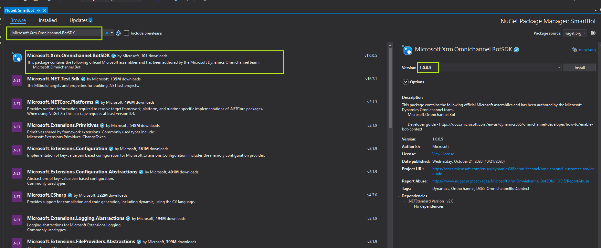
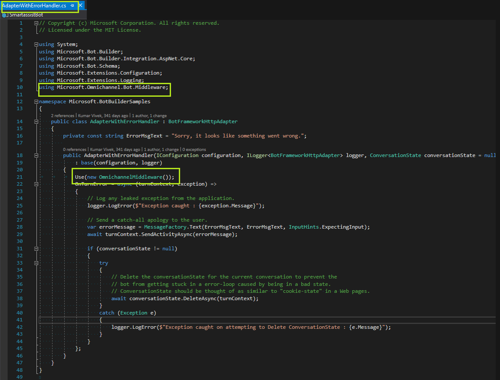

# Enable bot context NuGet package

[!INCLUDE[cc-use-with-omnichannel](../includes/cc-use-with-omnichannel.md)]

As a bot author, you can enable your Azure bot to understand context while authoring a bot flow. Bot context includes context name-value pairs for the current conversation and custom context passed by API programmatically.

When customers initiate a conversation, the relevant context that is related to the customer, the issue they are facing, and recent activities performed by them can be made available for the bot to intelligently provide contextual responses to resolve customer issues in a quick and efficient manner. For example, the bot can use the signed-in user details to look up the recent case information or order history of the customer and provide a response. Similarly, the pre-conversation information, custom context, or recent pages browsed on a website by the customer can be passed on to the bot by configuring context variables for the Azure bot.

For information on context variables that can be configured, see [Context variables for bots](context-variables-for-bot.md).

## Install the bot SDK in your project

1. To open the NuGet Package Manager, right-click your project and then select **Manage NuGet Packages.**

2. In the NuGet Package Manager, select the feedname **nuget.org** and search for "Microsoft.Xrm.Omnichannel.BotSDK". Select the package and select install. Refer to [Nuget page](https://www.nuget.org/packages/Microsoft.Xrm.Omnichannel.BotSDK)

>

Alternatively, you can use the following command in NuGet CLI:

```
Install-Package Microsoft.Xrm.Omnichannel.BotSDK -version 1.0.0.4 
```
The bot SDK is now installed and the Omnichannel middleware is available in your project.

The Omnichannel for Customer Service context messages are sent as event activity to bots, and you need to override the `OnEventActivityAsync` method to process the context messages. More information: [Event-driven conversations using an activity handler](/azure/bot-service/bot-activity-handler-concept.md?view=azure-bot-service-4.0&tabs=csharp)

## Use the Omnichannel middleware in your bot code

Use this procedure if you have created your bot using Visual Studio Azure Bot template or Azure portal.

1. Open the file, **AdapterWithErrorHandler.cs**.

2. Add the import statement and instantiate the Omnichannel middleware.  

    ```
    using Microsoft.Omnichannel.Bot.Middleware; 
    Use(new OmnichannelMiddleware()); 
    ```

    

### See also

[Manage custom context](send-context-starting-chat.md)  
[setContextProvider](developer/reference/methods/setContextProvider.md)  
[Integrate an Azure bot](configure-bot.md)  

[!INCLUDE[footer-include](../includes/footer-banner.md)]