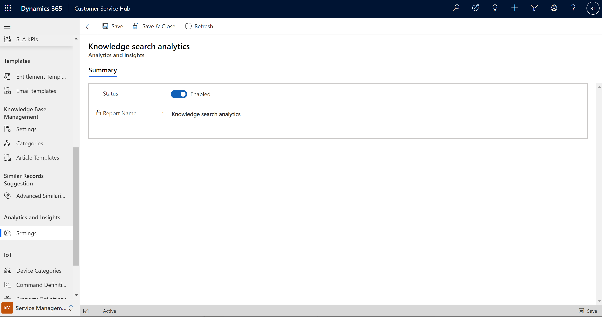

# Preview: Configure Knowledge search insights for Dynamics 365 Customer Service

[!include[cc-beta-prerelease-disclaimer](../includes/cc-beta-prerelease-disclaimer.md)]

> [!IMPORTANT]
>
> - A preview is a feature that is not complete, as it may employ reduced privacy, security, and/or compliance commitments, but is made available before it is officially released for general availability so customers can get early access and provide feedback. Previews are provided "as-is," "with all faults," "as available," and without warranty.
> - This preview feature does not come with technical support and Microsoft Dynamics 365 Technical Support won't be able to help you with issues or questions.  If Microsoft does elect to provide any type of support, such support is provided "as is," "with all faults," and without warranty, and may be discontinued at any time.
> - Previews are not meant for production use, especially to process Personal Data or other data that is subject to heightened compliance requirements, and any use of "live" or production data is at your sole risk. All previews are subject to separate [Terms and Conditions](../legal/supp-dynamics365-preview.md).

The knowledge search analytics dashboard is designed to provide your organization's customer service supervisors and knowledge workers with valuable insights into how your support agents are finding and using knowledge articles.

> [!NOTE]
> Knowledge search analytics will not provide information about customer search behavior. Data is only from internal knowledge searches.

## Configure the Knowledge search analytics dashboard

To enable the Knowledge search analytics dashboard:

1. Sign in to Dynamics 365 as an administrator, and go to Customer Service Hub.

2. In the **Change area**, select **Service Management**.

3. Under **Analytics and Insights**, select **Settings**. The **Analytics and insights settings** page is displayed.

    > [!div class=ms-imgBorder]
    > 

4. On the right side of **Knowledge search analytics (preview)**, select **Manage**.

5. On the **Knowledge search analytics (preview)** page, toggle **Status** to **Enabled**.

    > [!div class=ms-imgBorder]
    > 

6. Select **Save** or **Save & Close**.

### View Customer Service knowledge search analytics (preview) reports

The service managers must have the admin or service manager role to view the reports. Users with the CSR Manager role will be able to view the reports only after the reports are shared with them.

You can see the following reports by navigating to the **Service** > **Analytics and Insights** > **Knowledge search analytics (preview)** page. Search term insights are displayed.

> [!NOTE]
>
> - The knowledge search analytics dashboard is currently available only in the following geographical locations:
>   - North America
>   - South America
>   - Canada
>   - United Kingdom
>   - Europe
>   - Japan
>   - India
>   - Asia Pacific
>   - Australia
> - The knowledge base analytics dashboard supports only English content and is available only in organizations that have the base language set as English.

### See also

[Introduction to Customer Service analytics and insights](introduction-customer-service-analytics.md)  
[View and understand Customer Service analytics and insights in Customer Service Hub](customer-service-analytics-insights-csh.md)  
[View and understand Customer Service analytics](customer-service-analytics.md)  

[!INCLUDE[footer-include](../includes/footer-banner.md)]