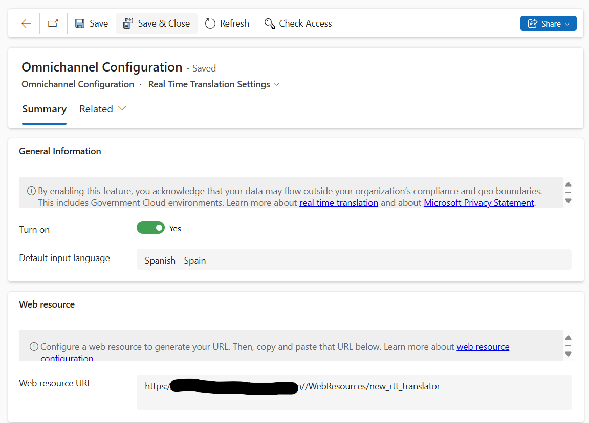

# Enable real-time translation of conversations

[!INCLUDE[cc-use-with-omnichannel](../includes/cc-use-with-omnichannel.md)]

> [!IMPORTANT]
> This feature is intended to help customer service managers or supervisors enhance their team's performance and improve customer satisfaction. This feature is not intended for use in making, and should not be used to make, decisions that affect the employment of an employee or group of employees, including compensation, rewards, seniority, or other rights or entitlements. Customers are solely responsible for using Dynamics 365 Customer Service, this feature, and any associated feature or service in compliance with all applicable laws, including laws relating to accessing individual employee analytics and monitoring, recording, and storing communications with end users. This also includes adequately notifying end users that their communications with agents may be monitored, recorded, or stored and, as required by applicable laws, obtaining consent from end users before using the feature with them. Customers are also encouraged to have a mechanism in place to inform their agents that their communications with end users may be monitored, recorded, or stored.

With the real-time message translation feature, agents can support customers in the language they elect to be serviced in. When you enable language translation, messages between the customer and support agent&mdash;and messages among support agents who consult and collaborate internally, such as supervisors or SMEs&mdash;are translated. The real-time translation feature is enabled as a plug-in that exposes APIs to bring in third-party translation services and also provides a native implementation.

All the languages that are supported in Omnichannel for Customer Service are supported for the agent in the conversations. For the list of supported languages, see [Language availability](international-availability.md).

> [!Important]
> The language translation feature isn't supported in Omnichannel for Customer Service on Unified Service Desk.

## Prerequisites

- You must add a web resource and make sure that the required language translation services are configured. More information: [Add a web resource for real-time translation](add-web-resource-real-time-translation.md)

- Enable call recording and transcription for the translated voice call transcripts to be displayed. More information: [Enable call recording and transcription for voice](voice-channel-configure-transcripts.md#enable-call-recording-and-transcription-for-voice)

## Enable real-time translation for agent and customer conversations

You can enable real-time translation in the Customer Service admin center or Omnichannel admin center app.

1. Go to one of the apps, and perform the following steps.
   
   ### [Customer Service admin center](#tab/customerserviceadmincenter)

     1. In the site map, select **Insights** in **Operations**. The **Insights** page appears.
     2. In the **Real-time translation** section, select **Manage**.

     The **Omnichannel Configuration** page is displayed.       

   ### [Omnichannel admin center](#tab/omnichanneladmincenter)
    
     1. In the site map, select **Agent experience** in **Advanced settings**. The **Agent experience** page appears.
     2. In the **Real-time translation** section, select **Manage**.

      The **Omnichannel Configuration** page is displayed. 

2. On the **Omnichannel Configuration·Real Time Translation Settings** page, in the **General Information** area, set the toggle for **Turn on** to **Yes**.
3. In **Default input language**, select the language for agents to converse with customers. The translation engine translates the customer messages for agents to the language specified. By, default, it's set to English (en-us).
4. In the **Web resource** area, in the **Web resource URL** box, enter the link of the web resource.
    > [!div class=mx-imgBorder]
    > 
5. Select **Save**.

### See also

[Add a web resource for real-time translation](add-web-resource-real-time-translation.md)  
[Real-time language translation of conversations for agents and customers](oc-real-time-translation.md)  

[!INCLUDE[footer-include](../includes/footer-banner.md)]
