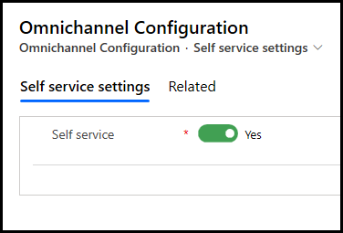

# Enable self-service settings for customer actions in a conversation summary

[!INCLUDE[cc-use-with-omnichannel](../includes/cc-use-with-omnichannel.md)]

## Overview

The self-service feature displays information about the recent actions that a customer performs before starting a conversation with an agent. This information helps agents understand customer issues and provide a personalized service for enhanced customer satisfaction.

The data about the recent actions is stored in an entity for the conversation that has been closed. A record is created for each self-service action and [action type](oc-customer-summary.md#self-service). To learn more, see [msdyn_visitorjourney Entity Reference](developer/reference/entities/msdyn_visitorjourney.md).

Enabling the self-service feature is a two-step process as follows:
1. Add a code snippet in the self-service portal that is configured for your organization. For the sample code and to learn more, see [Pass self service history as context](developer/reference/methods/setcontextprovider.md#pass-customers-self-service-as-context).
2. Update the settings in the Omnichannel Administration app.

## Enable self service

Perform the following steps to enable self service.

1. Add the code snippet in the customer self-service portal.
2. Sign in to the Omnichannel Administration app.
3. Under **Settings**, select **Self service**. The **Omnichannel Configuration** page appears.
4. On the **Self service settings** tab, set the **Self service** toggle to **Yes**.

   > [!div class='mx-imgBorder']
   > 
 
5. Select **Save**. The **Self service** tab will appear for the agent when a chat is started with a customer.

### See also

[Self service](oc-customer-summary.md#self-service)

[!INCLUDE[footer-include](../includes/footer-banner.md)]