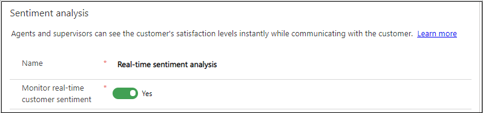
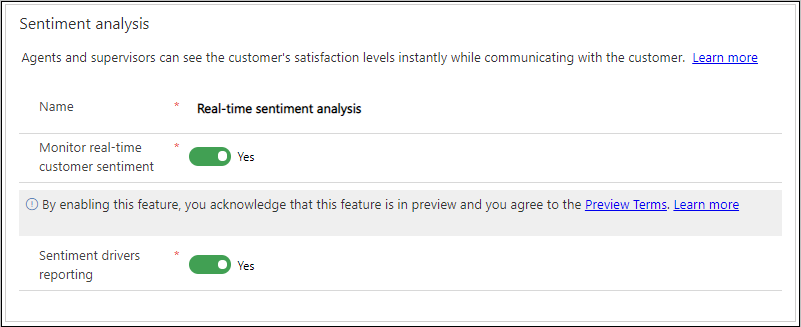
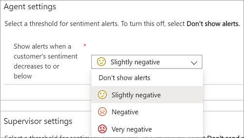
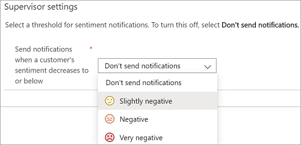

# Analyze real-time customer sentiment

[!INCLUDE[cc-use-with-omnichannel](../includes/cc-use-with-omnichannel.md)]

> [!IMPORTANT]
> This feature is intended to help customer service managers or supervisors enhance their team's performance and improve customer satisfaction. This feature is not intended for use in making, and should not be used to make, decisions that affect the employment of an employee or group of employees, including compensation, rewards, seniority, or other rights or entitlements. Customers are solely responsible for using Dynamics 365 Customer Service, this feature, and any associated feature or service in compliance with all applicable laws, including laws relating to accessing individual employee analytics and monitoring, recording, and storing communications with end users. This also includes adequately notifying end users that their communications with agents may be monitored, recorded, or stored and, as required by applicable laws, obtaining consent from end users before using the feature with them. Customers are also encouraged to have a mechanism in place to inform their agents that their communications with end users may be monitored, recorded, or stored.

> [!NOTE]
> Supervisor and agent sentiment notifications are not available in Omnichannel for Customer Service on Unified Service Desk.

Sentiment analysis settings in Omnichannel for Customer Service provide agents and supervisors with real-time insight regarding how customers are interacting with agents during chat sessions.

## Sentiment analysis

To let agents and supervisors see the customer's satisfaction levels instantly while communicating with the customer, you need to enable the sentiment analysis.

> [!NOTE]
> Sentiment analysis is enabled by default.

1. Sign in to **Omnichannel Administration**.

2. Under **Settings**, select **Sentiment Analysis**, and then select **Real-Time Sentiment Analysis**.

3. In the **Sentiment analysis** section, set the **Monitor real-time customer sentiment** toggle to **Yes**, and then select **Save**.

    > [!div class=mx-imgBorder]
    > 

After you enable real-time customer sentiment, you can view scores in the [Omnichannel Insights dashboards](configure-historical-sentiment-dashboard-supervisor.md).

### Preview: Sentiment drivers reporting

[!include[cc-beta-prerelease-disclaimer](../includes/cc-beta-prerelease-disclaimer.md)]

> [!NOTE]
> In the preview mode, this feature is not available for Government Community Cloud (GCC).

#### Prerequisite task

In the customization settings of Omnichannel Administration, enable change tracking for the **Conversation Sentiment** entity.

#### Enable sentiment drivers reporting

After you opt in for real-time sentiment analysis, you can enable sentiment drivers reporting to gain a better understanding of the topics that are affecting customer sentiment.

1. In the **Sentiment analysis** section, set the **Sentiment drivers reporting** toggle to **Yes**.
2. Select **Save**.

  > [!div class=mx-imgBorder]
  > 

> [!IMPORTANT]
> For this feature to work, a minimum of 10 chat conversations per organization are required.

## Agent settings

Agents can view the customer sentiment in the communication panel for a conversation session that is active and in focus. For a session that is not in focus, the alert is shown on the session panel.

You can show alerts to the agents when a customer's sentiment decreases to or below a particular value. You can set the customer's sentiment to any of the following values:

- Don't show alerts
- Slightly negative
- Negative
- Very negative

For example, you set the threshold value as **Slightly negative**. When the customer's sentiment reaches **Slightly negative** or any other sentiment value below this, an alert is displayed to the agent.

1. Sign in to **Omnichannel Administration**.

2. Under **Settings**, select **Sentiment Analysis**, and then select **Real-Time Sentiment Analysis**.

3. In the **Agent settings** section, select a value from the **Show alerts when a customer's sentiment decreases to or below** list. The options are:

    - Don't show alerts
    - Slightly negative
    - Negative
    - Very negative

      > [!div class=mx-imgBorder]
      > 

To turn off agent alerts, select **Don't show alerts**.

## Supervisor settings

Supervisors can use the **Omnichannel Ongoing Conversation** dashboard to view customer sentiment in real time during conversations between customers and agents.

You can show notifications to the supervisors when a customer's sentiment decreases to or below a particular value. The supervisor must be assigned to the queue to receive sentiment notifications.

You can set the sentiment threshold to any of the following values:

- Don't show notifications
- Slightly negative
- Negative
- Very negative

For example, you set the threshold value as **Slightly negative**. When the customer's sentiment reaches **Slightly negative** or any other sentiment value below this, a notification is displayed to the supervisor.

1. Sign in to **Omnichannel Administration**.

2. Under **Settings**, select **Sentiment Analysis**, and then select **Real-Time Sentiment Analysis**.

3. In the **Supervisor settings** section, select a value from the **Send notifications when a customer's sentiment decreases to or below** list. The options are:

    - Don't send notifications
    - Slightly negative
    - Negative
    - Very negative

    > [!div class=mx-imgBorder]
    > 

To turn off supervisor notifications, select **Don't send notifications**.

## Multi-language sentiment

Multi-language sentiment scoring is enabled by default. Conversations in more than 40 languages are scored. The languages listed in the following table are supported in the analytics features.

<table>
<tbody>
<colgroup span = "3">
<col width = "34%"></col>
<col width = "33%"></col>
<col width = "33%"></col>
</colgroup>
<tr>
<td>Arabic 
Bulgarian 
Chinese (Hong Kong SAR) 
Catalan 
Chinese Simplified 
Chinese Traditional 
Croatian 
Czech 
Danish 
Dutch 
English 
Estonian 
Finnish 
French 
</td>
<td>German 
Greek 
Hebrew 
Hindi 
Hungarian 
Indonesian 
Italian 
Japanese 
Korean 
Latvian 
Lithuanian 
Malay 
Norwegian 
Polish 
</td>
<td>Portuguese 
Romanian 
Russian 
Serbian (Cyrillic) 
Serbian (Latin) 
Slovak 
Slovenian 
Spanish 
Swedish 
Thai 
Turkish 
Ukrainian 
Vietnamese 
</td>
</tbody>
</table>

> [!NOTE]
> For languages supported in the product user interface (UI), see [Language availability](international-availability.md).

### See also

[Monitor conversations](monitor-conversations.md)

[!INCLUDE[footer-include](../includes/footer-banner.md)]