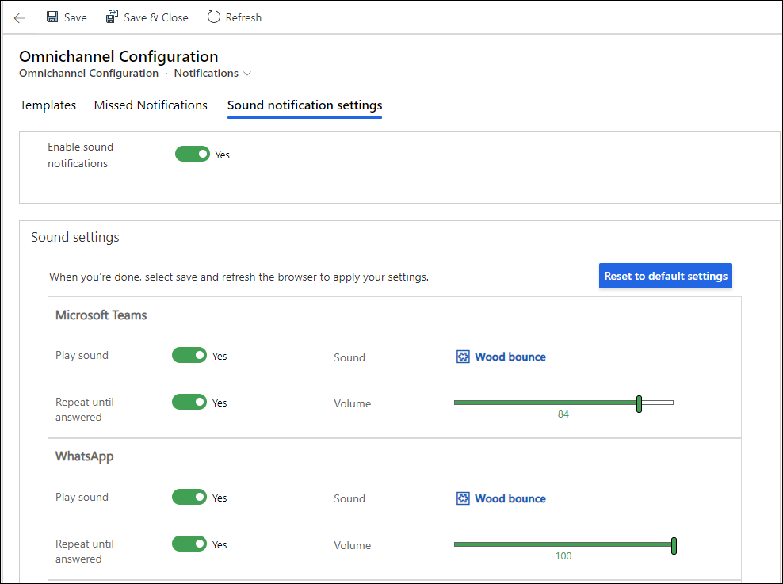

# Enable sound notifications for conversations

[!INCLUDE[cc-use-with-omnichannel](../includes/cc-use-with-omnichannel.md)]

## Introduction

Sound notifications for incoming conversation requests, such as live chat, that require immediate response are helpful in making sure the requests are not missed. Administrators can enable the sound notification settings in the configuration settings of Omnichannel for Customer Service. The option to personalize allows agents to customize their preferences for sound and volume selections, among other things. The sound notifications are available across all channels and can also be set for messages for ongoing conversations.

> [!IMPORTANT]
>
> Make sure that the browser settings allow sounds to be played. In Microsoft Edge, sound is allowed by default. For information on how to enable sound notifications for browsers, see the browser-specific documentation.

## Enable sound notifications

When you enable sound settings, the options to personalize settings are available for all the channels that are provisioned in your environment.

1. In the Omnichannel Administration app, select **Notifications** under **Agent Experience** in the site map.
2. On the Omnichannel Configuration - Notifications page, select **Sound notification settings**.
3. Set the toggle to **Yes** for **Enable sound notifications**. The **Sound settings** area is displayed.

4. Customize the notification settings for the required channels. The following settings are for Microsoft Teams:

   - **Play Sound:** Set the toggle to **Yes**.
   - **Repeat until answered:** Set the toggle to **Yes** if you want the sound to be played till the agent responds.
   - **Sound:** Accept the default setting or search and select a different audio file. You can use the **New Audio File** option to upload and use an audio file of your choice. You also have the option to preview the audio.
   - **Volume:** Accept the default setting or use the slider to adjust the volume.

     > 
  
  - **Reset to default settings:** When you customize any setting, the button is enabled for you to reset to the out-of-the-box settings.

5. In the **Incoming messages for open sessions** section, customize the options for sound notifications for messages in open sessions, such as live chat or a social channel.
    > 
6. Select **Save.**

### See also

[Personalize notifications](oc-personalize-sound-notifications.md)  

[!INCLUDE[footer-include](../includes/footer-banner.md)]