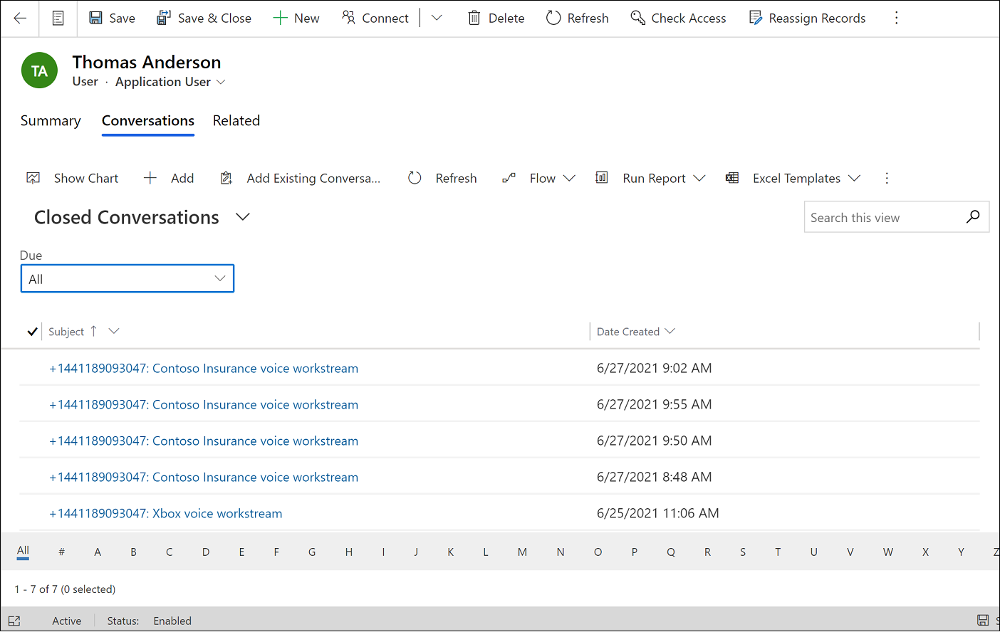

# Enable the transcription experience for messaging channels

[!INCLUDE[cc-use-with-omnichannel](../includes/cc-use-with-omnichannel.md)]

As an administrator, you can enable live transcription and recording of conversations, which allows agents and supervisors to view transcripts of customer conversations. The transcriptions include sentiment analysis data and can be searched through.

> [!IMPORTANT]
> Many countries and states have laws and regulations that apply to the recording of PSTN, voice, and video calls, and may require that users first consent to the recording of their communications. It is your responsibility to use the call recording capabilities in compliance with the law. Before using call recording features, you must obtain consent from the parties of recorded communications in a manner that complies with all applicable laws for each participant.

## Enable the transcript experience

> [!NOTE]
> The transcript feature is generally available; however, in some environments, you might see a preview tag or banner in the interface. Any preview annotations for this feature can safely be ignored.

**To enable transcripts**

1. In Dynamics 365, go to one of the apps, and perform the following steps.
   
   ### [Customer Service admin center](#tab/customerserviceadmincenter)
     
     1. In the site map, select **Productivity** in **Agent experience**.
     2. On the **Productivity** page, select **Manage** for **Transcript**.

   ### [Omnichannel admin center](#tab/omnichanneladmincenter)

    - In the site map, select **Agent experience** in **Advanced settings**, and then select **Manage** for **Transcript**.

1. On the **Omnichannel Configuration - Transcript settings** page, turn on the **Try out our new transcript experience for digital messaging channels** toggle.

1. Select **Save**.

## View the transcripts

You can view the conversation transcriptions in the Customer Service admin center, Omnichannel admin center, and Omnichannel for Customer Service apps.

To view transcripts in Omnichannel admin center, do the following:

1. In the Customer Service admin center site map, select **User management**, and then select **Manage** for **Users**. If you're using Omnichannel admin center, in the site map, select **Users**.
2. Select the user whose conversations you want to view.
3. Select the **Related** tab, and then select **Conversations** from the dropdown menu.
4. Select **Closed conversations** from the dashboard dropdown menu.
5. Select the conversation for which you want to access the transcript.
  
   > [!div class="mx-imgBorder"]
   > 

To view transcripts in Omnichannel for Customer Service, do the following:

1. Open the Omnichannel for Customer Service app, and then switch to the **Omnichannel Agent Dashboard** view.
   Completed chat conversations are displayed in the **Closed work items** column.
2. Do one of the following: 
    a. Select the closed work item for which you want to view the transcript. 
    b. Right-click the three dots to view the transcript.

> [!NOTE]
> As an administrator, only you have access to the conversations that are handled by other agents.

### See also

[Configure chat](add-chat-widget.md)  
[View communication panel](oc-conversation-control.md)
