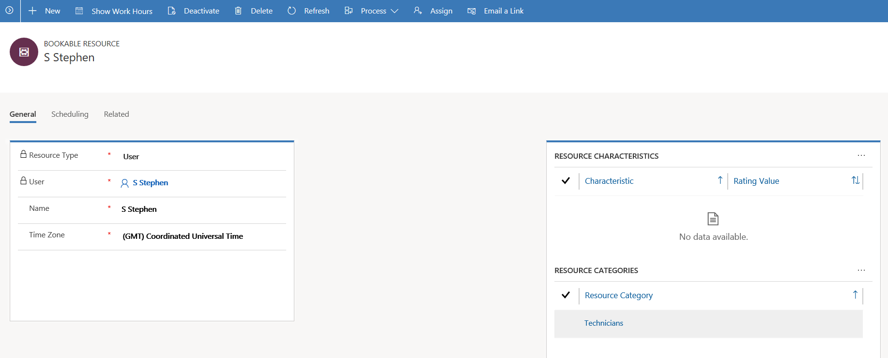

# Get the new Service Scheduling experience

Service scheduling is now built atop **Universal Resource Scheduling (URS)** to provide an efficient way to schedule service activity. It considers the availability of employees, facilities, and equipment to plan schedules accordingly. It also helps customer service organizations with improved service quality by preventing over-scheduling. This is done with the help of predictable workloads for employees, and reliable time estimates for customers and clients.

With the October'18 release, the new Service Scheduling will be available in the Customer Service Hub sitemap.

[!INCLUDE[proc_more_information](../includes/proc-more-information.md)] [Access Service Scheduling in the Customer Service Hub](basics-service-service-scheduling.md#access-service-scheduling-in-the-customer-service-hub)


> [!IMPORTANT]
> If you are a new customer who is using the Service Scheduling feature for the first time, see [Install and enable the new Service Scheduling experience](#install-and-enable-the-new-service-scheduling-experience) to know how you can install and enable Service Scheduling from the sitemap of your Customer Service Hub application. </br> </br> 
If you have been using the legacy Service Scheduling feature from either Service Management or Business Management, see [Migrate to the new Service Scheduling experience](#migrate-to-the-new-service-scheduling-experience) to know how you can migrate to the new Service Scheduling experience.

## About the new Service Scheduling experience

Understand the difference between the legacy and the new Service Scheduling experience with the help of the following scenario:

Contoso bike repairs, a company that repairs bikes, schedules repair services for their customers. To facilitate this process, they compile the following information:

- Create resources and resource groups
  
  Contoso defines the **Resources** and groups them into **Resource Categories** (known as **Resource Groups** in legacy experience)

  ##### Legacy Service Scheduling
  
  [!INCLUDE[proc_more_information](../includes/proc-more-information.md)] [Create or change a resource group (Customer Service app)](create-edit-resource-group.md)
 
  ##### New Service Scheduling
  

  [!INCLUDE[proc_more_information](../includes/proc-more-information.md)] [Create and manage resource categories](resource-categories-service-scheduling.md) </br>  [!INCLUDE[proc_more_information](../includes/proc-more-information.md)] [Create and set up bookable resources](resources-service-scheduling.md)


 


## Install and enable the new Service Scheduling experience

Make sure that you have the Customer Service Manager, System Administrator, or System Customizer security role or equivalent permissions.

### Install or upgrade Universal Resource Scheduling (URS)

To enable or migrate to the new Service Scheduling experience, you should have the latest version of URS installed on your system.

- Check the URS version. Go to Settings and select About to see the current version of URS on your machine
- Upgrade to the latest version of URS from <<here>>. Consider <<these>> points before you upgrade to the latest version.

[!INCLUDE[proc_more_information](../includes/proc-more-information.md)] [Schedule anything with Universal Resource Scheduling (Sales, Customer Service, Field Service, Project Service Automation)](../common-scheduler/schedule-anything-with-universal-resource-scheduling.md)

### Install the Service Scheduling package


### Enable Service Scheduling in the Customer Service Hub sitemap

## Migrate to the new Service Scheduling experience


### Migrate Service Activity 

Service activity isn’t directly available in the new scheduling experience. Contact your administrator to migrate Service activity to the new scheduling experience.

```csharp
//Fetch all Service Activity records

 QueryExpression serviceActivityQuery = new QueryExpression("serviceappointment");
 serviceActivityQuery.ColumnSet = new ColumnSet(true);
 EntityCollection serviceActivityCol = _serviceProxy.RetrieveMultiple(serviceActivityQuery);

//create related records for dependent entity for each ServiceActivity records
foreach (Entity entity in serviceActivityCol.Entities)
{

Guid serviceID = entity.GetAttributeValue<EntityReference>("serviceid").Id;
Guid appointmentID = entity.GetAttributeValue<Guid>("activityid");
 
//Fetch service and get the ‘msdyn_requirementgroupid’
QueryExpression serviceQuery = new QueryExpression("service");
serviceQuery.ColumnSet = new ColumnSet(true);
serviceQuery.Criteria = new FilterExpression();
serviceQuery.Criteria.AddCondition("serviceid", ConditionOperator.Equal, serviceID);

Entity service = _serviceProxy.Retrieve("service", new Guid(serviceID.ToString()), new ColumnSet(true));

//fetch the requirementGroupID for the service and clone the Requirement Group and resource requirement
EntityReference existingRequirementGroupID = service.GetAttributeValue<EntityReference>("msdyn_requirementgroupid");
Entity existingRequirementGroup = _serviceProxy.Retrieve("msdyn_requirementgroup", existingRequirementGroupID.Id, new ColumnSet(true));

// create a new msdyn_requirementgroup record by cloning the above 
Entity newRequirementGroup = new Entity("msdyn_resourcerequirement");
EntityReference rgOwnerID = existingRequirementGroup.GetAttributeValue<EntityReference>("ownerid");
newRequirementGroup["ownerid"] = rgOwnerID.Id;
int rgOwnerIDType = existingRequirementGroup.GetAttributeValue<int>("owneridtype");
newRequirementGroup["owneridtype"] = rgOwnerIDType;
var rgStateCode = existingRequirementGroup.GetAttributeValue<OptionSetValue>("statecode");
newRequirementGroup["statecode"] = rgStateCode;
string rgNmae = existingRequirementGroup.GetAttributeValue<string>("msdyn_name");
newRequirementGroup["msdyn_name"] = rgNmae;

//newRequirementGroup["msdyn_requirementgrouptemplateid"] = existingRequirementGroupID.Id;
newRequirementGroup["msdyn_istemplate"] = 0;
Guid _newRequirementGroupID = _service.Create(newRequirementGroup);


//fetch resourcerequirement for requirementGroupID for the service
QueryExpression existingResourceRequirementQuery = new QueryExpression("msdyn_resourcerequirement");
existingResourceRequirementQuery.ColumnSet = new ColumnSet(true);
existingResourceRequirementQuery.Criteria = new FilterExpression();
existingResourceRequirementQuery.Criteria.AddCondition("msdyn_requirementgroupid", ConditionOperator.Equal, existingRequirementGroupID.Id);
EntityCollection existingResourceRequirement = _serviceProxy.RetrieveMultiple(existingResourceRequirementQuery);

// create/clone records for each msdyn_resourcerequirement
 foreach (Entity entityRR in existingResourceRequirement.Entities)
  {
 Entity newResourceRequirement = new Entity("msdyn_resourcerequirement");
 newResourceRequirement["msdyn_requirementgroupid"] = _newRequirementGroupID;
 newResourceRequirement["serviceappointment"] = appointmentID;
 EntityReference rrOwnerID = entityRR.GetAttributeValue<EntityReference>("ownerid");
 newResourceRequirement["ownerid"] = rrOwnerID.Id;
 int rrOwnerIDType = entityRR.GetAttributeValue<int>("owneridtype");
 newResourceRequirement["owneridtype"] = rrOwnerIDType;
 var rrStateCode = entityRR.GetAttributeValue<OptionSetValue>("statecode");
 newResourceRequirement["statecode"] = rrStateCode;
 Guid _newResourceRequirementID = _service.Create(newResourceRequirement);
  }

// create new bookable resource booking for each ActivityParty record
QueryExpression activityPartyQuery = new QueryExpression("activityparty");
activityPartyQuery.ColumnSet = new ColumnSet(true);
activityPartyQuery.Criteria = new FilterExpression();
activityPartyQuery.Criteria.AddCondition("activityid", ConditionOperator.Equal, appointmentID);
EntityCollection activityPartyCol =  _serviceProxy.RetrieveMultiple(activityPartyQuery);
 foreach (Entity entityRR in activityPartyCol.Entities)
  {
  Entity newBookableResourceBooking = new Entity("bookableresourcebooking");
//fill all reuired fields 
//newBookableResourceBooking["resource"] = respective BookableResourceId from  'BookableResource'
newBookableResourceBooking["starttime"] = entityRR.GetAttributeValue<DateTime>("scheduledstart");
newBookableResourceBooking["endtime"] = entityRR.GetAttributeValue<DateTime>("scheduledend");
newBookableResourceBooking["msdyn_bookingsetupmetadataidname"] = "serviceappointment";
newBookableResourceBooking["msdyn_requirementgroupid"] = _newRequirementGroupID;
//newBookableResourceBooking["msdyn_resourcerequirementID"] = new ID for respective newly created resource requirement
// newBookableResourceBooking["bookingstatus"] =  appropriate BookingStatusBase.BookingStatusId for ActivityPointer statuscode
newBookableResourceBooking ["serviceappointment"] = appointmentID;
//newBookableResourceBooking ["statecode"] = from service activity

Guid _newBookableResourceBookingID = _service.Create(newBookableResourceBooking);}}
```

### See also

[Service Scheduling overview](basics-service-service-scheduling.md)