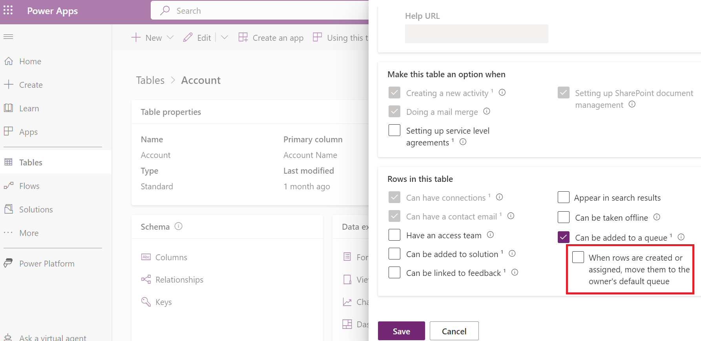

# Entity records routing

[!INCLUDE[cc-data-platform-banner](../includes/cc-data-platform-banner.md)]

[!INCLUDE[cc-use-with-omnichannel](../includes/cc-use-with-omnichannel.md)]

## Overview
 
In Omnichannel Administration, **Entity Records** channel helps you to automatically route cases and other entity records to agents based on the agent's skill, capacity, and presence. To learn more about skill-based routing, see [Skill-based routing overview](overview-skill-work-distribution.md).

### Automatic distribution of cases and other entity records

With unified routing for entity records, organizations can route cases and other entity records to omnichannel queues. The cases and other entity records routed to omnichannel queues are automatically distributed and assigned to best available agents based on their  skill, capacity, and presence.

### Unified routing and queues

Cases and other entity records can be routed to omnichannel queues along with work items that originate from other channels such as Chat and SMS. 

This allows organizations to tightly define the work profile that their agents are supposed to handle, and organizations can automate the work flow assignment across channels and assign the work items based on agents skill, capacity, and presence.

## Configure entity records channel

To setup the **Entity Record** channel for cases, follow the steps:

| Step | Description |
|---------------|----------------------------|--------------------------------------------------------------------------------------------|
| [Step 1: Create queues and add agents](#step-1-create-queues-and-add-agents) | Define queues for your organization and add agents (users) to the queues. |
| [Step 2: Enable entity for activities and queues](#enable-entities)| Enable the entity for activities and queues. |
| [Step 3: Enable entity for routing channel](#step-3-enable-entity-for-routing) | Create entity record configuration to enable an entity for routing. |
| [Step 4: Create routing rules](#step-4-create-routing-rules) | Create routing rules to route cases to the appropriate queues. |

## Step 1: Create queues and add agents

Create a new omnichannel queue or use an existing omnichannel queue, and then add agents to these queues. To learn more, see [Create a queue](queues-omnichannel.md).

## Step 2: Enable entity for activities and queues

Any entity you want to enable for routing needs to be enabled for activities and queues.

1. Sign in to the Dynamics 365 instance.

2. Select **Settings** > **Customizations** > **Customize the System**.

3. Expand **Entities** below **Components**.

4. Select an entity from the solution pane.

5. Select the check box for the following options under **Communication & Collaboration** section:

    - Activities
    - Queues

6. Select **Save**.

7. Select **Publish**.

> [!Note]
> If you enable the option - **Automatically move records to the owner's default queue when a record is created or assigned**, in the entity customization, then the entity record won't be automatically distributed to the agents. You must clear the checkbox to automatically distribute the entity records.    

## Step 3: Enable entity for routing

Create entity record configuration to enable an entity for routing.

1. Sign in to the Omnichannel Administration app.

2. Select **Entity Records** under **Channels** in the sitemap.

3. Select **New** in the **Active Entities** page.

4. Specify the following in the **New Entity** page.

    | Tab | Field | Description | Value |
    |--------|---------------------|----------------|----------------------|
    | Basic Details | Name | Specify a name to the entity record channel. | Case entity channel    **Note:** This is an example value.|
    | Basic Details | Entity | Select an entity from the list. | Case (Incident) |

5. Select **Save** to save the entity record channel. After you save, in the **Work distribution** section, a default work stream is automatically created to distribute these entity records.

> [!Note]
> When you create an entity record channel configuration, a default work stream will be created to distribute these entity records. You can edit the default work stream or create more work streams as per your business scenarios. To learn more, see [Create work stream for entity record routing](set-up-entity-workstream.md).

## Step 4: Create routing rules

After creating an entity record configuration, and enabling an entity for routing, you can define routing rules to route these records to appropriate queues. 

Routing rules for entity records consists of routing rule sets, which in turn contains rule items.

Let's see how to create routing rule set and rule items for entity records. In this procedure, we are adding it for case entity record as example.

1. Sign in to the Omnichannel Administration app.

2. Select **Entity Records** under **Channels** in the sitemap.

3. Select an entity records channel that you created for routing the records from the **Active Entities** view.

    > [!div class=mx-imgBorder] 
    > 

4. Select the **Routing Rules** tab in the entity records channel.

    > [!div class=mx-imgBorder] 
    > 

### Create routing rule set

   Routing rule set is a collection of rule items, and you can have multiple routing rule sets defined for an entity. However, only one routing rule set can be active at any point in time. The rules items in active routing rule set are used to route the records. To create a new routing rule set, follow steps 5-7.

   > [!Note]
   > You can’t edit an active routing rule set. Therefore, if you’re importing a solution that includes an active routing rule set into an organization where the rule set already exists with the same ID, the solution import will fail.

5. Select **New Routing Rule Set**.

6. Specify the following in the **New Routing Rule Set** page

    | Tab | Field | Value | Description | 
    |------------------|----------------------------|----------------------------------|--------------------------------------------|
    | General | Name | Case routing rules | Specify a name to the routing rule set. |
    | General | Entity | Case | Select the entity for which you are creating the rule set. |
    | General | Description | This routing rule set is used for routing high priority cases to agents. | Specify a description for you to identify the purpose of the routing rule set. |

    > [!div class=mx-imgBorder] 
    > 

7. Select **Save** to save the rule set. Once you save the record, you can see the **Rule Items** section in the page.

### Create rule item
    
   You can define multiple routing rule items in a routing rule set. A rule item consists of a condition and destination to route the entity records. Let's see how to define the rule items. To create a new rule item, follow steps 8-13.

8. Select **New Rule Item** in the **Rule Items** section. A **New Rule Item** page appears. 

    > [!div class=mx-imgBorder] 
    > 

9. Specify the following on the **New Rule Item** page.

    | Tab | Field | Value | Description |
    |------------------|----------------------------|----------------------------------|--------------------------------------------|
    | General | Name | Product - Credit card | Specify a name to the rule item. |
    | General | Description | This rule item is used for routing credit card cases. | Specify a description for you to identify the purpose of the rule item. |

10. Select **Add** in the **Rule Criteria** section, and then select **Add row**.

    a. Select a rule from the list for the first box. For example, **Subject**.

    b. Select a condition from the list. For example, **Contains**.

    c. Select a value for the rule from the list. For example, **Credit card**.

    > [!Note]
    > You can define conditions for both primary entity attributes and related entity attributes.

11. Select **Queue** for the **Route to** field.

12. Select an omnichannel queue for the **Add to Queue** field.

    The steps 9 to 11 indicate if the **Subject** of a case is **Credit card**, then route the case to the selected omnichannel queue.

    > [!div class=mx-imgBorder] 
    > 

    > [!Note]
    > You must select an omnichannel queue for automatic work distribution in the **Add to Queue** field to automatically assign entity records to agents.

13. Select **Save** to save the rule item.

You've successfully created queues, enabled entity for routing, and created routing rule sets. Now, activate the routing rule set.

## Upgrade path for preview users

If you are upgrading from preview release to the latest version, then earlier configured work streams will be obsolete. You need to create a new entity records channel and then redefine the work streams. To learn more, see [Create workstream for entity record routing](set-up-entity-workstream.md).

## See also

[Route trigger for entity records](routing-trigger.md)

[Create workstream for entity record routing](set-up-entity-workstream.md)

[Create multiple workstreams for entity records routing](multiple-ws-entity-record-routing.md)

[!INCLUDE[footer-include](../includes/footer-banner.md)]