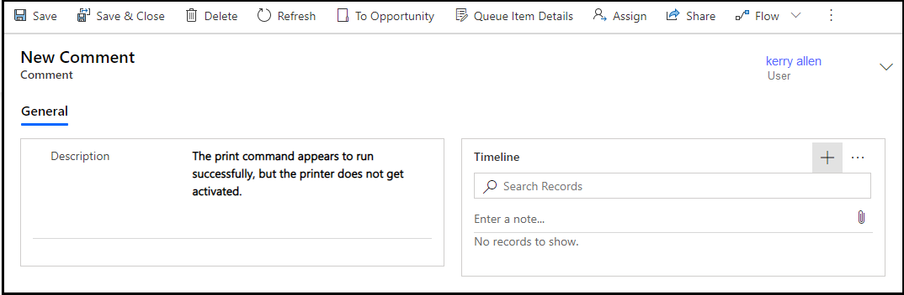

# Customer Service Team Member app

With the entry-level Team Member license, you can now address self-service support scenarios for your employees using the Customer Service Team Member app module. Employees can create cases for their problems, such as laptop issues, HR queries, and administrative needs, and interact with service representatives through the commenting feature. They can also search the knowledge base for solutions pertaining to their problems.

> [!NOTE]
> The Customer Service Team Member app isn't supported with Dynamics 365 Customer Engagement (on-premises).

## Install Customer Service Team Member app

An administrator must install the Customer Service Team Member app in your environment and assign the **Customer Service Team Member** security role to users before they can access it.

1. As an administrator, sign in to [Power Platform admin center](https://admin.powerplatform.microsoft.com/).
1. In the site map, expand **Resources**, and then select **Dynamics 365 apps**.
1. On the apps list page, select the ellipses next to **Customer Service Team Member**, and then select **Install**.
1. In the **Install Customer Service Team Member** panel, select an environment from the list.
1. Select the terms of service, and then select **Install**.
1. Assign the **Customer Service Team Member** role to the users who need access to the app. To learn about granting the role, refer to [Assign a security role to a user](/power-platform/admin/create-users-assign-online-security-roles#assign-a-security-role-to-a-user).

## Change the default account

You can update the default account that appears for employees when they're creating a case. Perform the steps outlined in this section to update the default account.

> [!IMPORTANT]
>
> Don't modify the default account that's available out of the box with the app; instead, deactivate the out-of-the-box account, and configure a new account and set it as the default.

1. In your instance, go to Copilot Service admin center, and create an account.
1. Copy the account record ID from the account record's URL.
1. Go to [Power Apps](https://make.powerapps.com), and then select **Solutions**.
1. In the **Solutions** list, browse and select **Customer Service Team Member**.
1. On the **Solutions** > **Customer Service Team Member** page, select **Default customer account**. The **Edit Default customer account** dialog appears.
1. Under **Current value**, select **New value**.
1. In the box that appears, paste the account ID that you copied in step 2, and then select **Save**. The account you chose is set as the default account.

## Use the Customer Service Team Member app

In the Customer Service Team Member app, you can perform the following tasks:

- Create, read, update, and close cases that you created.
- Use the comments feature for your cases to interact with service representatives.
- Add notes and attachments to your cases after you save the first comment.
- Search and read knowledge articles.

> [!NOTE]
> The Customer Service Team Member app doesn't support the following capabilities:
>
> - View or update cases created by other users.
> - Edit the **Customer** field on a case.
> - Send article URLs from knowledge search.
> - Author, edit, or publish knowledge articles.
> - Work with queues, routing, service-level agreements (SLAs), or entitlements.
>
> Capabilities outside the designated Team Member scenarios require a full Dynamics 365 Customer Service license and the appropriate security role.

1. Sign in to Dynamics 365, and select **Customer Service Team Member**.
1. Select **Cases**. The **Active Cases created by me** page appears.
1. Select **New Case**. The **New Case** page appears.
1. Enter the following details on the **Summary** tab:

   - **Case Title**: Specify a title.
   - **Subject**: Specify the subject.
   - **Product**: Select the product category.
   - **Description**: Specify a description that summarizes the problem.

    > [!NOTE]
    > You can't edit the **Customer** field. Its value is set to the default account configured by your administrator.

1. Select **Save**. The **Comments** section appears.
1. Select **New Comment**. The **New Comment** page appears.
1. In **General** > **Description**, enter additional information about the problem.
1. Select **Save**. The **Timeline** section becomes available so you can add notes and attach files related to the problem.
  
    > [!div class="mx-imgBorder"]
    > 

1. Optional: Select **Enter a note** to add notes and attach files.
1. Select **Save & Close**. The **Active Cases created by me** page appears.
1. Select **Knowledge Search** to find articles that might help resolve your issue. Learn more in [Search the knowledge base in Customer Service Hub](../use/search-knowledge-articles-csh.md#search-the-knowledge-base-in-customer-service-hub).

    > [!NOTE]
    > "Send article URLs" isn't supported in the Customer Service Team Member app.

1. If you want to close a case after it's resolved, you can select the case on the **Active Cases created by me** page, and then select **Close Case**. Alternatively, you can close the case on the **My Case** page.

> [!IMPORTANT]
> The Team Members license supports limited customization of the Team Member app. Before you extend forms, add entities, or change the app module, review the [customization restrictions](/dynamics365/get-started/team-members-license#customization-restrictions) to ensure that your changes conform to the Team Members license terms.

## Related information

[Dynamics 365 Team Members license](/dynamics365/get-started/team-members-license)  

[!INCLUDE[footer-include](../../includes/footer-banner.md)]
