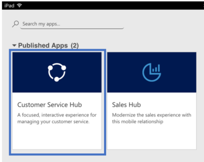

# Welcome to Dynamics 365 Customer Service

> [!TIP]
> To evaluate Dynamics 365 Customer Service before purchasing it, sign up for a [30-day trial](https://dynamics.microsoft.com/customer-service/customer-service/free-trial/).
> Explore [Copilot](/dynamics365/contact-center/use/copilot-feature-availability), a feature that can enhance representative productivity in Customer Service.

Welcome to Dynamics 365 Customer Service! Customer Service brings together capabilities to help your organization deliver personalized, efficient support across channels.

The customer service representative (service representative, representative) experience is at the heart of Customer Service. With the right app and configuration, representatives can manage requests from any channel, work across multiple sessions and apps without losing context, and use productivity tools to focus on customer needs.

## Find the guidance you need

Use the following links to quickly find guidance for common Customer Service tasks.

| If you want to... | Start here... |
|---|---|
| Set up and administer Customer Service | [Copilot Service admin center at a glance](cs-admin-center.md) |
| Configure and manage routing | [Overview of unified routing](../administer/overview-unified-routing.md) |
| Configure channels | [Overview of channels](../use/channels.md) |
| Review performance and analytics | [Use and customize analytics and insights](../administer/analytics_overview.md) |
| Learn about Customer Service apps and experiences | [Customer Service apps and experiences](#customer-service-apps-and-experiences) |
| Learn about autonomous agents | [Autonomous service agents in Dynamics 365](/dynamics365/contact-center/administer/autonomous-agents-overview) |
| Extend or integrate Customer Service | [Dynamics 365 Channel Integration Framework](../../channel-integration-framework/channel-integration-framework.md) |
| Work with Customer Service data programmatically | [Microsoft Dataverse Web API](/power-apps/developer/data-platform/webapi/overview) |
| Find answers to common routing questions | [Unified routing FAQs](../administer/unified-routing-faqs.md) |

## Customer Service capabilities

Use Customer Service to:

- Track customer issues through cases
- Record all interactions related to a case
- Share information in the knowledge base
- Use unified routing to efficiently route work items
- Manage conversations across channels, including voice
- Use AI-driven insights and analytics to improve customer satisfaction
- Use Copilot features in Copilot Service workspace to help representatives find information, summarize cases and conversations, and complete tasks
- Use autonomous agents to automate customer service tasks
- Collaborate with experts in Microsoft Teams
- Create and track service levels through service-level agreements (SLAs)
- Define service terms through entitlements
- Manage performance and productivity through reports and dashboards
- Create and schedule services
- Participate in chats

## Administer Customer Service

The capabilities available in Customer Service depend on the licenses your organization purchased.

Use Copilot Service admin center to manage Customer Service features in one place. You can configure customer support, operations, representative experiences, service terms, service scheduling, and channels. For more information, go to [Copilot Service admin center at a glance](cs-admin-center.md).

## Customer Service apps and experiences

Customer Service provides different app experiences for service representatives, team members, and administrators. The apps and experiences available to your organization depend on your licenses, environment, and configuration.

### Service representatives

**Copilot Service workspace**

[Copilot Service workspace](csw-overview.md) is the primary app for service representatives. It provides a multisession experience for managing cases, conversations, and other customer interactions.

For new organizations with Enterprise licenses, Copilot Service workspace replaces Customer Service Hub. Existing customers can migrate to Copilot Service workspace from Customer Service Hub and other deprecated apps.

**Customer Service Hub**

[Customer Service Hub](../use/user-guide-customer-service-hub.md) is a single-session app for managing cases and other customer service work. It's deprecated for new organizations with Enterprise licenses.

### Team members

**Customer Service Team Member**

[Customer Service Team Member](customer-service-team-member.md) is a lightweight app for users with a Dynamics 365 Team Members license. Team members can create cases for their own support needs, communicate with service representatives through comments, and search the knowledge base.

### Administrators

**Copilot Service admin center**

Use [Copilot Service admin center](cs-admin-center.md) to configure and manage Customer Service features. You can configure channels, unified routing, service representative experiences, and other Customer Service capabilities in one place.

### AI experiences

**Copilot Hub**

[Copilot Hub](../administer/configure-copilot-hub.md) is an AI-powered workspace for service representatives. Copilot Hub is a production-ready preview feature that administrators enable and configure through Copilot Service admin center.

### Custom apps

Organizations can create and customize apps to provide experiences tailored to their business requirements. Copilot capabilities can also be available in custom apps, depending on how the app is configured.

## Available anywhere, on any device

> [!NOTE]
> On mobile devices, install the app that's appropriate for your device. For installation instructions, go to [Install Dynamics 365 for phones and tablets](../../mobile-app/install-dynamics-365-for-phones-and-tablets.md).

On a desktop browser, you can access Customer Service apps and experiences based on your organization's configuration.

:::image type="content" source="../media/csw-default-overview.png" alt-text="Screenshot of the enhanced multisession Copilot Service workspace":::

On a mobile device with Dynamics 365 for phones and tablets installed, the app switcher displays the available app tiles.

> [!NOTE]
> If you previously installed a portal solution, turn off the **Read-only in mobile** option for the Case table to create a case or use the **Merge cases** command in Customer Service Hub. For instructions, go to [Enable or disable table options](../../customerengagement/on-premises/customize/edit-entities.md#enable-or-disable-entity-options).

## Copilot agents in Customer Service

Copilot in Dynamics 365 Customer Service includes AI-powered agents that extend Microsoft 365 Copilot with customer service-specific capabilities.

These agents use your organization's customer service data—such as cases, customer records, and interactions—to help customer service representatives find information, summarize context, and take actions without leaving their workflow.

For example, [Service Agent](../use/use-service-agent.md) helps representatives retrieve case details, generate summaries, and perform actions such as updating cases and creating follow-ups directly within Copilot experiences.

You can use Copilot agents in Microsoft 365 Copilot and within Copilot Service workspace while working on customer interactions.

## Accessibility and privacy in the Customer Service apps

Customer Service is committed to inclusive design and accessible content. The apps are designed around accessibility to help all users be productive.

For more information about app accessibility and privacy compliance, go to [Accessibility and privacy](../use/user-guide-customer-service-hub.md#accessibility-and-privacy).

## Get started with Customer Service

- [Copilot Service workspace](csw-overview.md)
- [Customer Service Team Member](customer-service-team-member.md)
- [Customer Service Hub](../use/user-guide-customer-service-hub.md)

## Training

Explore [training for Dynamics 365 Customer Service](/training/dynamics365/customer-service), including case management, workloads, service-level agreements, entitlements, and other customer service capabilities.

## Certification

[Microsoft Certified: Dynamics 365 Customer Service Functional Consultant Associate](/credentials/certifications/d365-functional-consultant-customer-service/)

Improve business processes for customer service functions, such as automatic case creation and queue management with Dynamics 365 Customer Service.
