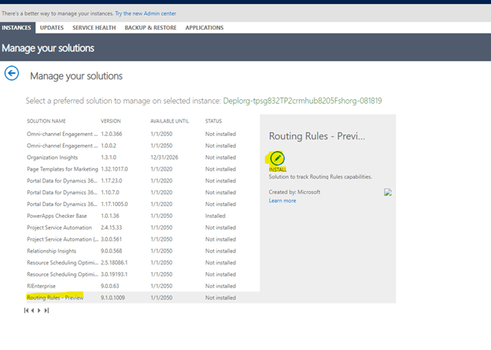

# Preview: Install Routing Rules

[!include[cc-beta-prerelease-disclaimer](../includes/cc-beta-prerelease-disclaimer.md)]

1. Go to [Microsoft 365 Admin center](https://admin.microsoft.com/AdminPortal/Home).

2. Select **Admin centers** > **All admin centers** > **Dynamics 365**. Dynamics 365 opens in a new tab.

   > [!div class=mx-imgBorder]
   > 

3. In the **Dynamics 365 Administration Center**, under the **Instances** tab, select an **Instance Type**, and then select an instance in the table. 

4. Select the edit icon beside **Solutions**. The **Manage your solutions** page appears.

   > [!div class=mx-imgBorder]
   > 

5. In the **Manage your solutions** page, select **Routing Rules - Preview**. 

6. If the status column displays **Not installed**, select the **INSTALL** icon. The **Terms of service** page appears.

   > [!div class=mx-imgBorder]
   > 

7. On the **Terms of service** page, read the terms and conditions, and then select **install**. The installation may take few minutes.

    The solution is installed in your organization.

### See also

[Automatically route cases using routing rule sets](create-rules-automatically-route-cases.md)
