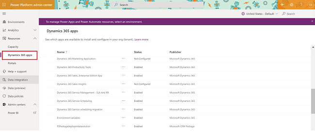
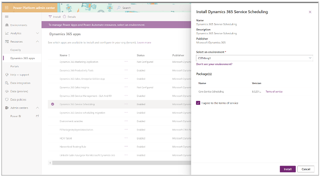

# Install Service Scheduling from Power Platform

You can install Core Service Scheduling from the Power Platform admin center by using the following steps:

1. Expand **Resources**, and then select **Dynamics 365 apps**.

   
  
2. Under the list of application names, select **Dynamics 365 Service Scheduling**, and then select **Install**.

3. Select the environment where you would like to install the latest app (the installation will start with the dev environment. Once the dev instance succeeds, it will change to test and then production.

   

4. If you agree to the terms and conditions, select the checkbox next to **I agree to the terms of service**, and then select **Install**.
