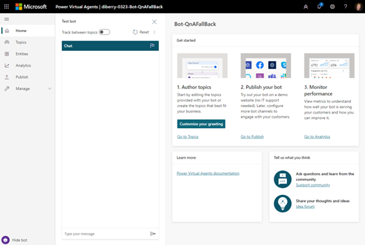
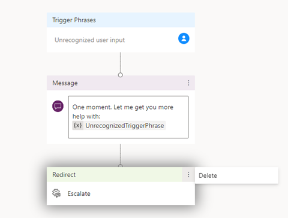
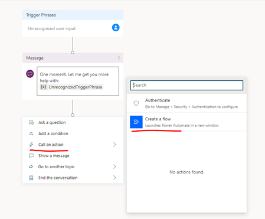
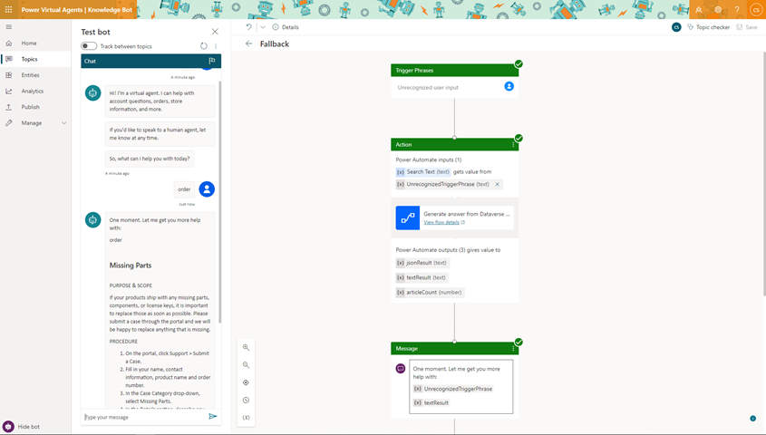

# Integrate Knowledge Management with Power Virtual Agents bot

To integrate a Power Virtual Agents bot to assist in Knowledge management, you need to perform the following steps.

1. Create and publish knowledge articles to Power Apps portal
2. Create a Power Virtual Agents bot
3. Create a topic and add an action
4. Use Knowledge search Power Automate template
5. Add a Power Automate flow to the solution
6. Add the solution's flow to Power Virtual Agents
7. Test the flow
8. Publish Power Virtual Agents bot
9. Share the Power Virtual Agents bot


## Create and publish knowledge articles to Power Apps portal

Set up your Power Apps portal before you begin integrating Knowledge Management with Power Virtual Agent bots. More information: [Configure Knowledge Management](set-up-knowledge-management-embedded-knowledge-search.md).

You can create and manage knowledge articles by marking the **Internal** field to **No**. For more information on managing knowledge articles, see [Create and manage knowledge articles](customer-service-hub-user-guide-knowledge-article.md).

## Create a Power Virtual Agents bot

1. Sign in to Power Virtual Agents.
2. Select **New bot**.

    > [!div class="mx-imgBorder"]
    > 

 You can select **Topics** to see the knowledge articles and topics that are provided by the bot.

## Create a topic and add an action

The system fallback topic can help agents present answers to customers when the knowledge search doesn't provide relevant knowledge articles. You can create the fallback topic and add an action. The action allows the fallback topic to be displayed as a message to agents. To create a fallback topic, perform the following steps.

1. In the Power Virtual Agents portal, select **Settings** and then **System Fallback**.
2. Select **Add**.
3. After the topic is added, select **Go to Fallback topic** to author the topic.

You can add an action to the topic that you created. Adding an action allows the fallback topic to be displayed as a message to agents.
Perform the following steps to add a call back action and  initiate the flow.

1. On the authoring canvas, delete the **Escalate** item by selecting **Options.**

    > [!div class="mx-imgBorder"]
    > 

2. Select the connector flowing to the message box and select **Call an action** > **Create a flow**.

    > [!div class="mx-imgBorder"]
    > 

This process takes you to the Power Apps portal and opens a new template for authoring.

## Use the Knowledge search Power Automate template

You can use the Power Automate template that you created to connect to the knowledge base by performing the following steps.

1. In the Power Automate page, select **Template**.
 
    > [!NOTE]
    > In the pop-up box that appears, select **Leave** and exit the current browser page.

2. On the templates page, search for the **Generate answers from Dataverse knowledge articles to Power Virtual Agent** template. 

    > [!div class="mx-imgBorder"]
    > 

3. Select **Continue**. You will be redirected to the Power Automate flow template.

## Add a Power Automate flow to your solution

For the agent to find the topic and connect to the flow, it must be included within the power automate solution.

1. In the Power Automate portal, select **Solutions.**
2. Select **New solution**.
3. Enter a display name. The list of solutions includes every solution in your organization. Choose a naming convention that helps you filter to just your solutions. For example, you might prefix your email to your solution name: *johndoe-power-virtual-agent-knowledgesearch-fallback*.
4. Select your publisher from the list of choices.
5. Accept the default values for name and version.
6. Select **Create** to finish the process.
 
     > [!div class="mx-imgBorder"]
     > 

### Add your flow to the solution

1. In the list of solutions, select the solution you just created. It should be at the top of the list. If it isn't, search by your email address, which is part of the solution name.
2. In the solution, select **Add existing**, and then select **Flow** from the list.
3. Find your flow from the **Outside solutions** list, and then select **Add** to finish the process. If there are several flows, look at the **Modified** column to find the most recent flow.

## Add your solution's flow to Power Virtual Agents

1. Open the browser with the authoring canvas.
2. To insert a new step in the flow, above the **Message** action box, select the connector and then select **Call an action**.
3. From the flow pop-up window, select the new flow named **Generate answer from Dataverse knowledge articles for Power Virtual Agent**, the new action appears in the flow.
4. To correctly set the input variable to the action, select **Select a variable**, then select **bot.UnrecognizedTriggerPhrase**.

     > [!div class="mx-imgBorder"]
     > 

5. To return the knowledge article search results to the bot, there are a few steps that you can perform.
    
    - To correctly set the output variable to the **Generate answer from Dataverse knowledge articles for Power Virtual Agent** action, select **UnrecognizedTriggerPhrase**, from the **Message** action box. Then select the dropdown next to {x} to insert a variable, then select  **textResult** which has the article result in text format which will render the whole article content as text in the message. 
    
    - Or use thumbnail cards to show the article. More information: [Respond with cards](/composer/how-to-send-cards#thumbnailcard).
    
    - Or use the sample code to render in adaptive cards.
    

    
#kbcardjason()
```
- 
{
  "type": "AdaptiveCard",
    "body": [
        {
            "type": "ColumnSet",
            "columns": [
                {
                    "type": "Column",
                    "items": [
                        {
                            "type": "Image",
                            "height": "35px",
                            "url": "https://th.bing.com/th/id/R4fbade037f8209666b06aa22641708fc?rik=ya%2bpnPJ41EFFMg&riu=http%3a%2f%2fmolnar-institute.com%2ffileadmin%2f_processed_%2fcsm_KnowledgeManagement_icon_forWebsite_bcda89676b.png&ehk=J%2bz2G15xtbJgd7ssSXo7X2q7LDLaMGl7EuGUSQU6P2s%3d&risl=&pid=ImgRaw",
                            "size": "Small"
                        }
                    ],
                    "width": "auto"
                },
                {
                    "type": "Column",
                    "items": [
                        {
                            "type": "TextBlock",
                            "weight": "Bolder",
                            "text": "${dialog.currentarticle.title}",
                            "wrap": true,
                            "size": "Large"
                        },
                        {
                            "type": "TextBlock",
                            "spacing": "None",
                            "text": "Last modified on ${dialog.currentarticle.modifiedon}",
                            "isSubtle": true,
                            "wrap": true
                        }
                    ],
                    "width": "stretch"
                }
            ]
        },
        {
            "type": "TextBlock",
            "text": "${json(virtualagent.jsonResult).articles[0].description}",
            "wrap": true,
            "size": "medium"
        }
    ],
    "actions": [
        {
            "type": "Action.OpenUrl",
            "title": "View article in Dynamics App",
            "url": "${dialog.currentarticle.articleurl}"
        }
    ],
    "$schema": "http://adaptivecards.io/schemas/adaptive-card.json",
    "version": "1.0"
}
```

## Test the flow

Once you have the fallback topic saved, you can test your Bot by typing some queries, if an existing topic can't answer the question, the topic that you created is displayed as a message. 

  > [!div class="mx-imgBorder"]
  > 

## Publish the Power Virtual Agents bot

To publish the Power Virtual agent bot, select **Publish** and look for the demo link that you will find on the same page.

## Share the Power Virtual Agents bot

To share the demo, you need to first configure it as a channel.

1. Select **Manage** > **Channel**.
2. Select **Demo website** from the channels list.
3. Copy the link and select **Save**.