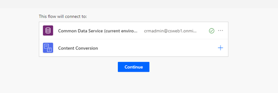
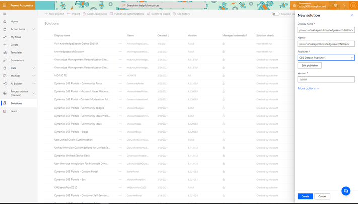
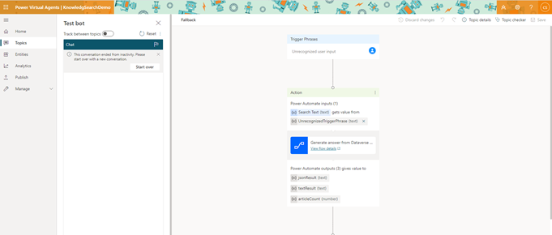

# Integrate knowledge management in Dynamics 365 with Power Virtual Agents bots

Integrate knowledge management with a Power Virtual Agents bot to use customized conversations. Bots help answer questions, perform actions, and solve simple problems. This frees up your agent's time to deal with complex issues that need human intervention.

Power Virtual Agents lets you configure bots with various topics and trigger phrases to automatically resolve questions posed by your customers on your portal page. More information: [Power Virtual Agents overview](/power-virtual-agents/fundamentals-what-is-power-virtual-agents)

You can integrate knowledge management with a Power Virtual Agents bot by using either of the following ways:

- Search Dynamics 365 knowledge articles
- Power Automate flow template

## Prerequisites

- Dataverse search must be enabled for the integration. You must have a system administrator role to be able to enable Dataverse search. More information: [Configure Dataverse search for your environment](/power-platform/admin/configure-relevance-search-organization)

- You must perform the following two steps before you begin the integration.

  1. Create and publish knowledge articles to a portal created in Power Apps.
  
     Set up your portal with the Power Apps portals feature before integrating knowledge management with the Power Virtual Agents bot. More information: [Use settings to set up knowledge management](set-up-knowledge-management-embedded-knowledge-search.md). For more information on setting up your Power Apps portal, see: [Power Apps portal documentation](/powerapps/maker/portals/).

     You can create and manage knowledge articles by setting the **Internal** field to **No** in the Microsoft Datverse Web API. More information: [knowledgearticle EntityType](/dynamics365/customer-engagement/web-api/knowledgearticle)

  2. Create a Power Virtual Agents bot and a topic in it.

     - For more information on creating a bot, go to [Create and delete Power Virtual Agents bots](/power-virtual-agents/authoring-first-bot).
     - For more information on creating a topic, go to [Create and edit topics in your Power Virtual Agents bot](/power-virtual-agents/authoring-create-edit-topics).
   
## Use the Search Dynamics 365 knowledge article flow action

Perform the following steps if you want to integrate a Power Virtual Agents bot with knowledge management using the **Search Dynamics 365 knowledge articles** action:
 
   1. Set connection references.
   1. Add the action to the Power Virtual Agents topic.

### Set connection references

Knowledge management integrated with Power Virtual Agents solution uses the flow with connections, such as **Content Conversion** and **Microsoft Dataverse**. You must configure these connection references before turning the **Search Dynamics 365 knowledge article flow** action on.

> [!NOTE]
> - If you have the Environment Maker role and can't see either the notification for connection references or the cloud flow, then you don't have the permission to update them. You must contact your system administrator or system customizer to set the connection references and enable the flow.
> - When the solution is imported from a test environment to the production environment, you must again set up the connection references as a system administrator. For more information on importing, go to [Export and import bots using solutions](/power-virtual-agents/authoring-export-import-bots).

To set connection references:
   
1. Go to [make.powerapps.com](https://make.powerapps.com).
1. Go to **Solutions**. The **Solutions** page displays a notification with a link to configure connection references.

    :::image type="content" source="media/con-ref-notification.png" alt-text="Connection reference notification":::
1. Select the link. If you don't see the notification on the **Solutions** page, go to **Default Solutions** > **Connection references**.

    :::image type="content" source="media/con-ref.png" alt-text="Connection References page":::

1. Select the connections for **Microsoft Dataverse** and **Content Conversion** on the **Connection references** page.
1. Select **Save and Close**.  
1. Go to **Default Solution** > **Cloud flows** and turn on **Search Dynamics 365 knowledge article flow** flow.

     :::image type="content" source="media/ka-article flow-on.png" alt-text="Turn on knowledge article flow":::

### Add the action to the Power Virtual Agents topic

After you configure the connection references in [make.powerapps.com](https://make.powerapps.com), go to **Chatbots** > **List** and select the required chatbot. This will take you to the Power Virtual Agents portal where you can create a topic.
If you need to create a chatbot, see [Create chatbots from Power Apps](/power-apps/chatbots).

You can create a topic with two question nodes for search text and filter, or you can configure the search integration to set up a fallback topic in case of an unrecognized search phrase. More information: [Configure the system fallback topic in Power Virtual Agents](/power-virtual-agents/authoring-system-fallback-topic)
   
If you're creating a topic with two question nodes, for the filter question node, the Power Virtual Agents author can provide a sample filter value; for example, **statecode eq 3**.

Perform the following steps to ensure that flow is properly configured and can now be replaced with **Search Dynamics 365 knowledge articles** action.
  
1. On the Power Virtual Agents portal, select **Topics** > **New Topic**.
1. Within the topic, create a question node to ask the user to search for the input text.

    :::image type="content" source="media/question_node.png" alt-text="Create a question node":::
    
1. Create a question node for the filter and provide the sample filter value after you trigger the topic.
    
1. Select **Add node** (**+**) and select **Call an action**. Select **Search Dynamics 365 knowledge article flow** action.
     
1. Provide the input to the flow. An error might appear if the filter isn't provided to the flow.
    
    :::image type="content" source="media/search-flow.png" alt-text="Describes the search flow":::
    
1. Add a message node to show the results returned by the flow. More information: [Render results](#render-results)

   :::image type="content" source="media/mesg_node.png" alt-text="Add message node.":::
    
1. Select **Save**.
    
1. Use the trigger phase and run the topic to verify the flow.

   > [!TIP]
   > If your search doesn’t return any results, modify the search terms or filter conditions. You can also add a filter condition if required.

   :::image type="content" source="media/no-search-results.png" alt-text="Add a condition when no search results are returned":::  
  
1. After the topic is configured, replace the **Search Dynamics 365 knowledge article flow** with the **Search Dynamics 365 knowledge articles** action. You can now configure any bot in the organization to access knowledge articles using the **Search Dynamics 365 knowledge articles** action.

    :::image type="content" source="media/search-dialog.png" alt-text="Add action to Power Virtual Agents topic":::

2. Remove the filter question node. More information: [Work with filters](#work-with-filters).

3. Update the message node with the output from the action and select **Save**.

#### Work with filters
- By default, the search is performed on the external published articles (**statecode eq 3** and **isinternal eq false**). If you need to perform additional filtering, you can set the required filter query as the Filter (text) input variable.
- To check which filters you can use and the attributes of the knowledge article entity, go to [knowledgearticle EntityType](/dynamics365/customer-engagement/web-api/knowledgearticle).
- To write a Dataverse search query using filters, go to [Working with operators](/powerapps/user/relevance-search#working-with-operators).
- To see filter conditions that aren't supported by Dataverse search, see [Configure Dataverse search to improve search results and performance](/power-platform/admin/configure-relevance-search-organization) .
- To filter on a string attribute like keywords, append the string value to the search text.

### Publish the changes
For details on publishing the bot, see [Publish the latest bot content](/power-virtual-agents/teams/publication-fundamentals-publish-channels-teams#publish-the-latest-bot-content). If you get errors during publishing, see [Troubleshoot](#troubleshoot).
 
## Use the Power Automate flow template

Perform the following steps if you want to integrate a Power Virtual Agents bot with knowledge management by using the Power Automate flow template:

1. Create a flow using the template.
1. Add the solution's flow to the Power Virtual Agents topic.
   
### Create a flow using the template

1. Go to [powerautomate.microsoft.com](https://powerautomate.microsoft.com).

2. On the templates page, search for the **Generate answers from Dataverse knowledge articles to Power Virtual Agent** template.

    > [!div class="mx-imgBorder"]
    > 

3. Select **Continue**. You'll be redirected to the Power Automate flow template.

4. Save the template, and then select **Solutions**. You might be prompted with a message on which you can select **OK**.
    
5. Select **New solution**.

6. Enter a display name. The list of solutions includes every solution in your organization. Choose a naming convention that helps you filter to just your solution. For example, you might prefix your email to your solution name: *johndoe-power-virtual-agent-knowledgesearch-fallback*.
    
7. Select your publisher from the list of choices.
    
8. Accept the default values for name and version.
    
9. Select **Create** to complete the process.
     
    > [!div class="mx-imgBorder"]
    > 
    
10. In the list of solutions, select the solution you just created. It should appear at the top of the list. If it doesn't, search by the convention you used in step 6 to name the solution.
    
11. In the solution, select **Add existing**, and then select **Cloud Flow** from the list.
    
12. In the **Outside solutions** list, select your flow, and then select **Add** to complete the process. If there are several flows, look at the **Modified** column to find the most recent version.

For more information on managing Power Virtual Agents solutions, go to [Export and import bots using solutions](/power-virtual-agents/authoring-export-import-bots).

### Add the solution's flow to the Power Virtual Agents topic

1. Open the browser with the authoring canvas.
    
2. Above the **Message** action box, select the connector, and select **Call an action**.
    
3. From the pop-up flow window, select the new flow named **Generate answer from Dataverse knowledge articles for Power Virtual Agent**. The new action appears in the flow.
    
4. To correctly set the input variable to the action, select **Select a variable**, and then select **bot.UnrecognizedTriggerPhrase**.
    
   > [!div class="mx-imgBorder"]
   > 
    
5. To return the knowledge article search results to the bot, go to [Render results](#render-results).

## Render results
 
To return the knowledge article search results to the bot, follow either of these steps:

- Use thumbnail cards to show the article. More information: [Respond with cards](/composer/how-to-send-cards#thumbnailcard)

- Use the following sample code to render search results in adaptive cards.

#kbcardjson()
```
-  
{ 

  "type": "AdaptiveCard", 

    "body": [ 

        { 

            "type": "ColumnSet", 

            "columns": [ 

                { 

                    "type": "Column", 

                    "items": [ 

                        { 

                            "type": "Image", 

                            "height": "35px", 

                            "url": "https://th.bing.com/th/id/R4fbade037f8209666b06aa22641708fc?rik=ya%2bpnPJ41EFFMg&riu=http%3a%2f%2fmolnar-institute.com%2ffileadmin%2f_processed_%2fcsm_KnowledgeManagement_icon_forWebsite_bcda89676b.png&ehk=J%2bz2G15xtbJgd7ssSXo7X2q7LDLaMGl7EuGUSQU6P2s%3d&risl=&pid=ImgRaw", 

                            "size": "Small" 

                        } 

                    ], 

                    "width": "auto" 

                }, 

                { 

                    "type": "Column", 

                    "items": [ 

                        { 

                            "type": "TextBlock", 

                            "weight": "Bolder", 

                            "text": "${json(virtualagent.jsonResult).articles[0].title}", 

                            "wrap": true, 

                            "size": "Large" 

                        }, 

                        { 

                            "type": "TextBlock", 

                            "spacing": "None", 

                            "text": "Last modified on ${json(virtualagent.jsonResult).articles[0].modifiedon}", 

                            "isSubtle": true, 

                            "wrap": true 

                        } 

                    ], 

                    "width": "stretch" 

                } 

            ] 

        }, 

        { 

            "type": "TextBlock", 

            "text": "${json(virtualagent.jsonResult).articles[0].description}", 

            "wrap": true, 

            "size": "medium" 

        } 

    ], 

    "actions": [ 

        { 

            "type": "Action.OpenUrl", 

            "title": "View article in Dynamics App", 

            "url": "${json(virtualagent.jsonResult).articles[0].crmAppUrl}" 

        } 

    ], 

    "$schema": "http://adaptivecards.io/schemas/adaptive-card.json", 

    "version": "1.0" 

} 
```

## Troubleshoot

- If a dialog is cross-linked and is modified, you'll see a validation error on publish and Power Virtual Agents will block the publish. More information: [Publish the latest bot content](/power-virtual-agents/teams/publication-fundamentals-publish-channels-teams#publish-the-latest-bot-content)

- If errors exist while saving a topic, the **Topic checker** shows the impacted topics. Errors will prevent the bot from working and must be fixed before you can publish your bot. More information: [Topic errors](/power-virtual-agents/teams/authoring-topic-management-teams#topic-errors)

- For more information on flow error codes, go to [Error codes: Power Virtual Agents](/power-virtual-agents/error-codes)

### See also

[Create and edit topics](/power-virtual-agents/authoring-create-edit-topics)
