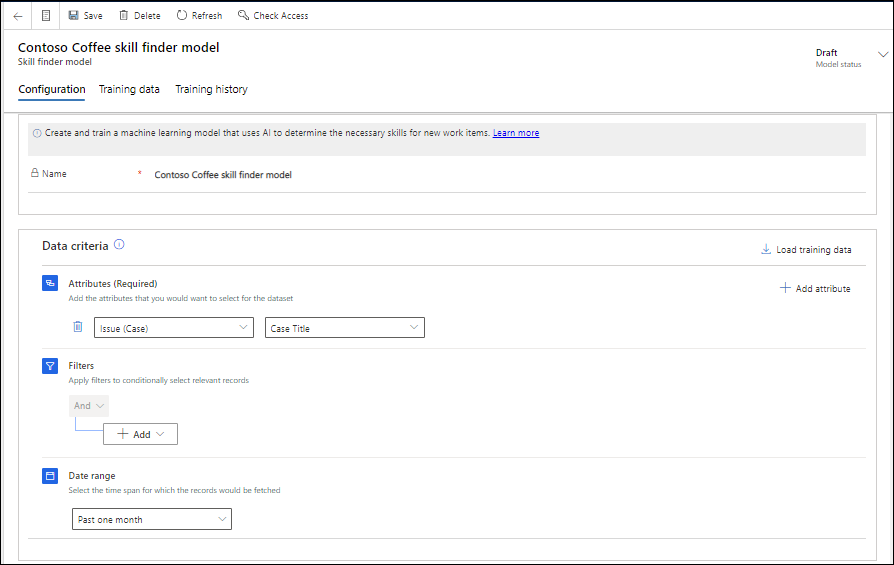
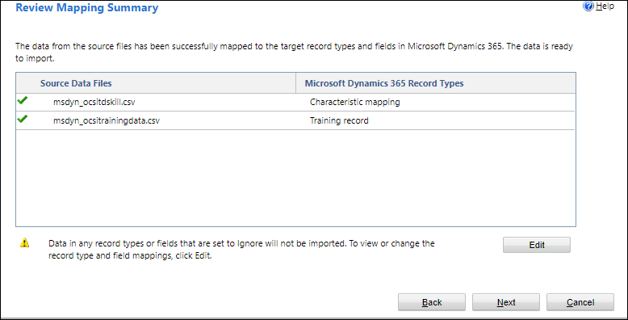

# Set up intelligent skill finder model

You can create and train machine-learning models that use AI to determine the necessary skills for new work items. You can create and train the model by using the data in Microsoft Dataverse. However, if you are trying to set up the model in a new organization or if skill-based routing was not in use, you mightn't have the skill data. In such conditions, you can use data from another application by using the **Import from Excel** option in the skill finder model.

## Create skill finder models

Perform the steps in this section to set up the intelligent skill finder model. You can create as many models as your business requires.

1. In Omnichannel admin center, select **User attributes** in the site map, and then select **Manage** beside **Intelligent skill finder**.
2. Select **New**, and on the **Configuration** tab of **New skill finder model** page, enter a name.
3. In **Data criteria**, enter the following to form the dataset records:
    - **Attributes (Required)**: Select attributes in the Attributes and related list to form the training dataset. The corresponding attribute values will be merged in the sequence they are added and will be used to form the input string for the model training data.
    - **Filters**: Optionally, apply filters to conditionally select the relevant records.
    - **Date range**: Select a value to set the time period for which the records need to be loaded.
    
    

4. Select **Save**, and then select **Load training data**. The **Training data** tab appears and displays the data load status.
5. After the load is complete, review the load, and edit the records if you want to modify the tags.
6. In the **Training data** section, select the checkbox beside **Input data** to select all the records, and select **Approve**. You must approve a minimum of 50 records for the model to be trained.
7. Select **Train model**, and select **Train model** on the confirmation dialog box.
8. After the status changes to training completed, select the rows that you want to publish, and select **Publish model**. The skills model is ready for use.

### Use training data imported from Excel file

If you do not have data to train your model, you can populate skills and attributes data in Excel files and upload them to the application by using the import feature of Microsoft Dataverse.

To use the data from the Excel files, you must make sure of the following:

- The model name in the application should match the name in the Training record column of the Excel file.

- Name the files as msdyn_ocsitrainingdata.csv and msdyn_ocsitdskill.csv.
  
A sample of each file is as follows.

**msdyn_ocsitrainingdata.csv**

|Skill finder model|Training record name|Input data|
|------------------|--------------------|----------|
|CCSFM01-Contoso Coffee skill finder model|CCSFM01-Contoso Coffee training data A10001|Hi, I work at Trey Research. One of the automatic expresso machines is becoming overheated and starts giving a burning smell after 30 minutes of usage. Please help!! Yes. No.|
|CCSFM01-Contoso Coffee skill finder model|CCSFM01-Contoso Coffee training data A10002|Hi, I work at Trey Research. One of the automatic expresso machines is becoming overheated and starts giving a burning smell after 30 minutes of usage. Please help!! Yes. No., can you please connect me to an agent|
|CCSFM01-Contoso Coffee skill finder model|CCSFM01-Contoso Coffee training data A10003|Hi, I work at Trey Research. One of the automatic expresso machines is becoming overheated and starts giving a burning smell after 30 minutes of usage. Please help!! Yes. No.t really, can you pls help|
|CCSFM01-Contoso Coffee skill finder model|CCSFM01-Contoso Coffee training data A10004|Hi, I work at Trey Research. One of the automatic expresso machines is becoming overheated and starts giving a burning smell after 30 minutes of usage. Please help!! Yes. No.t atall, can I speak to a human|
|CCSFM01-Contoso Coffee skill finder model|CCSFM01-Contoso Coffee training data A10005|Hi, I work at Trey Research. One of the automatic expresso machines is becoming overheated and starts giving a burning smell after 30 minutes of usage. Please help!! Yes. No. Need urgent attention|
||||

**msdyn_ocsitdskill.csv**

|Training record|Characteristic mapping|Characteristic|
|---------|--------|-----------|
|CCSFM01-Contoso Coffee training data A10001|Café A-100|Café A-100|
|CCSFM01-Contoso Coffee training data A10001|Heating|Heating|
|CCSFM01-Contoso Coffee training data A10001|Electrical|Electrical|
|CCSFM01-Contoso Coffee training data A10002|Café A-100|Café A-100|
|CCSFM01-Contoso Coffee training data A10002|Heating|Heating|
||||

Perform the following steps to upload the data for training your model:

1. On the **Skill finder model** page, enter a name for the model, and then save the form.
2. Select the **Training data** tab, and select **Import Excel**.
3. Select the .csv files to upload in the import tool.
   
   

4. Review the upload settings, and select **Finish** after you go through the stages. The data upload starts. The time taken for the data upload depends on the number of records.
5. Optionally, you can select **Refresh** to see the updated status of the data upload.
6. Perform the steps 5 through 8 in [Create skill finder models](#create-skill-finder-models) to approve, train, and publish your model.

### See also

[Create a workstream for unified routing](create-workstreams.md#create-a-workstream-in-omnichannel-admin-center)  
[Set up record routing](set-up-record-routing.md)  

[!INCLUDE[footer-include](../includes/footer-banner.md)]  