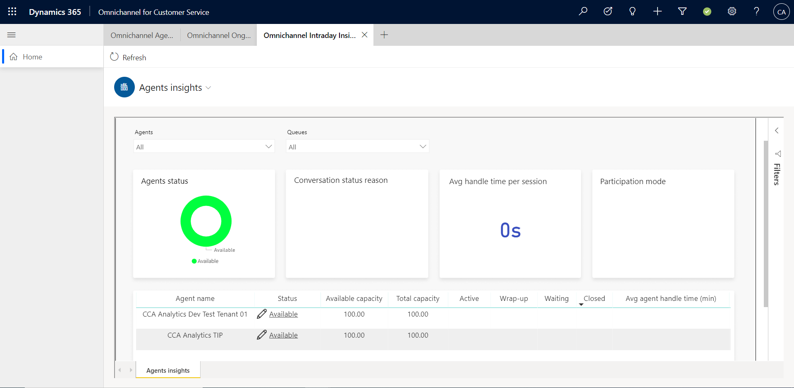

# View and understand the Omnichannel intraday insights dashboard

[!INCLUDE[cc-use-with-omnichannel](../includes/cc-use-with-omnichannel.md)]

The Omnichannel intraday insights dashboard provides metrics (key performance indicators) that reflect the health of your organization. This dashboard consists of two sections:

- [Intraday Monitoring](#intraday-monitoring)
- [Agent insights](#agent-insights)

The information displayed in these sections is based on the conversations that were closed in the last 24 hours, and is refreshed every 15 minutes. The report fetches the latest data and is generated in real time. If the report is kept open in a preconfigured Power BI workspace, it's automatically refreshed after 15 minutes; in a customer-configured workspace, the report is refreshed after every 5 minutes.

> [!IMPORTANT]
> To help ensure that the most accurate and up-to-date data is displayed on the dashboard, be sure to follow [best practices for using Omnichannel for Customer Service](best-practices.md).

## Intraday Monitoring

The intraday monitoring tab provides information on conversation and agent insights and their performance.

### Conversation insights

The **Conversations insights** section provides insights about conversation requests that have been generated in the past 24 hours, with KPIs such as the number and state of the conversations. The following image shows an example of the **Conversations insights** section.

> [!div class="mx-imgBorder"]
> 

This section of the dashboard displays the following KPIs about conversations.

| Metric | Description |
|-------|-------|
| Average wait time per conversation | For a conversation, wait time is defined as the cumulative wait time of its individual sessions. This KPI is calculated as an average that considers only closed conversations. *Session wait time* is defined as the elapsed time between the creation of a session and the time that an agent is assigned. |
| Exceeding 5 mins wait time | The number of conversations that are open and have exceeded the threshold wait time of five minutes. |
| Average handle time per conversation | For a conversation, the handle time used to calculate the average is defined as the cumulative handle time of its individual sessions. *Session handle time* is defined as the elapsed time between the creation of a session and the time that it's closed. More information: [Average handle time](#average-handle-time)|
| Exceeding 5 mins handle time | The number of active conversations that are exceeding the handle time threshold of five minutes. |
| Conversation by status | The distribution of the status of conversations across **Open**, **Active**, **Waiting**, **Wrap up**, and **Closed**. |
| Open conversations | The distribution of open conversations in pick mode and push mode, respectively. |
|||

## Agent insights

The **Agent insights** section provides information about the latest KPIs, the health of the queues, and the status of agents on a given day. An example of the **Agent insights** section is shown in the following image.

> [!div class="mx-imgBorder"]
> 

This section of the dashboard displays the following KPIs and their status.

| KPI | Description |
|-------|-------|
| Agent availability | The distribution of agents by presence status. The status of agents can be **Available**, **Busy**, **Busy-do not disturb**, **Away**, **Offline**, or a custom status that you define.|
| Average handle time per session | The average handle time for an agent is calculated based on the active time the agent spends in a session from the time the conversation is active until it's closed. This includes the time the agent takes to wrap up the conversation. More information: [Average handle time](#average-handle-time) |
| Average response time per session | The average time that an agent takes to accept a conversation from the time it's assigned. |
| Agent sessions abandon rate | The percentage of conversation sessions abandoned by agents due to timed-out or rejected requests. |
| Agents with longest handle time | The list of agents who have the highest handle times. |
| Sessions abandoned by agents | The number of sessions that are abandoned by agents. |
| Total sessions transferred | The number of sessions that are transferred to agents and supervisors, along with the break-up between the two. |
| Average consult time | The average time spent by agents on consultation for other agents or supervisors, across sessions. |
| Conversations per online agent | The average number of active conversations being handled by agents whose status is currently **Available**, **Busy**, or **Busy-do not disturb**. |
|||

### Agent insights report

In the agent insights report, you can view specific insights about the performance of individual agents or a group of agents in a queue, such as their availability, average length of time in conversations, and average response time per session. The following image shows an example of a queue for a group of agents.
 
> [!div class="mx-imgBorder"]
> 

The agents insights section displays the status of different conversations.

| Conversation status | Description |
|-------|-------|
| Agent status | The availability of the agent. |
| Conversation status reason | The status of the latest conversation between an agent and a customer. |
| Avg handle time per session | The average handle time for an agent is calculated based on the active time the agent spends in a session from the time the conversation is active until it's closed. This includes the time the agent takes to wrap up the conversation. More information: [Average handle time](#average-handle-time)|
| Participation mode | The split of sessions into three types: **Primary** indicates that the agent is engaged in a session, **Consult** indicates that the agent is engaged in a consulting session with another agent, and **Monitor** indicates that the agent is monitoring the conversation.|

You can filter on a specific queue or set of queues to view more specific information about an agent or group of agents. You can select the **Status** field to modify the presence indicator for an agent. You can also hover over an agent's name and a pop-up window will appear, showing details such as the agent's presence, current conversations, and the sentiments of those conversations.

The following image shows the options for viewing agent information in specific queues.

> [!div class="mx-imgBorder"]
> 

The table in the agent insights dashboard displays details about the agents in the queue.

| Agent details | Description |
|-------|-------|
| Agent name | A list of the agent names for the queue. |
| Status | The current presence of the agent. |
| Available capacity | The current free capacity for the agent. |
| Total capacity | The total capacity configured for an agent. |
| Active | The number of conversations that are ongoing. |
| Wrap-up | The number of conversations in the post-conversation stage. More information: [Understand conversation states](oc-conversation-state.md#wrap-up) |
| Waiting | The number of conversations that are yet to be assigned to agents. |
| Closed | The number of conversations that have been closed by agents. |
| Avg handle time (min) | The average of an individual agent's handle time, in minutes, for all closed conversations that the agent is involved in. More information: [Average handle time](#average-handle-time) |
|||

You can also view details about a specific agent by right-clicking the agent's name and then selecting **Drill through** > **Agent details** on the shortcut menu, as shown in the following image.

> [!div class="mx-imgBorder"]
> 

> [!NOTE]
> The **Drill through** feature isn't supported outside of Omnichannel for Customer Service.

The agent's details are displayed, as shown in the following image.

> [!div class="mx-imgBorder"]
> 

This section of the dashboard displays the following details.

| Detail | Description |
|-------|-------|
| Status | The agent's current presence : **Available**, **Offline**, **Do not disturb**, or **Busy**. |
| Status since | The amount of time that this agent has been in their current presence. |
| Available capacity | The agent's current free capacity. |
| Total capacity | The total capacity configured for an agent. |
| Logged in duration 24 hrs | The total duration for which the agent has been signed in during the past 24 hours.|
| Logged off duration 24 hrs | The total duration for which the agent has been signed out during the past 24 hours. |
| Logged in duration 12 hrs | The total duration for which the agent has been signed in during the past 12 hours.|
| Logged off duration 12 hrs | The total duration for which the agent has been signed out during the past 12 hours. |
| Queues | The queues that the agent is mapped to. |
| Skills | The skills that are assigned to the agent.|
| Conversation status reason | The status of the latest conversation between the agent and a customer. | 
| Avg handle time per session | The average handle time for an agent is calculated based on the active time the agent spends in a session from the time the conversation is active until it's closed. This includes the time the agent takes to wrap up the conversation. More information: [Average handle time](#average-handle-time) |
| Logged in states duration | The agent's presence when the agent is signed in. The state reflects the base presence and not any custom presence.|
| Subject | For an identified customer, the customer's name is displayed with the subject. For unidentified customers, static text is displayed with a "Visitor" label. More information: [Automatically identify customers](record-identification-rule.md) |
| Participation mode | **Primary** indicates that the agent is engaged in a session. **Consult** means that the agent is engaged in a consulting session with another agent. **Monitor** means that this agent is monitoring the session. |
| Workstream | The work stream that the conversation is assigned to. |
| Channel | The channel that the conversation was created from. |
| Queue | The queue that the conversation is currently part of. |
| Status reason | The current conversation status. |
| Customer sentiment | The current sentiment. |
| Created on | The conversation creation time. |
| Capacity and status timeline | Every change in capacity or status is plotted on the timeline. Negative capacity is displayed if a supervisor assigns a conversation to an agent that's beyond the agent's available capacity. |
|||

## View and filter reports

You can filter information by selecting the queues that have been defined for your organization. From the **Omnichannel queues** drop-down list, select the queues you want, and the information will be filtered according to your selection. This helps you quickly analyze the KPIs and take any necessary steps to improve outcomes.

> [!div class=mx-imgBorder]
> 

## Average handle time

The average handle time for a conversation is defined as the cumulative handle times of its individual sessions. The session handle times take into account only the active time of agents. The average handle time for an agent is calculated based on the active time the agent spends in a session from the time the conversation is active until it's closed. This includes the time the agent takes to wrap up the conversation. When an agent concurrently handles multiple customers and switches sessions, the active time for the previous session is paused and the active time for the current session resumes. 

If the agent spends time providing consultation, it's included in the agent's average handle time. Similarly, for supervisors, the monitor time is included in the supervisor's average handle time.
When a conversation is transferred, the active time spent by all agents who are involved is summed up to compute the handle time for the conversation.

Average handle time will be accurately calculated if you ensure the following:

- Agents close the sessions by selecting the close button at the end of their shift. More information: [Conversation in waiting status](oc-conversation-state.md)
- Agents don't change the computer time.
- Agents don't use incognito mode in Google Chrome or private browsing in Microsoft Edge.

When an agent steps away from the desk during an ongoing session and doesn't interact with the customer, the system counts this time as active and subsequently computes a higher value for the handle time. For a more realistic reporting on the active time that agents spend in the session, you can configure the idle time threshold. If no agent activity is detected after the idle time threshold is reached, the handle time computation is paused. The computation resumes if any mouse, touch, or keyboard activity is detected. By default, the idle time threshold isn't enabled out of the box. More information: [Set the idle time threshold](set-idle-time-threshold.md)

### See also

[Introduction to intraday insights dashboard](intro-intraday-insights-dashboard.md)  
[View and understand Ongoing Conversations dashboard](ongoing-conversations-dashboard.md)  

[!INCLUDE[footer-include](../includes/footer-banner.md)]