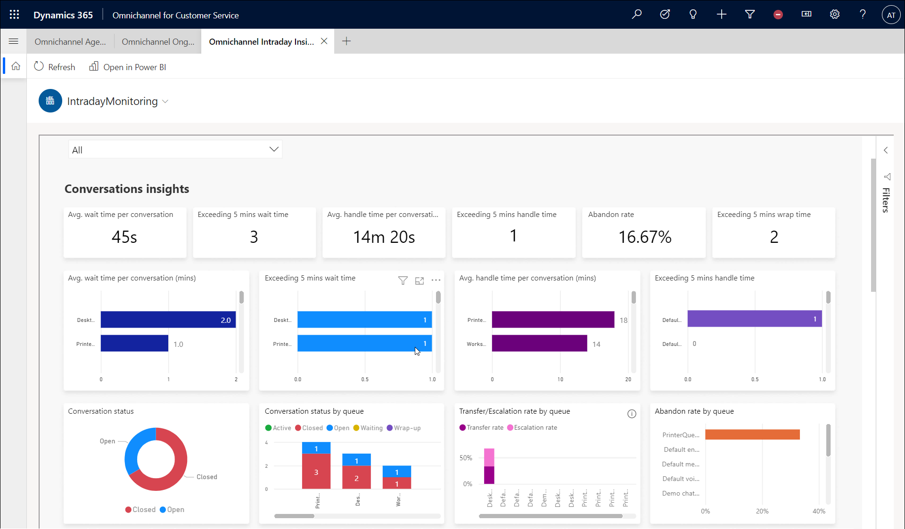
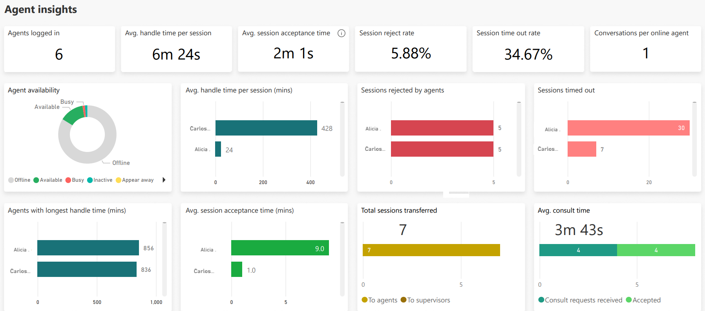

# View and understand Omnichannel intraday insights dashboards

[!INCLUDE[cc-use-with-omnichannel](../includes/cc-use-with-omnichannel.md)]

## Introduction

The **Omnichannel intraday insights** dashboards provide information about the health and key performance indicators (KPIs) for your organization. Omnichannel intraday insights consists of the following reports.

- [IntradayMonitoring](#the-intradaymonitoring-report)
- [Conversation insights](intraday-conversation-insights.md)
- [Agents insights](intraday-agents-insights.md)

The information displayed in these reports is based on the conversations that were started or closed within the last 24 hours. The report fetches the latest data and is generated in real time when a supervisor accesses it. If the report in a customer configured workspace is kept open, it's automatically refreshed after 15 minutes. In a pre-configured Power BI workspace, the report auto refreshes after every 5 minutes.

> [!IMPORTANT]
> To help ensure that the most accurate and up-to-date data is displayed on the dashboard, be sure to follow [best practices for using Omnichannel for Customer Service](best-practices.md).

## The IntradayMonitoring report

The IntradayMonitoring report deals with the overall contact center health and has relevant metrics to help understand it. This report contains two sections:

- The Conversation insights section provides metrics on the customer side, such as Customers waiting in queue and wait times.
- The Agent insights section contains metrics pertaining to agents such as Agents logged in and and handle times.

### Conversations insights

The **Conversations insights** section provides metrics from a customer standpoint. A sample view of the metrics in **Conversations insights** is as follows.

> [!div class="mx-imgBorder"]
> 

The KPIs for conversations in the IntradayMonitoring report are as follows.

| Metric | Description |
|-------|-------|
| Average wait time per conversation | For a conversation, wait time is defined as the cumulative wait time of its individual sessions. This KPI is calculated as an average that considers only closed conversations. Session wait time is defined as the elapsed time between the creation of a session until the time an agent accepts it. This metric is also displayed on a per-queue basis. |
| Exceeding 5 mins wait time | The number of conversations that are open and have exceeded the threshold wait time of five minutes. This metric is also displayed on a per-queue basis. |
| Exceeding 5 mins wrap time | The number of conversations that are open and have exceeded the threshold wrap time of five minutes. |
| Abandon rate | The percentage of conversations abandoned by customers before connecting to an agent. This metric is also displayed on a per-queue basis. | 
| Average handle time per conversation | For a conversation, the handle time used to calculate the average is defined as the cumulative handle time of its individual sessions. *Session handle time* is defined as the elapsed time between the creation of a session and the time that it's closed. Average handle time is also displayed on a per-queue basis. More information: [Average handle time](#average-handle-time). |
| Exceeding 5 mins handle time | The number of active conversations that are exceeding the handle time threshold of five minutes. This metric is also displayed on a per-queue basis. |
| Conversation status | The distribution of the status of conversations across **Open**, **Active**, **Waiting**, **Wrap up**, and **Closed**. |
| Conversation status by queue | The distribution of the status of conversations across different queues. |
| Transfer/Escalation rate by queue | The transfer rate is the percentage of conversations in a queue that was transferred atleast once. Escalation rate is the percentage of the conversations within a queue escalated to a supervisor. |
|||

### Agent insights

The **Agent insights** section provides information about the health of the queues and the status of agents in a day. The agent insights section consolidates sessions across all channels. A sample view of the **Agent insights** section is as follows.

> [!div class="mx-imgBorder"]
> 

This section consists of the following performance indicators.

| Metric | Description |
| ------------ | --------------- |
| Agents logged in | The number of agents who are signed in.|
| Average handle time per session | The average time that an agent takes to accept a conversation and resolve it. |
| Average session acceptance time | The average time an agent takes to accept an incoming conversation. |
| Session reject rate | The percentage of sessions rejected by the agents out of the total sessions assigned to them. |
| Session time out rate | The rate of sessions that were timed out |
| Sessions rejected by agents | The percentage of sessions rejected out of the total sessions assigned per agent. |
| Sessions timed out | The rate of sessions that were timed out per agent. |
| Conversations per online agent | The number of conversations that are handled by each agent. |
| Agent availability | The distribution of agents presence. |
| Agents with longest handle time | The number of agents with the longest time to accept a conversation and resolve it. |
| Total sessions transferred | The number of sessions that were transferred to other agents or supervisors. |
| Average consult time | The average time spent by agents consulting with other agents or supervisors. |
|||

## View and filter reports

You can filter information by selecting the queues that have been defined for your organization. From the **Omnichannel queues** drop-down list, select the queues you want, and the information will be filtered according to your selection. This helps you quickly analyze the KPIs and take any necessary steps to improve outcomes.

> [!div class="mx-imgBorder"]
> 

## Average handle time

The average handle time for a conversation is defined as the cumulative handle times of its individual sessions. The session handle times take into account only the active time of agents. The average handle time for an agent is calculated based on the active time the agent spends in a session from the time the conversation is active until it's closed. This includes the time the agent takes to wrap up the conversation. When an agent concurrently handles multiple customers and switches sessions, the active time for the previous session is paused and the active time for the current session resumes.

If the agent spends time providing consultation, it's included in the agent's average handle time. Similarly, for supervisors, the monitor time is included in the supervisor's average handle time.
When a conversation is transferred, the active time spent by all agents who are involved is summed up to compute the handle time for the conversation.

Average handle time will be accurately calculated if you ensure the following:

- Agents close the sessions by selecting the **Close** button at the end of their shift. More information: [Conversation in waiting status](oc-conversation-state.md).
- Agents don't change the computer time.
- Agents don't use incognito mode in Google Chrome or private browsing in Microsoft Edge.

When an agent steps away from the desk during an ongoing session and doesn't interact with the customer, the system counts this time as active and subsequently computes a higher value for the handle time. For a more realistic report of the active time that agents spend in the session, you can configure the idle time threshold. If no agent activity is detected after the idle time threshold is reached, the handle time computation is paused. The computation resumes if any mouse, touch, or keyboard activity is detected. By default, the idle time threshold isn't enabled out of the box. More information: [Set the idle time threshold](set-idle-time-threshold.md).

## Saved views for Intraday reports

You can save the filters that you used for the reports as bookmarks. The bookmarks allow you to access the filters easily and repeatedly, without having to apply the filters every time. You can switch between the multiple bookmarks when you're managing different reports and teams. The saved views allow you to save the queues and agents pertaining to different teams and lets you switch between the filters to view the metrics for each team.

You can create personal bookmarks that are visible only to you. Bookmarks that are created by PowerBI administrators can be shared with all users in a read-only mode.

More information:

- [Create bookmarks in Power BI Desktop to share insights and build stories](/power-bi/create-reports/desktop-bookmarks)
- [Create personal bookmarks](/power-bi/consumer/end-user-bookmarks)

## Slice metrics by time

The **Duration** option that is available in all reports lets you filter the report details. The filter helps you look at the metrics for the shift the supervisor is handling out of the entire 24 hours duration. The filter lets you report the data within the last four, eight, or twelve hours duration or apply a custom value as well. The metrics within the reports are calculated based on the conversations created in the selected time duration.

### See also

[Introduction to intraday insights dashboard](intro-intraday-insights-dashboard.md)  
[View and understand the Agents insights report](intraday-agents-insights.md)  
[View and understand the Conversation insights report](intraday-conversation-insights.md)  
[View and understand Ongoing Conversations dashboard](ongoing-conversations-dashboard.md)  

[!INCLUDE[footer-include](../includes/footer-banner.md)]
