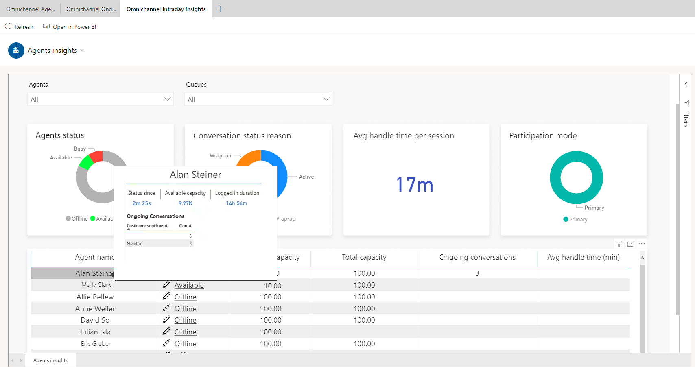
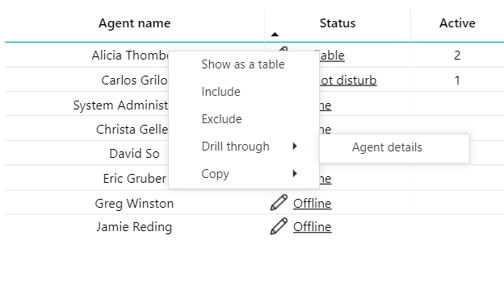
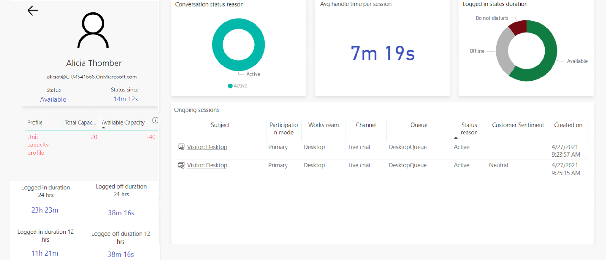

# View and understand the Omnichannel intraday insights dashboard

[!INCLUDE[cc-use-with-omnichannel](../includes/cc-use-with-omnichannel.md)]

The Omnichannel intraday insights dashboard provides information about the health and key performance indicators (KPIs) for your organization. Intraday Monitoring allows you to see a summary of the conversation and insights reports. From the Omnichannel intraday insights report, you can view a summary of the two sections:

- [Intraday Monitoring](#intraday-monitoring)
- [Agent insights](#agent-insights)

The information displayed in these sections are displayed based on the conversations closed in the last 24 hours and is refreshed every 15 minutes.

> [!IMPORTANT]
> To help ensure that the most accurate and up-to-date data is displayed on the dashboard, be sure to follow [best practices for using Omnichannel for Customer Service](best-practices.md).

## Intraday Monitoring

The intraday monitoring tab provides information on conversation and agent insights and their performance.

### Conversation insights

> [!div class=mx-imgBorder]
> THIS SCREENSHOT NEEDS TO BE ADDED

This section of the dashboard displays the following KPIs about conversations.

| Metric | Description |
|-------|-------|
| Inbound | Number of conversations that happened in the last 24 hours. |
| Ongoing | The number of conversations that are ongoing. |
| Waiting in queue | The number of conversations that are waiting in the queue and are ready to be picked up by an agent. |
| Closed | The number of conversations that are closed. |
| Abandoned | Conversations that have been abandoned by the customer. |
| Longest wait time | The longest time that the conversation was in queue. |

You can also view a report on the average conversation handle time, average wait time, transfer rate and more. The report can also be filtered to display an in-depth analysis of each chat channel that conversations have come in from.

### Ongoing conversations

The ongoing conversations section provides information on the status of the conversation, wait time and also allows you to assign the conversations to agents based on their status and capacity. You can also reassign the conversation to a different queue using the ongoing conversations report. The ongoing conversation report also displays information of the channel through which the conversation came in, along with the time and date that the conversation was picked up on. 

### Assign a conversation

A conversation can be assigned to another agent or can be routed to another queue through the ongoing conversations report. Select the **Assign** option in the **Action** column in the report. Select an available agent and then **Assign**.If no agent is available, you can move the conversation to another queue and check if an agent is available. After an agent is assigned, the action is changed to **Monitor**.

> [!NOTE]
> Conversations can be assigned in every state except when they are in the closed state. 

## Agent insights

The **Agent insights** section provides information on the latest KPIs, the health of queues, the status of agents on a given day. The agent insights dashboard provides a consolidated report of conversations in both Live chats and Digital messaging platforms.

An example of the **Agent insights** section is as follows.

> [!div class=mx-imgBorder]
> THIS SCREENSHOT NEEDS TO BE ADDED

This section of the dashboard consists of the following KPIs.

| Conversation status | Description |
|-------|-------|
| Agents logged in | The number of agents that are logged in.|
| Agents with available capacity | The number of agents who have the capacity to accept incoming conversation requests. |
| Average handle time per session | The average time that an agent takes to accept a conversation and resolve it. |
| Sessions rejected | The number of conversation sessions rejected by agents due to the lack of capacity. |
| Sessions timed-out | The number of sessions that were timed-out. |
| Sessions transferred | The number of sessions that were transferred to another agent or queue.

You can view specific insights about the performance of individual or groups of agents, such as their availability, average length of time in conversations, and average response time per session.

You can filter on a specific queue or set of queues to view more specific information about an agent or group of agents. You can select the **Status** field to modify the presence indicator for an agent. You can also hover over an agent's name and a pop-up window will appear, showing details such as the agent's presence, current conversations, and the sentiments of those conversations.

The following image shows the options for viewing agent information in specific queues.

> [!div class="mx-imgBorder"]
> 

The **Agents insights** table displays the following information.

| Agent details | Description |
|-------|-------|
| Agent name | A list of the agent names for the queue. |
| Status | The current presence of the agent: available, offline, do not disturb, or busy. |
| Active | The number of conversations in the active state.|
| Waiting | The total number of conversations waiting to be picked up by an agent. |
| Closed | All the conversations that are closed. |
| Avg handle time (min) | The average of an individual agent's handle time in minutes for all closed conversations that the agent is involved in. More information: [Average handle time](#average-handle-time). |
| Email ID | The email address of the agent handling the conversation. |
|||

You can also view details about a specific agent by right-clicking the agent's name and then selecting **Drill through** > **Agent details** on the shortcut menu, as shown in the following image.

> [!div class="mx-imgBorder"]
> 

> [!NOTE]
> The **Drill through** feature isn't supported outside of Omnichannel for Customer Service.

The agent's details are displayed, as shown in the following image.

> [!div class="mx-imgBorder"]
> 

This section of the dashboard displays the following details.

| Detail | Description |
|-------|-------|
| Status | The agent's current presence : **Available**, **Offline**, **Do not disturb**, or **Busy**. |
| Status since | The amount of time that this agent has been in their current presence. |
| Available capacity | The agent's current free capacity. |
| Total capacity | The total capacity configured for an agent. |
| Logged in duration 24 hrs | The total duration for which the agent has been signed in during the past 24 hours.|
| Logged off duration 24 hrs | The total duration for which the agent has been signed out during the past 24 hours. |
| Logged in duration 12 hrs | The total duration for which the agent has been signed in during the past 12 hours.|
| Logged off duration 12 hrs | The total duration for which the agent has been signed out during the past 12 hours. |
| Queues | The queues that the agent is mapped to. |
| Skills | The skills that are assigned to the agent.|
| Conversation status reason | The status of the latest conversation between the agent and a customer. | 
| Avg handle time per session | The average handle time for an agent is calculated based on the active time the agent spends in a session from the time the conversation is active until it's closed. This includes the time the agent takes to wrap up the conversation. More information: [Average handle time](#average-handle-time) |
| Logged in states duration | The agent's presence when the agent is signed in. The state reflects the base presence and not any custom presence.|
| Subject | For an identified customer, the customer's name is displayed with the subject. For unidentified customers, static text is displayed with a "Visitor" label. More information: [Automatically identify customers](record-identification-rule.md) |
| Participation mode | **Primary** indicates that the agent is engaged in a session. **Consult** means that the agent is engaged in a consulting session with another agent. **Monitor** means that this agent is monitoring the session. |
| Workstream | The work stream that the conversation is assigned to. |
| Channel | The channel that the conversation was created from. |
| Queue | The queue that the conversation is currently part of. |
| Status reason | The current conversation status. |
| Customer sentiment | The current sentiment. |
| Created on | The conversation creation time. |
| Capacity and status timeline | Every change in capacity or status is plotted on the timeline. Negative capacity is displayed if a supervisor assigns a conversation to an agent that's beyond the agent's available capacity. |
|||

## View and filter reports

You can filter information by selecting the queues that have been defined for your organization. From the **Omnichannel queues** drop-down list, select the queues you want, and the information will be filtered according to your selection. This helps you quickly analyze the KPIs and take any necessary steps to improve outcomes.

> [!div class=mx-imgBorder]
> 

## Average handle time

The average handle time for a conversation is defined as the cumulative handle times of its individual sessions. The session handle times take into account only the active time of agents. The average handle time for an agent is calculated based on the active time the agent spends in a session from the time the conversation is active until it's closed. This includes the time the agent takes to wrap up the conversation. When an agent concurrently handles multiple customers and switches sessions, the active time for the previous session is paused and the active time for the current session resumes. 

If the agent spends time providing consultation, it's included in the agent's average handle time. Similarly, for supervisors, the monitor time is included in the supervisor's average handle time.
When a conversation is transferred, the active time spent by all agents who are involved is summed up to compute the handle time for the conversation.

Average handle time will be accurately calculated if you ensure the following:

- Agents close the sessions by selecting the close button at the end of their shift. More information: [Conversation in waiting status](oc-conversation-state.md)
- Agents don't change the computer time.
- Agents don't use incognito mode in Google Chrome or private browsing in Microsoft Edge.

When an agent steps away from the desk during an ongoing session and doesn't interact with the customer, the system counts this time as active and subsequently computes a higher value for the handle time. For a more realistic reporting on the active time that agents spend in the session, you can configure the idle time threshold. If no agent activity is detected after the idle time threshold is reached, the handle time computation is paused. The computation resumes if any mouse, touch, or keyboard activity is detected. By default, the idle time threshold isn't enabled out of the box. More information: [Set the idle time threshold](set-idle-time-threshold.md)

### See also

[Introduction to intraday insights dashboard](intro-intraday-insights-dashboard.md)  
[View and understand Ongoing Conversations dashboard](ongoing-conversations-dashboard.md)  

[!INCLUDE[footer-include](../includes/footer-banner.md)]