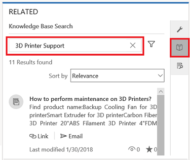
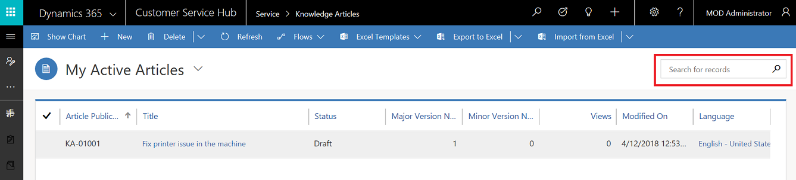

# Understand knowledge base search

Setting up a comprehensive knowledge base is the key to increased customer satisfaction and improved productivity. 
A knowledge base is created to help the customer service reps with solutions to the most common issues, so that they can assist customers quickly.

Use this topic to understand how various search methods work in a knowledge base, and how a customer service rep can view accurate search results based on the client, application, or keyword they use to search the knowledge base.

See the following section to learn the types of search mechanisms available:

## Search options

- **Full-text search**: Lets you run full-text queries against character-based data in SQL Server tables. 
 
   [!INCLUDE[proc_more_information](../includes/proc-more-information.md)] [Full-text search](https://docs.microsoft.com/sql/relational-databases/search/full-text-search)

- **Relevance search**:  Lets you search across multiple pre-defined entities and returns result sorted by relevance.  

   [!INCLUDE[proc_more_information](../includes/proc-more-information.md)] [Relevance search](https://docs.microsoft.com/powerapps/user/relevance-search)
     

   See [Configure Relevance search](https://docs.microsoft.com/power-platform/admin/configure-relevance-search-organization) to learn how to configure Relevance search to improve search results and performance.

   To better understand the various searches used in Dynamics 365 Customer Service and how they can be compared, see [Compare Dynamics 365 apps searches](https://docs.microsoft.com/power-platform/admin/configure-relevance-search-organization).

## Search the knowledge base

You can search the knowledge base from the following areas in the Customer Service Hub app:

- **Knowledge base search control**. In the app, select a case by navigating to **Service** > **Cases**. In the **Related** section (also known as Reference panel), select **Knowledge Base Search** and search for knowledge articles using keywords in the search box. 
  
  

   To explore more options in the knowledge base search given in the Related section, see [Search for knowledge articles](search-knowledge-articles-csh.md).

   > [!NOTE]
   > Knowledge base search control is available out of the box in a case entity. The previous procedure describes how the control can be accessed in the Customer Service Hub app.

- **Global search**. Select the **Search** icon on the navigation bar to do a global search for knowledge base articles. Global search lets you use **Categorized search** or **Relevance search**.

- **Quick find in Grids**. In the app, go to **Service** > **Knowledge Articles**, and select the search box to search the knowledge base using keywords. 

   

  
> [!NOTE]
> You can also search the knowledge base using Portals. See [Use faceted search to improve portal search](../portals/improve-portal-search-faceted-search.md).

With each of the previous search areas, the search results might vary based on the underlying search option used:

|Version  |  |Search areas| Search mechanism  |
|---------|---------|---------|---------|
| December 2016 Update for Dynamics 365 Customer Service   &   December 2016 Service Pack for Customer Engagement (on-premises) platform  |      |     - KB search control    - Quick find in Grids   |   Full-text search    |
|   |     |      - Global search  |   Categorized search     |
|Dynamics 365 Customer Service apps version 9.0   |     |  - KB search control      |   Relevance search/ Full-text search (based on what you configure)     |
|  |      |   - Quick find in Grids     |   Full-text search |
|  |      |   - Global search     |   Relevance search or Categorized search (based on what you configure)    |

### See also

[Add the Knowledge Base Search control to forms](add-knowledge-base-search-control-forms.md)

[Create and manage knowledge articles](customer-service-hub-user-guide-knowledge-article.md)

[!INCLUDE[footer-include](../includes/footer-banner.md)]