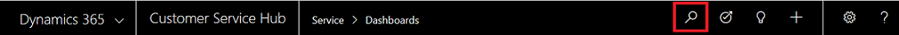

# Search the Knowledge base in Dynamics 365

[!INCLUDE[cc-applies-to-update-9-0-0](../includes/cc_applies_to_update_9_0_0.md)]

Setting up a comprehensive knowledge base is the key to increased customer satisfaction and improved productivity. 
A knowledge base is created to help the customer service reps with solutions to the most common issues, so that they can assist customers quickly.

Utilize this topic to understand how search works in a knowldege base, and how a customer service rep can view accurate search results based on the client, application, or search keyword they use to search the knowledge base.

Refer the section below to know the various search methods available.

## Search methods

- **Knowledge base search control** - In the app, select a case by navigating to **Service** > **Cases**. In the **Related** section (also known as Reference panel), select **Knowledge Base Search** and search for knowledge articles using keywords in the search box. 
  
  

   To explore more options in the knowledge base search given in the Related section, see [Search for knowledge articles](customer-service-hub-user-guide-case-sla.md#search-for-knowledge-articles).

   > [!NOTE]
   > Knowledge base search control is available out-of-the-box in case entity. The above procedure describes how the control can be accessed in the Customer Service Hub app.

- **Quick find in Grids** - In the app, go to **Service** > **Knowledge Articles**, and select the search box to search the knowledge base using keywords. 

   

   Knowledge articles with the status **Draft** or **Published** are displayed in the search results. 

- **Global search**: Select the search icon given on the nav bar to perform global search for knowledge base articles. Global search lets you search using **Categorized** search or **Relevance** search.

  

> [!NOTE]
> You can search the knowledge base using Portals also. See [Use faceted search to improve portal search](../portals/improve-portal-search-faceted-search.md) for more information.

With each of the above search methods, the search results might vary based on the underlying search mechanism used. Refer the table below to know the search technology used for a search method: 

|App  |Version  |Search methods  | Search technology  |
|---------|---------|---------|---------|
|Any web client based app    |       |        - KB search  |        |
|Interactive service hub     |     8.2    |       - Quick find   - KB search control   - Global search |    Full-Text search     |
|Customer Service app    |  9.0       |   - Quick find   - KB search control   - Global search     |   Relevance search/ Full-Text search (based on what you configure)     |
|Customer Service Hub (based on Unified interface)    |       9.0  |     Quick find on Grids   |   Full-Text search      |
|  |       |    - KB search control   - Global search  |   Relevance search/ Full-Text search (based on what you configure)     |

The following section elaborates the search technologies: 

- **Full-Text search**: Lets you run full-text queries against character-based data in SQL Server tables. Read more: 
[Full-Text Search](https://docs.microsoft.com/en-us/sql/relational-databases/search/full-text-search). 

- **Relevance search**:  Lets you search across multiple entities in a single list, sorted by relevance. It uses a dedicated search service external to Dynamics 365 (powered by Azure) to boost Dynamics 365 search performance. Read more: [Relevance Search](../basics/relevance-search-results.md).
    See [Configure Relevance Search](../admin/configure-relevance-search-organization.md) to know how to configure Relevance search to improve search results and performance.

### See also

[Add the Knowledge Base Search control to forms](add-knowledge-base-search-control-forms.md)

